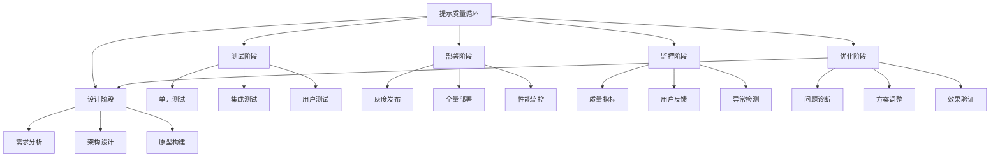
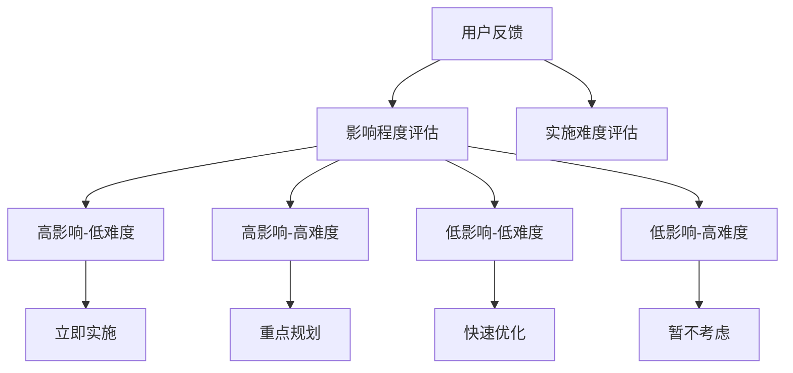
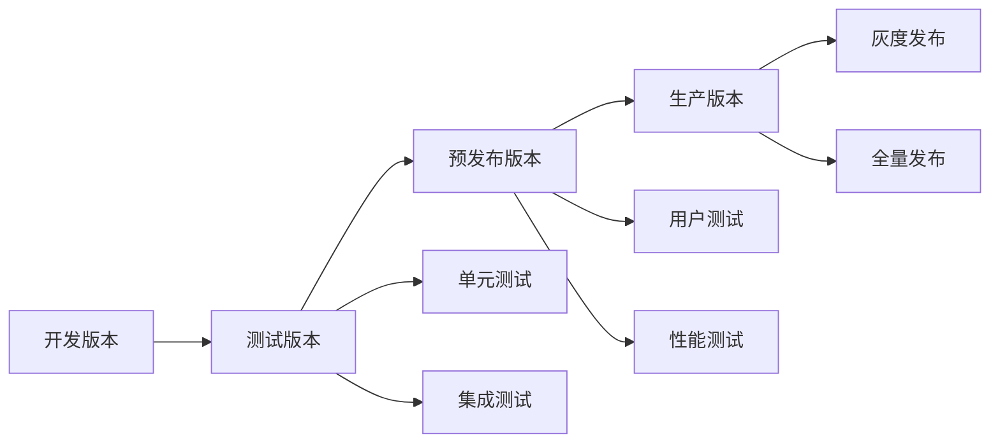
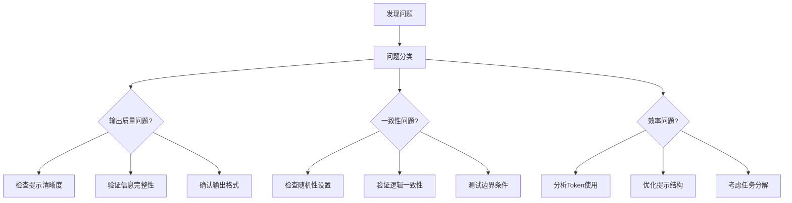
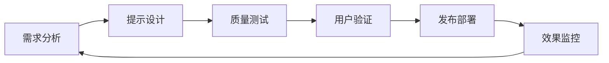

# 优化篇：质量控制与改进

## 🎯 持续改进理念

优秀的提示工程不是一次性的创作，而是持续迭代优化的过程。本章提供系统化的质量控制方法和改进策略，让您的提示系统越来越可靠。



## 1. 避免AI幻觉的系统方法

### 1.1 幻觉识别与预防

```python
HALLUCINATION_PREVENTION_SYSTEM = """
## AI幻觉防控系统

### 幻觉风险评估
对以下内容进行幻觉风险评估：

**待评估内容**：{content_to_evaluate}

### 风险评估维度

#### 1. 事实性风险评估
- **包含具体数据**：{contains_specific_data} (高风险)
- **涉及专业领域**：{involves_expertise} (中高风险)
- **时效性要求**：{time_sensitive} (中风险)
- **可验证性**：{verifiable} (低风险)

风险等级：{factual_risk_level}

#### 2. 逻辑一致性检查
- **内部逻辑**：{internal_logic_check}
- **前后一致**：{consistency_check}
- **因果关系**：{causality_check}

一致性评分：{consistency_score}/10

#### 3. 来源可信度分析
- **信息来源**：{information_sources}
- **权威性**：{authority_level}
- **更新时间**：{last_updated}

可信度评分：{credibility_score}/10

### 防控策略

#### 高风险内容处理
```python
if factual_risk_level == "高":
    strategies = [
        "要求提供信息来源",
        "添加不确定性声明",
        "建议用户验证信息",
        "提供替代信息源"
    ]
```

#### 标准防控模板
```
**信息准确性声明**：
以上信息基于我的训练数据，建议您：
1. 对关键数据进行独立验证
2. 咨询相关领域专家
3. 查阅最新的官方资料

**不确定性标识**：
- ✅ 高置信度：{high_confidence_items}
- ⚠️ 中等置信度：{medium_confidence_items}  
- ❓ 需要验证：{verification_needed_items}
```

### 实施检查
请对以上评估内容实施防控策略：
"""

# 具体应用示例
FINANCIAL_DATA_VERIFICATION = """
## 金融数据分析防控示例

### 原始输出
"根据最新数据，某公司Q3营收同比增长25%，净利润率达到15%，预计年底股价将上涨30%。"

### 风险评估
- **事实性风险**：高 (包含具体财务数据)
- **逻辑一致性**：中 (营收增长与利润率存在逻辑关系)
- **预测风险**：极高 (股价预测)

### 优化后输出
"基于公开财务报告，该公司Q3营收呈现增长趋势。请注意：
- ✅ 财务数据请以公司官方财报为准
- ⚠️ 行业对比数据仅供参考
- ❓ 股价预测存在极大不确定性，投资需谨慎

**建议行动**：
1. 查阅公司最新财报
2. 对比同行业公司表现
3. 咨询专业投资顾问"
```
```

### 1.2 事实验证机制

```python
FACT_VERIFICATION_FRAMEWORK = """
## 事实验证框架

### 验证清单
对生成内容进行逐项验证：

#### A. 数据验证
- [ ] **数值准确性**：所有数字是否准确？
- [ ] **时间准确性**：日期和时间是否正确？
- [ ] **单位一致性**：度量单位是否统一？
- [ ] **范围合理性**：数值是否在合理范围内？

#### B. 逻辑验证
- [ ] **因果关系**：因果链条是否成立？
- [ ] **前提结论**：结论是否从前提自然得出？
- [ ] **内部一致性**：不同部分是否相互矛盾？

#### C. 权威性验证
- [ ] **引用来源**：是否引用了可靠来源？
- [ ] **专业术语**：专业术语使用是否准确？
- [ ] **最新性**：信息是否为最新版本？

### 验证模板
使用以下模板进行验证报告：

```
## 验证报告

### 已验证事实 ✅
{verified_facts}

### 需要确认的信息 ⚠️
{needs_confirmation}

### 无法验证的声明 ❌
{unverifiable_claims}

### 建议行动
{recommended_actions}
```

### 质量保证流程
1. **自动检查**：使用检查清单初步筛查
2. **交叉验证**：对关键信息进行多源验证
3. **专家审核**：邀请领域专家复查
4. **用户反馈**：收集实际使用中的问题

请开始验证以下内容：
{content_for_verification}
"""
```

## 2. A/B测试与性能评估

### 2.1 提示效果测试框架

```python
PROMPT_AB_TESTING_FRAMEWORK = """
## 提示A/B测试设计

### 测试目标
- **主要指标**：{primary_metric}
- **次要指标**：{secondary_metrics}
- **测试假设**：{test_hypothesis}

### 测试设计

#### 版本A（对照组）
```
{version_a_prompt}
```

#### 版本B（实验组）
```
{version_b_prompt}
```

#### 关键差异
| 差异维度 | 版本A | 版本B | 预期影响 |
|----------|-------|-------|----------|
| {dimension_1} | {version_a_value_1} | {version_b_value_1} | {expected_impact_1} |
| {dimension_2} | {version_a_value_2} | {version_b_value_2} | {expected_impact_2} |

### 测试执行

#### 样本设计
- **样本大小**：{sample_size}
- **分组方式**：{randomization_method}
- **测试时长**：{test_duration}
- **测试环境**：{test_environment}

#### 评估指标

##### 质量指标
- **准确性**：输出是否符合预期
- **完整性**：是否遗漏重要信息
- **一致性**：多次运行结果的稳定性
- **相关性**：与用户需求的匹配度

##### 效率指标
- **响应时间**：生成结果的速度
- **Token使用量**：成本效率
- **用户满意度**：实际使用体验

#### 数据收集计划
```python
test_metrics = {
    "quality_scores": [],
    "response_times": [],
    "token_usage": [],
    "user_ratings": [],
    "error_rates": [],
    "completion_rates": []
}
```

### 结果分析

#### 统计显著性检验
- **置信水平**：95%
- **统计方法**：{statistical_method}
- **样本充分性**：{sample_adequacy}

#### 实际显著性评估
- **效果大小**：{effect_size}
- **业务影响**：{business_impact}
- **成本效益**：{cost_benefit_analysis}

### 决策框架
```python
def make_decision(results):
    if results.statistical_significance and results.practical_significance:
        return "采用版本B"
    elif results.statistical_significance and not results.practical_significance:
        return "继续优化"
    else:
        return "保持版本A"
```

请开始设计您的A/B测试：
"""

# 实际测试案例
CUSTOMER_SERVICE_AB_TEST = """
## 客服回复模板A/B测试案例

### 测试场景
客户投诉处理回复模板优化

### 版本对比

#### 版本A：标准客服模板
"您好，感谢您的反馈。我们会认真处理您的问题，请您耐心等待。"

#### 版本B：情感化回复模板  
"您好！感谢您花时间向我们反馈问题。我完全理解您的感受，这确实会让人感到困扰。我会立即为您处理，并在2小时内给您明确回复。"

### 测试结果
| 指标 | 版本A | 版本B | 改进幅度 |
|------|-------|-------|----------|
| 客户满意度 | 3.2/5 | 4.1/5 | +28% |
| 问题升级率 | 15% | 8% | -47% |
| 处理时长 | 45分钟 | 52分钟 | +16% |
| 二次投诉率 | 12% | 5% | -58% |

### 结论
版本B显著提升客户体验，尽管处理时间略长，但总体效益明显，建议采用。
"""
```

### 2.2 性能基准建立

```python
PERFORMANCE_BENCHMARKING = """
## 提示性能基准体系

### 基准维度

#### 1. 任务完成质量
```python
quality_benchmarks = {
    "信息提取": {
        "准确率": ">95%",
        "召回率": ">90%", 
        "F1分数": ">92%"
    },
    "内容生成": {
        "相关性": ">4.0/5",
        "创意性": ">3.5/5",
        "可读性": ">4.2/5"
    },
    "问题解答": {
        "正确率": ">90%",
        "完整性": ">85%",
        "有用性": ">4.0/5"
    }
}
```

#### 2. 系统性能指标
```python
performance_benchmarks = {
    "响应时间": {
        "简单任务": "<3秒",
        "复杂任务": "<15秒",
        "超复杂任务": "<30秒"
    },
    "资源使用": {
        "Token效率": "<2000 tokens/任务",
        "成本控制": "<$0.10/任务",
        "并发处理": ">100请求/分钟"
    }
}
```

#### 3. 用户体验指标
```python
ux_benchmarks = {
    "满意度": ">4.0/5",
    "任务成功率": ">90%",
    "重试率": "<5%",
    "推荐度": ">80% NPS"
}
```

### 基准测试方法

#### 测试数据集构建
```python
test_dataset = {
    "简单场景": {
        "数量": 100,
        "特征": "标准格式，明确需求",
        "预期性能": "高准确性，快速响应"
    },
    "复杂场景": {
        "数量": 50,
        "特征": "多步骤，需要推理",
        "预期性能": "准确性>85%，可接受延迟"
    },
    "边界场景": {
        "数量": 30,
        "特征": "模糊需求，异常输入",
        "预期性能": "优雅降级，有用反馈"
    }
}
```

#### 自动化测试流程
```python
def benchmark_test(prompt_system, test_cases):
    results = {}
    
    for category, cases in test_cases.items():
        category_results = []
        
        for case in cases:
            start_time = time.time()
            response = prompt_system.execute(case.input)
            end_time = time.time()
            
            metrics = {
                "response_time": end_time - start_time,
                "quality_score": evaluate_quality(response, case.expected),
                "token_usage": count_tokens(response),
                "error_rate": check_errors(response)
            }
            
            category_results.append(metrics)
        
        results[category] = aggregate_results(category_results)
    
    return generate_benchmark_report(results)
```

### 基准报告模板
```
## 性能基准报告

### 整体表现
- **综合评分**：{overall_score}/100
- **达标率**：{compliance_rate}%
- **核心优势**：{key_strengths}
- **改进重点**：{improvement_areas}

### 分类表现
| 任务类型 | 质量得分 | 性能得分 | 成本得分 | 综合排名 |
|----------|----------|----------|----------|----------|
| {task_1} | {quality_1} | {perf_1} | {cost_1} | {rank_1} |
| {task_2} | {quality_2} | {perf_2} | {cost_2} | {rank_2} |

### 趋势分析
{trend_analysis}

### 优化建议
{optimization_recommendations}
```

请建立您的性能基准：
"""
```

## 3. 持续改进的系统化方法

### 3.1 质量监控体系

```python
QUALITY_MONITORING_SYSTEM = """
## 质量监控仪表板

### 实时监控指标

#### 核心质量指标
```python
quality_metrics = {
    "准确性": {
        "当前值": "{accuracy_current}%",
        "目标值": "{accuracy_target}%", 
        "趋势": "{accuracy_trend}",
        "预警阈值": "{accuracy_threshold}%"
    },
    "一致性": {
        "当前值": "{consistency_current}%",
        "目标值": "{consistency_target}%",
        "趋势": "{consistency_trend}",
        "预警阈值": "{consistency_threshold}%"
    },
    "完整性": {
        "当前值": "{completeness_current}%",
        "目标值": "{completeness_target}%",
        "趋势": "{completeness_trend}",
        "预警阈值": "{completeness_threshold}%"
    }
}
```

#### 性能监控指标
```python
performance_metrics = {
    "响应时间": {
        "平均值": "{avg_response_time}s",
        "P95值": "{p95_response_time}s",
        "趋势": "{response_time_trend}"
    },
    "吞吐量": {
        "当前QPS": "{current_qps}",
        "峰值QPS": "{peak_qps}",
        "容量利用率": "{capacity_utilization}%"
    },
    "错误率": {
        "系统错误": "{system_error_rate}%",
        "业务错误": "{business_error_rate}%",
        "用户投诉": "{complaint_rate}%"
    }
}
```

### 预警机制

#### 预警规则配置
```python
alert_rules = {
    "critical": {
        "准确性下降超过10%": {
            "action": "立即通知",
            "escalation": "30分钟内无响应升级"
        },
        "系统错误率超过5%": {
            "action": "自动降级",
            "escalation": "启动应急预案"
        }
    },
    "warning": {
        "响应时间超过阈值20%": {
            "action": "发送告警",
            "escalation": "2小时内分析原因"
        },
        "用户满意度下降": {
            "action": "记录日志",
            "escalation": "日报重点关注"
        }
    }
}
```

#### 异常检测算法
```python
def detect_anomaly(metrics_history, current_value):
    """
    基于历史数据检测异常
    """
    mean = np.mean(metrics_history)
    std = np.std(metrics_history)
    
    # 3-sigma规则
    threshold = mean + 3 * std
    
    if current_value > threshold:
        return {
            "is_anomaly": True,
            "severity": calculate_severity(current_value, threshold),
            "recommendation": generate_recommendation(current_value, mean)
        }
    
    return {"is_anomaly": False}
```

### 质量分析报告
```
## 周度质量分析报告

### 核心指标概览
- **整体健康度**：{overall_health_score}/100
- **质量趋势**：{quality_trend}
- **关键事件**：{key_incidents}

### 详细分析

#### 质量表现
{quality_performance_analysis}

#### 性能表现  
{performance_analysis}

#### 用户反馈
{user_feedback_summary}

### 改进行动
{improvement_actions}

### 下周重点
{next_week_focus}
```

请设置您的监控体系：
"""
```

### 3.2 用户反馈收集与分析

```python
USER_FEEDBACK_SYSTEM = """
## 用户反馈收集与分析系统

### 反馈收集机制

#### 1. 主动收集
```python
feedback_prompts = {
    "任务完成后": "请对本次AI助手的表现打分（1-5分）并简要说明原因",
    "定期调研": "您对AI助手的整体满意度如何？有什么改进建议？",
    "特定场景": "在处理{scenario_type}任务时，您希望AI助手如何改进？"
}
```

#### 2. 被动收集
```python
passive_indicators = {
    "行为数据": {
        "重试率": "用户重新提问的频率",
        "修改率": "用户修改提示的频率", 
        "放弃率": "用户中途放弃的频率"
    },
    "使用模式": {
        "使用频率": "用户活跃度变化",
        "功能偏好": "最常用的功能模块",
        "时长分析": "单次使用时长趋势"
    }
}
```

### 反馈分析框架

#### 定量分析
```python
quantitative_analysis = {
    "满意度分析": {
        "总体满意度": "{overall_satisfaction}",
        "功能满意度": "{feature_satisfaction}",
        "性能满意度": "{performance_satisfaction}"
    },
    "使用效率分析": {
        "任务成功率": "{task_success_rate}%",
        "平均完成时间": "{avg_completion_time}",
        "重试成功率": "{retry_success_rate}%"
    }
}
```

#### 定性分析
```python
qualitative_analysis = {
    "主题分析": {
        "最常提及问题": "{top_issues}",
        "改进建议分类": "{improvement_categories}",
        "用户痛点识别": "{pain_points}"
    },
    "情感分析": {
        "正面反馈": "{positive_feedback}%",
        "负面反馈": "{negative_feedback}%",
        "中性反馈": "{neutral_feedback}%"
    }
}
```

### 改进优先级矩阵



#### 优先级评分
| 改进项目 | 用户需求强度 | 技术实现难度 | 业务价值 | 综合评分 | 优先级 |
|----------|-------------|-------------|----------|----------|--------|
| {item_1} | {demand_1} | {difficulty_1} | {value_1} | {score_1} | {priority_1} |
| {item_2} | {demand_2} | {difficulty_2} | {value_2} | {score_2} | {priority_2} |

### 反馈响应机制
```python
def respond_to_feedback(feedback_item):
    """
    反馈响应工作流
    """
    # 1. 自动分类
    category = classify_feedback(feedback_item)
    
    # 2. 紧急度评估
    urgency = assess_urgency(feedback_item)
    
    # 3. 分配处理
    if urgency == "critical":
        assign_to_team("emergency_response")
    elif urgency == "high":
        assign_to_team("product_team")
    else:
        add_to_backlog(feedback_item)
    
    # 4. 用户确认
    send_acknowledgment(feedback_item.user)
```

请设计您的反馈收集系统：
"""
```

### 3.3 版本管理与发布策略

```python
VERSION_MANAGEMENT_SYSTEM = """
## 提示系统版本管理

### 版本控制策略

#### 版本号规范
```
格式：Major.Minor.Patch
- Major：重大功能变更或架构调整
- Minor：新功能添加或重要改进
- Patch：错误修复或小幅优化

示例：v2.1.3
```

#### 版本管理流程


### 发布策略

#### 灰度发布计划
```python
rollout_plan = {
    "阶段1": {
        "用户比例": "5%",
        "持续时间": "24小时",
        "监控重点": "错误率、响应时间",
        "回滚条件": "错误率>1%"
    },
    "阶段2": {
        "用户比例": "20%", 
        "持续时间": "48小时",
        "监控重点": "用户满意度、业务指标",
        "回滚条件": "满意度下降>10%"
    },
    "阶段3": {
        "用户比例": "100%",
        "持续时间": "持续",
        "监控重点": "全面监控",
        "回滚条件": "重大问题"
    }
}
```

#### 风险控制
```python
risk_controls = {
    "技术风险": {
        "自动化测试": "确保功能正确性",
        "性能测试": "验证系统性能",
        "兼容性测试": "确保向后兼容"
    },
    "业务风险": {
        "A/B测试": "验证业务效果",
        "用户反馈": "收集真实体验",
        "数据监控": "跟踪关键指标"
    },
    "运营风险": {
        "回滚准备": "快速回滚机制",
        "应急预案": "异常情况处理",
        "沟通计划": "内外部沟通"
    }
}
```

### 版本文档管理

#### 变更日志模板
```markdown
# 版本 v2.1.3 发布说明

## 发布信息
- **发布日期**：2024-03-15
- **发布类型**：补丁版本
- **影响范围**：全量用户

## 主要变更

### 新增功能
- 添加了{new_feature_1}
- 支持{new_capability}

### 改进优化
- 优化了{improvement_1}的性能
- 提升了{improvement_2}的准确性

### 问题修复
- 修复了{bug_1}
- 解决了{bug_2}

## 升级指南
{upgrade_instructions}

## 已知问题
{known_issues}

## 下个版本计划
{next_version_plan}
```

#### 回滚计划
```python
rollback_plan = {
    "触发条件": [
        "系统错误率超过5%",
        "用户满意度下降超过20%",
        "关键功能异常"
    ],
    "回滚步骤": [
        "停止新版本流量",
        "切换到上个稳定版本",
        "验证系统恢复正常",
        "通知相关团队",
        "分析问题原因"
    ],
    "预计时间": "15分钟内完成回滚"
}
```

请设计您的版本管理策略：
"""
```

## 4. 经验总结与最佳实践

### 4.1 常见问题解决方案

```python
COMMON_ISSUES_SOLUTIONS = """
## 提示工程常见问题及解决方案

### 问题分类

#### 1. 输出质量问题

##### 问题：AI回答不准确
**常见原因**：
- 提示信息不够具体
- 缺少必要的上下文
- 任务目标不明确

**解决方案**：
```python
# 改进前
prompt = "帮我分析这个数据"

# 改进后
prompt = """
作为数据分析师，请分析以下销售数据：

数据背景：2024年Q1季度销售报告
分析目标：识别增长趋势和异常情况
期望输出：
1. 总体趋势分析（2-3句话）
2. 异常数据识别（具体指出异常项）
3. 改进建议（3条具体建议）

数据：{sales_data}
"""
```

##### 问题：回答过于冗长或简短
**解决方案**：明确指定输出长度和格式
```python
length_control_template = """
请在{word_limit}字以内回答以下问题：
{question}

回答要求：
- 核心观点用1句话概括
- 支撑论据不超过3点
- 结论明确具体
"""
```

#### 2. 一致性问题

##### 问题：多次运行结果差异很大
**解决方案**：
```python
consistency_template = """
请严格按照以下步骤分析：

步骤1：问题理解
{problem_understanding_framework}

步骤2：信息收集
{information_gathering_criteria}

步骤3：分析推理
{analysis_methodology}

步骤4：结论输出
{output_format_specification}

每个步骤都必须完成，不得跳过。
"""
```

#### 3. 效率问题

##### 问题：响应时间过长
**优化策略**：
```python
efficiency_optimization = {
    "提示精简": "去除不必要的描述性语言",
    "任务分解": "将复杂任务分解为简单子任务",
    "并行处理": "可并行执行的部分分开处理",
    "缓存机制": "对重复查询建立缓存"
}
```

### 解决问题的系统化方法

#### 问题诊断流程


请诊断您遇到的问题：
"""
```

### 4.2 行业最佳实践汇总

```python
INDUSTRY_BEST_PRACTICES = """
## 行业最佳实践总结

### 企业级应用最佳实践

#### 1. 治理与合规
```python
governance_framework = {
    "内容审核": {
        "敏感信息过滤": "建立关键词黑名单",
        "合规性检查": "定期审查输出内容",
        "版权保护": "避免直接复制受保护内容"
    },
    "质量保证": {
        "人工审核": "关键内容人工复查",
        "自动检测": "建立质量检测机制",
        "用户反馈": "建立反馈收集渠道"
    },
    "安全防护": {
        "访问控制": "限制系统访问权限",
        "数据加密": "敏感数据传输加密",
        "审计日志": "记录所有操作日志"
    }
}
```

#### 2. 成本优化
```python
cost_optimization = {
    "Token管理": {
        "精简提示": "移除冗余描述",
        "智能缓存": "缓存重复请求结果",
        "批量处理": "合并相似请求"
    },
    "模型选择": {
        "任务匹配": "简单任务用轻量模型",
        "性价比评估": "定期评估模型ROI",
        "混合策略": "不同场景用不同模型"
    }
}
```

#### 3. 可扩展性设计
```python
scalability_design = {
    "架构设计": {
        "微服务化": "提示系统模块化设计",
        "负载均衡": "支持高并发访问",
        "故障隔离": "单点故障不影响整体"
    },
    "配置管理": {
        "参数化": "提示模板参数化配置",
        "版本控制": "支持多版本并存",
        "热更新": "支持不停机更新"
    }
}
```

### 垂直行业应用模式

#### 金融行业
```python
financial_best_practices = {
    "风险控制": "所有金融建议都标注风险等级",
    "合规要求": "遵循金融监管政策",
    "数据安全": "客户信息严格保护",
    "决策支持": "提供决策依据而非直接建议"
}
```

#### 医疗健康
```python
healthcare_best_practices = {
    "专业性": "明确AI不能替代医生诊断",
    "准确性": "医疗信息需要权威来源验证",
    "伦理考虑": "涉及生命健康的建议要谨慎",
    "隐私保护": "患者信息严格保密"
}
```

#### 教育培训
```python
education_best_practices = {
    "个性化": "根据学习者水平调整内容",
    "循序渐进": "知识点按难度分层",
    "互动性": "鼓励学习者主动思考",
    "评估反馈": "提供学习效果评估"
}
```

### 团队协作模式

#### 角色分工
```python
team_roles = {
    "提示工程师": {
        "职责": "设计和优化提示模板",
        "技能": "理解AI模型特性，业务需求分析",
        "产出": "高质量提示模板和使用指南"
    },
    "质量工程师": {
        "职责": "建立质量保证体系",
        "技能": "测试设计，数据分析",
        "产出": "质量标准和测试报告"
    },
    "产品经理": {
        "职责": "需求管理和优先级排序",
        "技能": "用户研究，产品设计",
        "产出": "产品需求和验收标准"
    }
}
```

#### 协作流程


请根据您的行业特点选择适用的最佳实践：
"""
```

## 5. 实战优化工具包

### 5.1 快速诊断工具

```python
PROMPT_DIAGNOSTIC_TOOL = """
## 提示质量诊断工具

### 使用方式
将您的提示粘贴到下方，系统将自动诊断质量问题：

**待诊断提示**：
{prompt_to_diagnose}

### 诊断结果

#### 结构分析 ✅❌
- **角色设定**：{role_definition_check}
- **任务描述**：{task_description_check}
- **上下文信息**：{context_information_check}
- **输出格式**：{output_format_check}
- **约束条件**：{constraints_check}

#### 清晰度评估 (1-10分)
- **指令明确性**：{instruction_clarity}/10
- **信息完整性**：{information_completeness}/10
- **逻辑连贯性**：{logical_coherence}/10

#### 潜在问题识别 ⚠️
{identified_issues}

#### 改进建议 💡
{improvement_suggestions}

#### 优化后版本 ✨
{optimized_version}

### 质量得分
**综合评分**：{overall_score}/100
**评级**：{quality_rating}

### 下一步行动
{next_actions}
"""

# 自动诊断示例
DIAGNOSTIC_EXAMPLE = """
## 诊断示例

### 原始提示
"帮我写个方案"

### 诊断结果
#### 结构分析
- **角色设定**：❌ 缺失
- **任务描述**：❌ 过于模糊
- **上下文信息**：❌ 完全缺失
- **输出格式**：❌ 未指定
- **约束条件**：❌ 无约束

#### 清晰度评估
- **指令明确性**：2/10
- **信息完整性**：1/10
- **逻辑连贯性**：3/10

#### 潜在问题
- 任务目标不明确
- 缺少必要背景信息
- 输出要求未定义

#### 优化建议
1. 明确具体的方案类型
2. 提供相关背景信息
3. 指定输出格式和长度
4. 设定专业角色

#### 优化后版本
"作为项目管理专家，请为我们公司的数字化转型项目制定实施方案。

背景信息：
- 公司规模：500人的制造企业
- 当前状况：主要使用传统ERP系统
- 转型目标：提升运营效率20%
- 预算范围：100-200万元
- 时间要求：6个月内完成

请提供：
1. 总体策略（200字以内）
2. 分阶段实施计划（时间线+里程碑）
3. 资源需求分析（人力+技术+资金）
4. 风险评估与应对措施
5. 成功评估标准

输出格式：结构化文档，每部分包含具体的行动项。"

### 质量得分
**综合评分**：85/100
**评级**：优秀
"""
```

### 5.2 A/B测试模板库

```python
AB_TEST_TEMPLATES = """
## A/B测试模板库

### 模板1：指令风格测试
**测试目标**：比较不同指令风格的效果

#### 版本A：命令式
```
分析以下数据并提供建议：
{data}
```

#### 版本B：引导式
```
请帮我深入分析以下数据，我特别关心其中的趋势变化和异常情况：
{data}

您能从专业角度给我一些有价值的见解吗？
```

### 模板2：结构化vs自由式
**测试目标**：比较结构化和自由式输出的效果

#### 版本A：高度结构化
```
请按以下格式分析：

## 核心发现
- 发现1：
- 发现2：
- 发现3：

## 详细分析
### 趋势分析
### 风险评估
### 机会识别

## 行动建议
1. 立即行动：
2. 短期规划：
3. 长期战略：
```

#### 版本B：自由格式
```
请对以下情况进行全面分析，包括关键发现、深度分析和实用建议：
{context}
```

### 模板3：专业程度测试
**测试目标**：测试不同专业程度的表达效果

#### 版本A：专业术语
```
作为高级业务分析师，请运用SWOT分析、波特五力模型等战略分析工具，对目标市场进行深度剖析...
```

#### 版本B：通俗易懂
```
请帮我分析一下这个市场机会，用简单易懂的方式说明优势、劣势、机会和威胁...
```

### 测试执行框架
```python
def run_ab_test(template_a, template_b, test_cases, metrics):
    results = {
        "version_a": {},
        "version_b": {},
        "statistical_analysis": {}
    }
    
    for case in test_cases:
        # 执行版本A
        response_a = execute_prompt(template_a.format(**case))
        score_a = evaluate_response(response_a, metrics)
        
        # 执行版本B  
        response_b = execute_prompt(template_b.format(**case))
        score_b = evaluate_response(response_b, metrics)
        
        results["version_a"][case.id] = score_a
        results["version_b"][case.id] = score_b
    
    # 统计分析
    results["statistical_analysis"] = perform_statistical_test(
        results["version_a"], 
        results["version_b"]
    )
    
    return results
```

请选择适合的模板进行测试：
"""
```

### 5.3 性能优化清单

```python
PERFORMANCE_OPTIMIZATION_CHECKLIST = """
## 性能优化检查清单

### 🚀 速度优化

#### Token使用优化
- [ ] **移除冗余词汇**：删除不必要的形容词和修饰语
- [ ] **简化句式**：使用简洁直接的表达
- [ ] **避免重复**：合并相似的指令或说明
- [ ] **精简示例**：只保留最有代表性的示例

#### 提示结构优化
- [ ] **前置关键信息**：重要指令放在开头
- [ ] **逻辑层次清晰**：使用编号和标题组织内容
- [ ] **减少嵌套层级**：避免过深的信息嵌套
- [ ] **并行任务分离**：独立任务分别处理

### 💰 成本优化

#### 模型选择策略
```python
model_selection_guide = {
    "简单任务": {
        "推荐模型": "Claude-3-Haiku",
        "适用场景": "分类、简单问答、格式转换",
        "成本效益": "极高"
    },
    "中等复杂度": {
        "推荐模型": "Claude-3-Sonnet", 
        "适用场景": "分析、写作、推理",
        "成本效益": "高"
    },
    "复杂任务": {
        "推荐模型": "Claude-3-Opus",
        "适用场景": "创意写作、复杂推理、专业分析",
        "成本效益": "中等"
    }
}
```

#### 缓存策略
- [ ] **识别重复请求**：记录常见查询模式
- [ ] **建立缓存机制**：对重复结果进行缓存
- [ ] **缓存失效策略**：设定合理的缓存更新周期
- [ ] **增量更新**：支持部分内容更新

### 📊 质量优化

#### 一致性保证
- [ ] **固定输出格式**：使用严格的格式模板
- [ ] **设定温度参数**：较低温度提高一致性
- [ ] **多次验证**：关键结果多次生成对比
- [ ] **边界条件测试**：测试极端情况的处理

#### 准确性提升
- [ ] **事实验证机制**：建立信息验证流程
- [ ] **专家审核**：关键内容专家复查
- [ ] **用户反馈循环**：收集使用反馈持续改进
- [ ] **A/B测试验证**：用数据验证改进效果

### 🔧 技术优化

#### 系统架构
```python
architecture_checklist = {
    "高可用性": [
        "多实例部署",
        "负载均衡配置", 
        "故障自动切换",
        "健康检查机制"
    ],
    "可扩展性": [
        "水平扩展支持",
        "资源池管理",
        "弹性伸缩配置",
        "性能监控告警"
    ],
    "安全性": [
        "访问权限控制",
        "数据传输加密",
        "操作日志审计",
        "敏感信息过滤"
    ]
}
```

#### 监控告警
- [ ] **响应时间监控**：设定性能基线和告警阈值
- [ ] **错误率追踪**：监控系统和业务错误率
- [ ] **资源使用监控**：CPU、内存、网络使用情况
- [ ] **业务指标监控**：用户满意度、任务成功率等

### 📈 持续改进

#### 数据驱动优化
```python
optimization_metrics = {
    "性能指标": {
        "响应时间": "P95 < 5秒",
        "吞吐量": "> 1000 QPS",
        "可用性": "> 99.9%"
    },
    "质量指标": {
        "准确率": "> 95%",
        "用户满意度": "> 4.5/5",
        "任务成功率": "> 90%"
    },
    "成本指标": {
        "单次请求成本": "< $0.01",
        "ROI": "> 300%",
        "资源利用率": "> 80%"
    }
}
```

#### 优化周期
- [ ] **日常监控**：每日检查关键指标
- [ ] **周度分析**：每周深度分析性能趋势
- [ ] **月度优化**：每月制定优化计划
- [ ] **季度评估**：每季度全面评估和规划

### 使用方法
1. 根据当前痛点选择对应的优化方向
2. 按照检查清单逐项评估当前状态
3. 制定具体的优化计划和时间表
4. 实施改进措施并监控效果
5. 定期回顾和调整优化策略

请开始您的性能优化之旅：
"""
```

## 📋 优化实战检查清单

### 质量控制要点
- [ ] 建立基准测试数据集
- [ ] 设置关键性能指标监控
- [ ] 建立用户反馈收集机制
- [ ] 制定版本发布流程
- [ ] 建立问题快速响应机制

### 持续改进循环
- [ ] 定期收集使用数据
- [ ] 分析性能瓶颈和质量问题
- [ ] 制定改进计划
- [ ] 实施优化措施
- [ ] 验证改进效果

---

**下一步：[工具篇：扩展能力与集成](./05_tools_integration.md)**