# 工具篇：扩展能力与集成

## 🔧 系统化工具应用

当基础提示技能成熟后，集成外部工具和数据源能显著扩展AI的能力边界。本章重点介绍实用的工具集成模式和工作流设计。

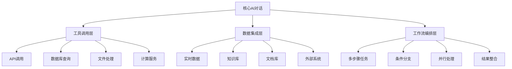

## 1. 工具使用与函数调用

### 1.1 工具调用最佳实践

```python
FUNCTION_CALLING_FRAMEWORK = """
## 函数调用设计框架

### 工具定义规范

#### 标准工具描述模板
```python
tool_definition = {
    "name": "{tool_name}",
    "description": "{clear_purpose_description}",
    "parameters": {
        "type": "object",
        "properties": {
            "{param_1}": {
                "type": "{param_type}",
                "description": "{param_description}",
                "required": True/False
            }
        }
    },
    "examples": [
        {
            "input": "{example_input}",
            "output": "{example_output}",
            "explanation": "{why_this_example}"
        }
    ]
}
```

#### 工具选择策略
```python
tool_selection_criteria = {
    "任务匹配度": "工具功能与任务需求的契合程度",
    "数据可用性": "所需数据是否可访问",
    "执行效率": "工具调用的时间和资源成本",
    "结果可靠性": "工具输出的准确性和稳定性",
    "错误处理": "异常情况的处理能力"
}
```

### 工具调用提示模板

#### 通用工具调用模板
```
作为智能助手，我可以调用以下工具来帮助您：

可用工具：
{available_tools_list}

请告诉我您的需求，我会：
1. 分析任务需求
2. 选择合适的工具
3. 执行相应操作
4. 整合结果并回复

如果需要调用多个工具，我会按逻辑顺序执行。

您的需求：{user_request}

让我来分析和处理...
```

#### 特定场景工具调用
```python
# 数据分析场景
data_analysis_tools = """
我将使用数据分析工具来处理您的请求：

步骤1：数据获取
- 工具：{data_source_tool}
- 目的：获取{data_type}数据
- 参数：{data_parameters}

步骤2：数据处理
- 工具：{processing_tool}
- 目的：{processing_purpose}
- 方法：{processing_method}

步骤3：结果分析
- 工具：{analysis_tool}
- 输出：{expected_output_format}

开始执行...
"""

# API集成场景
api_integration_template = """
我需要调用外部API来获取实时信息：

API调用计划：
1. **{api_name}** 
   - 端点：{api_endpoint}
   - 参数：{api_parameters}
   - 预期数据：{expected_data}

2. **数据处理**
   - 解析：{data_parsing_method}
   - 验证：{data_validation_criteria}
   - 格式化：{output_format}

3. **结果整合**
   - 组织结构：{result_structure}
   - 质量检查：{quality_checks}

执行中...
"""
```

### 1.2 错误处理与异常恢复

```python
ERROR_HANDLING_SYSTEM = """
## 工具调用错误处理系统

### 错误分类与处理策略

#### 1. 网络错误
```python
network_error_handling = {
    "连接超时": {
        "检测方法": "设置合理的超时时间",
        "处理策略": "重试机制（指数退避）",
        "用户反馈": "网络连接异常，正在重试...",
        "备用方案": "使用缓存数据或提示手工操作"
    },
    "服务不可用": {
        "检测方法": "HTTP状态码检查",
        "处理策略": "切换到备用服务",
        "用户反馈": "服务暂时不可用，尝试备用方案",
        "备用方案": "使用历史数据或降级服务"
    }
}
```

#### 2. 数据错误
```python
data_error_handling = {
    "格式错误": {
        "检测方法": "数据格式验证",
        "处理策略": "数据清洗和转换",
        "用户反馈": "数据格式异常，正在处理...",
        "备用方案": "提供格式说明，请求重新输入"
    },
    "数据缺失": {
        "检测方法": "必填字段检查",
        "处理策略": "使用默认值或提示补充",
        "用户反馈": "缺少必要信息，请补充：{missing_fields}",
        "备用方案": "基于已有信息提供部分结果"
    }
}
```

#### 3. 权限错误
```python
permission_error_handling = {
    "认证失败": {
        "检测方法": "401状态码",
        "处理策略": "引导重新认证",
        "用户反馈": "需要重新登录验证身份",
        "备用方案": "提供公开信息或手工操作指南"
    },
    "权限不足": {
        "检测方法": "403状态码",
        "处理策略": "申请权限或降级服务",
        "用户反馈": "当前权限不足，已申请相关权限",
        "备用方案": "提供可访问的替代信息"
    }
}
```

### 优雅降级策略
```python
graceful_degradation = """
当工具调用失败时，采用优雅降级：

1. **完全成功**：所有工具正常，提供完整结果
2. **部分成功**：部分工具失败，提供可用结果+说明
3. **完全失败**：所有工具失败，提供解决方案指导

降级示例：
原计划：调用股票API获取实时价格 → 计算投资组合价值 → 生成分析报告

降级方案：
- Level 1：API成功 → 提供实时分析
- Level 2：API失败，使用昨日收盘价 → 提供近似分析
- Level 3：无可用数据 → 提供数据获取指南和分析框架
"""
```

### 错误处理提示模板
```python
ERROR_RESPONSE_TEMPLATE = """
遇到技术问题时的标准回复：

很抱歉，在{operation_description}过程中遇到了{error_type}。

**问题说明**：{error_explanation}

**已采取的措施**：
1. {action_taken_1}
2. {action_taken_2}

**当前状态**：{current_status}

**您可以选择**：
- 选项1：{option_1}
- 选项2：{option_2}  
- 选项3：{option_3}

**预计解决时间**：{estimated_resolution_time}

如果问题持续，请{escalation_procedure}。

在此期间，我可以为您{alternative_assistance}。
"""
```

## 2. 提示链与工作流设计

### 2.1 复杂工作流架构

```python
WORKFLOW_DESIGN_FRAMEWORK = """
## 工作流设计框架

### 工作流类型分类

#### 1. 顺序型工作流
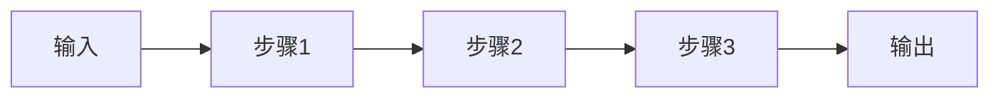

**适用场景**：
- 数据处理管道
- 文档生成流程
- 质量检查流程

**设计要点**：
- 每个步骤输出成为下一步输入
- 建立检查点验证中间结果
- 设计回滚机制处理异常

#### 2. 并行型工作流
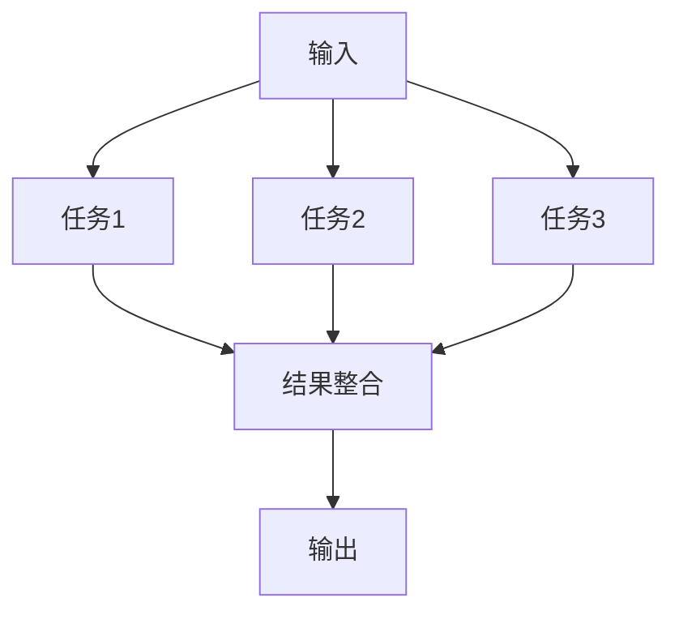

**适用场景**：
- 多源数据收集
- 多角度分析
- 并行质量检查

**设计要点**：
- 识别可并行执行的任务
- 设计结果整合策略
- 处理部分失败情况

#### 3. 条件分支工作流
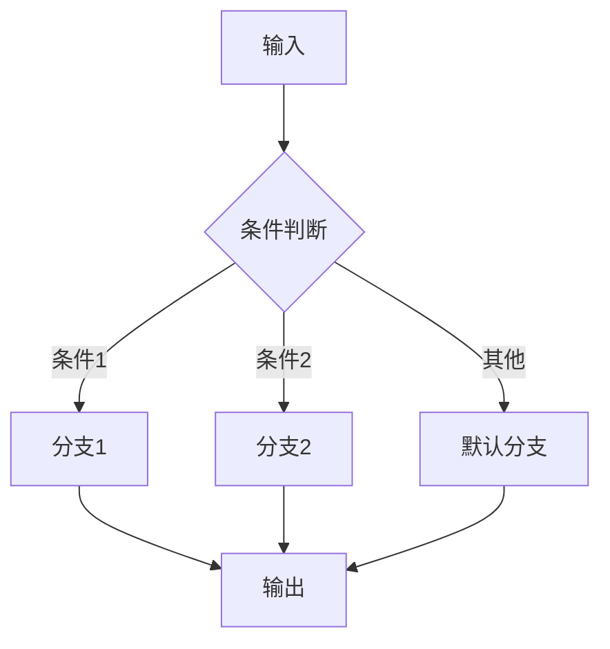

**适用场景**：
- 智能客服路由
- 个性化推荐
- 风险评估决策

**设计要点**：
- 明确分支条件
- 确保条件完整性
- 设计默认处理路径

### 工作流编排模板

#### 数据分析工作流
```python
data_analysis_workflow = """
## 数据分析工作流

### 阶段1：数据准备
```
任务：数据收集与预处理
输入：{data_sources}
处理：
1. 数据提取：{extraction_method}
2. 数据清洗：{cleaning_rules}
3. 数据验证：{validation_criteria}
输出：清洗后的数据集
质量检查：{quality_check_1}
```

### 阶段2：探索性分析
```
任务：数据模式识别
输入：清洗后的数据集
处理：
1. 描述性统计：{descriptive_stats}
2. 分布分析：{distribution_analysis}
3. 相关性分析：{correlation_analysis}
输出：初步分析报告
质量检查：{quality_check_2}
```

### 阶段3：深度分析
```
任务：业务洞察挖掘
输入：初步分析报告
处理：
1. 趋势分析：{trend_analysis}
2. 异常检测：{anomaly_detection}
3. 预测建模：{predictive_modeling}
输出：深度分析报告
质量检查：{quality_check_3}
```

### 阶段4：结果输出
```
任务：报告生成与可视化
输入：深度分析报告
处理：
1. 图表生成：{visualization_specs}
2. 报告撰写：{report_template}
3. 建议制定：{recommendation_framework}
输出：最终分析报告
质量检查：{final_quality_check}
```

### 异常处理
- 数据质量问题：{data_quality_handling}
- 分析异常：{analysis_error_handling}
- 资源不足：{resource_limitation_handling}
"""

#### 内容创作工作流
```python
content_creation_workflow = """
## 内容创作工作流

### 阶段1：需求分析
- 输入：创作需求
- 任务：需求解析和规划
- 输出：创作方案

### 阶段2：资料收集
- 输入：创作方案
- 任务：相关信息收集
- 输出：素材库

### 阶段3：内容生成
- 输入：素材库
- 任务：内容创作
- 输出：初稿

### 阶段4：质量优化
- 输入：初稿
- 任务：编辑和优化
- 输出：优化稿

### 阶段5：最终检查
- 输入：优化稿
- 任务：质量检查和确认
- 输出：最终版本
"""
```

### 2.2 状态管理与上下文传递

```python
STATE_MANAGEMENT_SYSTEM = """
## 工作流状态管理

### 状态定义
```python
workflow_state = {
    "session_id": "{unique_session_identifier}",
    "current_stage": "{current_workflow_stage}",
    "stage_status": "pending|running|completed|failed",
    "context_data": {
        "user_input": "{original_user_request}",
        "intermediate_results": "{results_from_previous_stages}",
        "configuration": "{workflow_configuration_parameters}",
        "metadata": "{execution_metadata}"
    },
    "execution_history": [
        {
            "stage": "{stage_name}",
            "start_time": "{timestamp}",
            "end_time": "{timestamp}",
            "status": "{execution_status}",
            "output": "{stage_output}",
            "errors": "{error_information}"
        }
    ]
}
```

### 上下文传递机制
```python
context_passing_template = """
## 上下文信息传递

### 前一阶段输出摘要
{previous_stage_summary}

### 关键信息提取
- **核心数据**：{key_data_points}
- **重要发现**：{important_findings}
- **待处理问题**：{pending_issues}
- **约束条件**：{constraints}

### 当前阶段任务
基于以上信息，当前阶段需要：
1. {current_task_1}
2. {current_task_2}
3. {current_task_3}

### 质量要求
- {quality_requirement_1}
- {quality_requirement_2}
- {quality_requirement_3}

### 输出格式
{expected_output_format}

请开始执行当前阶段任务...
"""
```

### 检查点与回滚机制
```python
checkpoint_system = """
## 检查点系统

### 检查点设置原则
1. **关键节点**：每个主要阶段完成后
2. **分支点**：条件判断之前
3. **外部调用**：工具调用前后
4. **用户交互**：需要用户确认的节点

### 检查点信息保存
```python
checkpoint_data = {
    "checkpoint_id": "{unique_checkpoint_id}",
    "timestamp": "{checkpoint_creation_time}",
    "stage_name": "{current_stage_name}",
    "input_data": "{stage_input_data}",
    "output_data": "{stage_output_data}",
    "system_state": "{complete_system_state}",
    "validation_results": "{quality_check_results}"
}
```

### 回滚操作
```python
def rollback_to_checkpoint(checkpoint_id):
    '''
    回滚到指定检查点
    '''
    # 1. 恢复系统状态
    system_state = load_checkpoint(checkpoint_id)
    
    # 2. 清理后续状态
    cleanup_subsequent_states(checkpoint_id)
    
    # 3. 重新初始化
    reinitialize_from_state(system_state)
    
    # 4. 通知用户
    notify_user("已回滚到检查点：{checkpoint_name}")
```
"""
```

### 2.3 多Agent协作模式

```python
MULTI_AGENT_COLLABORATION = """
## 多Agent协作框架

### Agent角色设计

#### 专业化Agent
```python
specialized_agents = {
    "数据分析师Agent": {
        "专长": "数据处理、统计分析、可视化",
        "工具": ["pandas", "numpy", "matplotlib", "sklearn"],
        "输入格式": "结构化数据、分析要求",
        "输出格式": "分析报告、图表、建议"
    },
    "内容创作Agent": {
        "专长": "文案写作、创意设计、品牌表达",
        "工具": ["写作模板", "品牌指南", "SEO优化"],
        "输入格式": "创作需求、品牌信息、目标受众",
        "输出格式": "营销文案、文章、创意方案"
    },
    "决策支持Agent": {
        "专长": "战略分析、风险评估、方案比较",
        "工具": ["决策模型", "风险矩阵", "财务分析"],
        "输入格式": "决策问题、相关数据、约束条件",
        "输出格式": "决策建议、风险评估、实施方案"
    }
}
```

### 协作模式

#### 1. 流水线协作
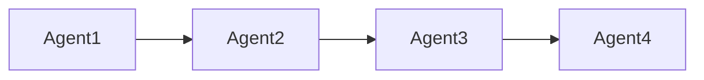

**使用场景**：复杂任务的顺序处理
**协作机制**：
```python
pipeline_collaboration = """
Agent1完成任务后，将结果传递给Agent2：

传递信息包括：
- 处理结果：{agent1_output}
- 质量评估：{quality_metrics}
- 后续建议：{next_steps_recommendation}
- 注意事项：{important_notes}

Agent2接收信息并开始处理...
"""
```

#### 2. 并行协作
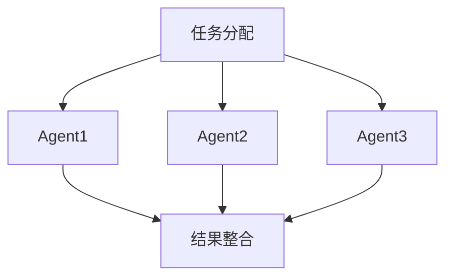

**使用场景**：可并行处理的独立子任务
**协作机制**：
```python
parallel_collaboration = """
## 并行任务执行计划

### 任务分配
- **Agent1**：{task_1_description}
- **Agent2**：{task_2_description}  
- **Agent3**：{task_3_description}

### 协调机制
- 共享信息：{shared_information}
- 依赖关系：{inter_dependencies}
- 冲突解决：{conflict_resolution_strategy}

### 结果整合
- 整合标准：{integration_criteria}
- 质量检查：{quality_assurance}
- 最终输出：{final_output_format}
"""
```

#### 3. 辩论协作
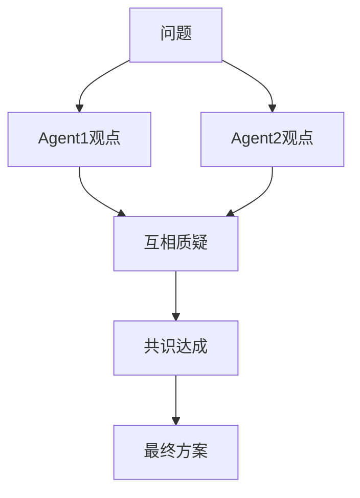

**使用场景**：需要多角度分析的复杂决策
**协作机制**：
```python
debate_collaboration = """
## 多角度辩论分析

### 辩论主题
{debate_topic}

### Agent观点

#### 支持方观点 (Agent1)
{supporting_arguments}

#### 反对方观点 (Agent2)  
{opposing_arguments}

#### 中立方分析 (Agent3)
{neutral_analysis}

### 辩论过程
1. 各方陈述观点
2. 相互质疑和反驳
3. 寻找共同点
4. 达成平衡方案

### 最终共识
{final_consensus}
"""
```

### Agent通信协议
```python
agent_communication_protocol = """
## Agent间通信协议

### 消息格式
```python
message = {
    "sender": "{agent_id}",
    "receiver": "{target_agent_id}",
    "message_type": "request|response|notification|error",
    "timestamp": "{timestamp}",
    "content": {
        "task_id": "{task_identifier}",
        "data": "{message_data}",
        "requirements": "{specific_requirements}",
        "context": "{relevant_context}"
    },
    "priority": "high|medium|low",
    "expected_response_time": "{time_limit}"
}
```

### 协调机制
1. **任务分配器**：负责任务分解和分配
2. **进度监控器**：跟踪各Agent执行进度
3. **质量控制器**：确保输出质量标准
4. **冲突仲裁器**：处理Agent间的分歧
"""
```

## 3. 检索增强生成(RAG)应用

### 3.1 知识库构建与管理

```python
KNOWLEDGE_BASE_SYSTEM = """
## 知识库构建与管理系统

### 知识库架构设计

#### 文档组织结构
```python
knowledge_base_structure = {
    "元数据层": {
        "文档ID": "唯一标识符",
        "创建时间": "文档创建时间",
        "更新时间": "最后修改时间",
        "作者": "文档创建者",
        "标签": "分类标签",
        "权限": "访问权限控制"
    },
    "内容层": {
        "原始文档": "完整原始内容",
        "处理后文档": "清洗和格式化后的内容",
        "摘要": "文档核心内容摘要",
        "关键词": "主题关键词提取"
    },
    "索引层": {
        "向量索引": "文档向量表示",
        "关键词索引": "基于关键词的检索索引",
        "语义索引": "语义相似度索引"
    }
}
```

#### 文档预处理流程
```python
document_preprocessing_pipeline = """
## 文档预处理流程

### 1. 文档解析
- **格式识别**：{document_format_detection}
- **内容提取**：{content_extraction_method}
- **结构化**：{structure_parsing}

### 2. 内容清洗
- **去除噪声**：{noise_removal_rules}
- **格式统一**：{format_standardization}
- **编码转换**：{encoding_conversion}

### 3. 文本分割
- **分割策略**：{chunking_strategy}
- **块大小**：{chunk_size}
- **重叠处理**：{overlap_handling}

### 4. 向量化
- **模型选择**：{embedding_model}
- **向量维度**：{vector_dimensions}
- **批处理**：{batch_processing}

### 5. 索引构建
- **索引类型**：{index_type}
- **相似度计算**：{similarity_metric}
- **索引优化**：{index_optimization}
"""
```

### 知识库质量保证
```python
quality_assurance_framework = """
## 知识库质量保证

### 质量评估维度
```python
quality_metrics = {
    "完整性": {
        "覆盖度": "知识点覆盖的全面性",
        "深度": "每个主题的详细程度",
        "更新度": "信息的时效性"
    },
    "一致性": {
        "术语统一": "专业术语使用的一致性",
        "格式统一": "文档格式的规范性",
        "逻辑一致": "内容逻辑的连贯性"
    },
    "准确性": {
        "事实准确": "信息的真实性",
        "引用规范": "来源引用的规范性",
        "版本控制": "内容版本的管理"
    }
}
```

### 质量监控机制
- **自动检测**：{automated_quality_checks}
- **人工审核**：{manual_review_process}
- **用户反馈**：{user_feedback_integration}
- **持续改进**：{continuous_improvement_cycle}
"""
```

### 3.2 智能检索策略

```python
INTELLIGENT_RETRIEVAL_SYSTEM = """
## 智能检索系统

### 多层检索策略

#### 1. 语义检索
```python
semantic_retrieval = {
    "原理": "基于向量相似度的语义匹配",
    "优势": "理解查询意图，不局限于关键词匹配",
    "适用场景": "概念性查询、模糊查询",
    "实现方法": {
        "查询向量化": "将用户查询转换为向量",
        "相似度计算": "计算查询与文档的相似度",
        "结果排序": "按相似度降序排列",
        "阈值过滤": "过滤低相似度结果"
    }
}
```

#### 2. 关键词检索
```python
keyword_retrieval = {
    "原理": "基于关键词匹配的精确检索",
    "优势": "精确匹配、速度快",
    "适用场景": "专有名词查询、精确匹配需求",
    "实现方法": {
        "查询解析": "提取查询中的关键词",
        "倒排索引": "基于倒排索引快速匹配",
        "权重计算": "TF-IDF等权重计算",
        "结果排序": "按权重排序返回结果"
    }
}
```

#### 3. 混合检索
```python
hybrid_retrieval = {
    "原理": "结合语义检索和关键词检索",
    "优势": "兼顾准确性和召回率",
    "适用场景": "复杂查询、高质量要求",
    "实现方法": {
        "并行检索": "同时执行语义和关键词检索",
        "结果融合": "合并两种检索结果",
        "重排序": "基于综合得分重新排序",
        "去重处理": "移除重复结果"
    }
}
```

### 查询理解与扩展
```python
query_understanding = """
## 查询理解与扩展

### 查询意图识别
- **信息查询**：寻找特定信息
- **对比分析**：比较不同选项
- **问题解决**：寻求解决方案
- **学习研究**：深入了解某个主题

### 查询扩展策略
```python
query_expansion_methods = {
    "同义词扩展": {
        "方法": "基于同义词词典扩展查询词",
        "示例": "汽车 → [汽车, 车辆, 轿车, 机动车]"
    },
    "相关词扩展": {
        "方法": "基于语义相关性扩展",
        "示例": "机器学习 → [人工智能, 深度学习, 神经网络]"
    },
    "上下文扩展": {
        "方法": "基于用户历史和上下文扩展",
        "示例": "Python → [Python编程, Python语法, Python库]"
    }
}
```

### 检索结果优化
```python
result_optimization = """
## 检索结果优化

### 结果排序策略
1. **相似度得分**：基础相似度权重40%
2. **文档质量**：权威性和可信度权重30%
3. **时效性**：信息新鲜度权重20%
4. **用户偏好**：个性化调整权重10%

### 结果多样性
- **去重处理**：移除内容高度重复的结果
- **主题多样性**：确保结果覆盖不同角度
- **来源多样性**：来自不同权威来源

### 结果质量控制
- **置信度评估**：对检索结果给出置信度分数
- **相关性验证**：验证结果与查询的相关性
- **准确性检查**：检查事实性信息的准确性
"""
```

### 3.3 RAG系统集成模式

```python
RAG_INTEGRATION_PATTERNS = """
## RAG系统集成模式

### 集成架构类型

#### 1. 串行集成模式
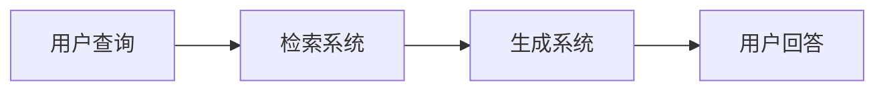

**特点**：
- 简单直接的处理流程
- 检索结果直接用于生成
- 适合单轮对话场景

**实现模板**：
```python
serial_rag_template = """
基于以下检索到的相关信息回答用户问题：

用户问题：{user_query}

检索到的相关信息：
{retrieved_documents}

请基于以上信息，准确回答用户问题。如果信息不足，请明确说明。

回答要求：
1. 直接回答用户问题
2. 引用相关信息来源
3. 保持答案简洁准确
4. 如有不确定性，明确标出
"""
```

#### 2. 迭代交互模式
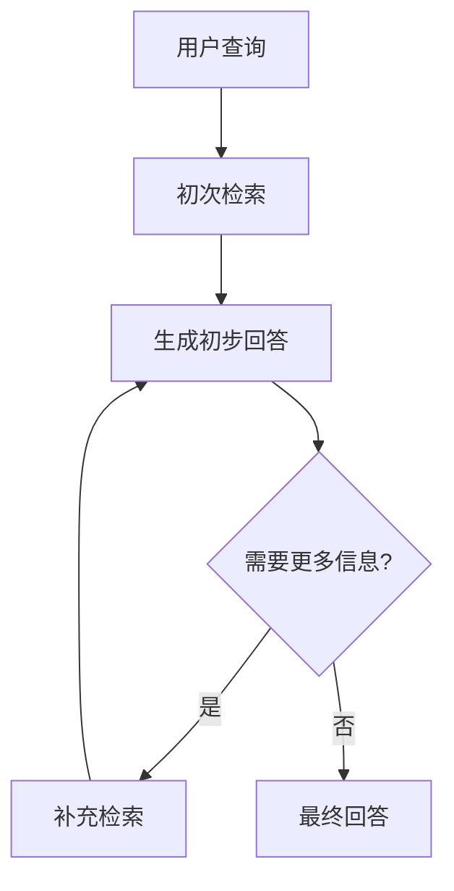

**特点**：
- 支持多轮检索优化
- 可根据生成结果调整检索策略
- 适合复杂问题处理

**实现模板**：
```python
iterative_rag_template = """
## 迭代式信息检索与生成

### 第{iteration_round}轮检索

当前检索查询：{current_query}
检索结果：{current_results}

### 信息充分性评估
基于当前信息，我能够：
- ✅ 已解决：{resolved_aspects}
- ❓ 需补充：{needs_more_info}
- ❌ 缺失：{missing_info}

### 下一步行动
{next_action_plan}
"""
```

#### 3. 混合增强模式
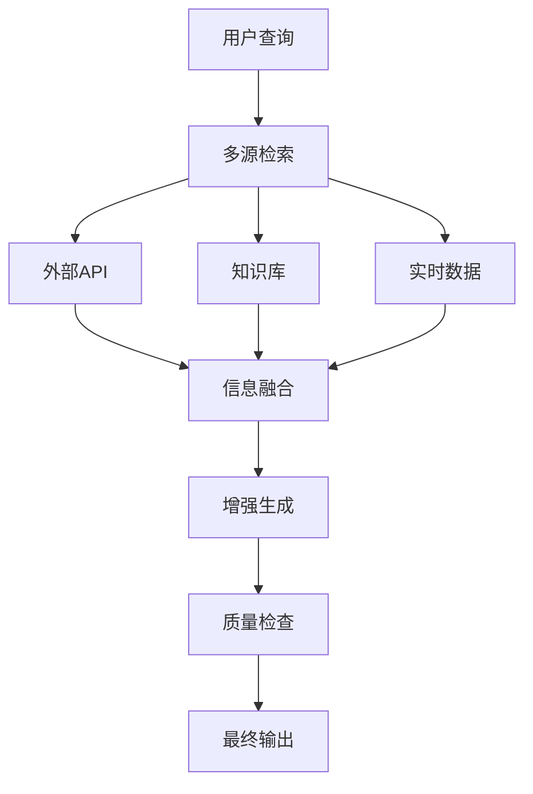

**特点**：
- 整合多种信息源
- 实时信息与静态知识结合
- 提供最全面的信息支持

### RAG质量评估

#### 评估指标体系
```python
rag_evaluation_metrics = {
    "检索质量": {
        "精确率": "检索结果中相关文档的比例",
        "召回率": "相关文档被检索到的比例",
        "平均精度": "检索结果排序质量"
    },
    "生成质量": {
        "准确性": "生成答案的事实准确性",
        "相关性": "答案与问题的相关程度",
        "完整性": "答案的信息完整度",
        "一致性": "答案内容的逻辑一致性"
    },
    "用户体验": {
        "满意度": "用户对答案的满意程度",
        "有用性": "答案对用户的实际帮助",
        "可信度": "用户对答案的信任程度"
    }
}
```

#### 自动评估流程
```python
automated_evaluation = """
## RAG系统自动评估

### 评估数据集
- **问题集**：{evaluation_questions}
- **标准答案**：{ground_truth_answers}
- **相关文档**：{relevant_documents}

### 评估流程
1. **批量测试**：对测试集进行批量处理
2. **结果对比**：将生成结果与标准答案对比
3. **指标计算**：计算各项评估指标
4. **分析报告**：生成详细的评估报告

### 持续监控
- **在线评估**：实时监控系统表现
- **用户反馈**：收集用户使用反馈
- **定期评审**：定期全面评估系统性能
"""
```

### RAG优化策略
```python
rag_optimization_strategies = """
## RAG系统优化策略

### 检索优化
1. **查询重写**：优化用户查询表达
2. **多策略检索**：结合不同检索方法
3. **结果重排**：基于多因素重新排序
4. **动态阈值**：根据查询调整相似度阈值

### 生成优化
1. **上下文管理**：优化输入上下文长度
2. **提示优化**：持续改进生成提示
3. **输出格式化**：规范化输出格式
4. **质量过滤**：过滤低质量生成结果

### 系统优化
1. **缓存机制**：缓存常见查询结果
2. **并行处理**：并行化检索和生成
3. **负载均衡**：分布式处理高并发
4. **性能监控**：实时监控系统性能
"""
```

## 4. 实战集成案例

### 4.1 企业知识管理系统

```python
ENTERPRISE_KNOWLEDGE_SYSTEM = """
## 企业知识管理系统集成案例

### 系统架构
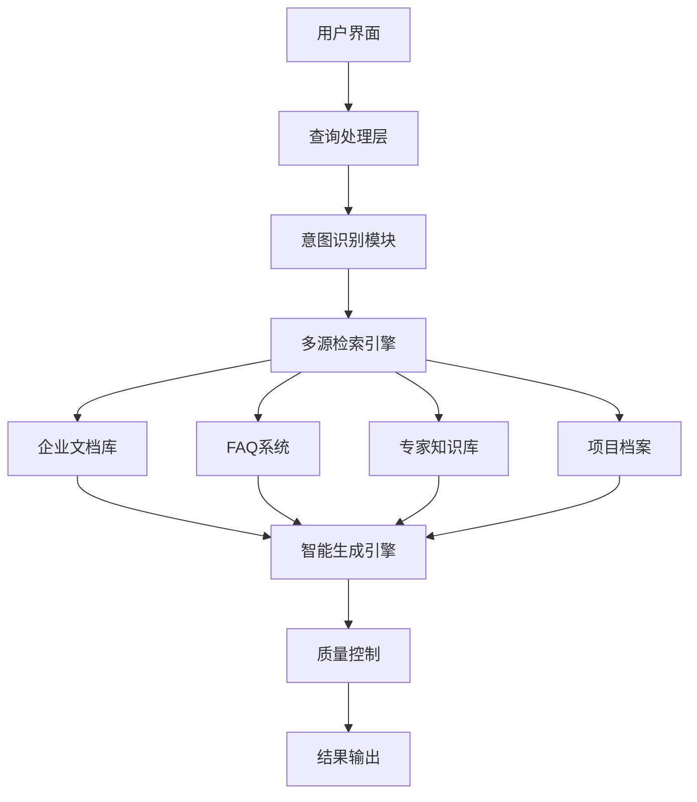

### 核心功能模块

#### 1. 智能问答系统
```python
qa_system_template = """
作为企业知识助手，我将帮您查找和整理企业内部信息：

查询类型识别：{query_type}
- 政策查询：查找公司政策制度
- 流程指导：业务流程操作指南  
- 技术文档：技术规范和文档
- 项目信息：项目相关资料
- 人事信息：组织架构和联系方式

检索策略：{retrieval_strategy}
- 精确匹配：政策条文、流程步骤
- 语义检索：概念性问题、经验分享
- 混合检索：综合性问题、复杂查询

信息整合：{information_integration}
- 多源聚合：整合来自不同系统的信息
- 去重排序：移除重复内容，按相关性排序
- 权威性标注：标识信息来源和权威程度

回答生成：{answer_generation}
- 直接回答：明确的事实性问题
- 引导式回答：复杂问题的分步指导
- 推荐相关：提供相关资料和联系人
"""
```

#### 2. 文档智能分析
```python
document_analysis_template = """
## 文档智能分析功能

### 分析类型
- **内容摘要**：自动生成文档摘要
- **主题提取**：识别文档核心主题
- **关键信息**：提取关键数据和结论
- **相关推荐**：推荐相关文档和资料

### 分析流程
1. **文档解析**：{document_parsing}
2. **内容分析**：{content_analysis}
3. **结构化提取**：{structured_extraction}
4. **智能标注**：{intelligent_annotation}

### 输出格式
```
文档标题：{document_title}
文档类型：{document_type}
关键信息：
- {key_point_1}
- {key_point_2}
- {key_point_3}

核心摘要：{executive_summary}

相关文档：{related_documents}
建议行动：{recommended_actions}
```
"""
```

### 4.2 客户服务智能化改造

```python
CUSTOMER_SERVICE_TRANSFORMATION = """
## 客户服务智能化系统

### 系统能力图谱
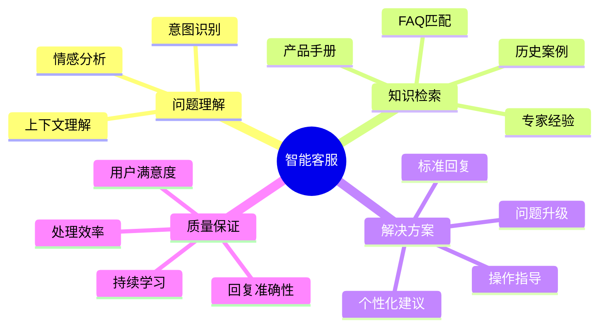

### 核心对话流程
```python
customer_service_flow = """
## 智能客服对话流程

### 阶段1：问题接收与理解
```
用户输入：{customer_input}

问题分析：
- 意图识别：{intent_classification}
- 情感分析：{sentiment_analysis}
- 紧急程度：{urgency_level}
- 问题分类：{issue_category}
```

### 阶段2：知识检索与匹配
```
检索策略：{retrieval_strategy}
- FAQ检索：{faq_results}
- 产品文档：{product_doc_results}
- 历史案例：{historical_cases}
- 专家知识：{expert_knowledge}

最佳匹配：{best_match_result}
置信度：{confidence_score}
```

### 阶段3：回复生成与输出
```
回复模板：{response_template}
个性化调整：{personalization_factors}
质量检查：{quality_checks}

最终回复：{final_response}
跟进计划：{follow_up_plan}
```

### 阶段4：效果评估与学习
```
用户反馈：{user_feedback}
解决状态：{resolution_status}
学习要点：{learning_points}
知识更新：{knowledge_updates}
```
"""
```

### 个性化服务模板
```python
personalized_service_template = """
## 个性化客户服务

### 客户画像
- 客户类型：{customer_type}
- 历史问题：{historical_issues}
- 偏好风格：{communication_preference}
- 产品使用：{product_usage_pattern}

### 个性化策略
- 回复风格：{response_style}
- 详细程度：{detail_level}
- 技术术语：{technical_language_level}
- 推荐内容：{recommendation_focus}

### 回复模板
亲爱的{customer_name}，

感谢您联系我们。基于您之前的{previous_interaction_context}，我为您提供以下解决方案：

{personalized_solution}

考虑到您是{customer_profile}，我特别为您准备了：
{additional_recommendations}

如有其他问题，请随时联系我们。我们会持续关注您的使用体验。

{service_signature}
"""
```

### 4.3 业务决策支持系统

```python
BUSINESS_DECISION_SUPPORT = """
## 业务决策支持系统

### 决策分析框架
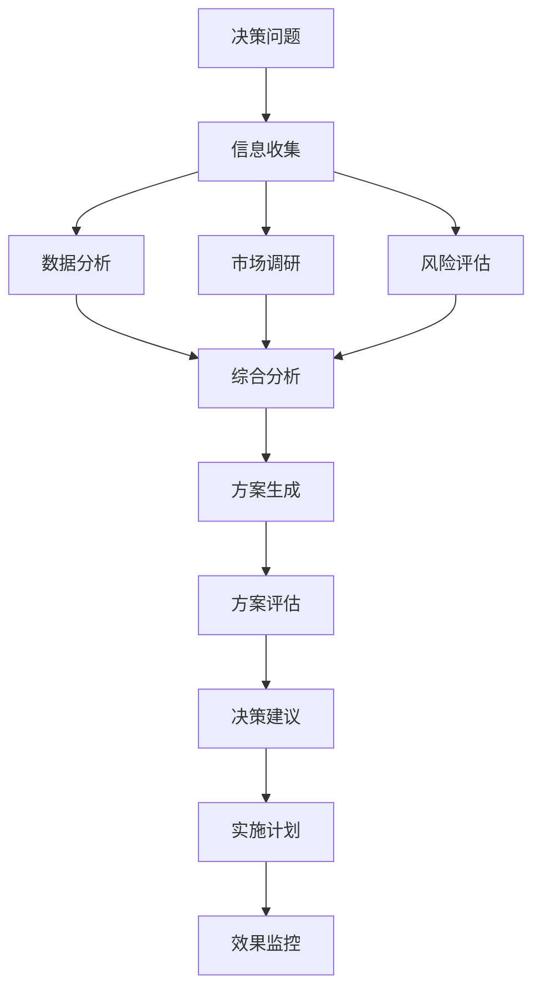

### 决策支持模板
```python
decision_support_template = """
## 业务决策分析报告

### 决策背景
- 决策问题：{decision_problem}
- 业务影响：{business_impact}
- 时间窗口：{time_constraint}
- 资源约束：{resource_constraints}

### 信息收集与分析

#### 内部数据分析
{internal_data_analysis}

#### 外部环境分析
{external_environment_analysis}

#### 竞争态势分析
{competitive_analysis}

### 决策方案

#### 方案A：{option_a_name}
- 核心内容：{option_a_description}
- 预期收益：{option_a_benefits}
- 实施成本：{option_a_costs}
- 风险评估：{option_a_risks}
- 成功概率：{option_a_probability}

#### 方案B：{option_b_name}
- 核心内容：{option_b_description}
- 预期收益：{option_b_benefits}
- 实施成本：{option_b_costs}
- 风险评估：{option_b_risks}
- 成功概率：{option_b_probability}

### 综合评估

#### 定量分析
| 评估维度 | 方案A | 方案B | 权重 |
|----------|-------|-------|------|
| 财务回报 | {financial_a} | {financial_b} | 30% |
| 实施难度 | {difficulty_a} | {difficulty_b} | 25% |
| 风险程度 | {risk_a} | {risk_b} | 25% |
| 战略契合 | {strategy_a} | {strategy_b} | 20% |

#### 定性分析
{qualitative_analysis}

### 推荐决策
基于以上分析，推荐选择：{recommended_option}

推荐理由：{recommendation_rationale}

### 实施建议
{implementation_recommendations}

### 风险控制
{risk_mitigation_strategies}

### 监控指标
{monitoring_metrics}
"""
```

## 📋 集成实战检查清单

### 工具集成要点
- [ ] 明确工具的能力边界和适用场景
- [ ] 设计完善的错误处理和降级机制
- [ ] 建立工具调用的监控和日志系统
- [ ] 制定工具性能和成本优化策略

### 工作流设计要点  
- [ ] 识别任务的并行和串行关系
- [ ] 设置关键节点的质量检查点
- [ ] 建立状态管理和上下文传递机制
- [ ] 设计异常情况的处理流程

### RAG系统要点
- [ ] 构建高质量的知识库和索引
- [ ] 优化检索策略提高准确性
- [ ] 设计智能的查询理解和扩展
- [ ] 建立质量评估和持续改进机制

---

**恭喜！您已完成Claude提示工程实用指南的学习。现在您具备了从基础到高级的完整提示工程技能体系。**

**建议下一步行动：**
1. 选择一个实际业务场景开始实践
2. 建立自己的提示模板库
3. 构建质量监控和改进体系
4. 持续学习和分享经验