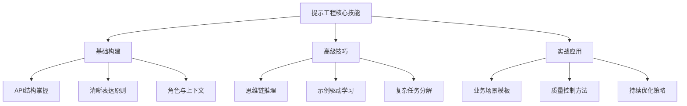

# Claude 提示工程实用指南

## 🎯 指南概览

本指南将Anthropic的提示工程教程精华提炼为实用的知识体系，专注于**可立即应用的技巧**和**经过验证的最佳实践**。



## 📖 章节导航    C --> C1[分离数据和指令]

    C --> C2[格式化输出]

1. **[基础篇：构建有效提示的核心原则](./01_foundations.md)**    C --> C3[思维链推理]

   - API结构与参数优化    C --> C4[使用示例]

   - 清晰性原则与实用技巧    

   - 角色设定与上下文管理    D --> D1[避免幻觉]

    D2[复杂提示构建]

2. **[进阶篇：高效提示技术](./02_advanced_techniques.md)**    D --> D2

   - 思维链与分步推理    

   - 示例驱动的少样本学习    E --> E1[提示链]

   - 复杂任务的分解策略    E --> E2[工具使用]

    E --> E3[搜索检索]

3. **[实战篇：业务应用与案例](./03_practical_applications.md)**    E --> E4[性能评估]

   - 常见业务场景的提示模板```

   - 行业特定的解决方案

   - 错误处理与边缘情况## 📖 章节导航


4. **[优化篇：质量控制与改进](./04_optimization.md)**### 基础入门 (Beginner)

   - 避免AI幻觉的实用方法1. **[基本提示结构](./chapters/01_basic_prompt_structure.md)** - 学习构建有效提示的基础框架

   - A/B测试与性能评估2. **[清晰直接的表达](./chapters/02_being_clear_and_direct.md)** - 掌握清晰沟通的黄金法则

   - 持续改进的系统化方法3. **[角色分配与角色提示](./chapters/03_assigning_roles.md)** - 通过角色设定提升 Claude 的表现


5. **[工具篇：扩展能力与集成](./05_tools_integration.md)**### 中级技巧 (Intermediate)

   - 工具使用与函数调用4. **[分离数据和指令](./chapters/04_separating_data_and_instructions.md)** - 有效组织提示内容

   - 提示链与工作流设计5. **[格式化输出与为 Claude 代言](./chapters/05_formatting_output.md)** - 控制输出格式和风格

   - 检索增强生成(RAG)应用6. **[预知与分步思考](./chapters/06_thinking_step_by_step.md)** - 启用 Claude 的推理过程

7. **[使用示例与少样本提示](./chapters/07_using_examples.md)** - 通过示例提升任务表现

## 🚀 快速上手

### 高级应用 (Advanced)

### 立即可用的提示模板8. **[避免幻觉](./chapters/08_avoiding_hallucinations.md)** - 确保回答的准确性和可靠性

9. **[从零构建复杂提示](./chapters/09_complex_prompts.md)** - 实际行业用例的复杂提示设计

```python

# 通用高质量提示模板### 附录：高级主题 (Appendix)

UNIVERSAL_TEMPLATE = """- **[提示链](./appendix/chaining_prompts.md)** - 连接多个提示以处理复杂任务

你是一位{role}，具有{expertise}的专业背景。- **[工具使用](./appendix/tool_use.md)** - 集成外部工具和函数

- **[搜索与检索](./appendix/search_and_retrieval.md)** - 信息检索和知识整合

任务：{task_description}- **[实证性能评估](./appendix/performance_evaluation.md)** - 评估和优化提示性能


上下文信息：## 🚀 学习路径

{context_data}

```mermaid

请按以下步骤完成：journey

1. {step_1}    title 提示工程学习之旅

2. {step_2}    section 基础阶段

3. {step_3}      学习API结构        : 5: 学习者

      掌握清晰表达       : 4: 学习者

输出要求：      理解角色提示       : 3: 学习者

- {requirement_1}    section 进阶阶段

- {requirement_2}      分离数据指令       : 4: 学习者

- 如有不确定的信息，请明确说明      格式化输出         : 5: 学习者

      启用思维链         : 3: 学习者

示例格式：      使用示例学习       : 4: 学习者

{output_example}    section 高级阶段

"""      避免幻觉问题       : 2: 学习者

```      构建复杂提示       : 3: 学习者

    section 专家阶段

### 核心原则速记      提示链设计         : 5: 专家

      工具集成使用       : 4: 专家

```mermaid      性能优化评估       : 5: 专家

mindmap```

  root((提示工程))

    清晰性## 💡 核心概念一览

      具体指令

      明确约束### Messages API 结构

      单一理解```mermaid

    结构化graph LR

      逻辑分层    A[Messages API] --> B[必需参数]

      信息分离    A --> C[可选参数]

      格式统一    

    可靠性    B --> B1[model - 模型名称]

      避免幻觉    B --> B2[max_tokens - 最大令牌数]

      验证机制    B --> B3[messages - 消息数组]

      错误处理    

    效率性    C --> C1[system - 系统提示]

      复用模式    C --> C2[temperature - 温度参数]

      批量处理    

      性能优化    B3 --> D[user角色消息]

```    B3 --> E[assistant角色消息]

```

## 🎓 学习路径

### 提示工程核心原则

### 初学者路径 (1-2周)1. **清晰性原则** - 明确、直接的指令

1. 掌握基础API结构和参数2. **上下文原则** - 提供充分的背景信息

2. 学会写清晰直接的指令3. **结构化原则** - 逻辑清晰的组织方式

3. 练习角色设定和格式控制4. **示例化原则** - 通过实例说明期望

5. **迭代化原则** - 持续优化和改进

### 进阶者路径 (2-4周)

1. 掌握思维链和示例技术## 🔧 技术要求

2. 学会处理复杂多步任务

3. 构建业务场景解决方案- Python 3.7+

- Anthropic API 密钥

### 专家路径 (1-3个月)- 基本的 JSON 和 API 理解

1. 设计完整的提示系统

2. 集成工具和外部数据源## 📝 使用说明

3. 建立评估和优化体系

1. 按顺序阅读各章节

## 💡 立即行动2. 实践每个章节的示例

3. 完成相关练习

选择一个实际问题，用本指南的方法构建解决方案：4. 在实际项目中应用所学技能


1. **明确任务目标** - 具体要解决什么问题？## 🤝 贡献指南

2. **选择核心技术** - 需要哪些提示工程技巧？

3. **构建初版提示** - 用模板快速搭建框架如果您发现错误或有改进建议，欢迎提交 Issue 或 Pull Request。

4. **测试和迭代** - 验证效果并持续改进

## 📄 许可证

---

本教程基于原始 Anthropic 教程改编，遵循相同的开源许可证。

**开始您的提示工程之旅：[基础篇：构建有效提示的核心原则](./01_foundations.md)**
---

**开始您的提示工程之旅，从 [第一章：基本提示结构](./chapters/01_basic_prompt_structure.md) 开始！**