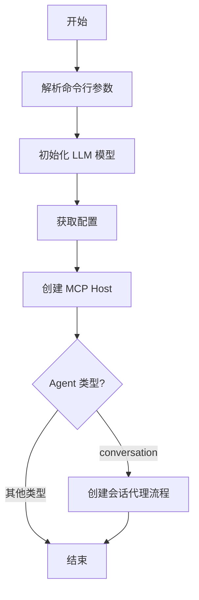
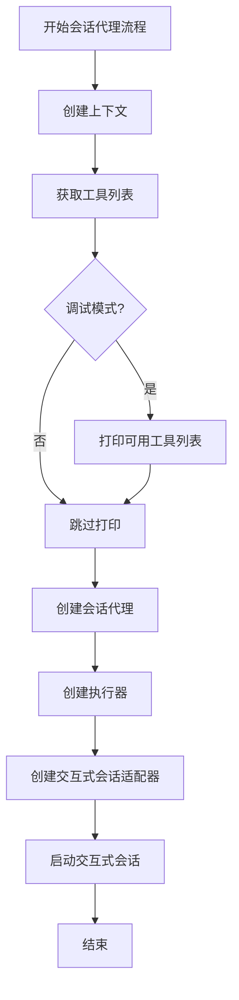
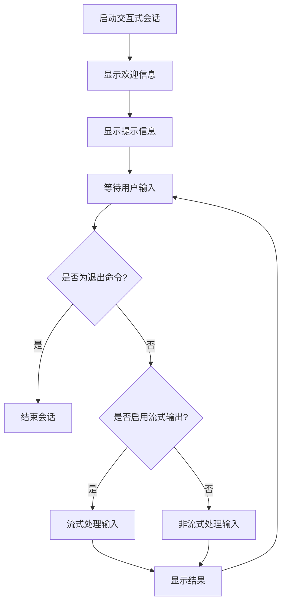
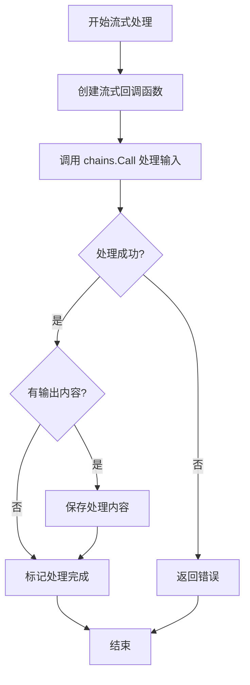
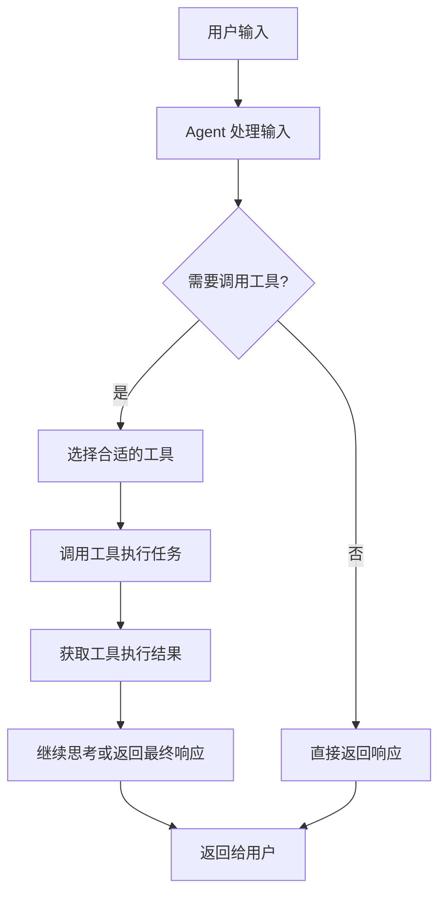
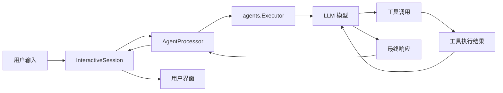
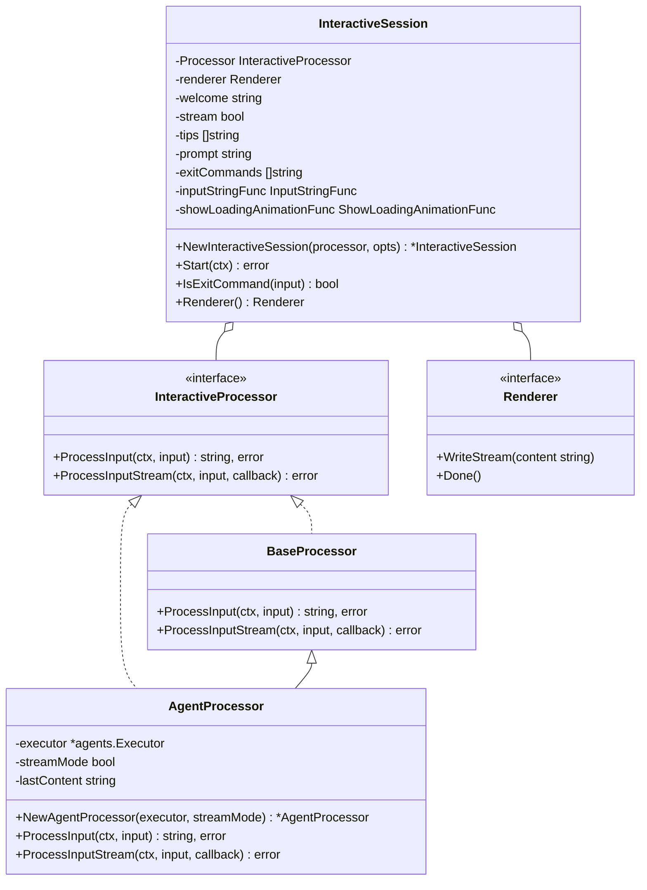
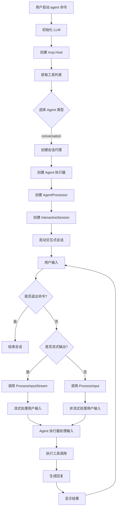
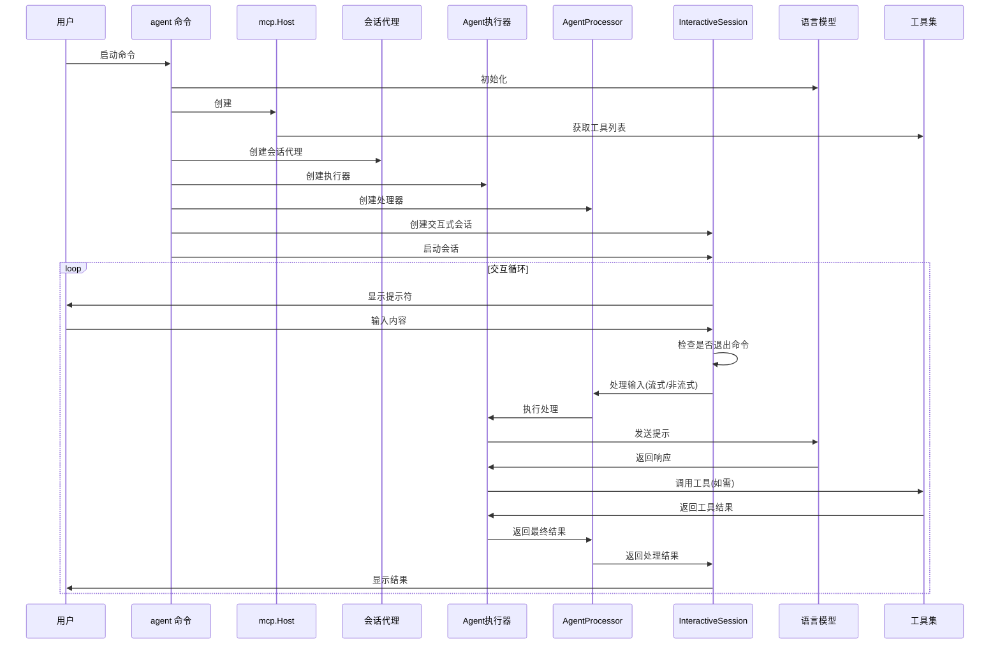

# Tong Agent 命令流程分析

## 概述

`agent.go` 文件实现了一个基于 LangChain 的 AI 对话代理，支持流式输出和工具调用功能。该命令通过 Cobra 库集成到 CLI 工具中，提供了一个交互式的 AI 助手界面。

## 命令结构

`agent` 命令支持以下参数：

- `--stream, -s`：启用流式输出模式（默认为 true）
- `--type, -t`：Agent 类型（默认为 "conversation"）
- `--config, -c`：配置文件路径（默认为 "tong.json"）
- `--directory, -d`：工作目录路径（默认为当前目录）
- `--repository, -r`：Git 仓库 URL（用于克隆和打包）

# agent.go 命令架构分析

## 概述

`agent.go` 是一个基于 LangChain 框架实现的 AI 对话代理命令行工具，它提供了与 AI 模型交互的能力，支持流式输出和工具调用。本文档从架构设计的角度分析了 `agent.go` 的实现，包括其组件结构、执行流程、数据流向以及各组件之间的交互关系。

本文档包含以下几个部分：

1. **命令结构**：介绍 `agent` 命令的参数和选项
2. **主流程图**：展示 `agent.go` 命令的主要执行流程
3. **类图**：展示系统中的核心类和接口及其关系
4. **流程图**：详细展示命令执行的完整流程
5. **组件交互图**：展示各组件之间的交互关系
6. **核心组件说明**：详细介绍每个核心组件的职责和实现
7. **总结**：总结 `agent.go` 的主要特点
8. **架构优化建议**：提出可能的架构改进方向

## 命令结构

`agent` 命令支持以下参数：

- `--stream, -s`：启用流式输出模式（默认为 true）
- `--type, -t`：Agent 类型（默认为 "conversation"）
- `--config, -c`：配置文件路径（默认为 "tong.json"）
- `--directory, -d`：工作目录路径（默认为当前目录）
- `--repository, -r`：Git 仓库 URL（用于克隆和打包）

## 主流程图

### 会话代理流程

### 交互式会话流程

### 流式处理流程

## 核心组件说明

### AgentProcessor

`AgentProcessor` 是一个适配 langchaingo agent 的处理器，实现了 `InteractiveProcessor` 接口。它负责处理用户输入并返回 AI 的响应，支持流式和非流式两种模式。

主要属性：
- `executor`：langchaingo 的 agent executor
- `streamMode`：是否使用流式输出
- `lastContent`：最后一次处理的内容

主要方法：
- `ProcessInput`：处理用户输入，非流式模式
- `ProcessInputStream`：流式处理用户输入

### InteractiveSession

`InteractiveSession` 是交互式会话的实现，负责管理用户输入和 AI 响应的交互流程。

主要属性：
- `Processor`：处理器，实现了 InteractiveProcessor 接口
- `renderer`：渲染器，用于输出内容
- `welcome`：欢迎信息
- `stream`：是否流式输出
- `tips`：提示信息
- `prompt`：命令提示符
- `exitCommands`：退出命令列表

主要方法：
- `Start`：启动交互式会话
- `IsExitCommand`：检查输入是否为退出命令

## 工具调用流程

## 数据流向

## 类图

## 流程图

## 组件交互图

## 核心组件说明

### 1. InteractiveProcessor 接口

`InteractiveProcessor` 是整个系统的核心接口，定义了处理用户输入的两种方式：

- `ProcessInput`: 非流式处理，一次性返回完整结果
- `ProcessInputStream`: 流式处理，通过回调函数逐步返回结果

这种设计使得系统可以灵活地支持不同的处理模式，同时保持接口的一致性。

### 2. AgentProcessor

`AgentProcessor` 是 `InteractiveProcessor` 接口的具体实现，负责：

- 封装 LangChain 的 Agent 执行器
- 处理用户输入并调用 LLM 生成回复
- 支持工具调用
- 实现流式输出逻辑

流式处理的实现通过 `chains.WithStreamingFunc` 函数，该函数接收一个回调函数，在生成内容时逐步调用该回调函数，实现流式输出效果。

### 3. InteractiveSession

`InteractiveSession` 负责管理整个交互会话，主要功能包括：

- 显示欢迎信息和提示
- 读取用户输入
- 检查退出命令
- 根据配置选择流式或非流式处理
- 显示处理结果

通过依赖注入 `InteractiveProcessor`，`InteractiveSession` 可以与不同的处理器配合使用，增强了系统的灵活性和可测试性。

### 4. mcp.Host

`mcp.Host` 是工具管理的核心组件，负责：

- 获取系统内置工具
- 获取自定义工具
- 提供工具调用的接口

通过 `GetTools` 方法，`mcp.Host` 将系统工具和自定义工具组合在一起，提供给 Agent 使用。

### 5. Agent 执行器

`agents.Executor` 是 LangChain 框架提供的组件，负责：

- 执行 Agent 的推理过程
- 调用工具
- 生成最终回复

执行器是连接 LLM 和工具的桥梁，它根据 LLM 的输出决定是调用工具还是直接生成回复。

## 总结

`agent.go` 实现了一个功能完整的 AI 对话代理，通过集成 LangChain 框架，提供了流式输出和工具调用能力。其架构设计清晰，采用了接口和依赖注入的方式，使得代码具有良好的可测试性和可扩展性。

主要特点：

1. 支持流式输出，提供更好的用户体验
2. 支持工具调用，增强 AI 的能力
3. 模块化设计，各组件职责明确
4. 使用依赖注入，便于测试和扩展
5. 国际化支持，通过 lang.T 函数实现

## 架构优化建议

1. **更灵活的 Agent 类型支持**：当前代码只实现了 "conversation" 类型的 Agent，可以扩展支持更多类型，如任务型 Agent、搜索型 Agent 等。

2. **工具注册机制**：实现一个更灵活的工具注册机制，允许动态注册和管理工具。

3. **会话状态管理**：添加会话状态管理，支持多轮对话中的上下文保持和状态跟踪。

4. **异步处理**：对于长时间运行的工具调用，可以考虑使用异步处理机制，避免阻塞用户交互。

5. **插件系统**：设计一个插件系统，使第三方开发者可以轻松扩展 Agent 的功能。