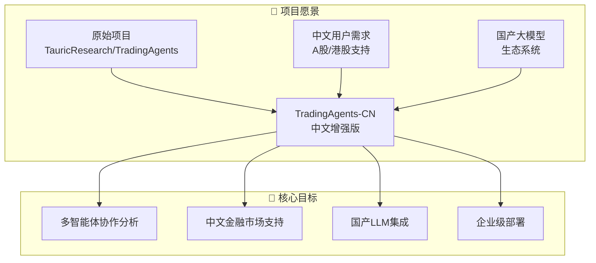
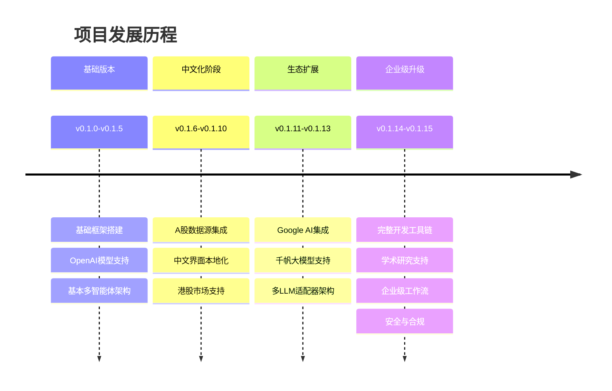
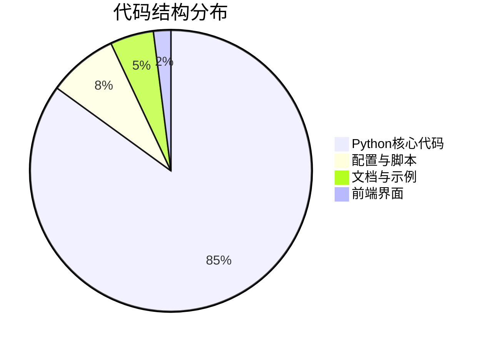
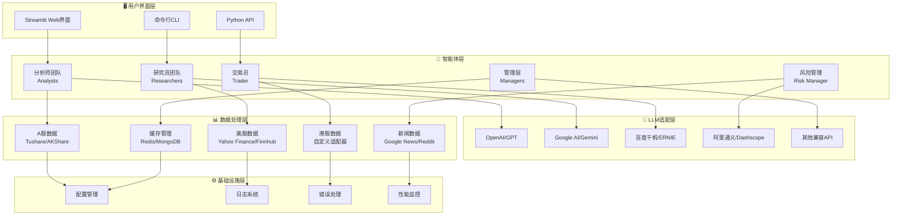
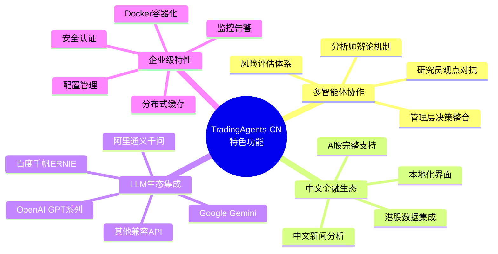
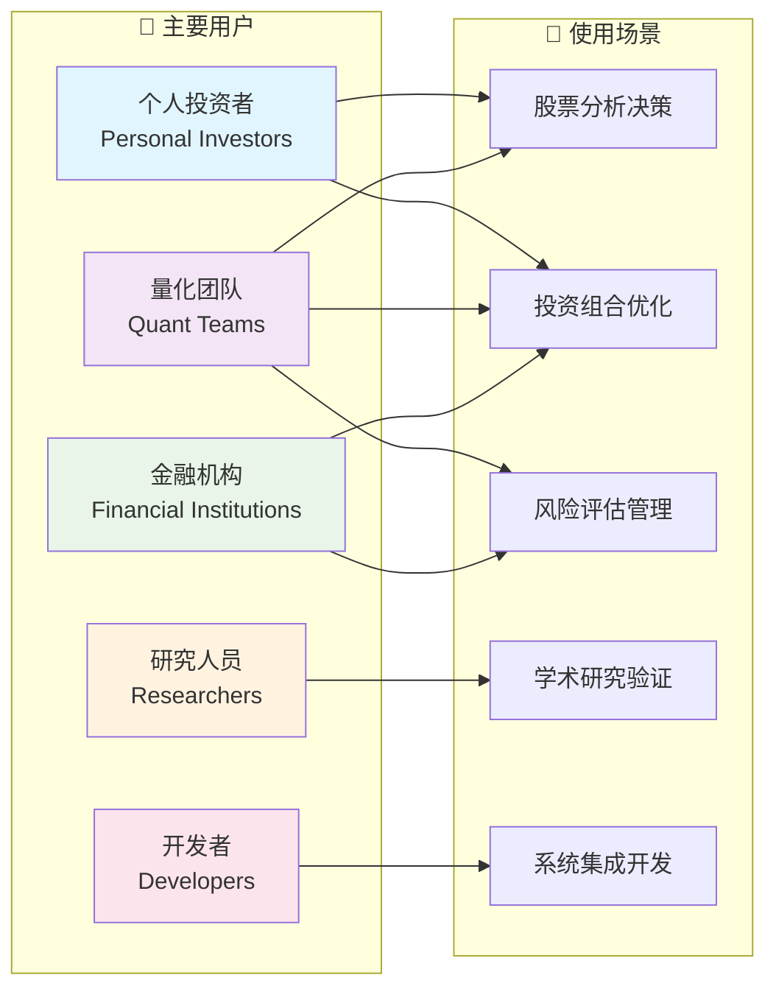
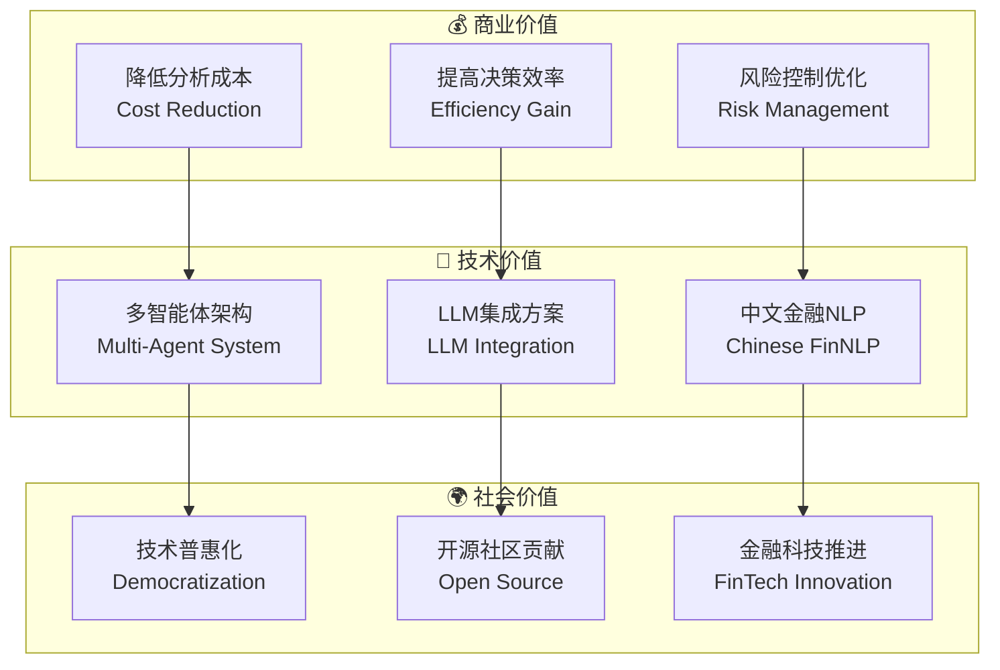
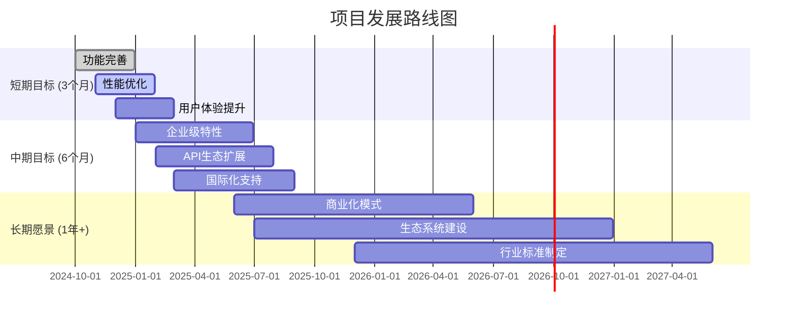
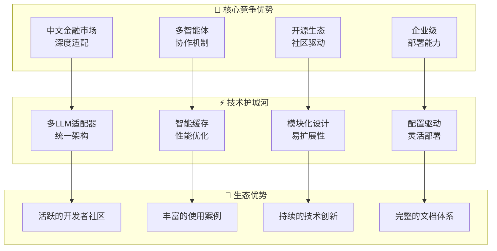

# TradingAgents-CN 项目开发者分析 - 项目概览视角

## 📋 项目概述

TradingAgents-CN 是一个基于多智能体大语言模型的中文金融交易决策框架，专门为中文用户优化，提供完整的A股/港股/美股分析能力。



## 🚀 版本历程与特性



## 📊 项目规模统计



### 技术指标
- **总代码量**: ~100K+ 行
- **核心模块**: 50+ Python模块
- **智能体类型**: 15+ 专业智能体
- **数据源支持**: 10+ 金融数据API
- **LLM提供商**: 8+ 大模型厂商
- **部署方式**: 3种 (本地/Docker/云端)

## 🏗️ 技术架构概览



## 🔧 项目特色功能



## 🎯 目标用户群体



## 📈 项目价值主张



## 🚀 未来发展规划



## 📋 项目成熟度评估

```mermaid
radar
    title 项目各维度成熟度评估
    plotBorder true
    
    "功能完整性" : [0.85]
    "代码质量" : [0.80]
    "文档完善度" : [0.90]
    "测试覆盖率" : [0.70]
    "性能表现" : [0.75]
    "安全性" : [0.85]
    "可维护性" : [0.88]
    "用户体验" : [0.82]
```

### 评估说明
- **🟢 优秀 (0.8+)**: 功能完整性、文档完善度、安全性、可维护性
- **🟡 良好 (0.7-0.8)**: 代码质量、性能表现、用户体验  
- **🟠 待改进 (<0.7)**: 测试覆盖率

## 🏆 竞争优势分析



---

## 📚 相关文档链接

- [技术架构详解](./technical-architecture.md)
- [数据流分析](./data-flow-analysis.md)
- [部署运维指南](./deployment-operations.md)
- [开发流程规范](./development-workflow.md)

---

*📅 文档生成时间: 2025年10月9日*  
*🔄 最后更新: v0.1.15*  
*👨‍💻 分析视角: 项目概览*