# TradingAgents-CN 项目开发者分析 - 技术架构视角

## 🏗️ 系统架构概览

TradingAgents-CN 采用分层式微服务架构，结合多智能体协作模式，为金融交易决策提供强大的AI驱动分析能力。

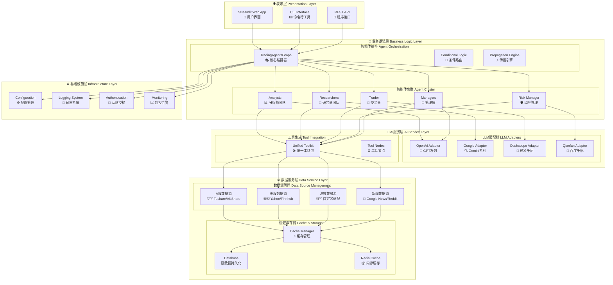

## 🎭 多智能体架构设计

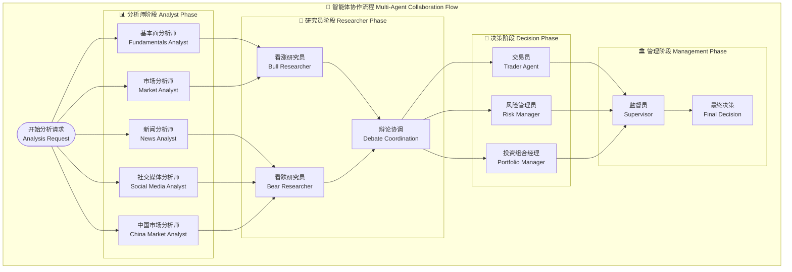

## 🧠 LLM适配器架构

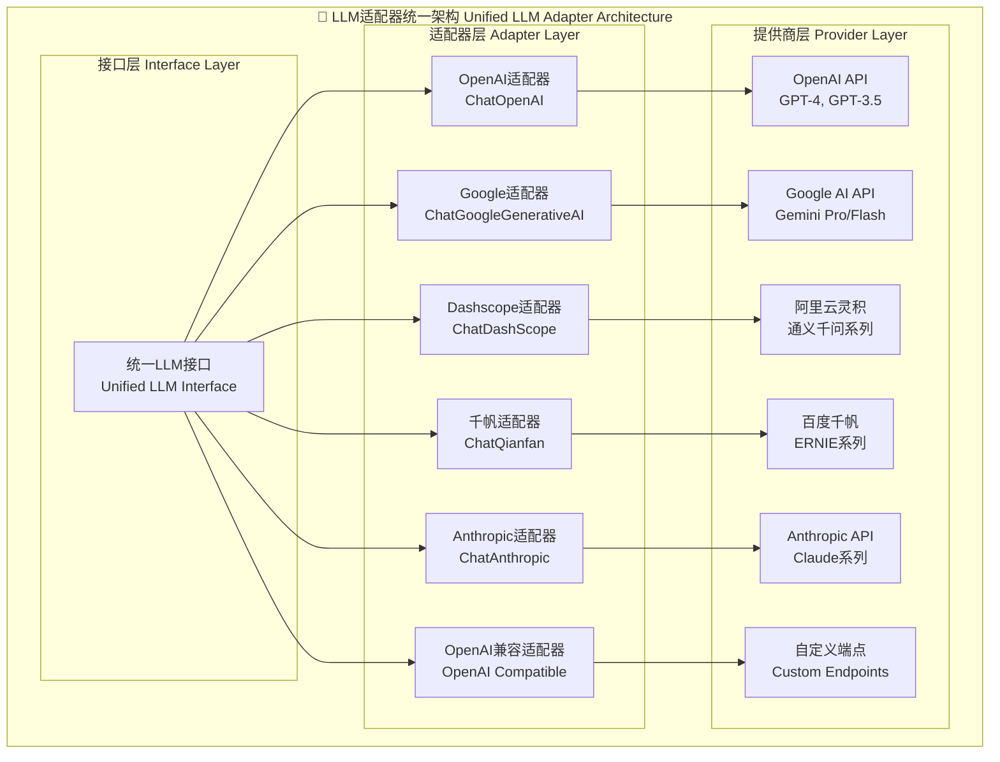

## 🛠️ 工具与数据集成架构

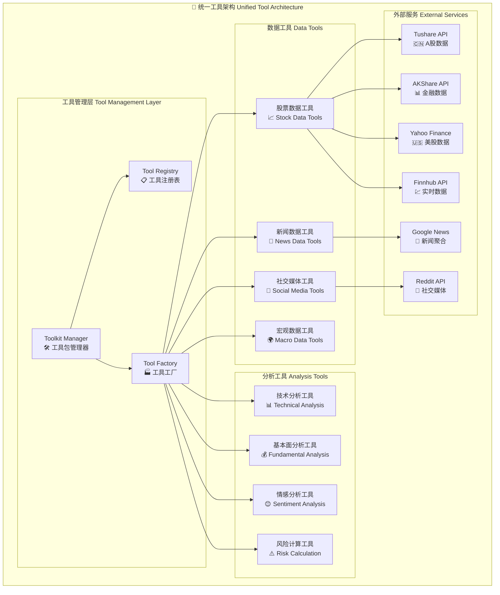

## 📊 数据流架构

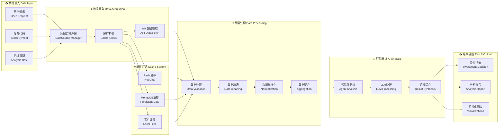

## 🔧 配置管理架构

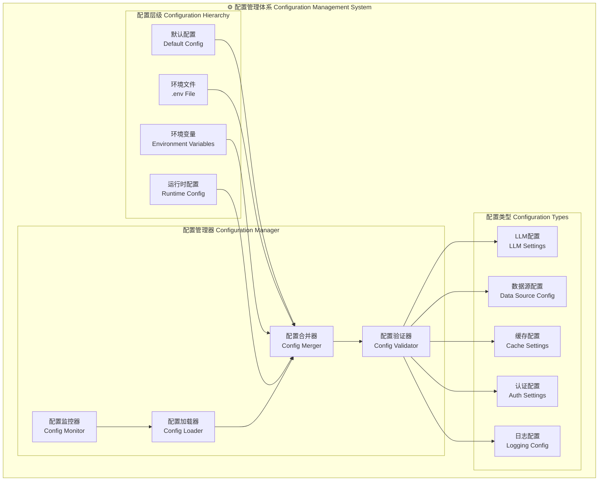

## 🚀 部署架构

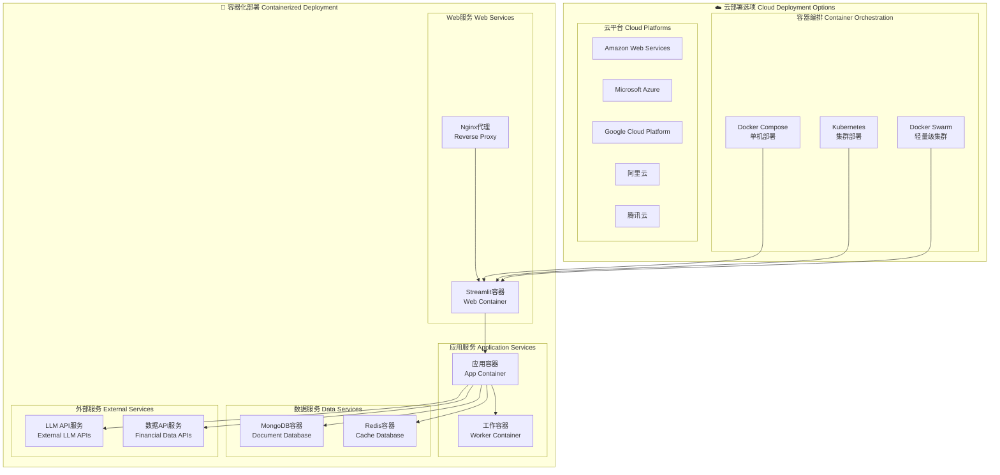

## 🔒 安全架构

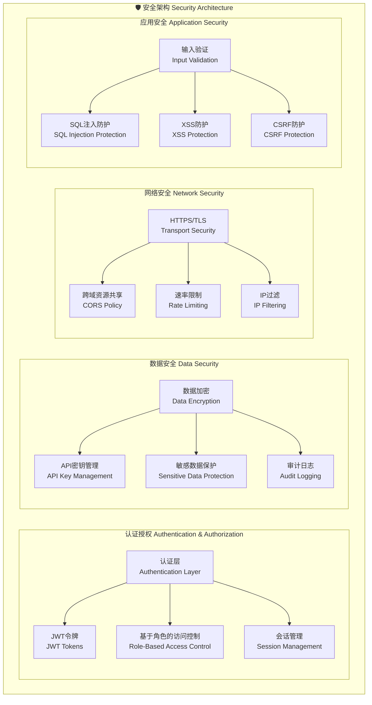

## 📈 性能监控架构

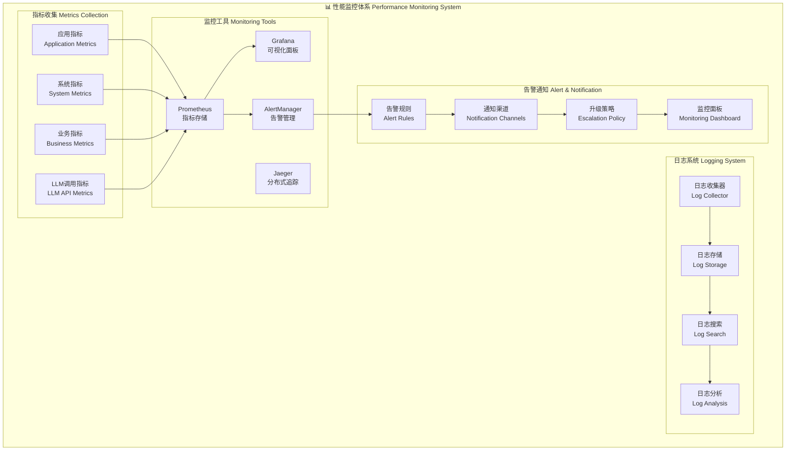

## 🎯 技术选型决策

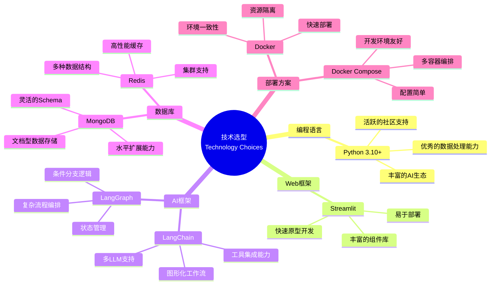

## 🔄 扩展性设计

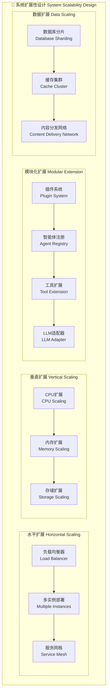

---

## 📚 相关文档链接

- [项目概览](./01-project-overview.md)
- [数据流分析](./03-data-flow-analysis.md)
- [部署运维指南](./04-deployment-operations.md)
- [开发流程规范](./05-development-workflow.md)

---

*📅 文档生成时间: 2025年10月9日*  
*🔄 最后更新: v0.1.15*  
*👨‍💻 分析视角: 技术架构*