# TradingAgents-CN 项目开发者分析 - 数据流视角

## 📊 数据流概览

TradingAgents-CN 构建了一个复杂的数据处理管道，涵盖数据采集、处理、缓存、分析和展示的完整生命周期。

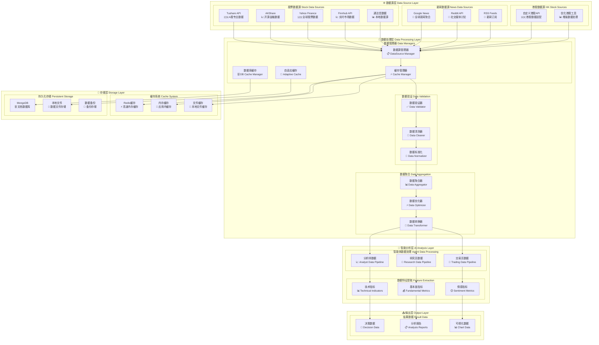

## 🔍 详细数据流分析

### 1. 数据采集流程

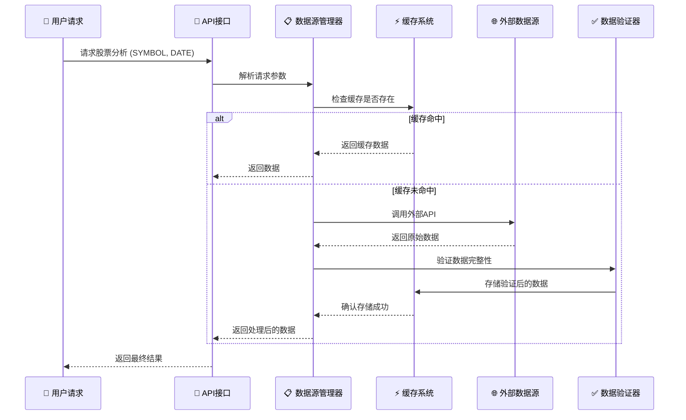

### 2. A股数据处理流程

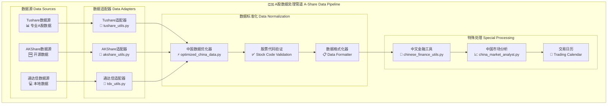

### 3. 美股数据处理流程

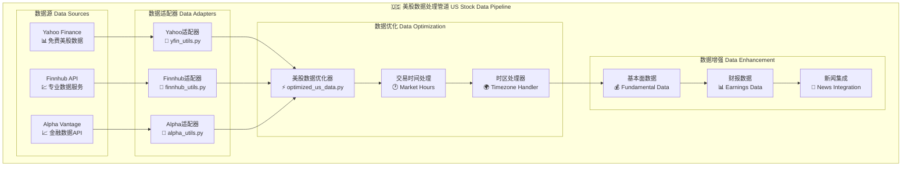

### 4. 港股数据处理流程

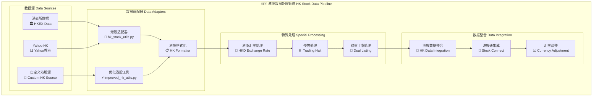

## ⚡ 缓存策略架构

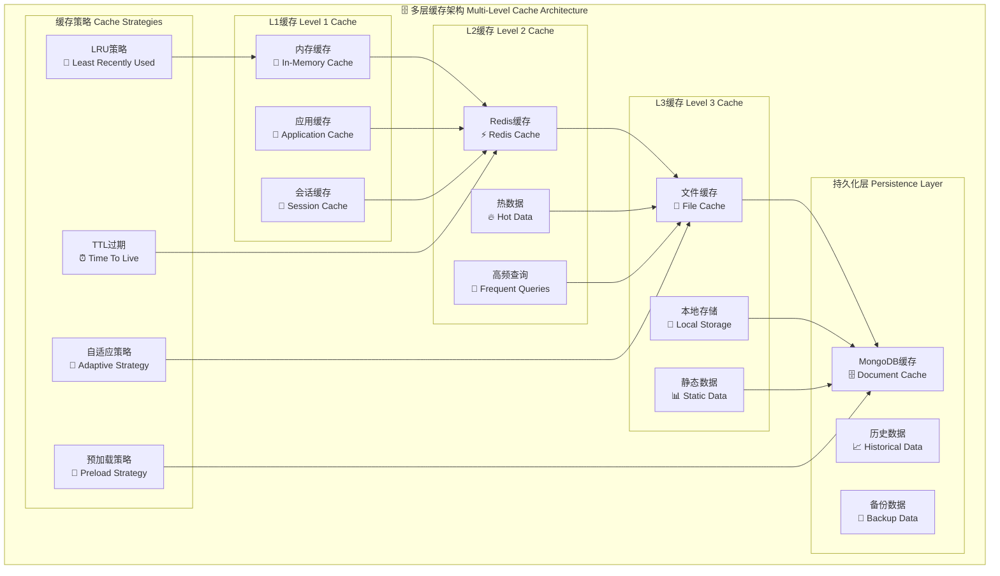

### 缓存性能优化

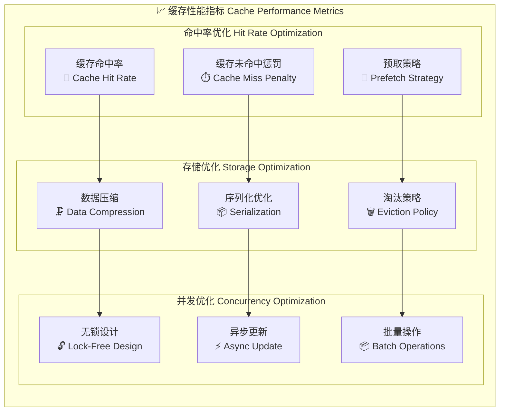

## 📊 数据质量管理

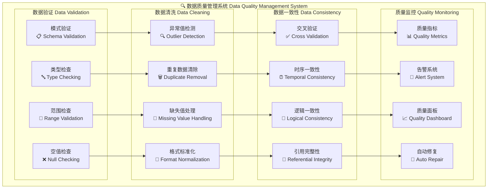

## 🔄 实时数据处理

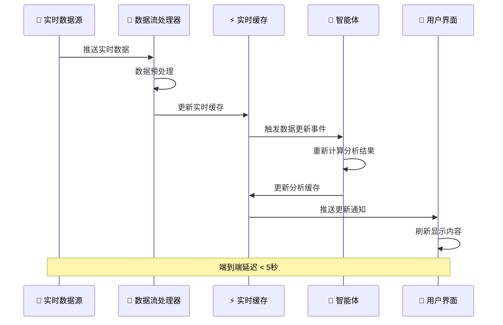

## 📈 数据流性能优化

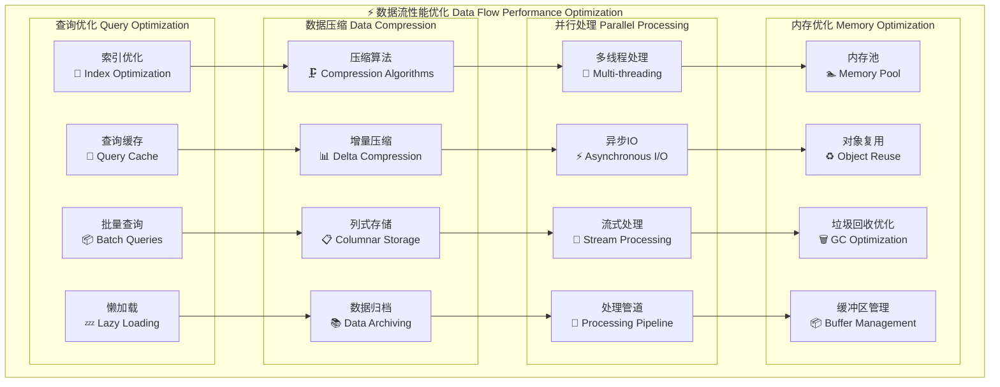

## 📊 数据流监控

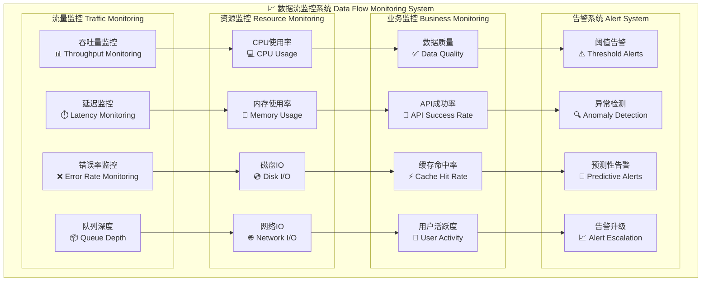

## 💾 数据备份与恢复

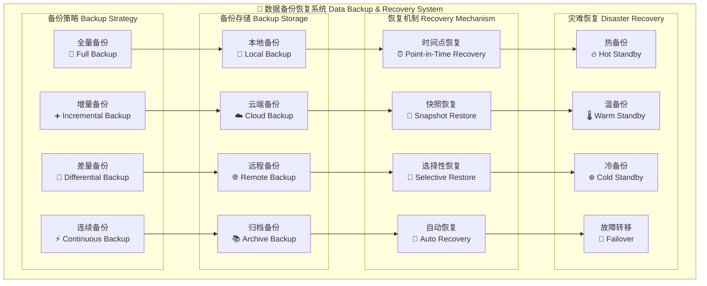

---

## 📚 相关文档链接

- [项目概览](./01-project-overview.md)
- [技术架构详解](./02-technical-architecture.md)
- [部署运维指南](./04-deployment-operations.md)
- [开发流程规范](./05-development-workflow.md)

---

*📅 文档生成时间: 2025年10月9日*  
*🔄 最后更新: v0.1.15*  
*👨‍💻 分析视角: 数据流*