# TradingAgents-CN 项目开发者分析 - 部署运维视角

## 🚀 部署架构概览

TradingAgents-CN 提供多种部署方式，从单机开发环境到企业级分布式集群，满足不同规模的需求。

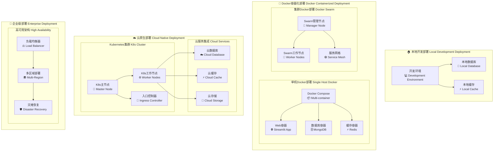

> 图解说明：分四层展示从本地 → Docker 单机/Swarm → K8s 云原生 → 企业级高可用的演进路径，为不同成熟阶段提供可切换部署阶梯。

## 🐳 Docker容器化详解

### Docker Compose架构

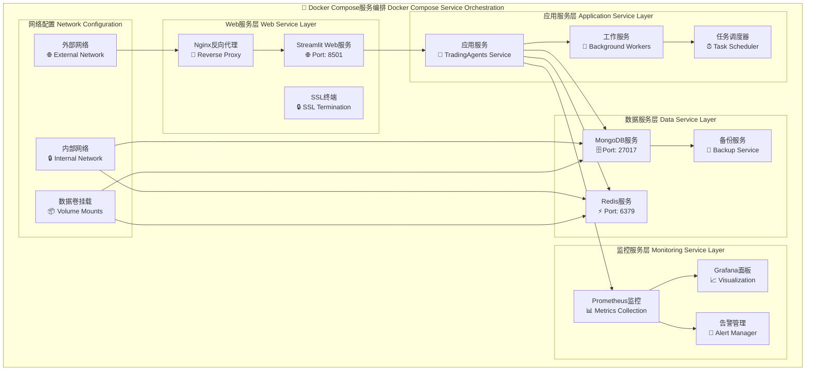

> 图解说明：Compose 编排图细化 Web / 应用 / 数据 / 监控 / 网络五个服务域，体现最小可观测部署所需组件组合。

### Docker容器配置

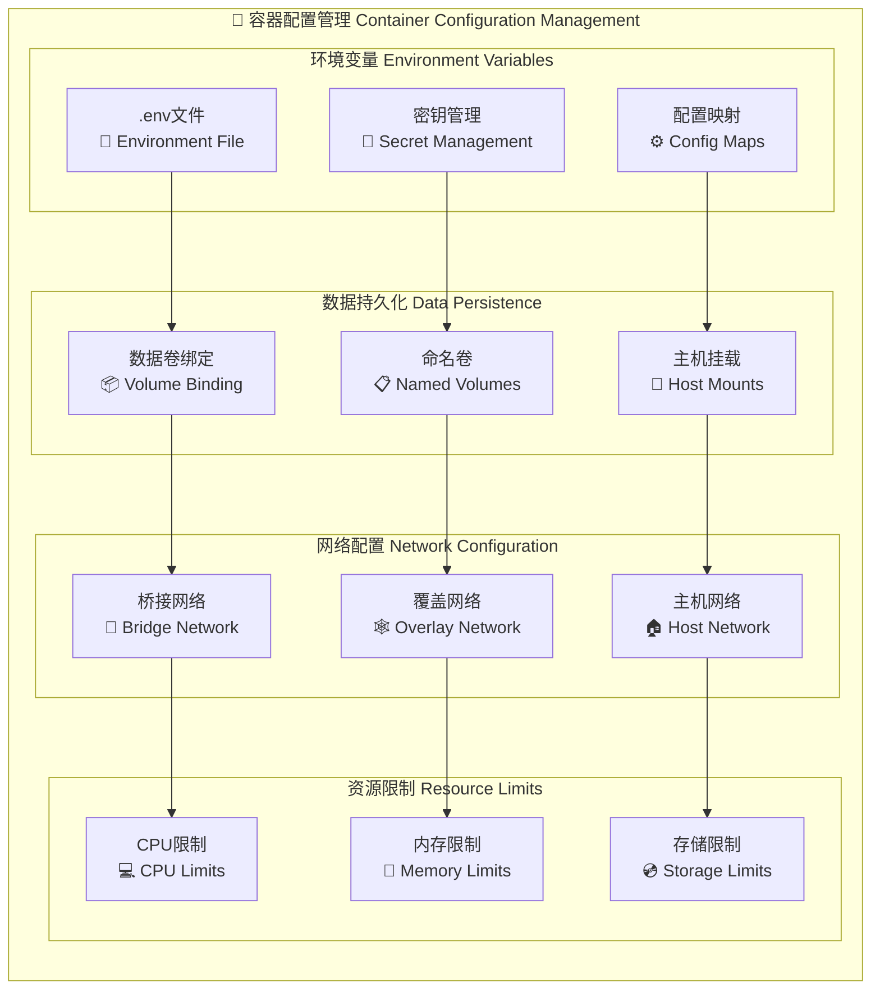

> 图解说明：容器配置图聚焦四类非功能关注点（环境、数据、网络、资源），强调声明式配置与安全隔离（Secret / Config 分离）。

## ☁️ 云部署架构

### Kubernetes部署

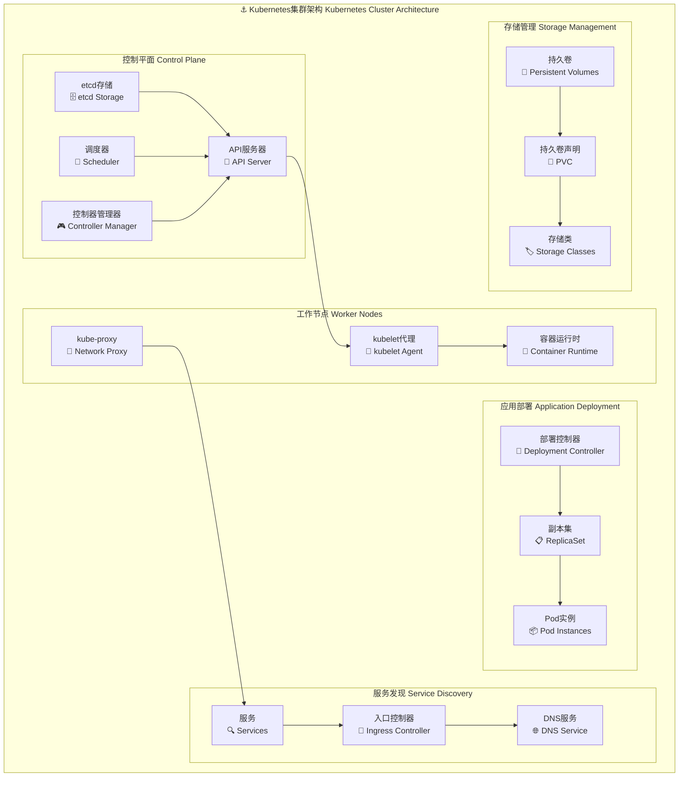

> 图解说明：Kubernetes 集群图展示控制面、工作节点、部署、服务发现与存储抽象的标准链路，辅助后续 IaC 模板拆分。

### 云服务集成

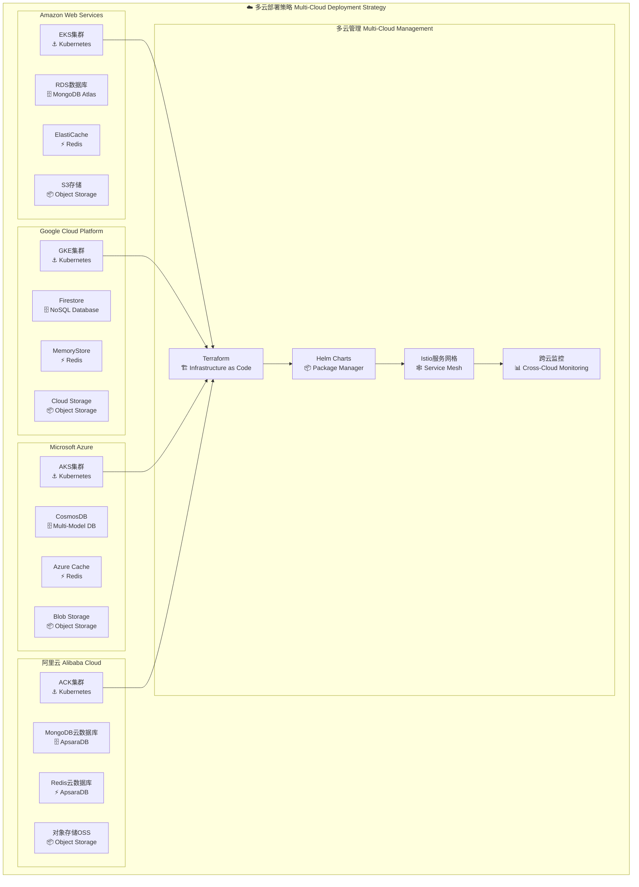

> 图解说明：多云策略图通过 Terraform + Helm + Istio 统一编排，降低跨云迁移成本并复用监控与服务网格策略。

## 🔧 运维管理体系

### 监控告警架构

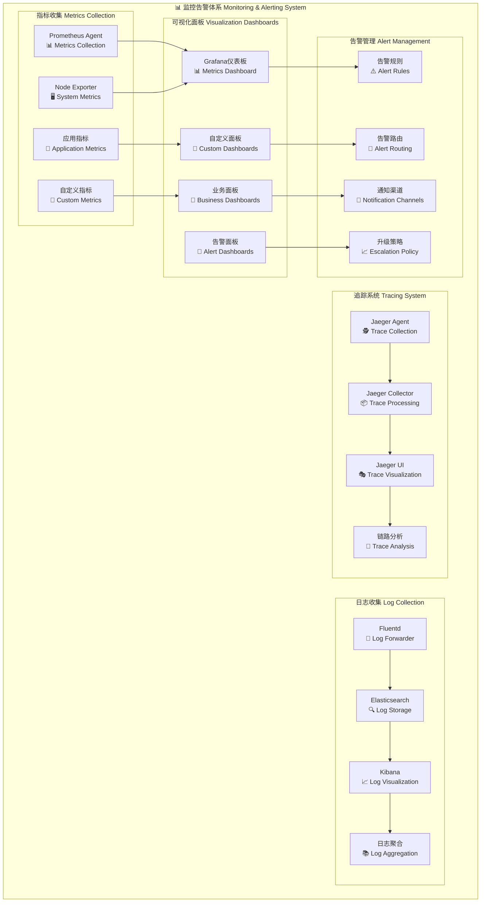

> 图解说明：监控告警体系图串联指标/日志/追踪与告警路由，形成端到端可观测性闭环与多维告警升级机制。

### 日志管理系统

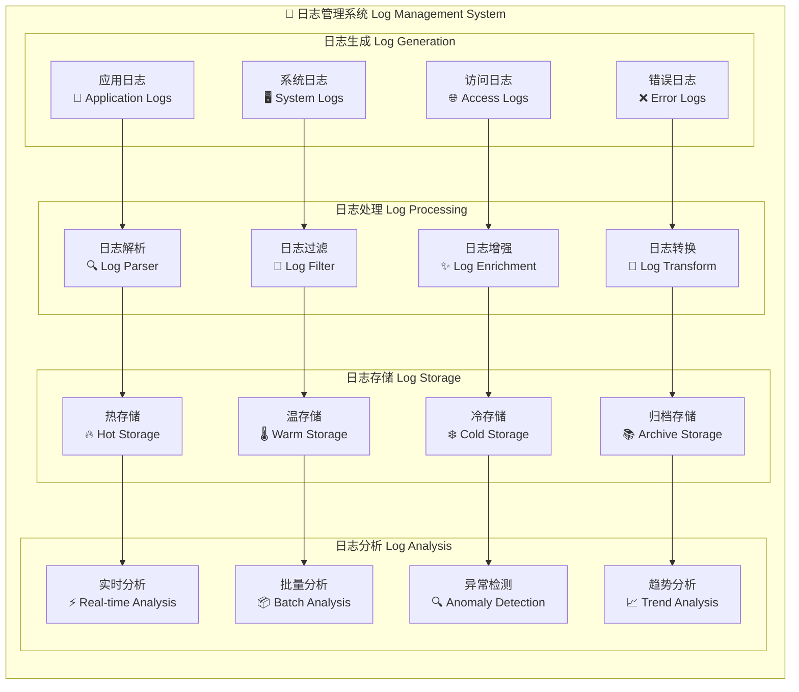

> 图解说明：日志系统图按生成→处理→存储→分析四阶段分冷热层，支持成本优化与实时/趋势分析分工。

## 🔒 安全运维

### 安全防护体系

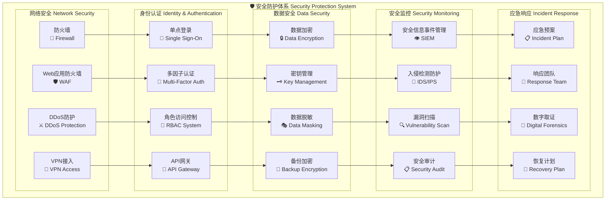

> 图解说明：安全防护图四域（网络/身份/数据/安全监控）与应急响应链耦合，体现“预防 + 监测 + 响应”全周期安全模型。

## 📈 性能优化

### 性能监控与调优

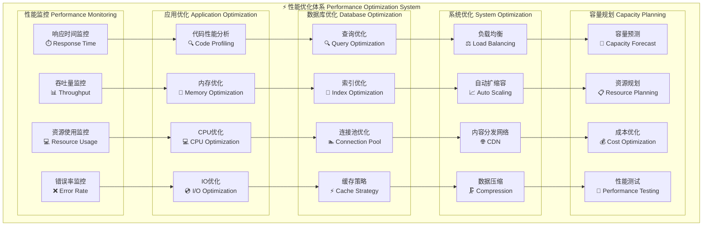

> 图解说明：性能优化体系将监控输入拆解到应用/数据库/系统/容量四类优化策略，再经测试验证形成持续改进循环。

## 🔄 持续集成/持续部署 (CI/CD)

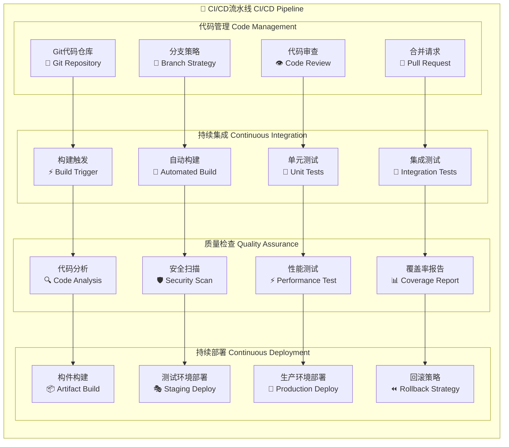

> 图解说明：CI/CD 流水线图以质量门控为中轴，将构建产物与部署阶段解耦，便于插入安全扫描与回滚策略。

## 💾 备份与灾难恢复

### 备份策略

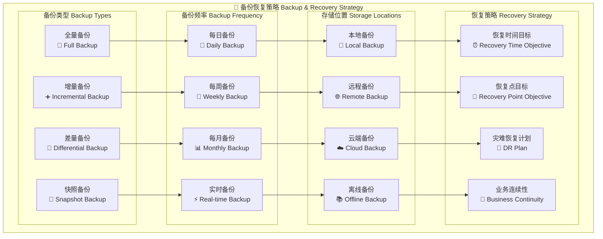

> 图解说明：备份策略图覆盖类型、频率、存储位置与恢复指标四维矩阵，支撑分级 RTO/RPO 目标设定。

## 📊 运维指标监控

### 关键性能指标 (KPI)

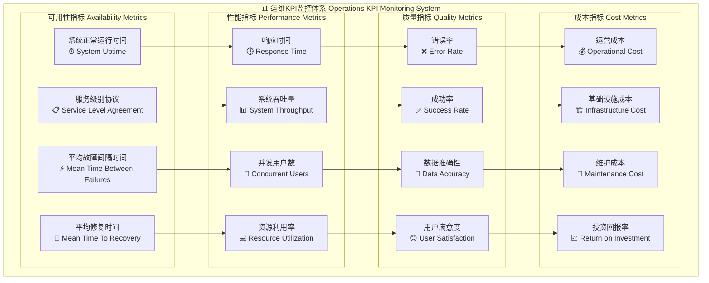

> 图解说明：运维 KPI 图分可用性/性能/质量/成本四象限，建立指标级联逻辑用于定位资源与改进优先级。

## 🚨 应急响应预案

### 故障处理流程

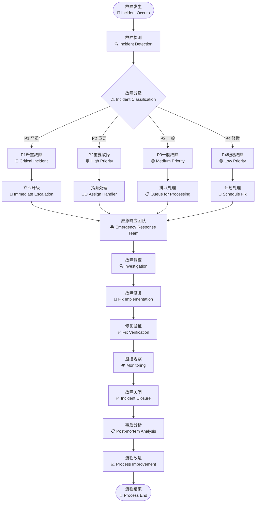

> 图解说明：故障处理流程自分级→响应→修复→验证→复盘→改进全链路闭环，保障知识沉淀与流程优化再反馈。

---

## 📚 相关文档链接

- [项目概览](./01-project-overview.md)
- [技术架构详解](./02-technical-architecture.md)
- [数据流分析](./03-data-flow-analysis.md)
- [开发流程规范](./05-development-workflow.md)

---

*📅 文档生成时间: 2025年10月9日*  
*🔄 最后更新: v0.1.15*  
*👨‍💻 分析视角: 部署运维*