# TradingAgents-CN 项目开发者分析 - 开发流程视角

## 🛠️ 开发工作流概览

TradingAgents-CN 采用现代化的开发工作流，结合敏捷开发方法论和DevOps最佳实践，确保高质量的软件交付。

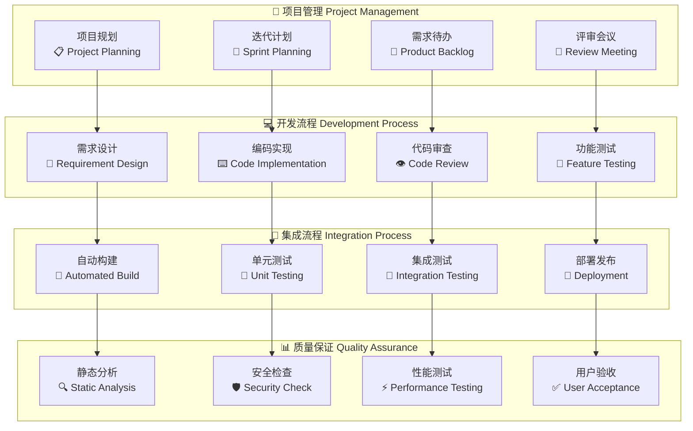

> 图解说明：开发工作流图以“项目管理→开发→集成→质量”四个并行泳道绑定依赖，确保需求粒度下沉后即可被自动化构建与测试接管。

## 🌿 Git工作流管理

### 分支策略

```mermaid
gitgraph
    commit id: "Initial Commit"
    branch develop
    checkout develop
    commit id: "Dev Setup"
    
    branch feature/llm-adapter
    checkout feature/llm-adapter
    commit id: "Add Dashscope Adapter"
    commit id: "Add Qianfan Support"
    
    checkout develop
    merge feature/llm-adapter
    commit id: "Merge LLM Adapter"
    
    branch feature/data-source
    checkout feature/data-source
    commit id: "Add Tushare Integration"
    commit id: "Optimize Data Cache"
    
    checkout develop
    merge feature/data-source
    commit id: "Merge Data Source"
    
    branch release/v0.1.15
    checkout release/v0.1.15
    commit id: "Release Candidate"
    commit id: "Bug Fixes"
    
    checkout main
    merge release/v0.1.15
    commit id: "Release v0.1.15"
    
    checkout develop
    merge main
    commit id: "Sync Main to Develop"
    
    branch hotfix/critical-bug
    checkout hotfix/critical-bug
    commit id: "Fix Critical Bug"
    
    checkout main
    merge hotfix/critical-bug
    commit id: "Hotfix v0.1.15.1"
    
    checkout develop
    merge main
    commit id: "Sync Hotfix"
```

> 图解说明：Git 历史示例体现 feature → develop 聚合、release 稳定、main 发布、hotfix 快速修复回补的主干 + 预发布模型。

### 分支管理规范

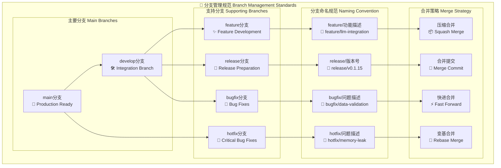

> 图解说明：分支管理规范图明确主/支持分支与命名约定及对应合并策略，降低冲突并统一审查流程。

## 📋 需求管理流程

### 需求生命周期

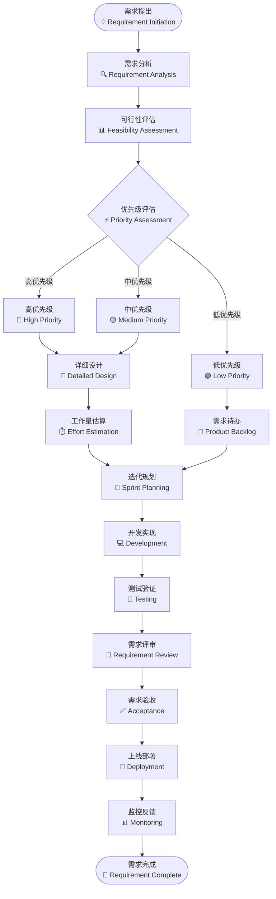

> 图解说明：需求生命周期将优先级决策前移，保障高价值需求获得更短交付路径；低优先级沉入 Backlog。

### 需求管理工具

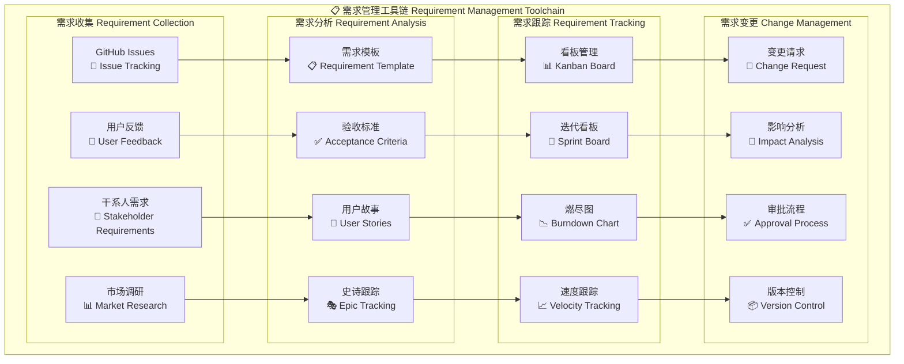

> 图解说明：需求工具链分“收集→分析→跟踪→变更”四层，形成结构化产出（模板/验收标准）与可量化推进（速度/燃尽）。

## 🧪 测试策略框架

### 测试金字塔

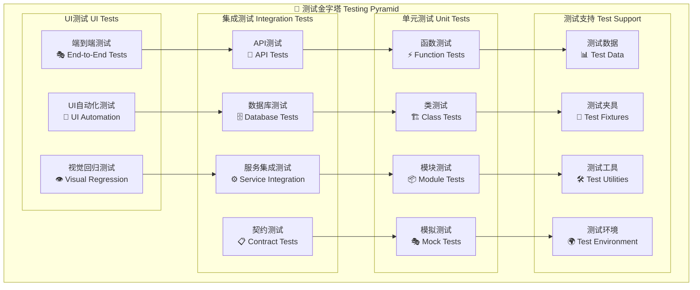

> 图解说明：测试金字塔强调底层单元广覆盖，上层 E2E 精准验证，借助 Test Support 组件提升重用性与稳定性。

### 测试自动化流程

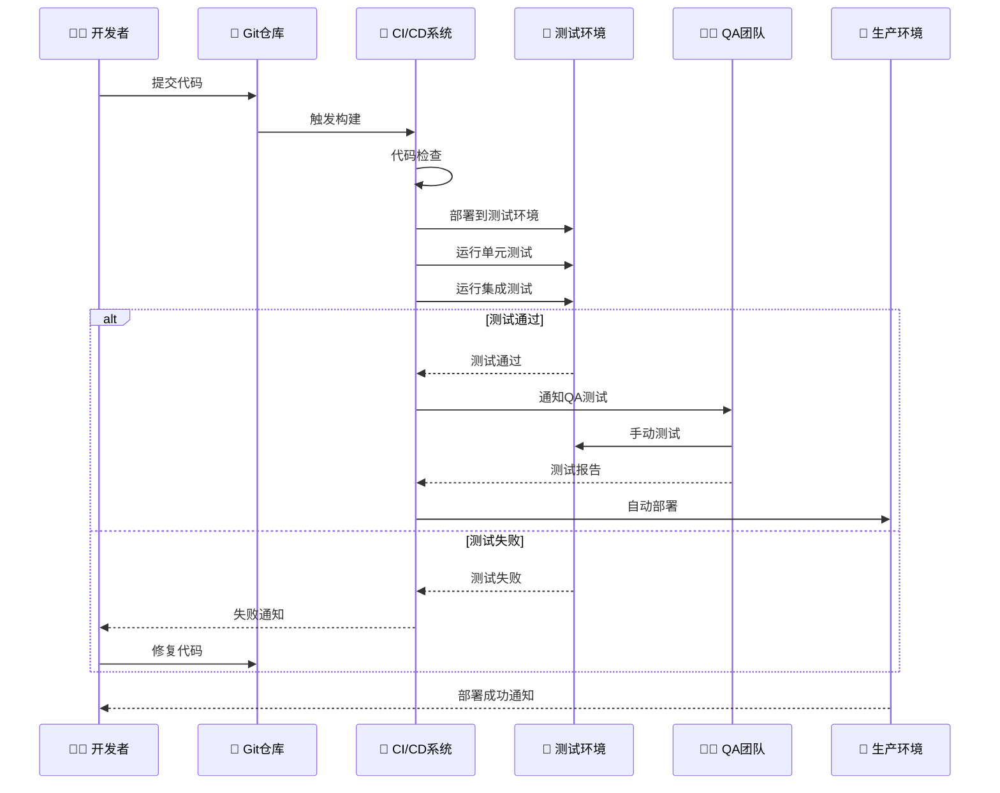

> 图解说明：测试自动化序列显示 CI 在构建后串行执行多层测试与 QA 人工验证，失败即时反馈开发闭环。

## 🔍 代码质量管理

### 代码质量检查流程

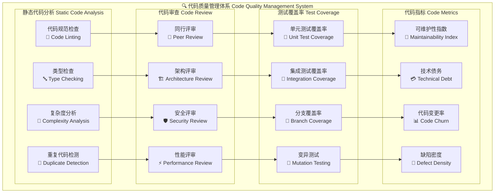

> 图解说明：代码质量体系以静态分析→评审→覆盖率→指标链条量化维护性与缺陷密度，驱动持续改进。

### 代码规范标准

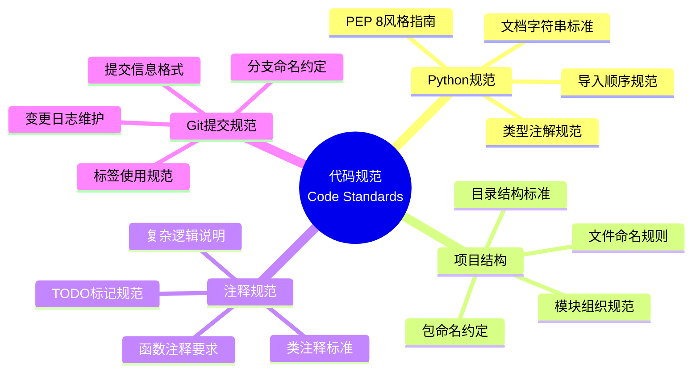

> 图解说明：代码规范思维导图聚合格式/结构/注释/Git 提交四类准则，统一风格减少审查认知开销。

## 🚀 持续集成/持续部署

### CI/CD管道设计

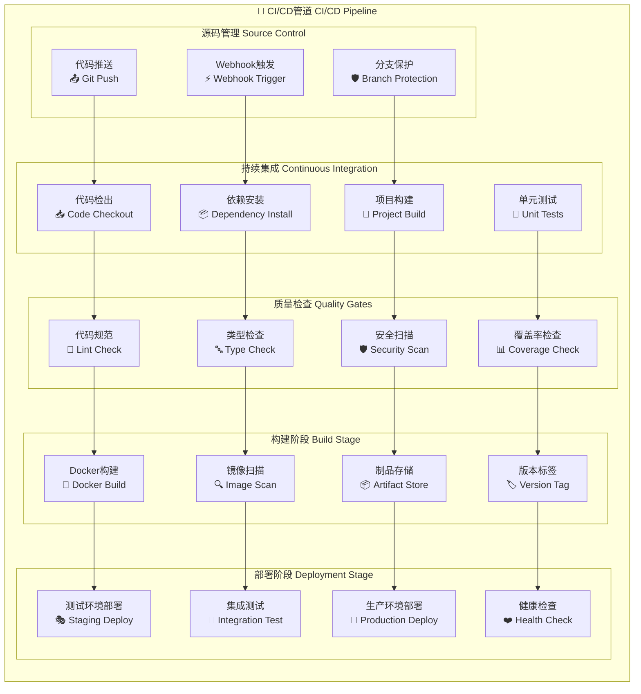

> 图解说明：CI/CD 管道将质量门控（Lint/Type/Security/Coverage）置于构建前端，降低缺陷进入制品与部署阶段概率。

## 📊 项目管理与协作

### 敏捷开发流程

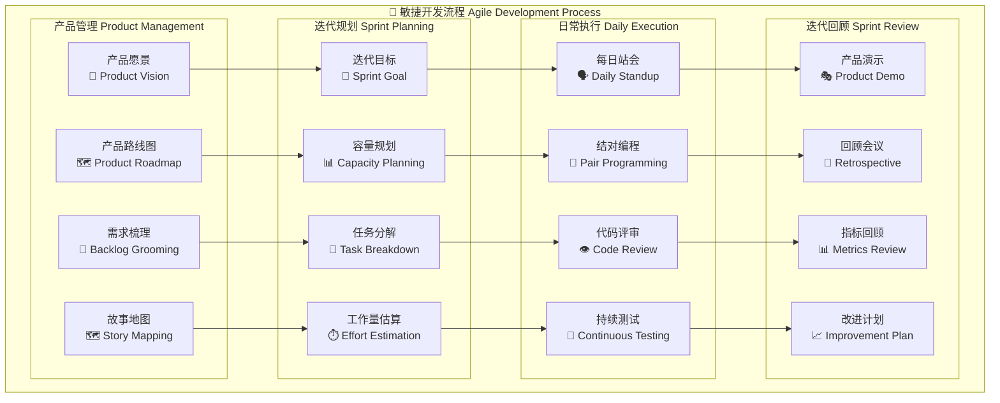

> 图解说明：敏捷流程将产品愿景拆解为迭代目标并通过每日执行与回顾闭环驱动指标改善。

### 团队协作工具

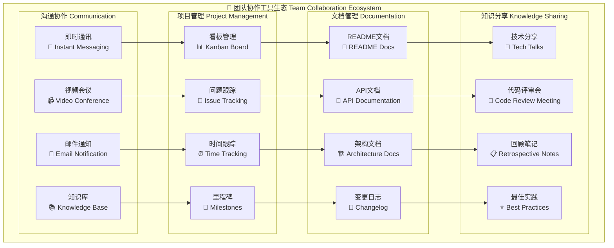

> 图解说明：协作工具生态映射出沟通→项目→文档→知识的价值流，支撑组织学习与可追溯性。

## 🎯 性能优化流程

### 性能监控与优化

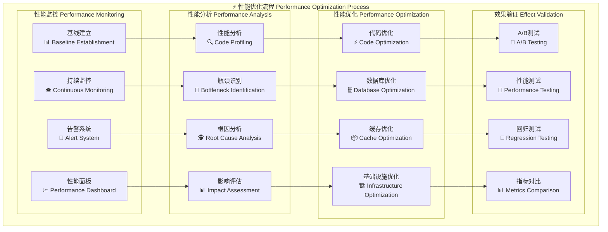

> 图解说明：性能优化流程将监控信号转化为分析-优化-验证四阶段，避免盲目调优。

## 🔄 版本发布流程

### 发布管理

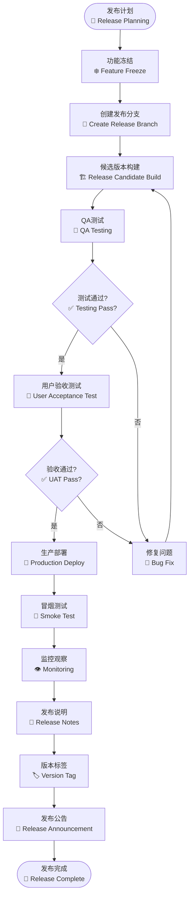

> 图解说明：版本发布流程通过 Feature Freeze + RC + UAT + Smoke + Post 发布活动降低生产风险并保留回滚缓冲。

## 📚 文档管理体系

### 文档生命周期

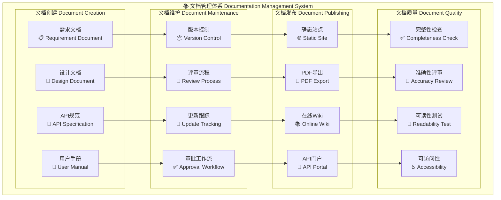

> 图解说明：文档管理体系保证从创建到发布全程可审计，并用质量检查（完整性/准确性/可读性/可访问性）驱动改进。

## 🎯 项目指标与KPI

### 开发效率指标

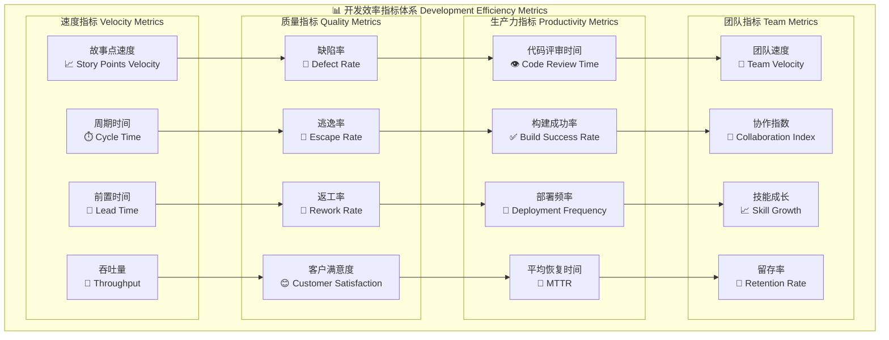

> 图解说明：开发效率指标体系构建“速度→质量→生产力→团队”四层指标传导，可用于季度级工程效能评估。

---

## 📚 相关文档链接

- [项目概览](./01-project-overview.md)
- [技术架构详解](./02-technical-architecture.md)
- [数据流分析](./03-data-flow-analysis.md)
- [部署运维指南](./04-deployment-operations.md)

---

## 📋 总结

本系列文档从开发者角度全面分析了TradingAgents-CN项目：

1. **📋 项目概览**: 整体介绍项目目标、技术栈和发展历程
2. **🏗️ 技术架构**: 深入分析系统架构、组件关系和扩展性设计
3. **📊 数据流**: 详细解析数据采集、处理、缓存和分析流程
4. **🚀 部署运维**: 全面覆盖部署方案、监控体系和运维管理
5. **🛠️ 开发流程**: 完整描述开发工作流、质量管理和团队协作

这些文档为项目的理解、开发、部署和维护提供了全面的技术指导。

---

*📅 文档生成时间: 2025年10月9日*  
*🔄 最后更新: v0.1.15*  
*👨‍💻 分析视角: 开发流程*