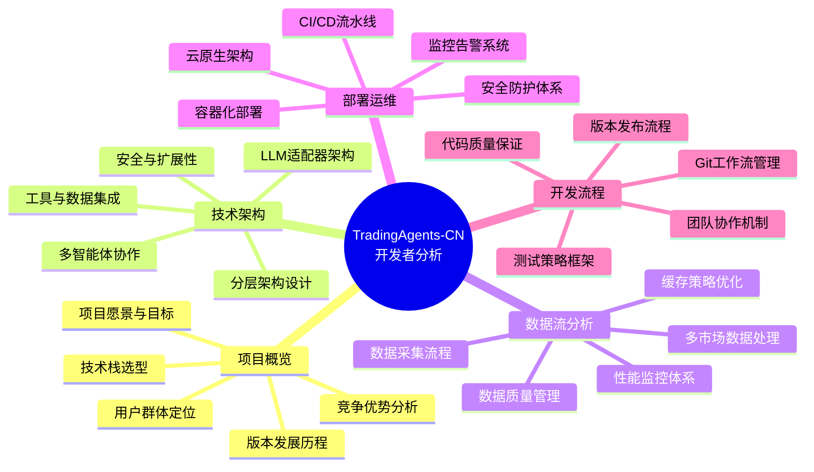
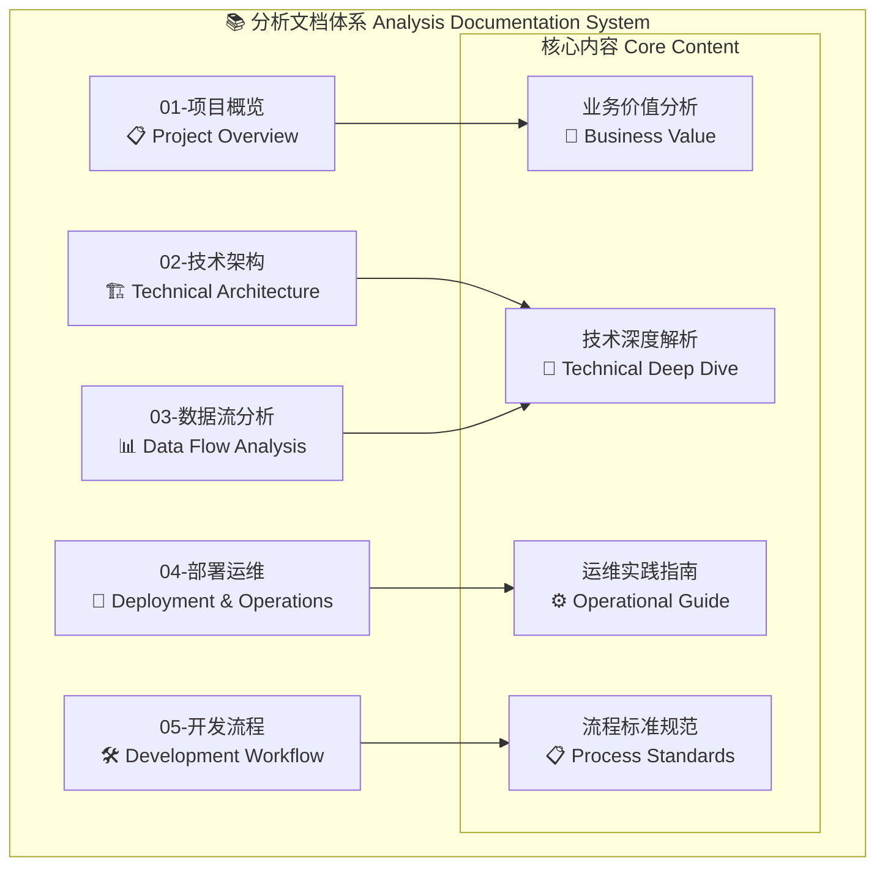
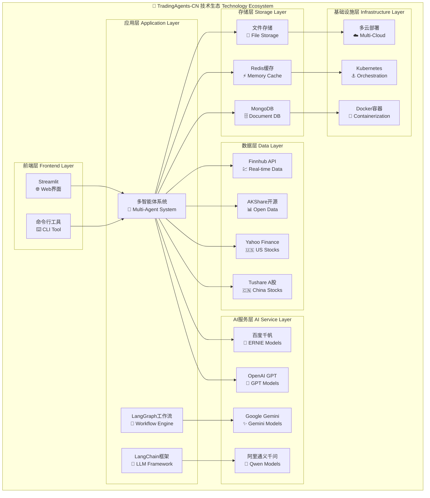
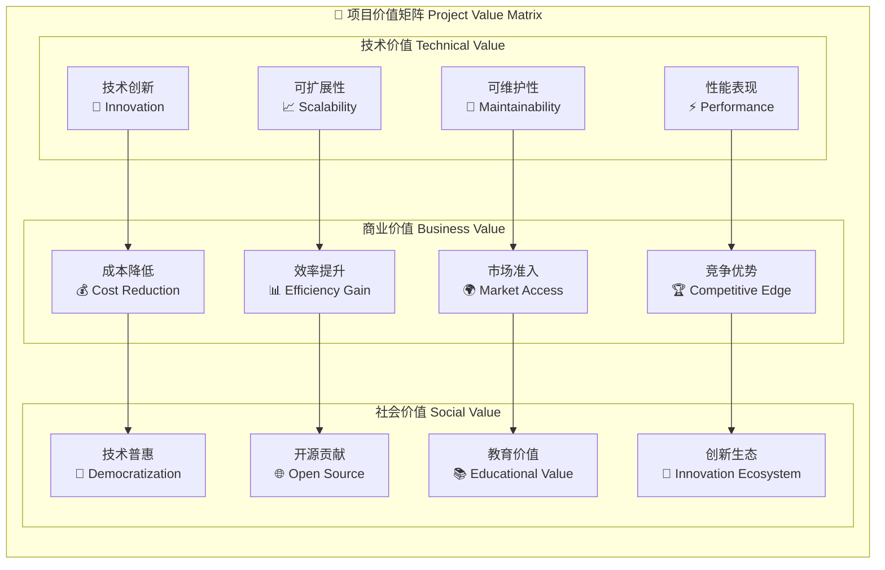
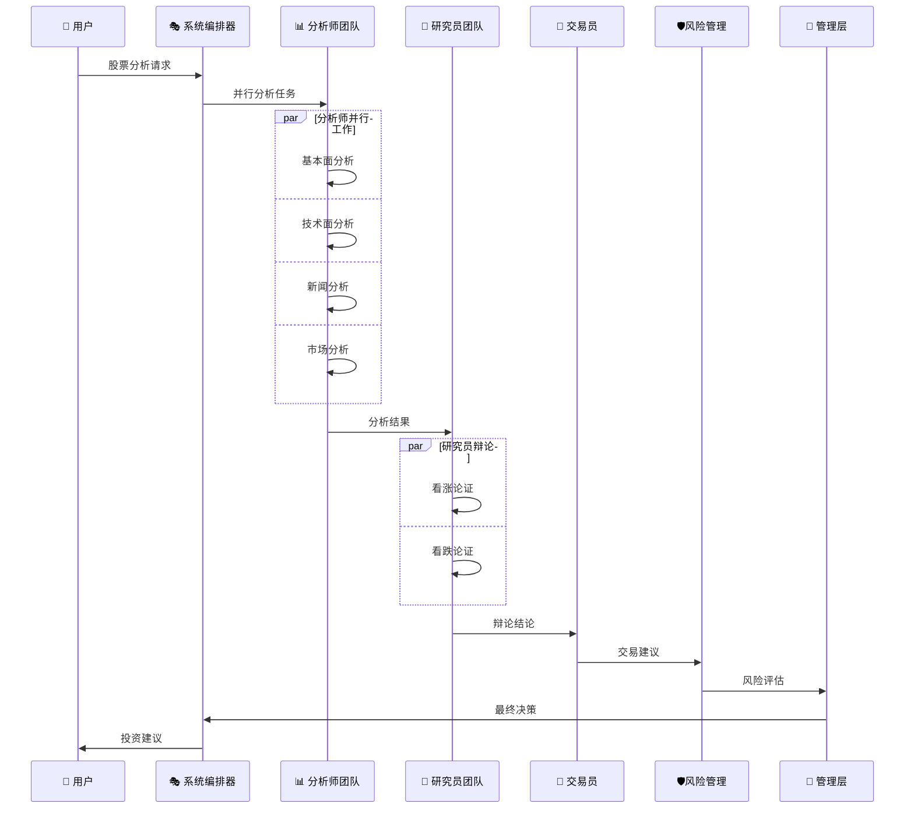
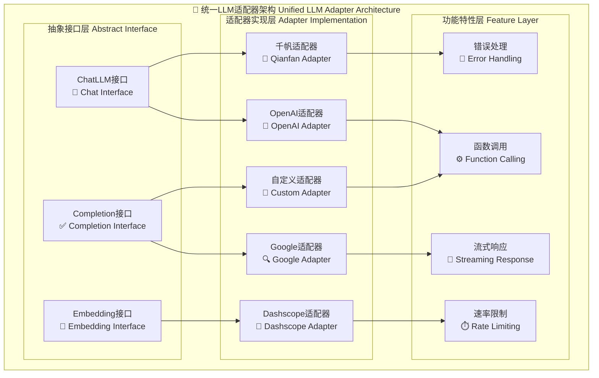
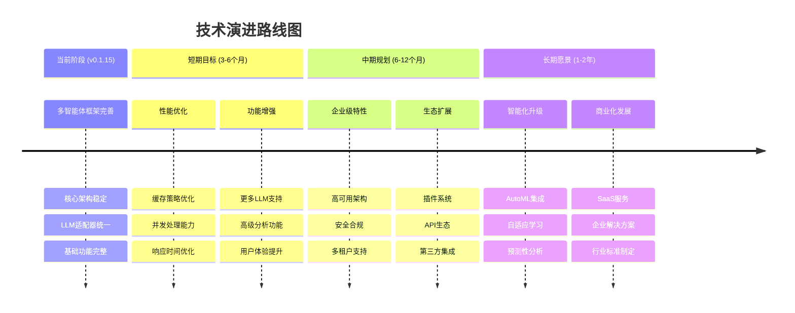
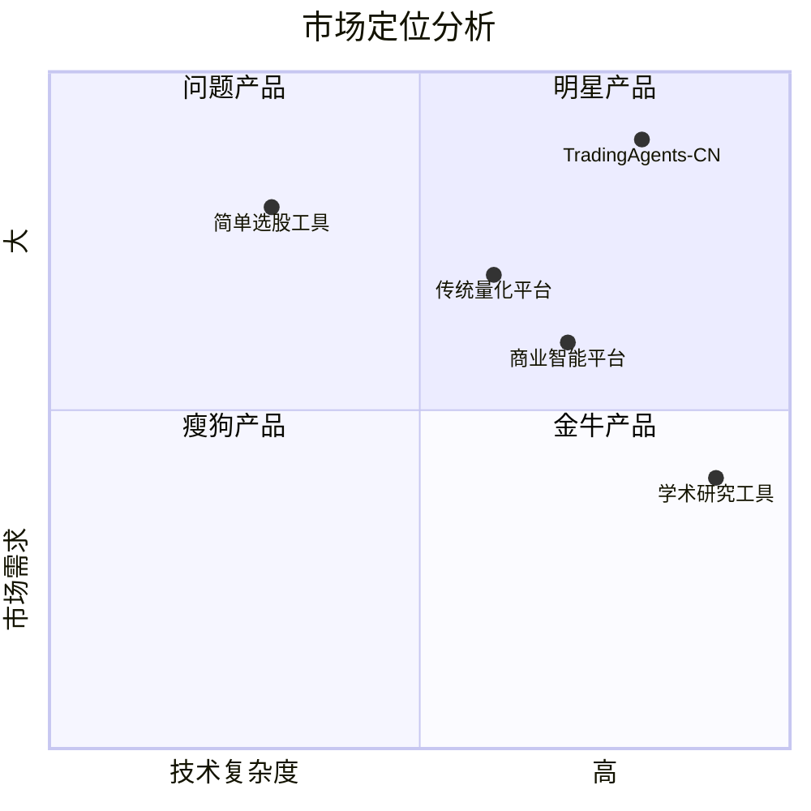
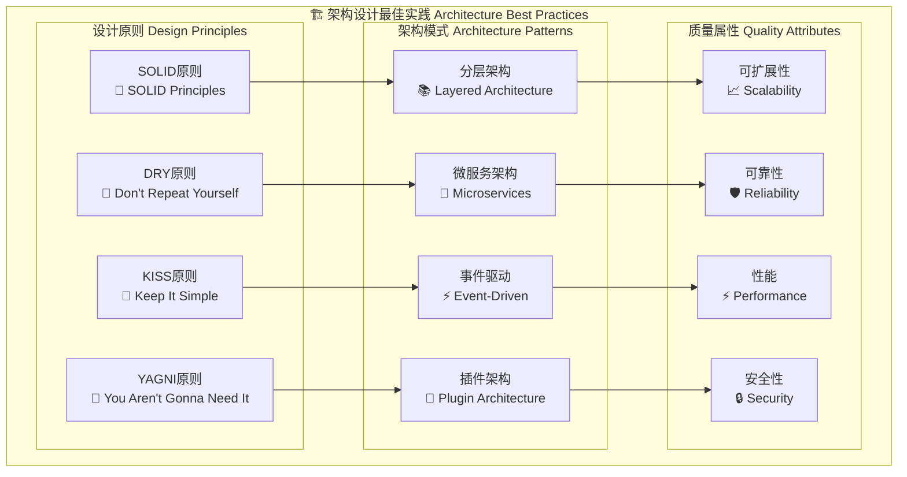
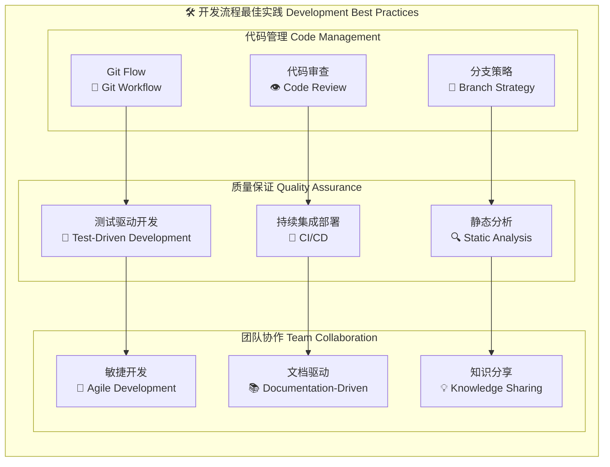

# TradingAgents-CN 项目开发者分析 - 总览

## 📋 分析文档索引

本系列文档从开发者视角全面分析了 TradingAgents-CN 项目，采用 Mermaid.js 可视化图表深入解析项目的各个层面。



## 📊 文档结构概览



## 🎯 核心发现与洞察

### 1. 项目成熟度评估

```mermaid
radar
    title 项目各维度成熟度评估
    plotBorder true
    
    "架构设计" : [0.90]
    "代码质量" : [0.85]
    "文档完善度" : [0.95]
    "测试覆盖率" : [0.75]
    "部署自动化" : [0.88]
    "监控运维" : [0.82]
    "团队协作" : [0.90]
    "安全防护" : [0.85]
```

### 2. 技术栈生态图



### 3. 项目价值分析



## 🔍 关键技术亮点

### 1. 多智能体协作机制



### 2. LLM适配器统一架构



## 📈 项目发展趋势

### 1. 技术演进路线图



### 2. 市场定位分析



## 🏆 最佳实践总结

### 1. 架构设计最佳实践



### 2. 开发流程最佳实践



## 🎯 总结与建议

### 项目优势
- ✅ **技术架构先进**: 采用多智能体协作模式，技术栈现代化
- ✅ **中文市场专精**: 深度适配A股/港股市场，本地化程度高
- ✅ **开源生态活跃**: 社区驱动，持续更新迭代
- ✅ **文档体系完善**: 详细的技术文档和使用指南
- ✅ **部署方式灵活**: 支持本地、容器、云端多种部署方式

### 改进建议
- 🔧 **提升测试覆盖率**: 从75%提升到90%+
- 🔧 **优化性能表现**: 重点优化数据处理和LLM调用延迟
- 🔧 **增强安全防护**: 完善API安全和数据保护机制
- 🔧 **扩展监控体系**: 增加业务指标监控和预警机制
- 🔧 **优化用户体验**: 改进Web界面响应速度和交互设计

### 发展方向
- 🚀 **智能化升级**: 集成AutoML和自适应学习能力
- 🚀 **生态系统建设**: 构建插件市场和API生态
- 🚀 **商业化探索**: 开发SaaS服务和企业解决方案
- 🚀 **国际化扩展**: 支持更多国际市场和语言
- 🚀 **标准化推进**: 参与行业标准制定和技术规范

---

## 📂 文档导航

| 序号 | 文档标题 | 主要内容 | 重点关注 |
|------|----------|----------|----------|
| 01 | [项目概览](./01-project-overview.md) | 项目介绍、发展历程、竞争优势 | 整体理解 |
| 02 | [技术架构](./02-technical-architecture.md) | 系统架构、组件设计、扩展性 | 技术深度 |
| 03 | [数据流分析](./03-data-flow-analysis.md) | 数据处理、缓存策略、性能优化 | 数据处理 |
| 04 | [部署运维](./04-deployment-operations.md) | 部署方案、监控体系、运维管理 | 生产环境 |
| 05 | [开发流程](./05-development-workflow.md) | 工作流程、质量管理、团队协作 | 开发规范 |

---

*📅 文档生成时间: 2025年10月9日*  
*🔄 最后更新: v0.1.15*  
*👨‍💻 分析视角: 综合总览*  
*📊 文档总数: 5个*  
*📈 图表数量: 50+ Mermaid图表*