# TradingAgents 系统架构分析

本文档从架构师的角度分析 TradingAgents 系统，并使用 mermaid 图表展示系统的架构设计、组件关系和数据流。

## 1. 系统概述

TradingAgents 是一个多智能体交易框架，模拟了现实世界交易公司的动态。该框架部署了专门的基于 LLM 的智能体，包括基本面分析师、情感专家、技术分析师、交易员和风险管理团队，共同评估市场状况并做出交易决策。这些智能体通过动态讨论来确定最佳策略。

## 2. 系统架构图

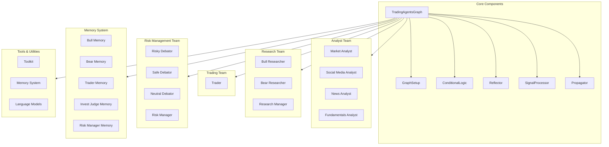
```mermaid
flowchart TB
    %% 定义核心组件
    TG[TradingAgentsGraph]
    GS[GraphSetup]
    CL[ConditionalLogic]
    RF[Reflector]
    SP[SignalProcessor]
    PP[Propagator]
    
    %% 定义分析团队
    MA[Market Analyst] 
    SA[Social Media Analyst]
    NA[News Analyst]
    FA[Fundamentals Analyst]
    
    %% 定义研究团队
    BR[Bull Researcher]
    BER[Bear Researcher]
    RM[Research Manager]
    
    %% 定义交易团队
    TR[Trader]
    
    %% 定义风险管理团队
    RD[Risky Debator]
    SD[Safe Debator]
    ND[Neutral Debator]
    RMG[Risk Manager]
    
    %% 定义记忆系统
    BM[Bull Memory]
    BEM[Bear Memory]
    TM[Trader Memory]
    IJM[Invest Judge Memory]
    RMM[Risk Manager Memory]
    
    %% 定义工具和实用程序
    TK[Toolkit]
    MS[Memory System]
    LLM[Language Models]
    
    %% 定义子图和关系
    subgraph CoreComponents["Core Components"]
        TG --> GS
        TG --> CL
        TG --> RF
        TG --> SP
        TG --> PP
    end
    
    subgraph AnalystTeam["Analyst Team"]
        MA
        SA
        NA
        FA
    end
    
    subgraph ResearchTeam["Research Team"]
        BR
        BER
        RM
    end
    
    subgraph TradingTeam["Trading Team"]
        TR
    end
    
    subgraph RiskTeam["Risk Management Team"]
        RD
        SD
        ND
        RMG
    end
    
    subgraph MemorySystem["Memory System"]
        BM
        BEM
        TM
        IJM
        RMM
    end
    
    subgraph ToolsUtilities["Tools & Utilities"]
        TK
        MS
        LLM
    end
    
    %% 连接主要组件
    TG --> AnalystTeam
    TG --> ResearchTeam
    TG --> TradingTeam
    TG --> RiskTeam
    TG --> MemorySystem
    TG --> ToolsUtilities
```

## 3. 组件关系图

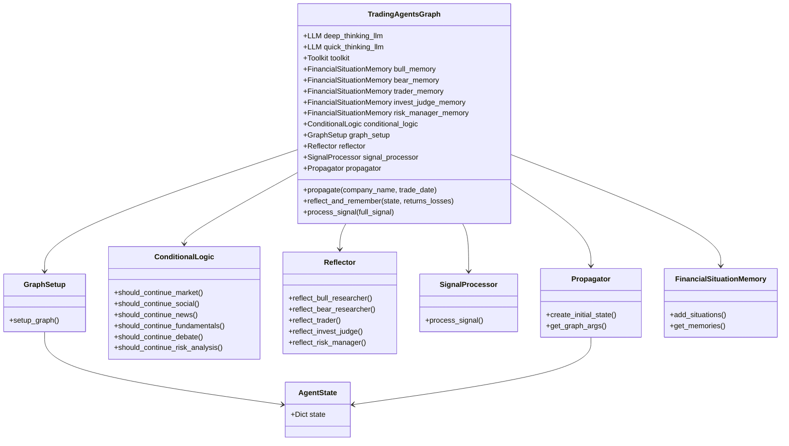
```mermaid
classDiagram
    class TradingAgentsGraph {
        +LLM deep_thinking_llm
        +LLM quick_thinking_llm
        +Toolkit toolkit
        +FinancialSituationMemory bull_memory
        +FinancialSituationMemory bear_memory
        +FinancialSituationMemory trader_memory
        +FinancialSituationMemory invest_judge_memory
        +FinancialSituationMemory risk_manager_memory
        +ConditionalLogic conditional_logic
        +GraphSetup graph_setup
        +Reflector reflector
        +SignalProcessor signal_processor
        +Propagator propagator
        +propagate(company_name, trade_date)
        +reflect_and_remember(state, returns_losses)
        +process_signal(full_signal)
    }
    
    class GraphSetup {
        +setup_graph()
    }
    
    class ConditionalLogic {
        +should_continue_market()
        +should_continue_social()
        +should_continue_news()
        +should_continue_fundamentals()
        +should_continue_debate()
        +should_continue_risk_analysis()
    }
    
    class Reflector {
        +reflect_bull_researcher()
        +reflect_bear_researcher()
        +reflect_trader()
        +reflect_invest_judge()
        +reflect_risk_manager()
    }
    
    class SignalProcessor {
        +process_signal()
    }
    
    class Propagator {
        +create_initial_state()
        +get_graph_args()
    }
    
    class FinancialSituationMemory {
        +add_situations()
        +get_memories()
    }
    
    class AgentState {
        +Dict state
    }
    
    TradingAgentsGraph --> GraphSetup
    TradingAgentsGraph --> ConditionalLogic
    TradingAgentsGraph --> Reflector
    TradingAgentsGraph --> SignalProcessor
    TradingAgentsGraph --> Propagator
    TradingAgentsGraph --> FinancialSituationMemory
    GraphSetup --> AgentState
    Propagator --> AgentState
```

TradingAgents 系统采用了多层次的架构设计，主要包括以下核心组件：

1. TradingAgentsGraph ：整个系统的核心类，负责协调所有组件和智能体，初始化语言模型、工具包、记忆模块，并创建用于不同数据源的工具节点。
2. GraphSetup ：负责设置和编译代理工作流图，创建分析师节点、研究员节点、研究经理节点、交易员节点和风险分析节点，并定义这些节点之间的条件边和连接顺序。
3. Propagator ：负责处理状态初始化和图中的状态传播，创建包含公司名称、交易日期、投资和风险辩论状态以及各类报告的初始状态。
4. Reflector ：负责处理决策反思和记忆更新，从当前状态提取市场情况，针对不同组件进行反思并更新各自记忆。
5. SignalProcessor ：用于处理交易信号并提取核心决策（BUY, SELL, HOLD）。
6. ConditionalLogic ：负责确定图的流程，根据消息中是否存在工具调用来决定是否继续各类分析，以及根据辩论轮次和当前发言者来决定是否继续投资辩论和风险分析。
7. FinancialSituationMemory ：使用 ChromaDB 和 OpenAI 嵌入来存储、检索和管理金融情景及其对应的建议。
8. Toolkit ：提供多种数据源和工具来获取市场信息，包括 Finnhub、SimFin、Google News、Reddit、YFinance 和 StockStats 等。

## 4. 智能体交互流程

### 4.1 基本工作流程

智能体交互流程是TradingAgents系统的核心运作机制，它定义了不同智能体之间的协作方式和信息流动路径。整个流程由`TradingAgentsGraph`类的`propagate`方法驱动，通过`GraphSetup`类设置的工作流图来实现。

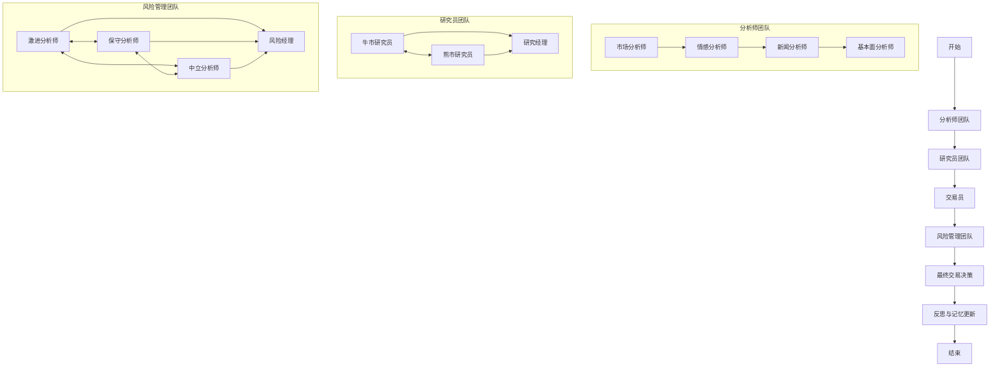
```mermaid
flowchart TD
    A[开始] --> B[分析师团队]
    B --> C[研究员团队]
    C --> D[交易员]
    D --> E[风险管理团队]
    E --> F[最终交易决策]
    F --> G[反思与记忆更新]
    G --> H[结束]

    subgraph 分析师团队
        B1[市场分析师] --> B2[情感分析师]
        B2 --> B3[新闻分析师]
        B3 --> B4[基本面分析师]
    end

    subgraph 研究员团队
        C1[牛市研究员] <--> C2[熊市研究员]
        C1 --> C3[研究经理]
        C2 --> C3
    end

    subgraph 风险管理团队
        E1[激进分析师] <--> E2[保守分析师]
        E1 <--> E3[中立分析师]
        E2 <--> E3
        E1 --> E4[风险经理]
        E2 --> E4
        E3 --> E4
    end
```

当用户调用`propagate(company_name, trade_date)`方法时，系统执行以下步骤：

1. **初始化状态**：`Propagator`组件创建包含公司名称、交易日期和空报告的初始状态
2. **图执行**：初始状态被传递给由`GraphSetup`设置的工作流图进行处理
3. **智能体协作**：各智能体按照预定义的流程和条件逻辑进行协作
4. **决策生成**：最终生成交易决策（买入/卖出/持有）
5. **状态存储**：完整状态被存储用于后续反思和记忆更新

### 4.2 详细工作流程图

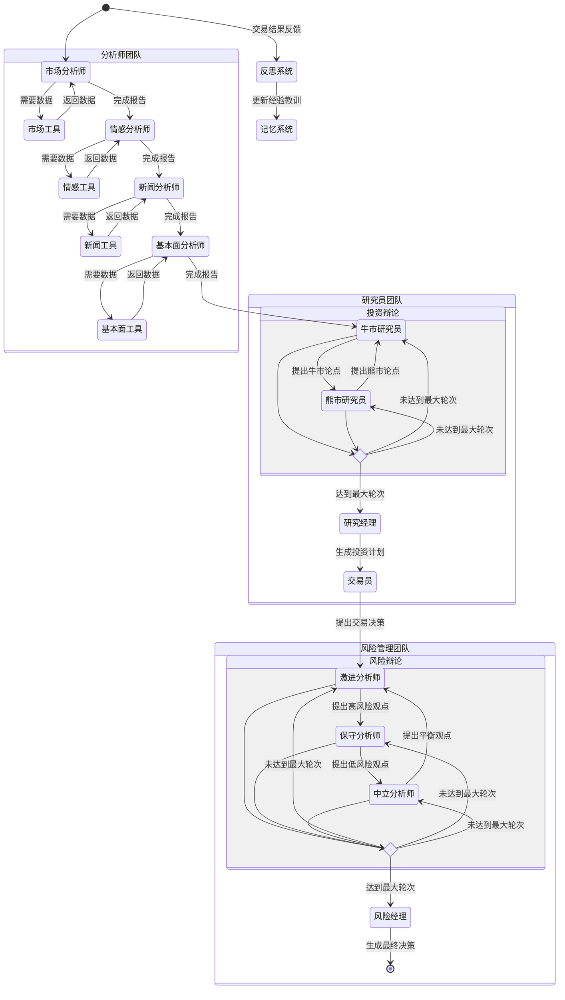
```mermaid
stateDiagram-v2
    [*] --> 市场分析师
    
    state 分析师团队 {
        市场分析师 --> 市场工具: 需要数据
        市场工具 --> 市场分析师: 返回数据
        市场分析师 --> 情感分析师: 完成报告
        
        情感分析师 --> 情感工具: 需要数据
        情感工具 --> 情感分析师: 返回数据
        情感分析师 --> 新闻分析师: 完成报告
        
        新闻分析师 --> 新闻工具: 需要数据
        新闻工具 --> 新闻分析师: 返回数据
        新闻分析师 --> 基本面分析师: 完成报告
        
        基本面分析师 --> 基本面工具: 需要数据
        基本面工具 --> 基本面分析师: 返回数据
        基本面分析师 --> 牛市研究员: 完成报告
    }
    
    state 研究员团队 {
        state 投资辩论 {
            牛市研究员 --> 熊市研究员: 提出牛市论点
            熊市研究员 --> 牛市研究员: 提出熊市论点
            
            state 辩论条件判断 <<choice>>
            牛市研究员 --> 辩论条件判断
            熊市研究员 --> 辩论条件判断
            辩论条件判断 --> 牛市研究员: 未达到最大轮次
            辩论条件判断 --> 熊市研究员: 未达到最大轮次
            辩论条件判断 --> 研究经理: 达到最大轮次
        }
        
        研究经理 --> 交易员: 生成投资计划
    }
    
    交易员 --> 激进分析师: 提出交易决策
    
    state 风险管理团队 {
        state 风险辩论 {
            激进分析师 --> 保守分析师: 提出高风险观点
            保守分析师 --> 中立分析师: 提出低风险观点
            中立分析师 --> 激进分析师: 提出平衡观点
            
            state 风险条件判断 <<choice>>
            激进分析师 --> 风险条件判断
            保守分析师 --> 风险条件判断
            中立分析师 --> 风险条件判断
            风险条件判断 --> 激进分析师: 未达到最大轮次
            风险条件判断 --> 保守分析师: 未达到最大轮次
            风险条件判断 --> 中立分析师: 未达到最大轮次
            风险条件判断 --> 风险经理: 达到最大轮次
        }
        
        风险经理 --> [*]: 生成最终决策
    }
    
    [*] --> 反思系统: 交易结果反馈
    反思系统 --> 记忆系统: 更新经验教训
```

工作流程的实现依赖于以下关键组件：

1. **GraphSetup**：负责创建和连接智能体节点，定义工作流图的结构
2. **ConditionalLogic**：实现条件判断逻辑，决定工作流的分支和流向
3. **Propagator**：处理状态初始化和传播，确保信息在智能体间正确流动
4. **各智能体节点**：每个智能体（如市场分析师、牛市研究员等）都是一个函数节点，接收状态、处理信息并更新状态

### 4.3 条件逻辑流程

条件逻辑由`ConditionalLogic`类实现，它决定了工作流的分支和流向。主要的条件判断包括：

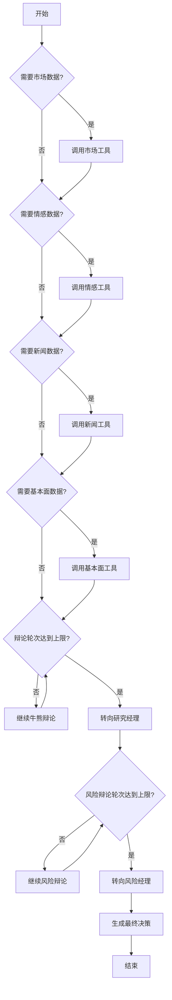
```mermaid
flowchart TD
    A[开始] --> B{需要市场数据?}
    B -->|是| C[调用市场工具]
    B -->|否| D{需要情感数据?}
    C --> D
    
    D -->|是| E[调用情感工具]
    D -->|否| F{需要新闻数据?}
    E --> F
    
    F -->|是| G[调用新闻工具]
    F -->|否| H{需要基本面数据?}
    G --> H
    
    H -->|是| I[调用基本面工具]
    H -->|否| J{辩论轮次达到上限?}
    I --> J
    
    J -->|否| K[继续牛熊辩论]
    J -->|是| L[转向研究经理]
    K --> J
    L --> M{风险辩论轮次达到上限?}
    
    M -->|否| N[继续风险辩论]
    M -->|是| O[转向风险经理]
    N --> M
    O --> P[生成最终决策]
    P --> Q[结束]
```

条件逻辑的主要判断函数包括：

1. **should_continue_market/social/news/fundamentals**：判断分析师是否需要继续调用工具获取数据
   ```python
   def should_continue_market(self, state: AgentState):
       messages = state["messages"]
       last_message = messages[-1]
       if last_message.tool_calls:
           return "tools_market"
       return "Msg Clear Market"
   ```

2. **should_continue_debate**：判断牛熊研究员辩论是否应该继续
   ```python
   def should_continue_debate(self, state: AgentState) -> str:
       if (state["investment_debate_state"]["count"] >= 2 * self.max_debate_rounds):
           return "Research Manager"
       if state["investment_debate_state"]["current_response"].startswith("Bull"):
           return "Bear Researcher"
       return "Bull Researcher"
   ```

3. **should_continue_risk_analysis**：判断风险辩论是否应该继续
   ```python
   def should_continue_risk_analysis(self, state: AgentState) -> str:
       if (state["risk_debate_state"]["count"] >= 3 * self.max_risk_discuss_rounds):
           return "Risk Judge"
       if state["risk_debate_state"]["latest_speaker"].startswith("Risky"):
           return "Safe Analyst"
       if state["risk_debate_state"]["latest_speaker"].startswith("Safe"):
           return "Neutral Analyst"
       return "Risky Analyst"
   ```

## 5. 智能体交互流程

### 5.1 序列图详解

以下序列图展示了`TradingAgentsGraph.propagate()`方法执行过程中各智能体之间的详细交互流程。这个流程是由代码中的`GraphSetup`类设置的工作流图和`ConditionalLogic`类的条件判断共同驱动的：

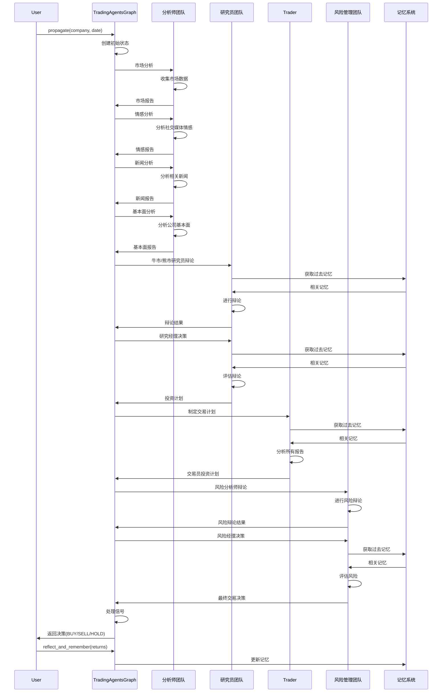
```mermaid
sequenceDiagram
    participant User
    participant TG as TradingAgentsGraph
    participant Analysts as 分析师团队
    participant Researchers as 研究员团队
    participant Trader
    participant RiskTeam as 风险管理团队
    participant Memory as 记忆系统
    
    User->>TG: propagate(company, date)
    TG->>TG: 创建初始状态
    
    TG->>Analysts: 市场分析
    Analysts->>Analysts: 收集市场数据
    Analysts->>TG: 市场报告
    
    TG->>Analysts: 情感分析
    Analysts->>Analysts: 分析社交媒体情感
    Analysts->>TG: 情感报告
    
    TG->>Analysts: 新闻分析
    Analysts->>Analysts: 分析相关新闻
    Analysts->>TG: 新闻报告
    
    TG->>Analysts: 基本面分析
    Analysts->>Analysts: 分析公司基本面
    Analysts->>TG: 基本面报告
    
    TG->>Researchers: 牛市/熊市研究员辩论
    Researchers->>Memory: 获取过去记忆
    Memory->>Researchers: 相关记忆
    Researchers->>Researchers: 进行辩论
    Researchers->>TG: 辩论结果
    
    TG->>Researchers: 研究经理决策
    Researchers->>Memory: 获取过去记忆
    Memory->>Researchers: 相关记忆
    Researchers->>Researchers: 评估辩论
    Researchers->>TG: 投资计划
    
    TG->>Trader: 制定交易计划
    Trader->>Memory: 获取过去记忆
    Memory->>Trader: 相关记忆
    Trader->>Trader: 分析所有报告
    Trader->>TG: 交易员投资计划
    
    TG->>RiskTeam: 风险分析师辩论
    RiskTeam->>RiskTeam: 进行风险辩论
    RiskTeam->>TG: 风险辩论结果
    
    TG->>RiskTeam: 风险经理决策
    RiskTeam->>Memory: 获取过去记忆
    Memory->>RiskTeam: 相关记忆
    RiskTeam->>RiskTeam: 评估风险
    RiskTeam->>TG: 最终交易决策
    
    TG->>TG: 处理信号
    TG->>User: 返回决策(BUY/SELL/HOLD)
    
    User->>TG: reflect_and_remember(returns)
    TG->>Memory: 更新记忆
```

### 5.2 交互流程代码实现

整个交互流程在代码中主要由以下几个部分实现：

1. **TradingAgentsGraph.propagate 方法**：这是整个流程的入口点，负责初始化状态并执行工作流图

   ```python
   def propagate(self, company_name, trade_date):
       # 创建初始状态
       initial_state = self.propagator.create_initial_state(company_name, trade_date)
       # 执行工作流图
       final_state = self.graph.run(initial_state)
       # 记录状态
       self._log_state(final_state)
       return final_state
   ```

2. **GraphSetup.setup_graph 方法**：定义了智能体节点之间的连接关系，构建了完整的工作流图

   ```python
   def setup_graph(self):
       # 创建分析师节点
       market_node = create_market_analyst(self.llm, self.toolkit, self.config)
       social_node = create_social_analyst(self.llm, self.toolkit, self.config)
       news_node = create_news_analyst(self.llm, self.toolkit, self.config)
       fundamentals_node = create_fundamentals_analyst(self.llm, self.toolkit, self.config)
       
       # 创建研究员节点
       bull_node = create_bull_researcher(self.llm, self.toolkit, self.config, self.bull_memory)
       bear_node = create_bear_researcher(self.llm, self.toolkit, self.config, self.bear_memory)
       research_manager_node = create_research_manager(self.llm, self.toolkit, self.config, self.invest_judge_memory)
       
       # 创建交易员节点
       trader_node = create_trader(self.llm, self.toolkit, self.config, self.trader_memory)
       
       # 创建风险分析师节点
       risky_analyst_node = create_risky_analyst(self.llm, self.toolkit, self.config)
       safe_analyst_node = create_safe_analyst(self.llm, self.toolkit, self.config)
       neutral_analyst_node = create_neutral_analyst(self.llm, self.toolkit, self.config)
       risk_judge_node = create_risk_judge(self.llm, self.toolkit, self.config, self.risk_manager_memory)
       
       # 定义节点之间的条件边和顺序边
       # ...
   ```

3. **ConditionalLogic 类**：实现了条件判断逻辑，决定工作流的分支和流向

   ```python
   def should_continue_debate(self, state: AgentState) -> str:
       if (state["investment_debate_state"]["count"] >= 2 * self.max_debate_rounds):
           return "Research Manager"
       if state["investment_debate_state"]["current_response"].startswith("Bull"):
           return "Bear Researcher"
       return "Bull Researcher"
   ```

4. **Reflector 类**：负责交易后的反思和记忆更新

   ```python
   def reflect_bull_researcher(self, state: AgentState, returns: float):
       current_situation = self._extract_current_situation(state)
       reflection = self._reflect_on_component("bull_researcher", state, returns)
       self.bull_memory.add_situations([(current_situation, reflection)])
       return reflection
   ```

### 5.3 状态传递机制

智能体之间通过`AgentState`对象共享信息，这是一个包含所有分析报告、辩论状态和决策的字典。每个智能体接收状态，处理信息，然后更新状态并传递给下一个智能体。

关键的状态字段包括：

- **messages**：存储所有智能体的消息历史
- **reports**：存储各类分析报告（市场、情感、新闻、基本面）
- **investment_debate_state**：存储牛熊研究员辩论的状态和轮次
- **risk_debate_state**：存储风险分析师辩论的状态和轮次
- **final_decision**：存储最终的交易决策（买入/卖出/持有）

### 5.4 条件逻辑与流程控制

`ConditionalLogic`类的条件判断方法决定了工作流的分支和流向：

1. **数据收集阶段**：判断是否需要继续调用工具获取数据
2. **辩论阶段**：判断辩论是否达到最大轮次，以及下一个发言的研究员
3. **风险评估阶段**：判断风险讨论是否达到最大轮次，以及下一个发言的风险分析师

这些条件判断确保了智能体交互的有序进行，并在适当的时候将控制权传递给下一个智能体。

## 6. 记忆系统设计

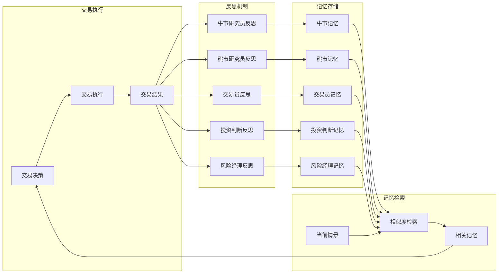
```mermaid
flowchart LR
    subgraph "交易执行"
        TD["交易决策"] --> TE["交易执行"]
        TE --> TR["交易结果"]
    end
    
    subgraph "反思机制"
        TR --> RB["牛市研究员反思"]
        TR --> RBE["熊市研究员反思"]
        TR --> RT["交易员反思"]
        TR --> RI["投资判断反思"]
        TR --> RR["风险经理反思"]
    end
    
    subgraph "记忆存储"
        RB --> BM["牛市记忆"]
        RBE --> BEM["熊市记忆"]
        RT --> TM["交易员记忆"]
        RI --> IJM["投资判断记忆"]
        RR --> RMM["风险经理记忆"]
    end
    
    subgraph "记忆检索"
        CS["当前情景"] --> SR["相似度检索"]
        BM --> SR
        BEM --> SR
        TM --> SR
        IJM --> SR
        RMM --> SR
        SR --> RM["相关记忆"]
    end
    
    RM --> TD
```

## 7. 关键组件分析

### 7.1 TradingAgentsGraph

TradingAgentsGraph 是整个系统的核心类，负责协调所有组件和智能体。它初始化语言模型、工具包、记忆模块，并创建用于不同数据源的工具节点。它还集成了 ConditionalLogic、GraphSetup、Propagator、Reflector 和 SignalProcessor 等组件来构建和管理交易图。

### 7.2 智能体设计

系统中的每个智能体都有特定的角色和职责：

- **分析师团队**：收集和分析不同类型的数据（市场、情感、新闻、基本面）
  - 市场分析师：分析股票价格走势、技术指标（如移动平均线、MACD、RSI、布林带等）
  - 情感分析师：分析社交媒体和公司特定新闻，评估公众情绪
  - 新闻分析师：分析全球新闻和宏观经济指标，解释事件对市场的影响
  - 基本面分析师：分析公司财务报表、内部交易和基本面数据

- **研究员团队**：牛市和熊市研究员进行辩论，研究经理做出决策
  - 牛市研究员：强调增长潜力、竞争优势和积极市场指标
  - 熊市研究员：强调风险、挑战和负面指标
  - 研究经理：评估辩论并做出明确的投资决策

- **交易员**：根据所有分析和研究制定交易计划，提出具体的买入、卖出或持有建议

- **风险管理团队**：激进、保守和中立分析师进行风险辩论，风险经理做出最终决策
  - 激进风险分析师：强调高回报、高风险的机会
  - 保守风险分析师：强调保护资产、最小化波动和确保稳定增长
  - 中立风险分析师：提供平衡的视角，权衡潜在收益和风险
  - 风险经理：评估风险辩论并做出最终交易决策

### 7.3 记忆系统

记忆系统是TradingAgents框架中的关键组件，它使智能体能够从过去的经验中学习，不断提高决策质量。系统基于向量数据库技术实现，具体使用了ChromaDB作为底层存储引擎，结合嵌入模型来实现相似性搜索。

#### 7.3.1 记忆系统架构

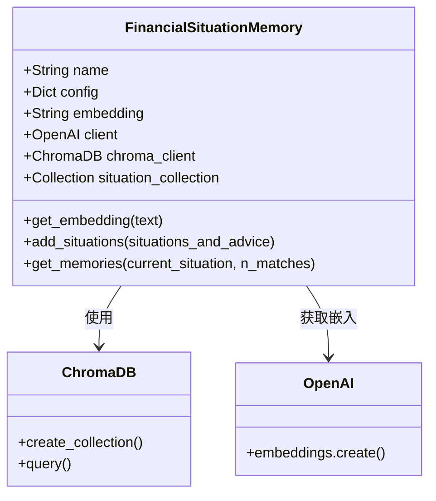
```mermaid
classDiagram
    class FinancialSituationMemory {
        +String name
        +Dict config
        +String embedding
        +OpenAI client
        +ChromaDB chroma_client
        +Collection situation_collection
        +get_embedding(text)
        +add_situations(situations_and_advice)
        +get_memories(current_situation, n_matches)
    }
    
    class ChromaDB {
        +create_collection()
        +query()
    }
    
    class OpenAI {
        +embeddings.create()
    }
    
    FinancialSituationMemory --> ChromaDB : 使用
    FinancialSituationMemory --> OpenAI : 获取嵌入
```

#### 7.3.2 记忆类型

系统为不同类型的智能体维护单独的记忆实例：

- **牛市研究员记忆**：存储牛市研究员的分析和建议，关注增长潜力和积极市场指标
- **熊市研究员记忆**：存储熊市研究员的分析和建议，关注风险和负面指标
- **交易员记忆**：存储交易员的交易计划和决策
- **投资判断记忆**：存储研究经理的投资判断和决策理由
- **风险经理记忆**：存储风险经理的风险评估和最终决策

每个记忆实例都是`FinancialSituationMemory`类的实例，在系统初始化时创建：

```python
# 初始化记忆
self.bull_memory = FinancialSituationMemory("bull_memory", self.config)
self.bear_memory = FinancialSituationMemory("bear_memory", self.config)
self.trader_memory = FinancialSituationMemory("trader_memory", self.config)
self.invest_judge_memory = FinancialSituationMemory("invest_judge_memory", self.config)
self.risk_manager_memory = FinancialSituationMemory("risk_manager_memory", self.config)
```

#### 7.3.3 记忆存储机制

记忆系统的核心功能是存储和检索金融情景及其对应的建议或反思。存储过程包括以下步骤：

1. **嵌入生成**：使用OpenAI或其他嵌入模型将文本转换为向量表示
2. **记忆添加**：将情景、建议和嵌入向量添加到ChromaDB集合中

```python
def add_situations(self, situations_and_advice):
    """添加金融情景及其对应的建议"""
    situations = []
    advice = []
    ids = []
    embeddings = []

    offset = self.situation_collection.count()

    for i, (situation, recommendation) in enumerate(situations_and_advice):
        situations.append(situation)
        advice.append(recommendation)
        ids.append(str(offset + i))
        embeddings.append(self.get_embedding(situation))

    self.situation_collection.add(
        documents=situations,
        metadatas=[{"recommendation": rec} for rec in advice],
        embeddings=embeddings,
        ids=ids,
    )
```

#### 7.3.4 记忆检索机制

当智能体需要做出决策时，它会查询记忆系统以获取与当前情景相似的历史记忆：

1. **查询嵌入生成**：将当前情景转换为向量表示
2. **相似度搜索**：在向量空间中查找最相似的历史情景
3. **结果处理**：返回匹配的情景、建议和相似度分数

```python
def get_memories(self, current_situation, n_matches=1):
    """查找匹配的建议"""
    query_embedding = self.get_embedding(current_situation)

    results = self.situation_collection.query(
        query_embeddings=[query_embedding],
        n_results=n_matches,
        include=["metadatas", "documents", "distances"],
    )

    matched_results = []
    for i in range(len(results["documents"][0])):
        matched_results.append({
            "matched_situation": results["documents"][0][i],
            "recommendation": results["metadatas"][0][i]["recommendation"],
            "similarity_score": 1 - results["distances"][0][i],
        })

    return matched_results
```

#### 7.3.5 记忆更新流程

记忆系统通过反思机制不断更新和改进：

1. **交易执行**：系统执行交易决策并获得结果（收益或损失）
2. **反思生成**：Reflector组件分析决策的正确性和影响因素
3. **记忆更新**：将反思结果存储到相应的记忆实例中

```python
def reflect_and_remember(self, returns_losses):
    """反思决策并基于回报更新记忆"""
    self.reflector.reflect_bull_researcher(
        self.curr_state, returns_losses, self.bull_memory
    )
    self.reflector.reflect_bear_researcher(
        self.curr_state, returns_losses, self.bear_memory
    )
    self.reflector.reflect_trader(
        self.curr_state, returns_losses, self.trader_memory
    )
    self.reflector.reflect_invest_judge(
        self.curr_state, returns_losses, self.invest_judge_memory
    )
    self.reflector.reflect_risk_manager(
        self.curr_state, returns_losses, self.risk_manager_memory
    )
```

通过这种持续学习的机制，系统能够从过去的交易中积累经验，不断改进决策质量，适应不同的市场环境。

### 7.4 反思机制

反思机制（Reflector）允许系统根据交易结果对各个智能体的决策进行评估，并将这些反思存储在记忆系统中，以便未来决策参考。反思过程包括：

1. 确定决策是否正确（是否增加了回报）
2. 分析成功或错误的因素（市场情报、技术指标、新闻分析等）
3. 对于错误决策，提出修订建议以最大化回报
4. 总结经验教训，并提取关键见解

#### 7.4.1 反思机制架构

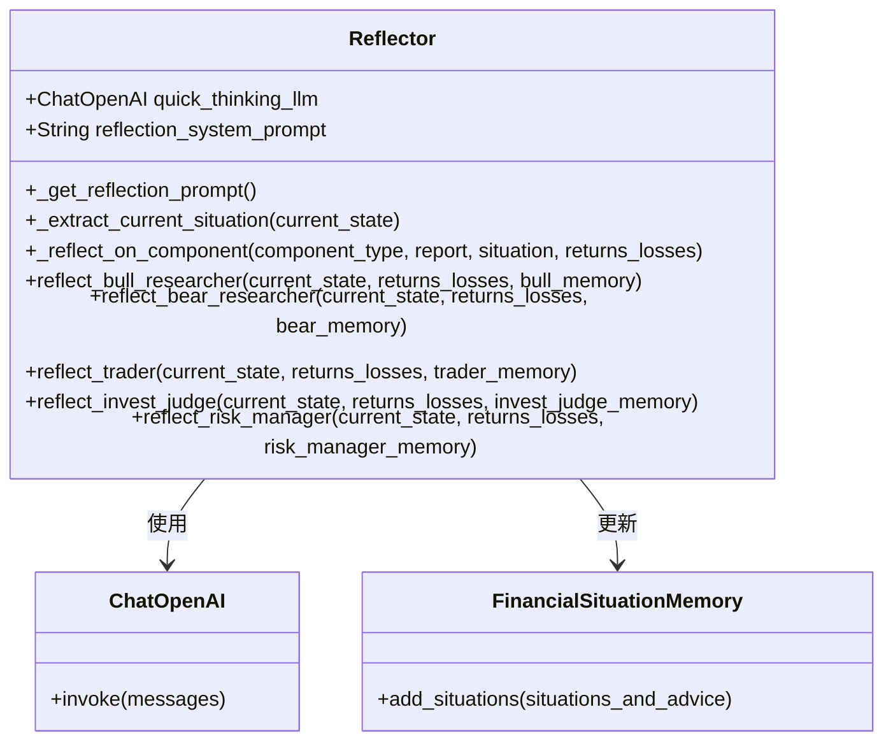
```mermaid
classDiagram
    class Reflector {
        +ChatOpenAI quick_thinking_llm
        +String reflection_system_prompt
        +_get_reflection_prompt()
        +_extract_current_situation(current_state)
        +_reflect_on_component(component_type, report, situation, returns_losses)
        +reflect_bull_researcher(current_state, returns_losses, bull_memory)
        +reflect_bear_researcher(current_state, returns_losses, bear_memory)
        +reflect_trader(current_state, returns_losses, trader_memory)
        +reflect_invest_judge(current_state, returns_losses, invest_judge_memory)
        +reflect_risk_manager(current_state, returns_losses, risk_manager_memory)
    }
    
    class FinancialSituationMemory {
        +add_situations(situations_and_advice)
    }
    
    class ChatOpenAI {
        +invoke(messages)
    }
    
    Reflector --> ChatOpenAI : 使用
    Reflector --> FinancialSituationMemory : 更新
```

#### 7.4.2 反思过程

反思机制通过以下步骤工作：

1. **情境提取**：从当前状态中提取市场、情感、新闻和基本面报告，形成完整的市场情境描述

```python
def _extract_current_situation(self, current_state: Dict[str, Any]) -> str:
    """Extract the current market situation from the state."""
    curr_market_report = current_state["market_report"]
    curr_sentiment_report = current_state["sentiment_report"]
    curr_news_report = current_state["news_report"]
    curr_fundamentals_report = current_state["fundamentals_report"]

    return f"{curr_market_report}\n\n{curr_sentiment_report}\n\n{curr_news_report}\n\n{curr_fundamentals_report}"
```

2. **决策评估**：使用LLM分析决策的正确性，考虑以下因素：
   - 市场情报
   - 技术指标和信号
   - 价格走势分析
   - 新闻分析
   - 社交媒体和情感分析
   - 基本面数据分析

3. **改进建议**：对于不正确的决策，提出修正建议和具体的改进行动

4. **经验总结**：总结从成功和错误中学到的经验教训，并提取关键见解

#### 7.4.3 反思提示工程

反思机制使用精心设计的提示模板，引导LLM进行深入分析：

```python
def _get_reflection_prompt(self) -> str:
    """Get the system prompt for reflection."""
    return """
You are an expert financial analyst tasked with reviewing trading decisions/analysis and providing a comprehensive, step-by-step analysis. 
Your goal is to deliver detailed insights into investment decisions and highlight opportunities for improvement, adhering strictly to the following guidelines:

1. Reasoning:
   - For each trading decision, determine whether it was correct or incorrect. A correct decision results in an increase in returns, while an incorrect decision does the opposite.
   - Analyze the contributing factors to each success or mistake. Consider:
     - Market intelligence.
     - Technical indicators.
     - Technical signals.
     - Price movement analysis.
     - Overall market data analysis 
     - News analysis.
     - Social media and sentiment analysis.
     - Fundamental data analysis.
     - Weight the importance of each factor in the decision-making process.

2. Improvement:
   - For any incorrect decisions, propose revisions to maximize returns.
   - Provide a detailed list of corrective actions or improvements, including specific recommendations (e.g., changing a decision from HOLD to BUY on a particular date).

3. Summary:
   - Summarize the lessons learned from the successes and mistakes.
   - Highlight how these lessons can be adapted for future trading scenarios and draw connections between similar situations to apply the knowledge gained.

4. Query:
   - Extract key insights from the summary into a concise sentence of no more than 1000 tokens.
   - Ensure the condensed sentence captures the essence of the lessons and reasoning for easy reference.

Adhere strictly to these instructions, and ensure your output is detailed, accurate, and actionable. You will also be given objective descriptions of the market from a price movements, technical indicator, news, and sentiment perspective to provide more context for your analysis.
"""
```

#### 7.4.4 组件反思与记忆更新

系统为每个关键组件提供专门的反思方法：

1. **牛市研究员反思**：评估积极市场分析的准确性

```python
def reflect_bull_researcher(self, current_state, returns_losses, bull_memory):
    """Reflect on bull researcher's analysis and update memory."""
    situation = self._extract_current_situation(current_state)
    bull_debate_history = current_state["investment_debate_state"]["bull_history"]

    result = self._reflect_on_component(
        "BULL", bull_debate_history, situation, returns_losses
    )
    bull_memory.add_situations([(situation, result)])
```

2. **熊市研究员反思**：评估风险分析的准确性

3. **交易员反思**：评估交易计划的有效性

4. **投资判断反思**：评估投资决策的正确性

5. **风险经理反思**：评估风险管理决策的有效性

每个反思过程都会生成详细的分析结果，并将其与当前市场情境一起存储到相应的记忆实例中，形成持续学习的闭环。

### 7.5 数据流工具包

系统使用多种数据源和工具来获取市场信息：

- **Finnhub 工具**：获取公司新闻、内部交易情绪和交易信息
- **SimFin 工具**：获取资产负债表、现金流和收入报表等财务数据
- **Google News 工具**：获取相关新闻文章
- **Reddit 工具**：获取社交媒体讨论和情绪
- **YFinance 工具**：获取股票价格数据
- **StockStats 工具**：计算技术指标（移动平均线、MACD、RSI等）

这些工具可以在在线模式（实时获取数据）或离线模式（使用缓存数据）下运行，为智能体提供全面的市场视图。

## 8. 总结与评估

### 8.1 架构优势

TradingAgents 系统采用了多智能体协作的架构设计，通过专业化的角色分工和动态辩论机制，模拟了真实交易公司的决策过程。这种设计具有以下优势：

1. **专业化分工**：每个智能体专注于特定领域（技术分析、情感分析、新闻分析、基本面分析），提供深入的专业见解。

2. **辩论机制**：通过牛市/熊市研究员和风险管理团队的辩论，系统能够全面考虑不同观点，减少单一视角的偏见。

3. **层级决策**：决策过程分为多个层级（分析师 → 研究员 → 交易员 → 风险管理），每个层级都对前一层级的输出进行评估和优化。

4. **记忆与学习**：系统的记忆和反思机制使智能体能够从过去的经验中学习，不断改进决策质量。

5. **灵活配置**：系统支持不同的LLM模型、辩论轮次和数据源配置，可以根据需求进行调整。

### 8.2 架构评估

从架构设计的角度评估，TradingAgents 系统具有以下特点：

1. **模块化设计**：系统由多个独立的组件组成，每个组件都有明确的职责和接口，便于维护和扩展。

2. **状态管理**：使用 TypedDict 类（AgentState、InvestDebateState、RiskDebateState）管理系统状态，确保数据的一致性和类型安全。

3. **工作流管理**：使用 LangGraph 构建工作流，通过条件边和普通边连接不同的智能体节点，形成完整的决策流程。

4. **数据流设计**：系统通过工具包从多种数据源获取信息，为智能体提供全面的市场视图。

5. **反馈循环**：通过反思机制，系统能够根据交易结果对决策进行评估，并将经验教训存储在记忆系统中，形成闭环反馈。

### 8.3 潜在改进方向

尽管 TradingAgents 系统设计合理，但仍有一些潜在的改进方向：

1. **并行处理**：当前系统的分析师团队是按顺序执行的，可以考虑并行执行以提高效率。

2. **动态智能体选择**：根据不同的市场条件和交易目标，动态选择最适合的智能体组合。

3. **更细粒度的记忆系统**：为不同类型的市场情景（如牛市、熊市、震荡市）建立专门的记忆库。

4. **自适应辩论轮次**：根据辩论的质量和收敛情况，动态调整辩论轮次。

5. **多样化的决策策略**：支持不同的决策策略（如价值投资、趋势跟踪、反转交易等）。

总体而言，TradingAgents 系统提供了一个灵活、可扩展的交易框架，能够处理复杂的金融市场分析和交易决策任务。通过多智能体协作和记忆学习机制，系统能够不断改进决策质量，为金融交易提供有价值的参考。

## 9. 工具与数据源详细分析

### 9.1 工具节点架构

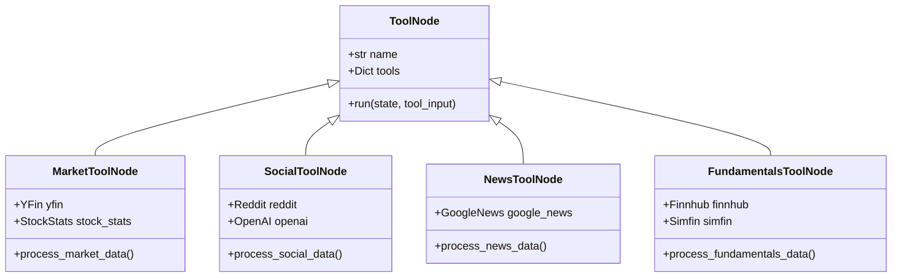
```mermaid
classDiagram
    class ToolNode {
        +str name
        +Dict tools
        +run(state, tool_input)
    }
    
    class MarketToolNode {
        +YFin yfin
        +StockStats stock_stats
        +process_market_data()
    }
    
    class SocialToolNode {
        +Reddit reddit
        +OpenAI openai
        +process_social_data()
    }
    
    class NewsToolNode {
        +GoogleNews google_news
        +process_news_data()
    }
    
    class FundamentalsToolNode {
        +Finnhub finnhub
        +Simfin simfin
        +process_fundamentals_data()
    }
    
    ToolNode <|-- MarketToolNode
    ToolNode <|-- SocialToolNode
    ToolNode <|-- NewsToolNode
    ToolNode <|-- FundamentalsToolNode
```

### 9.2 数据流与工具交互

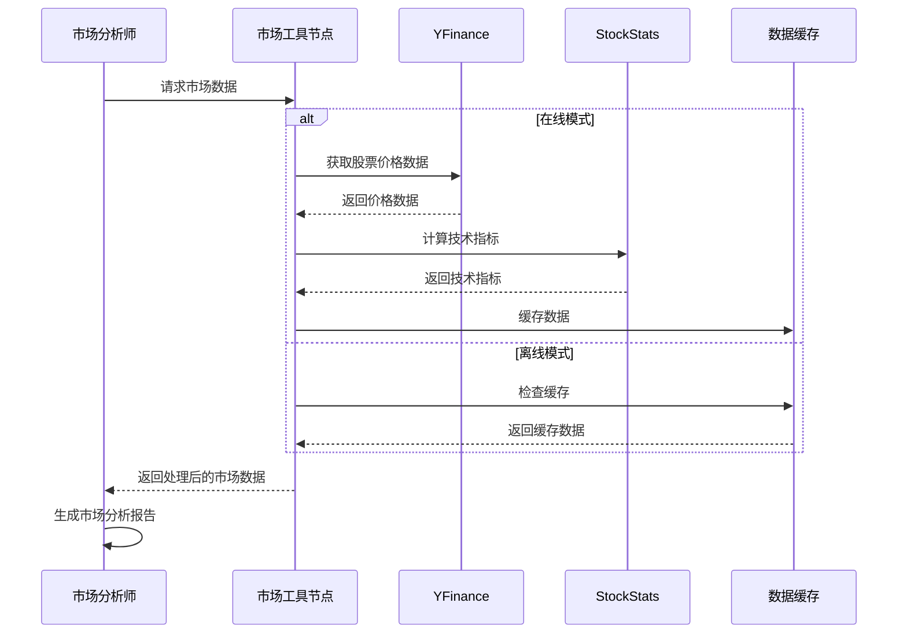
```mermaid
sequenceDiagram
    participant MA as 市场分析师
    participant MT as 市场工具节点
    participant YF as YFinance
    participant SS as StockStats
    participant Cache as 数据缓存
    
    MA->>MT: 请求市场数据
    
    alt 在线模式
        MT->>YF: 获取股票价格数据
        YF-->>MT: 返回价格数据
        MT->>SS: 计算技术指标
        SS-->>MT: 返回技术指标
        MT->>Cache: 缓存数据
    else 离线模式
        MT->>Cache: 检查缓存
        Cache-->>MT: 返回缓存数据
    end
    
    MT-->>MA: 返回处理后的市场数据
    MA->>MA: 生成市场分析报告
```

### 9.3 工具功能详细说明

#### 9.3.1 市场分析工具

| 工具名称 | 功能描述 | 输出数据 |
|---------|---------|----------|
| YFinance | 获取历史股价数据、交易量、股息信息 | 开盘价、收盘价、最高价、最低价、交易量、调整后收盘价 |
| StockStats | 计算技术指标 | 移动平均线(SMA, EMA)、MACD、RSI、布林带、成交量变化 |

#### 9.3.2 社交媒体分析工具

| 工具名称 | 功能描述 | 输出数据 |
|---------|---------|----------|
| Reddit | 抓取相关子版块的讨论内容 | 帖子内容、评论、投票情况、发布时间 |
| OpenAI | 分析社交媒体文本的情感倾向 | 情感分数(积极/消极)、关键词提取、主题分类 |

#### 9.3.3 新闻分析工具

| 工具名称 | 功能描述 | 输出数据 |
|---------|---------|----------|
| GoogleNews | 获取与公司相关的新闻文章 | 新闻标题、来源、发布时间、摘要、URL |
| NewsProcessor | 分析新闻内容的影响 | 新闻重要性评分、事件分类、市场影响预测 |

#### 9.3.4 基本面分析工具

| 工具名称 | 功能描述 | 输出数据 |
|---------|---------|----------|
| Finnhub | 获取公司新闻、内部交易、财务指标 | 新闻事件、内部交易记录、财务比率 |
| Simfin | 获取详细财务报表数据 | 资产负债表、利润表、现金流量表、财务比率 |

### 9.4 数据缓存机制

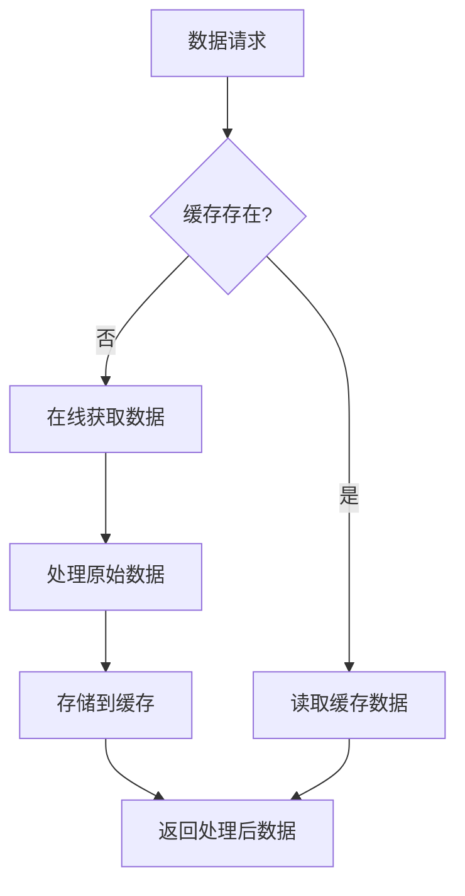
```mermaid
flowchart TD
    A[数据请求] --> B{缓存存在?}
    B -->|是| C[读取缓存数据]
    B -->|否| D[在线获取数据]
    D --> E[处理原始数据]
    E --> F[存储到缓存]
    F --> G[返回处理后数据]
    C --> G
```

系统实现了高效的数据缓存机制，以减少API调用并提高性能：

1. **缓存策略**：基于公司名称和日期创建唯一缓存键
2. **缓存存储**：使用JSON文件存储缓存数据，按工具类型和日期组织
3. **缓存验证**：检查缓存数据的完整性和有效性
4. **缓存更新**：定期更新缓存数据，确保数据的时效性
5. **离线模式支持**：在无网络连接时自动切换到缓存数据

## 10. LLM策略与配置

### 10.1 LLM模型选择与配置

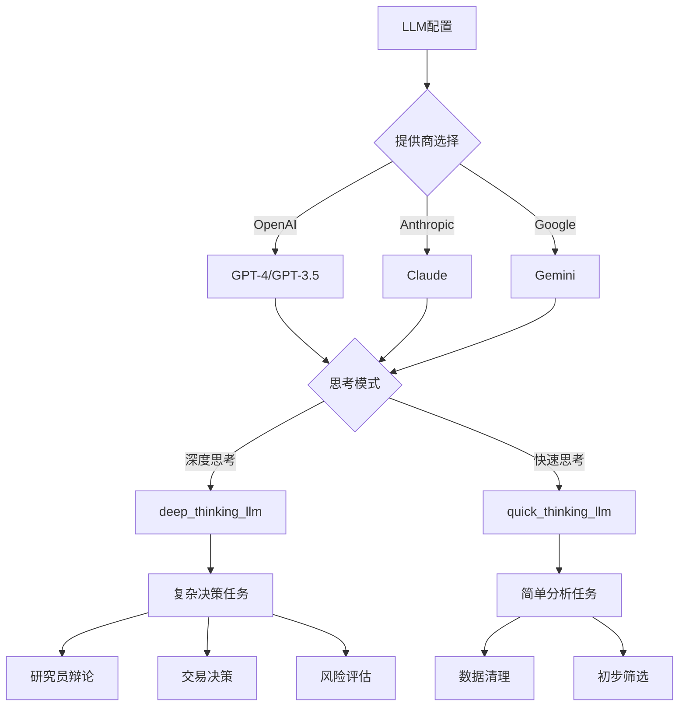
```mermaid
flowchart TD
    A[LLM配置] --> B{提供商选择}
    B -->|OpenAI| C[GPT-4/GPT-3.5]
    B -->|Anthropic| D[Claude]
    B -->|Google| E[Gemini]
    
    C --> F{思考模式}
    D --> F
    E --> F
    
    F -->|深度思考| G[deep_thinking_llm]
    F -->|快速思考| H[quick_thinking_llm]
    
    G --> I[复杂决策任务]
    H --> J[简单分析任务]
    
    I --> K[研究员辩论]
    I --> L[交易决策]
    I --> M[风险评估]
    
    J --> N[数据清理]
    J --> O[初步筛选]
```

系统根据任务复杂性和重要性，采用了双层LLM策略：

1. **深度思考LLM (deep_thinking_llm)**
   - 用于复杂的推理和决策任务
   - 配置更高的温度和最大令牌数
   - 应用于研究员辩论、交易决策和风险评估等关键节点
   - 通常使用更强大的模型（如GPT-4、Claude-2等）

2. **快速思考LLM (quick_thinking_llm)**
   - 用于简单的数据处理和初步分析
   - 配置较低的温度和令牌数，优化速度和成本
   - 应用于数据清理、消息格式化等辅助任务
   - 通常使用更轻量级的模型（如GPT-3.5等）

### 10.2 提示工程策略

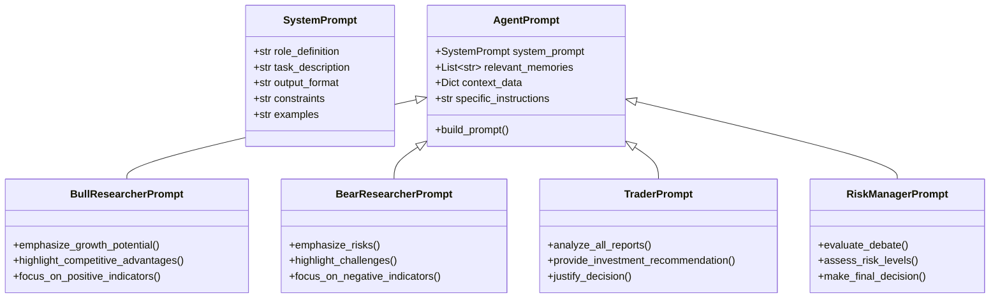
```mermaid
classDiagram
    class SystemPrompt {
        +str role_definition
        +str task_description
        +str output_format
        +str constraints
        +str examples
    }
    
    class AgentPrompt {
        +SystemPrompt system_prompt
        +List~str~ relevant_memories
        +Dict context_data
        +str specific_instructions
        +build_prompt()
    }
    
    class BullResearcherPrompt {
        +emphasize_growth_potential()
        +highlight_competitive_advantages()
        +focus_on_positive_indicators()
    }
    
    class BearResearcherPrompt {
        +emphasize_risks()
        +highlight_challenges()
        +focus_on_negative_indicators()
    }
    
    class TraderPrompt {
        +analyze_all_reports()
        +provide_investment_recommendation()
        +justify_decision()
    }
    
    class RiskManagerPrompt {
        +evaluate_debate()
        +assess_risk_levels()
        +make_final_decision()
    }
    
    AgentPrompt <|-- BullResearcherPrompt
    AgentPrompt <|-- BearResearcherPrompt
    AgentPrompt <|-- TraderPrompt
    AgentPrompt <|-- RiskManagerPrompt
```

系统为每个智能体角色设计了专门的提示工程策略：

1. **角色定义**：明确定义智能体的角色、职责和专业领域
2. **任务描述**：详细说明智能体需要完成的具体任务和目标
3. **上下文注入**：提供相关的市场数据、分析报告和历史记忆
4. **输出格式规范**：指定输出的结构和格式，确保一致性和可解析性
5. **思考框架**：引导LLM按照特定的思考步骤进行分析和决策
6. **约束条件**：设置特定的约束和偏好，引导LLM向特定方向思考
7. **示例展示**：提供高质量的示例输出，帮助LLM理解预期结果

### 10.3 LLM交互优化

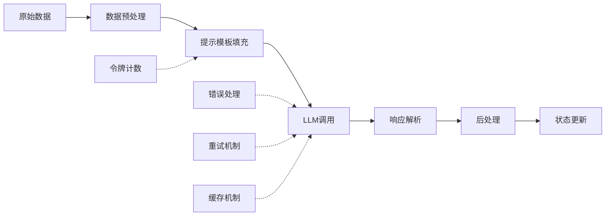
```mermaid
flowchart LR
    A[原始数据] --> B[数据预处理]
    B --> C[提示模板填充]
    C --> D[LLM调用]
    D --> E[响应解析]
    E --> F[后处理]
    F --> G[状态更新]
    
    H[错误处理] -.-> D
    I[重试机制] -.-> D
    J[令牌计数] -.-> C
    K[缓存机制] -.-> D
```

系统实现了多种LLM交互优化策略：

1. **批量处理**：将多个相关查询合并为单个LLM调用，减少API请求次数
2. **令牌优化**：动态调整提示长度，确保不超过模型的最大令牌限制
3. **缓存机制**：缓存常见查询的LLM响应，减少重复调用
4. **错误处理**：实现健壮的错误处理和重试机制，应对API限制和网络问题
5. **响应验证**：验证LLM响应的格式和内容，确保符合预期
6. **自适应温度**：根据任务的创造性需求动态调整温度参数
7. **并行调用**：在可能的情况下并行调用多个LLM，提高系统吞吐量

## 11. 系统架构总结

### 11.1 完整系统架构图

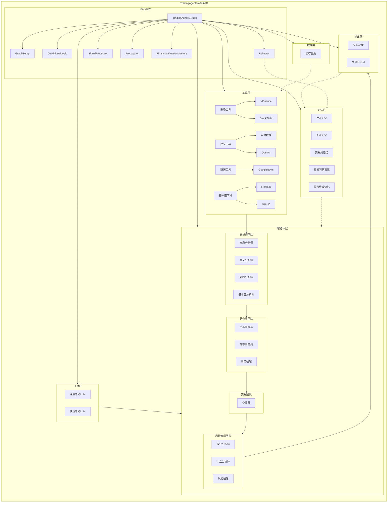
```mermaid
flowchart TB
    subgraph "TradingAgents系统架构"
        direction TB
        
        subgraph "核心组件"
            TG[TradingAgentsGraph] --> GS[GraphSetup]
            TG --> CL[ConditionalLogic]
            TG --> RF[Reflector]
            TG --> SP[SignalProcessor]
            TG --> PP[Propagator]
            TG --> FSM[FinancialSituationMemory]
        end
        
        subgraph "LLM层"
            DT[深度思考LLM] 
            QT[快速思考LLM]
        end
        
        subgraph "工具层"
            MT[市场工具] --> YF[YFinance]
            MT --> SS[StockStats]
            ST[社交工具] --> RD[Reddit]
            ST --> OA[OpenAI]
            NT[新闻工具] --> GN[GoogleNews]
            FT[基本面工具] --> FH[Finnhub]
            FT --> SF[SimFin]
        end
        
        subgraph "智能体层"
            direction TB
            
            subgraph "分析师团队"
                MA[市场分析师] 
                SA[社交分析师]
                NA[新闻分析师]
                FA[基本面分析师]
            end
            
            subgraph "研究员团队"
                BR[牛市研究员]
                BER[熊市研究员]
                RM[研究经理]
            end
            
            subgraph "交易团队"
                TR[交易员]
            end
            
            subgraph "风险管理团队"
                RD[激进分析师]
                SD[保守分析师]
                ND[中立分析师]
                RMG[风险经理]
            end
        end
        
        subgraph "记忆层"
            BM[牛市记忆]
            BEM[熊市记忆]
            TM[交易员记忆]
            IJM[投资判断记忆]
            RMM[风险经理记忆]
        end
        
        subgraph "数据层"
            CD[缓存数据]
            RD[实时数据]
        end
        
        subgraph "输出层"
            TD[交易决策]
            RL[反思与学习]
        end
    end
    
    TG --> LLM层
    TG --> 工具层
    TG --> 智能体层
    TG --> 记忆层
    TG --> 数据层
    TG --> 输出层
    
    LLM层 --> 智能体层
    工具层 --> 分析师团队
    分析师团队 --> 研究员团队
    研究员团队 --> 交易团队
    交易团队 --> 风险管理团队
    风险管理团队 --> 输出层
    记忆层 -.-> 智能体层
    数据层 -.-> 工具层
    输出层 -.-> 记忆层
    RF -.-> 记忆层
```

### 11.1.1 智能体交互详细流程

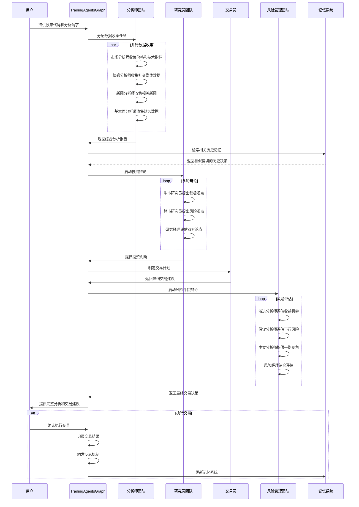
```mermaid
sequenceDiagram
    participant User as 用户
    participant TG as TradingAgentsGraph
    participant AT as 分析师团队
    participant RT as 研究员团队
    participant T as 交易员
    participant RMT as 风险管理团队
    participant M as 记忆系统
    
    User->>TG: 提供股票代码和分析请求
    TG->>AT: 分配数据收集任务
    
    par 并行数据收集
        AT->>AT: 市场分析师收集价格和技术指标
        AT->>AT: 情感分析师收集社交媒体数据
        AT->>AT: 新闻分析师收集相关新闻
        AT->>AT: 基本面分析师收集财务数据
    end
    
    AT->>TG: 返回综合分析报告
    TG->>M: 检索相关历史记忆
    M-->>TG: 返回相似情境的历史决策
    
    TG->>RT: 启动投资辩论
    
    loop 多轮辩论
        RT->>RT: 牛市研究员提出积极观点
        RT->>RT: 熊市研究员提出风险观点
        RT->>RT: 研究经理评估双方论点
    end
    
    RT->>TG: 提供投资判断
    TG->>T: 制定交易计划
    T->>TG: 返回详细交易建议
    
    TG->>RMT: 启动风险评估辩论
    
    loop 风险评估
        RMT->>RMT: 激进分析师评估收益机会
        RMT->>RMT: 保守分析师评估下行风险
        RMT->>RMT: 中立分析师提供平衡视角
        RMT->>RMT: 风险经理综合评估
    end
    
    RMT->>TG: 返回最终交易决策
    TG->>User: 提供完整分析和交易建议
    
    alt 执行交易
        User->>TG: 确认执行交易
        TG->>TG: 记录交易结果
        TG->>TG: 触发反思机制
        TG->>M: 更新记忆系统
    end
```

### 11.2 系统架构特点总结

1. **多层次智能体协作**
   - 分析师团队负责数据收集和初步分析
   - 研究员团队通过辩论机制评估投资机会
   - 交易员制定初步交易计划
   - 风险管理团队评估风险并做出最终决策

2. **基于LLM的决策系统**
   - 使用深度思考LLM处理复杂决策任务
   - 使用快速思考LLM处理简单分析任务
   - 为每个智能体角色定制专门的提示工程策略

3. **多源数据整合**
   - 市场数据：价格、交易量、技术指标
   - 社交媒体数据：情感分析、公众讨论
   - 新闻数据：相关新闻、事件影响
   - 基本面数据：财务报表、内部交易

4. **记忆与学习机制**
   - 为不同角色维护专门的记忆系统
   - 根据交易结果进行反思和学习
   - 将经验教训应用于未来决策

5. **灵活的工作流管理**
   - 使用条件逻辑控制工作流程
   - 支持辩论轮次的动态调整
   - 允许不同组件的灵活配置

6. **高效的数据处理**
   - 实现数据缓存机制减少API调用
   - 支持在线和离线模式
   - 优化LLM交互减少令牌消耗

### 11.3 系统性能优化

为了提高系统的效率和响应速度，TradingAgents实现了多种性能优化策略：

#### 11.3.1 计算资源优化

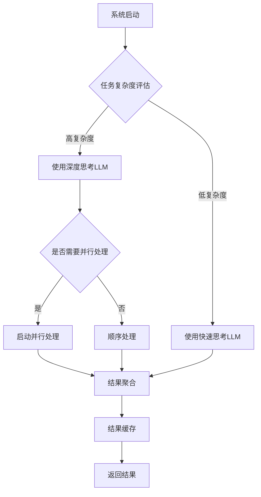
```mermaid
flowchart TD
    A[系统启动] --> B{任务复杂度评估}
    B -->|高复杂度| C[使用深度思考LLM]
    B -->|低复杂度| D[使用快速思考LLM]
    
    C --> E{是否需要并行处理}
    E -->|是| F[启动并行处理]
    E -->|否| G[顺序处理]
    
    F --> H[结果聚合]
    G --> H
    D --> H
    
    H --> I[结果缓存]
    I --> J[返回结果]
```

1. **LLM调用优化**
   - 动态选择模型：根据任务复杂性选择适当的LLM模型
   - 批量处理：将多个相关查询合并为单个LLM调用
   - 并行调用：在可能的情况下并行调用多个LLM
   - 令牌优化：动态调整提示长度，确保不超过模型的最大令牌限制

2. **数据处理优化**
   - 增量数据获取：只获取新的或更新的数据
   - 数据预处理：在发送到LLM之前对数据进行清理和格式化
   - 数据压缩：减少传输和存储的数据量
   - 异步数据获取：在后台获取数据，减少等待时间

3. **缓存策略**
   - LLM响应缓存：缓存常见查询的LLM响应
   - 数据缓存：缓存API响应和处理结果
   - 记忆检索优化：使用向量索引加速相似性搜索
   - 缓存失效策略：根据数据类型设置不同的缓存过期时间

4. **资源分配**
   - 动态资源分配：根据任务优先级分配计算资源
   - 批处理任务：将非紧急任务批量处理
   - 负载均衡：在多个LLM提供商之间分配请求
   - 降级策略：在资源受限时降级服务

#### 11.3.2 系统监控与日志

```python
def log_llm_usage(model, tokens_in, tokens_out, latency, cost):
    """记录LLM使用情况"""
    logger.info(f"LLM调用: 模型={model}, 输入令牌={tokens_in}, 输出令牌={tokens_out}, 延迟={latency}ms, 成本=${cost:.4f}")

def monitor_system_performance():
    """监控系统性能"""
    # 记录内存使用情况
    memory_usage = psutil.Process(os.getpid()).memory_info().rss / 1024 / 1024
    logger.info(f"内存使用: {memory_usage:.2f} MB")
    
    # 记录API调用统计
    for api_name, stats in api_call_stats.items():
        logger.info(f"API {api_name}: 调用次数={stats['count']}, 平均延迟={stats['avg_latency']:.2f}ms, 错误率={stats['error_rate']:.2f}%")
    
    # 记录缓存命中率
    for cache_name, stats in cache_stats.items():
        hit_rate = stats['hits'] / (stats['hits'] + stats['misses']) if (stats['hits'] + stats['misses']) > 0 else 0
        logger.info(f"缓存 {cache_name}: 命中率={hit_rate:.2f}, 大小={stats['size']}")
```

系统实现了全面的监控和日志记录，包括：

1. **性能指标监控**
   - LLM使用情况：令牌消耗、延迟、成本
   - API调用统计：调用次数、延迟、错误率
   - 缓存效率：命中率、大小、过期率
   - 系统资源：CPU、内存、网络使用情况

2. **异常监控**
   - API错误跟踪：记录和分析API错误
   - LLM响应验证：检测异常或无效的LLM响应
   - 性能异常：检测性能下降或资源瓶颈
   - 自动报警：当关键指标超过阈值时发送警报

3. **业务指标监控**
   - 交易决策质量：准确率、收益率、风险调整回报
   - 智能体性能：各智能体的决策准确率和贡献度
   - 记忆系统效率：记忆检索的相关性和有用性
   - 用户满意度：用户反馈和交互指标

### 11.4 系统优势与应用场景

**系统优势：**

1. **全面的市场视角**：通过多个专业化智能体提供不同角度的分析，形成全面的市场视角。

2. **辩论驱动的决策**：通过牛熊研究员和风险分析师的辩论，充分考虑不同观点，减少决策偏见。

3. **持续学习能力**：通过记忆和反思机制，系统能够从过去的交易中学习，不断改进决策质量。

4. **灵活的配置选项**：支持不同的LLM提供商、数据源和辩论策略，可以根据需求进行定制。

5. **透明的决策过程**：每个决策步骤都有详细的记录和解释，提高决策的可解释性和可追溯性。

**应用场景：**

1. **量化交易系统**：作为量化交易系统的决策引擎，提供基于多源数据的交易信号。

2. **投资顾问辅助**：辅助人类投资顾问分析市场，提供全面的投资建议。

3. **投资组合管理**：管理多资产投资组合，根据市场变化调整资产配置。

4. **风险管理系统**：评估投资决策的风险，提供风险缓解策略。

5. **市场研究平台**：生成深入的市场研究报告，分析投资机会和风险。

6. **交易策略回测**：在历史数据上回测交易策略，评估其有效性。

7. **实时市场监控**：监控市场变化，及时发现投资机会或风险信号。

### 11.5 未来发展方向

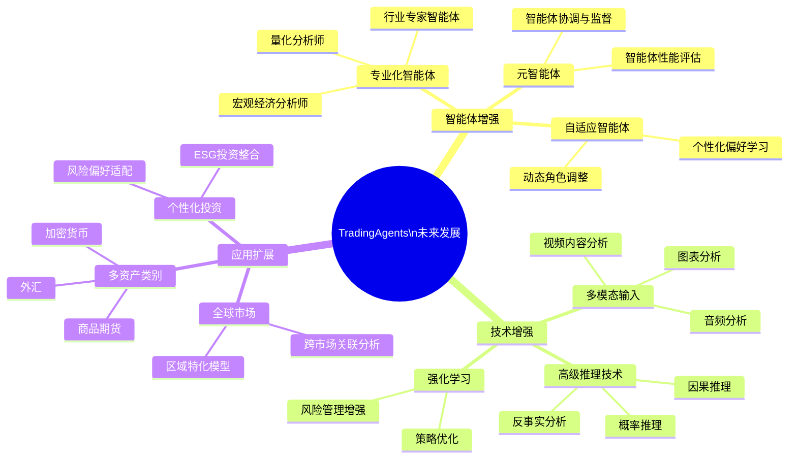
```mermaid
mindmap
  root((TradingAgents\n未来发展))
    智能体增强
      专业化智能体
        行业专家智能体
        宏观经济分析师
        量化分析师
      自适应智能体
        动态角色调整
        个性化偏好学习
      元智能体
        智能体协调与监督
        智能体性能评估
    技术增强
      多模态输入
        图表分析
        视频内容分析
        音频分析
      高级推理技术
        因果推理
        反事实分析
        概率推理
      强化学习
        策略优化
        风险管理增强
    应用扩展
      多资产类别
        加密货币
        商品期货
        外汇
      全球市场
        区域特化模型
        跨市场关联分析
      个性化投资
        风险偏好适配
        ESG投资整合
```

系统的未来发展方向包括：

1. **智能体增强**
   - **专业化智能体**：添加更多专业领域的智能体，如行业专家、宏观经济分析师、量化分析师等
   - **自适应智能体**：根据市场环境和历史表现动态调整智能体的角色和权重
   - **元智能体**：引入监督和协调其他智能体的元智能体，优化整体决策过程

2. **技术增强**
   - **多模态输入**：支持图表、视频和音频等多模态数据输入，提供更全面的市场视角
   - **高级推理技术**：引入因果推理、反事实分析和概率推理等高级技术，提高决策质量
   - **强化学习**：使用强化学习优化交易策略和风险管理

3. **应用扩展**
   - **多资产类别**：扩展到加密货币、商品期货、外汇等更多资产类别
   - **全球市场**：支持全球不同市场的分析和交易，考虑区域特定因素
   - **个性化投资**：根据用户的风险偏好和投资目标提供个性化建议

4. **系统优化**
   - **分布式架构**：实现分布式处理以提高系统吞吐量和可靠性
   - **实时处理**：支持实时市场数据处理和决策
   - **低延迟响应**：优化系统响应时间，支持高频交易场景

5. **用户体验**
   - **交互式分析**：支持用户与系统进行交互式分析和决策调整
   - **可视化增强**：提供更直观的数据和决策可视化
   - **自然语言界面**：通过自然语言与系统交互，简化用户操作

TradingAgents系统通过多智能体协作、记忆学习和灵活配置，为金融交易决策提供了一个强大而全面的框架，能够适应不同的市场环境和投资需求。随着技术的不断发展和系统的持续优化，它将为金融市场参与者提供更强大、更智能的决策支持。

## 12. 系统部署与扩展性

### 12.1 部署架构

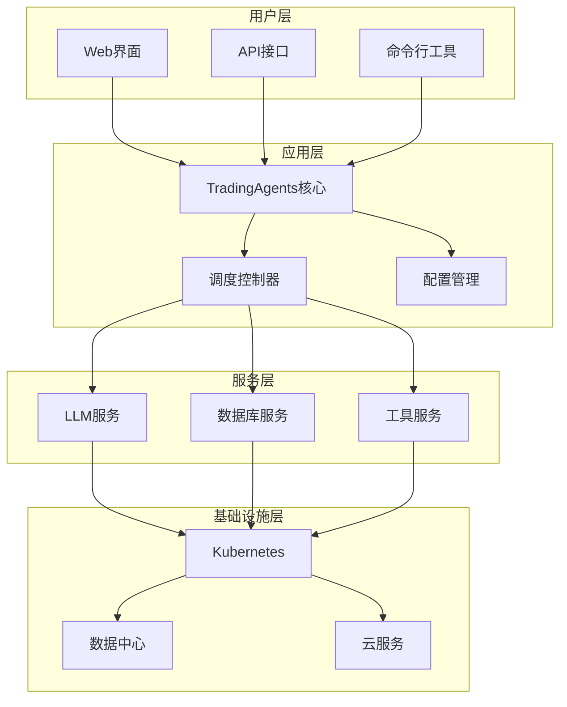
```mermaid
flowchart TB
    subgraph "用户层"
        UI[Web界面]
        API[API接口]
        CLI[命令行工具]
    end
    
    subgraph "应用层"
        TA[TradingAgents核心]
        SC[调度控制器]
        CM[配置管理]
    end
    
    subgraph "服务层"
        LLM[LLM服务]
        DB[数据库服务]
        TS[工具服务]
    end
    
    subgraph "基础设施层"
        K8S[Kubernetes]
        DC[数据中心]
        Cloud[云服务]
    end
    
    UI --> TA
    API --> TA
    CLI --> TA
    
    TA --> SC
    TA --> CM
    
    SC --> LLM
    SC --> DB
    SC --> TS
    
    LLM --> K8S
    DB --> K8S
    TS --> K8S
    
    K8S --> DC
    K8S --> Cloud
```

TradingAgents系统支持多种部署模式，从单机部署到大规模分布式部署，满足不同规模和需求的用户：

1. **单机部署**
   - 适用于个人用户和小型团队
   - 所有组件在单一服务器上运行
   - 支持Docker容器化部署
   - 资源需求适中，可在标准笔记本电脑上运行

2. **微服务部署**
   - 适用于中型组织和企业
   - 将系统拆分为多个微服务（LLM服务、数据服务、工具服务等）
   - 使用Kubernetes进行容器编排
   - 支持水平扩展和高可用性

3. **云原生部署**
   - 适用于大型金融机构和交易公司
   - 利用云服务提供商（AWS、Azure、GCP）的托管服务
   - 自动扩展以应对负载变化
   - 全球分布式部署支持多区域访问

### 12.2 扩展性设计

```mermaid
flowchart LR
    subgraph "水平扩展"
        LB[负载均衡器]
        LB --> I1[实例1]
        LB --> I2[实例2]
        LB --> I3[实例3]
        LB --> IN[实例N]
    end
    
    subgraph "垂直扩展"
        C[控制器]
        C --> A[分析服务]
        C --> R[研究服务]
        C --> T[交易服务]
        C --> RM[风险管理服务]
    end
    
    subgraph "功能扩展"
        Core[核心系统]
        Core --> P1[插件1]
        Core --> P2[插件2]
        Core --> P3[插件3]
        Core --> PN[插件N]
    end
```

TradingAgents系统的扩展性设计包括：

1. **水平扩展**
   - 无状态服务可以水平扩展以处理更多请求
   - 使用负载均衡器分发请求
   - 支持按需自动扩展
   - 实例间通过消息队列协调

2. **垂直扩展**
   - 将系统功能拆分为独立服务
   - 每个服务可以独立扩展和优化
   - 支持不同服务使用不同的资源配置
   - 服务间通过API和事件总线通信

3. **功能扩展**
   - 插件架构支持添加新功能
   - 标准化接口允许集成第三方工具和数据源
   - 自定义智能体和策略
   - 支持用户定义的工作流

### 12.3 可观测性与运维

```mermaid
flowchart TD
    subgraph "监控系统"
        M[指标收集]
        L[日志聚合]
        T[分布式追踪]
    end
    
    subgraph "告警系统"
        AM[指标告警]
        AL[日志告警]
        AE[异常检测]
    end
    
    subgraph "运维工具"
        D[部署工具]
        B[回滚机制]
        C[配置管理]
    end
    
    M --> AM
    L --> AL
    T --> AE
    
    AM --> N[通知系统]
    AL --> N
    AE --> N
    
    N --> O[运维人员]
    O --> D
    O --> B
    O --> C
```

系统实现了全面的可观测性和运维支持：

1. **监控与告警**
   - 全面的指标收集（CPU、内存、API调用、LLM使用等）
   - 结构化日志记录所有关键操作
   - 分布式追踪跟踪请求流程
   - 基于阈值和异常检测的智能告警

2. **自动化运维**
   - CI/CD流水线实现自动部署
   - 蓝绿部署和金丝雀发布减少风险
   - 自动回滚机制应对部署失败
   - 基础设施即代码(IaC)管理所有资源

3. **故障恢复**
   - 自动故障检测和恢复
   - 数据备份和恢复策略
   - 多区域容灾设计
   - 降级策略保证核心功能可用

## 13. 结论

TradingAgents系统代表了金融交易决策领域的一次重要创新，它将大型语言模型的强大推理能力与多智能体协作框架相结合，创造了一个能够全面分析市场、辩论不同观点、学习历史经验并做出明智决策的交易系统。

系统的核心优势在于：

1. **多角度分析**：通过专业化的智能体团队，从技术、情感、新闻和基本面等多个角度分析市场，形成全面的市场视图。

2. **辩论驱动决策**：通过牛熊研究员的辩论和风险团队的评估，系统能够充分考虑不同观点，减少决策偏见，提高决策质量。

3. **记忆与学习**：系统的记忆和反思机制使其能够从过去的交易中学习，不断改进决策质量，适应不同的市场环境。

4. **灵活与可扩展**：模块化的设计和灵活的配置选项使系统能够适应不同的需求和场景，从个人投资者到大型金融机构都能找到适合的使用方式。

随着人工智能技术的不断发展，特别是大型语言模型能力的持续提升，TradingAgents系统将有更广阔的发展空间。通过引入更专业的智能体、支持多模态输入、应用高级推理技术和强化学习等创新，系统将为金融市场参与者提供更强大、更智能的决策支持，帮助他们在复杂多变的市场环境中取得更好的投资结果。