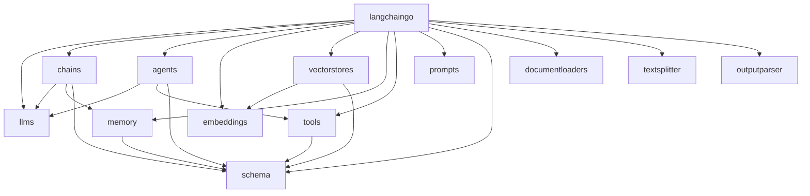
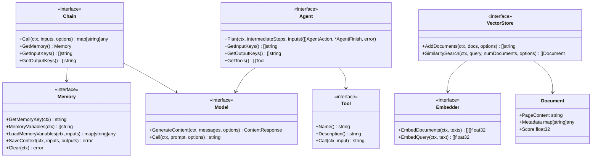
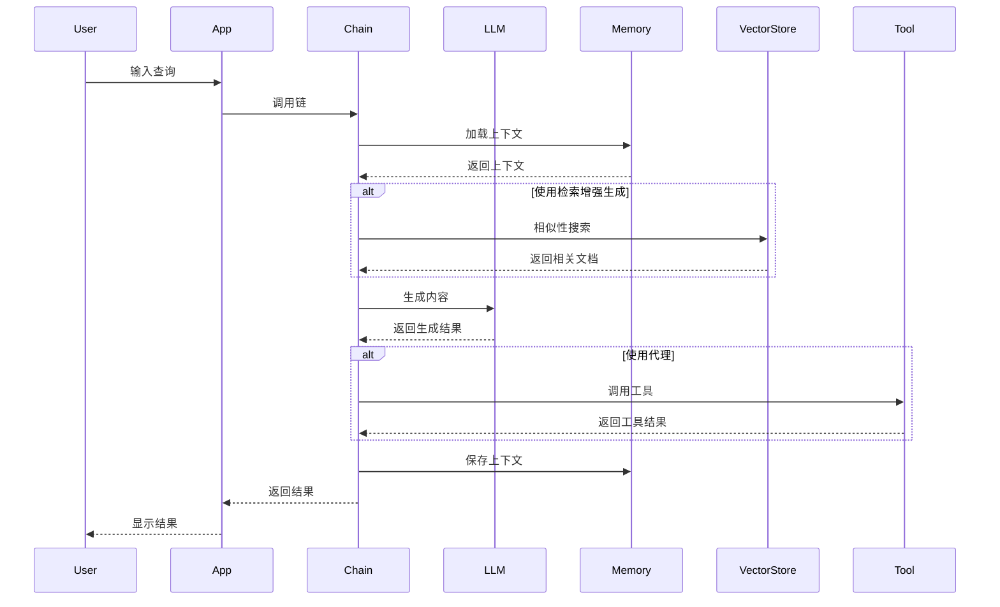

# LangChainGo 架构分析

## 项目概述

LangChainGo 是 LangChain 的 Go 语言实现，它是一个用于构建基于大型语言模型（LLMs）应用的框架。该框架通过组合性使开发者能够创建强大的 AI 驱动应用，提供了与各种 LLM 提供商、向量数据库和其他 AI 服务的统一接口。

## 核心组件

### 包引用关系图

### 核心接口关系图

## 架构分析

### 模块化设计

LangChainGo 采用了高度模块化的设计，将不同功能封装在独立的包中，这使得开发者可以根据需要只导入所需的组件，而不必引入整个框架。主要模块包括：

1. **llms**: 提供与各种语言模型交互的统一接口，支持多种提供商如 OpenAI、Anthropic、Google 等。

2. **chains**: 实现可组合的操作链，将多个步骤连接起来形成复杂的工作流。

3. **agents**: 实现自主代理，能够使用工具完成任务。

4. **embeddings**: 提供文本嵌入功能，用于语义搜索和相似性计算。

5. **vectorstores**: 提供向量数据库接口，用于存储和查询嵌入向量。

6. **memory**: 管理对话历史和上下文。

7. **tools**: 集成外部工具，如网络搜索、计算器、数据库等。

8. **prompts**: 管理提示模板。

9. **schema**: 定义框架中使用的基本数据结构和接口。

### 接口设计

LangChainGo 使用 Go 的接口机制实现了松耦合的组件交互：

1. **Model 接口**: 定义了与语言模型交互的标准方法，使得不同的 LLM 提供商可以通过相同的接口使用。

2. **Chain 接口**: 定义了链的标准操作，包括调用、获取记忆和输入/输出键。

3. **Agent 接口**: 定义了代理的规划和执行能力，使代理能够使用工具完成任务。

4. **Embedder 接口**: 定义了创建文本嵌入的方法，支持多种嵌入提供商。

5. **VectorStore 接口**: 定义了向量存储的操作，如添加文档和相似性搜索。

6. **Memory 接口**: 定义了记忆管理的方法，如加载和保存上下文。

7. **Tool 接口**: 定义了工具的基本操作，使代理能够使用各种外部工具。

### 扩展性

LangChainGo 的架构设计使其具有很强的扩展性：

1. **多 LLM 提供商支持**: 通过实现 Model 接口，可以轻松添加新的 LLM 提供商。

2. **多向量存储支持**: 通过实现 VectorStore 接口，可以集成各种向量数据库。

3. **自定义工具**: 通过实现 Tool 接口，可以创建自定义工具供代理使用。

4. **自定义链**: 通过实现 Chain 接口，可以创建自定义的处理链。

### 工作流程

## 总结

LangChainGo 提供了一个强大而灵活的框架，用于构建基于大型语言模型的应用。其模块化设计和接口抽象使得开发者可以轻松集成各种 LLM 提供商、向量存储和工具，同时保持代码的可维护性和可扩展性。

该框架特别适合构建以下类型的应用：

1. **检索增强生成 (RAG)**: 结合向量存储和 LLM，基于文档回答问题。

2. **对话系统**: 利用记忆组件维护对话历史，创建上下文感知的对话体验。

3. **自主代理**: 创建能够使用工具完成复杂任务的代理。

4. **多模态应用**: 支持文本和图像等多种输入类型。

通过提供这些功能，LangChainGo 使开发者能够专注于应用逻辑，而不必担心底层 LLM 集成的复杂性。