# LangChainGo 架构分析

## 项目概述

LangChainGo 是 LangChain 的 Go 语言实现，它是一个用于构建基于大型语言模型（LLMs）应用的框架。该框架通过组合性使开发者能够创建强大的 AI 驱动应用，提供了与各种 LLM 提供商、向量数据库和其他 AI 服务的统一接口。

## 核心组件

### 包引用关系图


### 核心接口关系图


## 架构分析

### 模块化设计

LangChainGo 采用了高度模块化的设计，将不同功能封装在独立的包中，这使得开发者可以根据需要只导入所需的组件，而不必引入整个框架。主要模块包括：

1. **llms**: 提供与各种语言模型交互的统一接口，支持多种提供商如 OpenAI、Anthropic、Google 等。

2. **chains**: 实现可组合的操作链，将多个步骤连接起来形成复杂的工作流。

3. **agents**: 实现自主代理，能够使用工具完成任务。

4. **embeddings**: 提供文本嵌入功能，用于语义搜索和相似性计算。

5. **vectorstores**: 提供向量数据库接口，用于存储和查询嵌入向量。

6. **memory**: 管理对话历史和上下文。

7. **tools**: 集成外部工具，如网络搜索、计算器、数据库等。

8. **prompts**: 管理提示模板。

9. **schema**: 定义框架中使用的基本数据结构和接口。

### 接口设计

LangChainGo 使用 Go 的接口机制实现了松耦合的组件交互：

1. **Model 接口**: 定义了与语言模型交互的标准方法，使得不同的 LLM 提供商可以通过相同的接口使用。

2. **Chain 接口**: 定义了链的标准操作，包括调用、获取记忆和输入/输出键。

3. **Agent 接口**: 定义了代理的规划和执行能力，使代理能够使用工具完成任务。

4. **Embedder 接口**: 定义了创建文本嵌入的方法，支持多种嵌入提供商。

5. **VectorStore 接口**: 定义了向量存储的操作，如添加文档和相似性搜索。

6. **Memory 接口**: 定义了记忆管理的方法，如加载和保存上下文。

7. **Tool 接口**: 定义了工具的基本操作，使代理能够使用各种外部工具。

### 扩展性

LangChainGo 的架构设计使其具有很强的扩展性：

1. **多 LLM 提供商支持**: 通过实现 Model 接口，可以轻松添加新的 LLM 提供商。

2. **多向量存储支持**: 通过实现 VectorStore 接口，可以集成各种向量数据库。

3. **自定义工具**: 通过实现 Tool 接口，可以创建自定义工具供代理使用。

4. **自定义链**: 通过实现 Chain 接口，可以创建自定义的处理链。

### 工作流程


## 包结构分析

### LLMs包

`llms` 包是 LangChainGo 框架的核心组件之一，它提供了与各种大型语言模型（LLMs）交互的统一接口。该包的设计目标是抽象不同 LLM 提供商的 API 差异，使开发者能够轻松切换不同的模型而无需修改应用逻辑。

#### 核心接口与结构

```mermaid
classDiagram
    %% 核心接口
    class Model {
        <<interface>>
        +GenerateContent(ctx, messages, options) *ContentResponse
        +Call(ctx, prompt, options) string
    }
    
    %% 消息内容结构
    class MessageContent {
        +Role ChatMessageType
        +Parts []ContentPart
    }
    
    %% 内容部分接口及实现
    class ContentPart {
        <<interface>>
        +isPart()
    }
    
    class TextContent {
        +Text string
    }
    
    class ImageURLContent {
        +URL string
        +Detail string
    }
    
    class BinaryContent {
        +MIMEType string
        +Data []byte
    }
    
    class ToolCall {
        +ID string
        +Type string
        +FunctionCall *FunctionCall
        +isPart()
    }
    
    class ToolCallResponse {
        +ToolCallID string
        +Name string
        +Content string
        +isPart()
    }
    
    %% 函数调用相关结构
    class FunctionCall {
        +Name string
        +Arguments string
    }
    
    class Tool {
        +Type string
        +Function *FunctionDefinition
    }
    
    class FunctionDefinition {
        +Name string
        +Description string
        +Parameters any
        +Strict bool
    }
    
    class ToolChoice {
        +Type string
        +Function *FunctionReference
    }
    
    class FunctionReference {
        +Name string
    }
    
    %% 响应结构
    class ContentResponse {
        +Choices []*ContentChoice
    }
    
    class ContentChoice {
        +Content string
        +StopReason string
        +GenerationInfo map[string]any
        +FuncCall *FunctionCall
        +ToolCalls []ToolCall
        +ReasoningContent string
    }
    
    %% 调用选项
    class CallOptions {
        +Model string
        +CandidateCount int
        +MaxTokens int
        +Temperature float64
        +StopWords []string
        +StreamingFunc func
        +StreamingReasoningFunc func
        +TopK int
        +TopP float64
        +Seed int
        +MinLength int
        +MaxLength int
        +N int
        +RepetitionPenalty float64
        +FrequencyPenalty float64
        +PresencePenalty float64
        +JSONMode bool
        +Tools []Tool
        +ToolChoice any
        +Functions []FunctionDefinition
        +FunctionCallBehavior FunctionCallBehavior
        +Metadata map[string]any
        +ResponseMIMEType string
    }
    
    %% 缓存机制
    class Cacher {
        +llm Model
        +cache Backend
        +GenerateContent()
        +Call()
    }
    
    %% 聊天消息类型
    class ChatMessageType {
        <<enumeration>>
        ChatMessageTypeAI
        ChatMessageTypeHuman
        ChatMessageTypeSystem
        ChatMessageTypeGeneric
        ChatMessageTypeFunction
        ChatMessageTypeTool
    }
    
    %% 聊天消息接口及实现
    class ChatMessage {
        <<interface>>
        +GetType() ChatMessageType
        +GetContent() string
    }
    
    class AIChatMessage {
        +Content string
        +FunctionCall *FunctionCall
        +ToolCalls []ToolCall
        +ReasoningContent string
        +GetType() ChatMessageType
        +GetContent() string
        +GetFunctionCall() *FunctionCall
    }
    
    class HumanChatMessage {
        +Content string
        +GetType() ChatMessageType
        +GetContent() string
    }
    
    class SystemChatMessage {
        +Content string
        +GetType() ChatMessageType
        +GetContent() string
    }
    
    class GenericChatMessage {
        +Content string
        +Role string
        +Name string
        +GetType() ChatMessageType
        +GetContent() string
    }
    
    class FunctionChatMessage {
        +Name string
        +Content string
        +GetType() ChatMessageType
        +GetContent() string
        +GetName() string
    }
    
    class ToolChatMessage {
        +ID string
        +Content string
        +GetType() ChatMessageType
        +GetContent() string
        +GetID() string
    }
    
    %% 关系定义
    ContentPart <|-- TextContent
    ContentPart <|-- ImageURLContent
    ContentPart <|-- BinaryContent
    ContentPart <|-- ToolCall
    ContentPart <|-- ToolCallResponse
    
    Model <|-- Cacher
    
    MessageContent o-- ChatMessageType
    MessageContent o-- ContentPart
    
    ContentResponse o-- ContentChoice
    ContentChoice o-- FunctionCall
    ContentChoice o-- ToolCall
    
    ToolCall o-- FunctionCall
    Tool o-- FunctionDefinition
    ToolChoice o-- FunctionReference
    
    CallOptions o-- Tool
    CallOptions o-- ToolChoice
    CallOptions o-- FunctionDefinition
    
    ChatMessage <|-- AIChatMessage
    ChatMessage <|-- HumanChatMessage
    ChatMessage <|-- SystemChatMessage
    ChatMessage <|-- GenericChatMessage
    ChatMessage <|-- FunctionChatMessage
    ChatMessage <|-- ToolChatMessage
    
    AIChatMessage o-- FunctionCall
    AIChatMessage o-- ToolCall
```



#### 结构体关系说明

1. **核心接口与实现**
   - `Model` 是核心接口，定义了与语言模型交互的方法
   - `Cacher` 实现了 `Model` 接口，为模型调用提供缓存功能

2. **消息内容与部分**
   - `MessageContent` 包含 `Role`（消息角色）和 `Parts`（内容部分数组）
   - `ContentPart` 是内容部分的接口，有多种实现：
     - `TextContent`：文本内容
     - `ImageURLContent`：图像URL内容
     - `BinaryContent`：二进制数据内容
     - `ToolCall`：工具调用请求
     - `ToolCallResponse`：工具调用响应

3. **函数和工具调用**
   - `FunctionCall` 包含函数名称和参数
   - `Tool` 包含类型和函数定义
   - `FunctionDefinition` 定义函数的名称、描述和参数
   - `ToolChoice` 指定要使用的工具
   - `FunctionReference` 引用特定函数
   - `ToolCall` 包含 `FunctionCall`，表示模型请求调用的工具

4. **响应结构**
   - `ContentResponse` 包含 `Choices` 数组
   - `ContentChoice` 包含生成的内容、停止原因、生成信息、函数调用和工具调用

5. **调用选项**
   - `CallOptions` 包含多种配置选项，如模型名称、温度、最大令牌数等
   - 包含 `Tools`、`ToolChoice` 和 `Functions` 等字段，用于配置工具和函数调用

6. **聊天消息**
   - `ChatMessage` 是聊天消息的接口
   - 多种实现类型：`AIChatMessage`、`HumanChatMessage`、`SystemChatMessage`、`GenericChatMessage`、`FunctionChatMessage` 和 `ToolChatMessage`
   - `AIChatMessage` 包含 `FunctionCall` 和 `ToolCalls`，表示AI可以请求调用函数或工具

#### 主要组件

1. **Model 接口**：定义了与语言模型交互的核心方法
   - `GenerateContent`：多模态内容生成的主要方法
   - `Call`：简化的文本生成方法（已弃用，保留向后兼容性）

2. **消息内容结构**：
   - `MessageContent`：表示发送给 LLM 的消息，包含角色和内容部分
   - `ContentPart`：内容部分的接口，支持多种类型（文本、图像、二进制数据等）
   - `ChatMessage`：表示聊天中的消息，包含类型和内容

3. **聊天消息类型**：
   - `ChatMessageType`：定义了消息的类型（枚举）
     - `ChatMessageTypeAI`：AI 发送的消息
     - `ChatMessageTypeHuman`：人类发送的消息
     - `ChatMessageTypeSystem`：系统发送的消息
     - `ChatMessageTypeGeneric`：通用消息
     - `ChatMessageTypeFunction`：函数调用结果消息（已弃用）
     - `ChatMessageTypeTool`：工具调用结果消息
   - 各种消息实现：
     - `AIChatMessage`：包含内容、函数调用、工具调用和推理内容
     - `HumanChatMessage`：人类发送的消息
     - `SystemChatMessage`：系统指令消息
     - `ToolChatMessage`：工具调用结果消息

4. **响应结构**：
   - `ContentResponse`：模型生成内容的响应
   - `ContentChoice`：响应中的一个选择，包含生成的内容和元数据

5. **调用选项**：
   - `CallOptions`：配置模型调用的选项，如温度、最大令牌数、停止词等
   - 提供了多种 `With*` 函数用于设置选项

6. **工具和函数调用**：
   - `Tool`：模型可以使用的工具，包含类型和函数
   - `ToolChoice`：指定要使用的工具，可以是 "none"、"auto" 或特定工具
   - `FunctionDefinition`：函数定义，包含名称、描述、参数和严格模式标志
   - `FunctionReference`：函数引用，包含函数名称
   - `FunctionCallBehavior`：函数调用行为（"none" 或 "auto"）
   - `ToolCall`：模型请求调用的工具

7. **缓存机制**：
   - `Cacher`：LLM 响应缓存包装器
   - `Backend`：缓存后端接口

8. **令牌计数**：
   - `GetModelContextSize`：获取指定模型的最大上下文令牌数
   - `CountTokens`：计算文本的令牌数，优先使用 tiktoken 库，失败时进行近似计算
   - `CalculateMaxTokens`：计算可添加的最大令牌数
   - 支持多种模型的上下文大小限制，如 GPT-3.5-Turbo (4096)、GPT-4 (8192)、GPT-4-32K (32768) 等

#### 多模态支持

`llms` 包支持多种内容类型，包括：

- 文本（`TextContent`）
- 图像 URL（`ImageURLContent`）
- 二进制数据（`BinaryContent`）
- 工具调用（`ToolCall`）

这使得开发者可以创建包含文本和图像的混合提示，适用于多模态 LLM。

#### 提供商实现

`llms` 包包含多个子包，每个子包实现了特定 LLM 提供商的 `Model` 接口：

- `openai`：OpenAI 模型（GPT-3.5、GPT-4 等）
- `anthropic`：Anthropic 模型（Claude 系列）
- `mistral`：Mistral AI 模型
- `googleai`：Google AI 模型（Gemini 系列）
- `cohere`：Cohere 模型
- `ollama`：本地 Ollama 模型
- 以及更多其他提供商

每个实现都处理特定提供商的 API 细节，同时遵循统一的接口。

#### 缓存机制

`cache` 子包提供了 LLM 响应的缓存功能，可以显著减少 API 调用次数和延迟：

- 使用哈希键基于输入和选项缓存响应
- 支持自定义缓存后端
- 处理流式响应的缓存

#### 错误处理

包含统一的错误处理机制，将不同提供商的错误映射到标准错误类型。

#### 使用模式

1. **基本文本生成**：
   ```go
   response, err := llm.GenerateFromSinglePrompt(ctx, model, "Tell me a joke")
   ```

2. **使用聊天消息**：
   ```go
   messages := []llms.ChatMessage{
       llms.SystemChatMessage{Content: "You are a helpful assistant."},
       llms.HumanChatMessage{Content: "Tell me a joke about programming."},
       llms.AIChatMessage{Content: "Why do programmers prefer dark mode? Because light attracts bugs!"},
       llms.HumanChatMessage{Content: "Tell me another one."},
   }
   
   // 将聊天消息转换为缓冲字符串
   buffer, err := llms.GetBufferString(messages, "Human", "AI")
   if err != nil {
       // 处理错误
   }
   
   // 使用缓冲字符串调用模型
   response, err := model.Call(ctx, buffer)
   ```

3. **多模态内容生成**：
   ```go
   messages := []llms.MessageContent{
       {
           Role: llms.ChatMessageTypeHuman,
           Parts: []llms.ContentPart{
               llms.TextPart("What's in this image?"),
               llms.ImageURLPart("https://example.com/image.jpg"),
           },
       },
   }
   response, err := model.GenerateContent(ctx, messages)
   ```

4. **使用工具和函数**：
   ```go
   // 使用工具
   response, err := model.GenerateContent(ctx, messages, 
       llms.WithTools([]llms.Tool{{
           Type: "function",
           Function: &llms.FunctionDefinition{
               Name: "get_weather",
               Description: "获取天气信息",
               Parameters: map[string]interface{}{
                   "type": "object",
                   "properties": map[string]interface{}{
                       "location": map[string]interface{}{
                           "type": "string",
                           "description": "城市名称",
                       },
                   },
                   "required": []string{"location"},
               },
           },
       }}),
       llms.WithToolChoice("auto"), // 或使用 "none" 或特定工具
   )
   
   // 使用已弃用的函数调用（向后兼容）
   response, err := model.GenerateContent(ctx, messages, 
       llms.WithFunctions([]llms.FunctionDefinition{...}),
       llms.WithFunctionCallBehavior(llms.FunctionCallBehaviorAuto),
   )
   ```

5. **流式响应**：
   ```go
   // 基本流式响应
   response, err := model.GenerateContent(ctx, messages, 
       llms.WithStreamingFunc(func(ctx context.Context, chunk []byte) error {
           // 处理流式响应块
           return nil
       }),
   )
   
   // 带推理过程的流式响应
   response, err := model.GenerateContent(ctx, messages, 
       llms.WithStreamingReasoningFunc(func(ctx context.Context, reasoningChunk, chunk []byte) error {
           // 处理推理过程和响应块
           return nil
       }),
   )
   ```

6. **缓存响应**：
   ```go
   cachedModel := cache.New(model, memoryCache)
   response, err := cachedModel.GenerateContent(ctx, messages)
   ```

7. **高级生成选项**：
   ```go
   // 使用 JSON 模式获取结构化输出
   response, err := model.GenerateContent(ctx, messages, 
       llms.WithJSONMode(),
   )
   
   // 设置采样参数
   response, err := model.GenerateContent(ctx, messages, 
       llms.WithTemperature(0.7),       // 控制随机性
       llms.WithTopK(40),               // Top-K 采样
       llms.WithTopP(0.95),             // Top-P (nucleus) 采样
       llms.WithSeed(42),               // 确定性采样的种子
       llms.WithRepetitionPenalty(1.1), // 重复惩罚
       llms.WithFrequencyPenalty(0.5),  // 频率惩罚
       llms.WithPresencePenalty(0.5),   // 存在惩罚
   )
   
   // 设置生成长度参数
   response, err := model.GenerateContent(ctx, messages, 
       llms.WithMaxTokens(1000),        // 最大生成令牌数
       llms.WithMinLength(100),         // 最小生成长度
       llms.WithMaxLength(2000),        // 最大生成长度
   )
   
   // 设置候选数量
   response, err := model.GenerateContent(ctx, messages, 
       llms.WithCandidateCount(3),      // 生成多个候选响应
       llms.WithN(3),                   // 为每个输入消息生成多个完成
   )
   
   // 设置特定于后端的选项
   response, err := model.GenerateContent(ctx, messages, 
       llms.WithMetadata(map[string]interface{}{
           "custom_option": "value",
       }),
       llms.WithResponseMIMEType("application/json"), // 指定响应 MIME 类型（仅 Google AI 支持）
   )
   ```

8. **令牌计数和管理**：
   ```go
   // 获取模型的上下文大小
   contextSize := llms.GetModelContextSize("gpt-4")
   
   // 计算文本的令牌数
   tokenCount := llms.CountTokens("gpt-4", "这是一段需要计算令牌数的文本")
   
   // 计算可添加的最大令牌数
   maxTokens := llms.CalculateMaxTokens("gpt-4", existingText)
   ```

#### 扩展性

`llms` 包的设计使其具有很强的扩展性：

1. **添加新提供商**：通过实现 `Model` 接口，可以轻松添加新的 LLM 提供商
   ```go
   type MyCustomLLM struct {
       // 自定义字段
   }
   
   func (m *MyCustomLLM) GenerateContent(ctx context.Context, messages []MessageContent, options ...CallOption) (ContentResponse, error) {
       // 实现生成内容的逻辑
   }
   
   func (m *MyCustomLLM) Call(ctx context.Context, prompt string, options ...CallOption) (string, error) {
       // 实现简单文本调用的逻辑
   }
   ```

2. **自定义缓存后端**：通过实现 `Backend` 接口，可以创建自定义缓存存储
   ```go
   type MyCustomCache struct {
       // 自定义字段
   }
   
   func (c *MyCustomCache) Get(key string) ([]byte, bool) {
       // 实现获取缓存的逻辑
   }
   
   func (c *MyCustomCache) Set(key string, value []byte) error {
       // 实现设置缓存的逻辑
   }
   ```

3. **中间件模式**：可以创建包装 `Model` 的中间件，添加日志、重试、监控等功能
   ```go
   type LoggingMiddleware struct {
       model Model
   }
   
   func (m *LoggingMiddleware) GenerateContent(ctx context.Context, messages []MessageContent, options ...CallOption) (ContentResponse, error) {
       // 记录请求日志
       startTime := time.Now()
       resp, err := m.model.GenerateContent(ctx, messages, options...)
       // 记录响应日志和耗时
       return resp, err
   }
   ```

4. **自定义选项**：通过创建新的 `CallOption` 函数，可以扩展模型调用选项
   ```go
   // 自定义选项函数
   func WithCustomOption(value string) CallOption {
       return func(o *CallOptions) {
           if o.Metadata == nil {
               o.Metadata = make(map[string]interface{})
           }
           o.Metadata["custom_option"] = value
       }
   }
   
   // 使用自定义选项
   response, err := model.GenerateContent(ctx, messages, WithCustomOption("value"))
   ```

## 总结

LangChainGo 提供了一个强大而灵活的框架，用于构建基于大型语言模型的应用。其模块化设计和接口抽象使得开发者可以轻松集成各种 LLM 提供商、向量存储和工具，同时保持代码的可维护性和可扩展性。

该框架特别适合构建以下类型的应用：

1. **检索增强生成 (RAG)**: 结合向量存储和 LLM，基于文档回答问题。

2. **对话系统**: 利用记忆组件维护对话历史，创建上下文感知的对话体验。

3. **自主代理**: 创建能够使用工具完成复杂任务的代理。

4. **多模态应用**: 支持文本和图像等多种输入类型。

通过提供这些功能，LangChainGo 使开发者能够专注于应用逻辑，而不必担心底层 LLM 集成的复杂性。