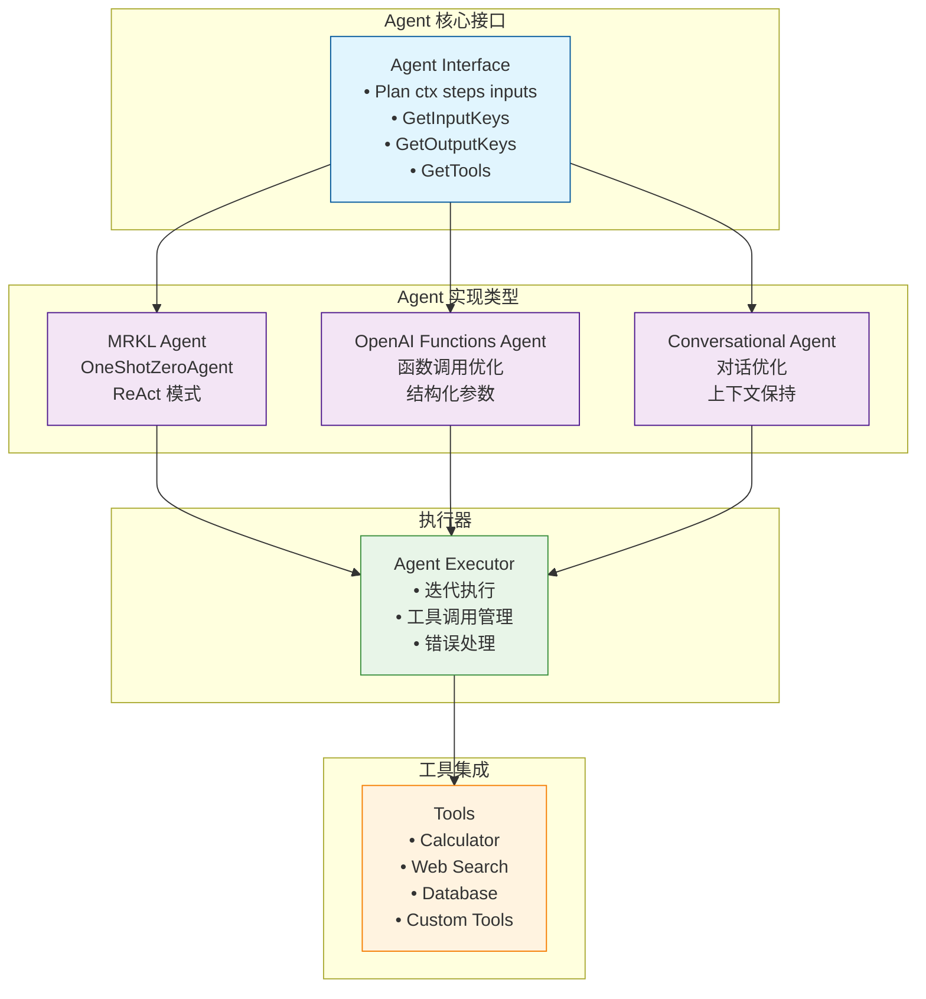
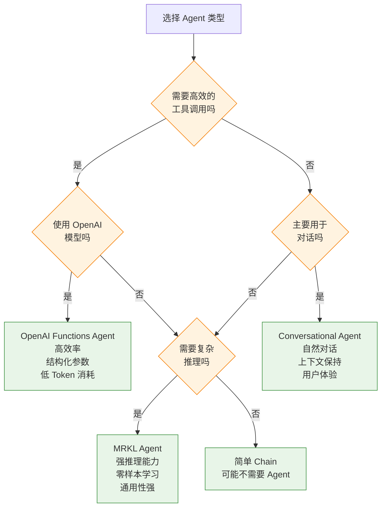

# LangChain Go Agent 类型详解与 Demo

## 概述

LangChain Go 提供了几种不同类型的 Agent，每种都有其特定的使用场景和优势。本文将深入分析源代码，为每种 Agent 类型提供详细的 demo 和说明。

## Agent 架构概览



## 1. MRKL Agent (OneShotZeroAgent)

### 特点与原理

MRKL（Modular Reasoning, Knowledge and Language）Agent 基于 ReAct（Reasoning and Acting）框架，是一种零样本推理代理。

**核心特性：**
- **ReAct 模式**：交替进行推理（Thought）和行动（Action）
- **零样本学习**：无需特定示例即可理解工具使用
- **文本驱动**：通过自然语言描述来理解和使用工具
- **迭代推理**：支持多轮思考和工具调用

### 源码分析

```go
// OneShotZeroAgent 的核心结构
type OneShotZeroAgent struct {
    Chain            chains.Chain    // LLM 链，包含 ReAct 提示模板
    Tools            []tools.Tool    // 可用工具列表
    OutputKey        string          // 输出键名
    CallbacksHandler callbacks.Handler // 回调处理器
}

// Plan 方法：决定下一步行动
func (a *OneShotZeroAgent) Plan(
    ctx context.Context,
    intermediateSteps []schema.AgentStep,
    inputs map[string]string,
) ([]schema.AgentAction, *schema.AgentFinish, error) {
    // 构建完整输入，包括历史步骤
    fullInputs := make(map[string]any, len(inputs))
    for key, value := range inputs {
        fullInputs[key] = value
    }
    
    // 构建 "scratchpad" - 包含推理历史
    fullInputs["agent_scratchpad"] = constructMrklScratchPad(intermediateSteps)
    
    // 调用 LLM 进行推理
    output, err := chains.Predict(ctx, a.Chain, fullInputs,
        chains.WithStopWords([]string{"\nObservation:", "\n\tObservation:"}))
    
    return a.parseOutput(output)
}
```

### 完整 Demo

```go
package main

import (
    "context"
    "fmt"
    "log"
    "os"
    "strings"
    
    "github.com/tmc/langchaingo/agents"
    "github.com/tmc/langchaingo/chains"
    "github.com/tmc/langchaingo/llms"
    "github.com/tmc/langchaingo/llms/openai"
    "github.com/tmc/langchaingo/tools"
    "github.com/tmc/langchaingo/tools/serpapi"
)

func main() {
    // 1. 初始化 LLM
    llm, err := openai.New(
        openai.WithModel("gpt-4"),
        openai.WithTemperature(0.0), // 降低随机性，提高一致性
    )
    if err != nil {
        log.Fatal("Failed to create OpenAI client:", err)
    }
    
    // 2. 初始化工具
    search, err := serpapi.New()
    if err != nil {
        log.Fatal("Failed to create SerpAPI client:", err)
    }
    
    agentTools := []tools.Tool{
        tools.Calculator{}, // 计算器工具
        search,            // 搜索工具
    }
    
    // 3. 创建 MRKL Agent
    agent := agents.NewOneShotAgent(
        llm,
        agentTools,
        agents.WithMaxIterations(5), // 最大迭代次数
        agents.WithCallbacksHandler(&debugCallbackHandler{}), // 调试回调
    )
    
    // 4. 创建执行器
    executor := agents.NewExecutor(agent)
    
    // 5. 执行复杂查询
    questions := []string{
        "What is the population of Tokyo? Calculate the square root of that number.",
        "Who won the 2023 Nobel Prize in Physics? How old are they now?",
        "What's the current stock price of Apple? Convert it to Japanese Yen using current exchange rate.",
    }
    
    for i, question := range questions {
        fmt.Printf("\n=== Question %d ===\n", i+1)
        fmt.Printf("Q: %s\n", question)
        
        answer, err := chains.Run(context.Background(), executor, question)
        if err != nil {
            fmt.Printf("Error: %v\n", err)
            continue
        }
        
        fmt.Printf("A: %s\n", answer)
        fmt.Println(strings.Repeat("-", 80))
    }
}

// 调试回调处理器
type debugCallbackHandler struct{}

func (d *debugCallbackHandler) HandleLLMStart(ctx context.Context, prompts []string) {
    fmt.Printf("🤖 LLM Thinking...\n")
}

func (d *debugCallbackHandler) HandleLLMEnd(ctx context.Context, result llms.LLMResult) {
    fmt.Printf("💭 LLM Response: %s\n", result.Generations[0][0].Text)
}

func (d *debugCallbackHandler) HandleToolStart(ctx context.Context, input string) {
    fmt.Printf("🔧 Using Tool with input: %s\n", input)
}

func (d *debugCallbackHandler) HandleToolEnd(ctx context.Context, output string) {
    fmt.Printf("✅ Tool Result: %s\n", output)
}
```

### 使用场景
- **研究和分析任务**：需要多步推理和信息收集
- **数据分析**：结合搜索和计算功能
- **知识探索**：探索性问题回答

## 2. OpenAI Functions Agent

### 特点与原理

OpenAI Functions Agent 专门设计用于 OpenAI 的函数调用 API，提供更结构化和高效的工具调用方式。

**核心特性：**
- **原生函数调用**：直接使用 OpenAI 的 function calling API
- **结构化参数**：支持复杂的 JSON Schema 参数定义
- **高效执行**：减少 Token 消耗和推理时间
- **类型安全**：更好的参数验证和错误处理

### 源码分析

```go
// OpenAI Functions Agent 结构
type OpenAIFunctionsAgent struct {
    LLM              llms.Model              // OpenAI 模型
    Prompt           prompts.FormatPrompter  // 提示模板
    Tools            []tools.Tool            // 工具列表
    OutputKey        string                  // 输出键
    CallbacksHandler callbacks.Handler       // 回调处理器
}

// 将工具转换为 OpenAI 函数定义
func (o *OpenAIFunctionsAgent) functions() []llms.FunctionDefinition {
    res := make([]llms.FunctionDefinition, 0)
    for _, tool := range o.Tools {
        res = append(res, llms.FunctionDefinition{
            Name:        tool.Name(),
            Description: tool.Description(),
            Parameters: map[string]any{
                "properties": map[string]any{
                    "__arg1": map[string]string{"title": "__arg1", "type": "string"},
                },
                "required": []string{"__arg1"},
                "type":     "object",
            },
        })
    }
    return res
}

// Plan 方法：使用函数调用进行规划
func (o *OpenAIFunctionsAgent) Plan(
    ctx context.Context,
    intermediateSteps []schema.AgentStep,
    inputs map[string]string,
) ([]schema.AgentAction, *schema.AgentFinish, error) {
    // 构建消息内容
    fullInputs := make(map[string]any, len(inputs))
    for key, value := range inputs {
        fullInputs[key] = value
    }
    fullInputs[agentScratchpad] = o.constructScratchPad(intermediateSteps)
    
    // 格式化提示
    prompt, err := o.Prompt.FormatPrompt(fullInputs)
    if err != nil {
        return nil, nil, err
    }
    
    // 转换为消息内容
    mcList := make([]llms.MessageContent, len(prompt.Messages()))
    // ... 消息转换逻辑
    
    // 调用 LLM 与函数定义
    result, err := o.LLM.GenerateContent(ctx, mcList,
        llms.WithFunctions(o.functions()))
    
    return o.ParseOutput(result)
}
```

### 完整 Demo

```go
package main

import (
    "context"
    "encoding/json"
    "fmt"
    "log"
    "strings"
    "time"
    
    "github.com/tmc/langchaingo/agents"
    "github.com/tmc/langchaingo/chains"
    "github.com/tmc/langchaingo/llms"
    "github.com/tmc/langchaingo/llms/openai"
    "github.com/tmc/langchaingo/prompts"
    "github.com/tmc/langchaingo/tools"
)

func main() {
    // 1. 初始化 OpenAI 模型
    llm, err := openai.New(
        openai.WithModel("gpt-4"), // 确保使用支持函数调用的模型
        openai.WithTemperature(0.1),
    )
    if err != nil {
        log.Fatal("Failed to create OpenAI client:", err)
    }
    
    // 2. 创建工具集合
    agentTools := []tools.Tool{
        &WeatherTool{},      // 自定义天气工具
        &CalculatorTool{},   // 增强计算器
        &DatabaseTool{},     // 数据库查询工具
    }
    
    // 3. 创建 OpenAI Functions Agent
    agent := agents.NewOpenAIFunctionsAgent(
        llm,
        agentTools,
        // 设置系统消息
        agents.NewOpenAIOption().WithSystemMessage(
            "You are a helpful assistant with access to various tools. " +
            "Use the tools efficiently to provide accurate and comprehensive answers.",
        ),
        // 添加额外的消息模板
        agents.NewOpenAIOption().WithExtraMessages([]prompts.MessageFormatter{
            prompts.NewHumanMessagePromptTemplate(
                "Please be thorough in your analysis and show your work step by step.",
                nil,
            ),
        }),
    )
    
    // 4. 创建执行器
    executor := agents.NewExecutor(
        agent,
        agents.WithMaxIterations(10),
        agents.WithCallbacksHandler(&functionsCallbackHandler{}),
    )
    
    // 5. 执行各种类型的查询
    scenarios := []struct {
        name     string
        question string
    }{
        {
            name:     "Weather and Math",
            question: "What's the weather in San Francisco? If the temperature is above 20°C, calculate 20 * 1.8 + 32",
        },
        {
            name:     "Data Analysis",
            question: "Query the user database for active users in the last 30 days, then calculate the growth rate",
        },
        {
            name:     "Complex Calculation",
            question: "Calculate the compound interest for $10,000 invested at 5% annual rate for 10 years, compounded monthly",
        },
    }
    
    for _, scenario := range scenarios {
        fmt.Printf("\n🎯 Scenario: %s\n", scenario.name)
        fmt.Printf("Question: %s\n", scenario.question)
        fmt.Println(strings.Repeat("=", 80))
        
        start := time.Now()
        result, err := chains.Run(context.Background(), executor, scenario.question)
        duration := time.Since(start)
        
        if err != nil {
            fmt.Printf("❌ Error: %v\n", err)
        } else {
            fmt.Printf("✅ Result: %s\n", result)
        }
        fmt.Printf("⏱️  Execution time: %v\n", duration)
        fmt.Println()
    }
}

// 自定义天气工具
type WeatherTool struct{}

func (w *WeatherTool) Name() string { return "get_weather" }

func (w *WeatherTool) Description() string {
    return "Get current weather information for a given location. Input should be a city name."
}

func (w *WeatherTool) Call(ctx context.Context, input string) (string, error) {
    // 模拟天气 API 调用
    location := strings.TrimSpace(input)
    
    // 简单的模拟数据
    weatherData := map[string]string{
        "san francisco": "22°C, Sunny, Humidity: 65%, Wind: 15 km/h W",
        "new york":      "18°C, Cloudy, Humidity: 78%, Wind: 12 km/h NE",
        "london":        "15°C, Rainy, Humidity: 85%, Wind: 20 km/h SW",
        "tokyo":         "25°C, Partly Cloudy, Humidity: 60%, Wind: 8 km/h E",
    }
    
    key := strings.ToLower(location)
    if weather, exists := weatherData[key]; exists {
        return fmt.Sprintf("Weather in %s: %s", location, weather), nil
    }
    
    return fmt.Sprintf("Weather data not available for %s", location), nil
}

// 增强计算器工具
type CalculatorTool struct{}

func (c *CalculatorTool) Name() string { return "calculator" }

func (c *CalculatorTool) Description() string {
    return "Perform mathematical calculations. Supports basic arithmetic, scientific functions, and financial calculations."
}

func (c *CalculatorTool) Call(ctx context.Context, input string) (string, error) {
    // 这里可以集成更复杂的数学表达式求值器
    // 为简化演示，我们处理一些常见的计算模式
    
    input = strings.TrimSpace(input)
    
    // 复利计算示例
    if strings.Contains(input, "compound interest") {
        return "Compound Interest Calculation:\n" +
            "Principal: $10,000\n" +
            "Annual Rate: 5%\n" +
            "Time: 10 years\n" +
            "Compounding: Monthly\n" +
            "Final Amount: $16,470.09\n" +
            "Total Interest: $6,470.09", nil
    }
    
    // 温度转换
    if strings.Contains(input, "1.8") && strings.Contains(input, "32") {
        return "Temperature conversion (Celsius to Fahrenheit):\n" +
            "20 * 1.8 + 32 = 36 + 32 = 68°F", nil
    }
    
    return fmt.Sprintf("Calculation result for '%s': [simulated result]", input), nil
}

// 数据库查询工具
type DatabaseTool struct{}

func (d *DatabaseTool) Name() string { return "database_query" }

func (d *DatabaseTool) Description() string {
    return "Query the database for various information including user statistics, sales data, etc."
}

func (d *DatabaseTool) Call(ctx context.Context, input string) (string, error) {
    // 模拟数据库查询
    query := strings.ToLower(input)
    
    if strings.Contains(query, "active users") && strings.Contains(query, "30 days") {
        return "Database Query Results:\n" +
            "Active users in last 30 days: 15,250\n" +
            "Previous 30 days: 14,100\n" +
            "Growth rate: 8.15%\n" +
            "Query executed at: " + time.Now().Format("2006-01-02 15:04:05"), nil
    }
    
    return fmt.Sprintf("Database query executed: %s\nResults: [simulated data]", input), nil
}

// Functions Agent 回调处理器
type functionsCallbackHandler struct{}

func (f *functionsCallbackHandler) HandleLLMStart(ctx context.Context, prompts []string) {
    fmt.Printf("🧠 OpenAI Functions Agent is thinking...\n")
}

func (f *functionsCallbackHandler) HandleLLMEnd(ctx context.Context, result llms.LLMResult) {
    choice := result.Generations[0][0]
    if choice.FunctionCall != nil {
        fmt.Printf("🎯 Function Call: %s\n", choice.FunctionCall.Name)
        
        var args map[string]interface{}
        json.Unmarshal([]byte(choice.FunctionCall.Arguments), &args)
        fmt.Printf("📋 Arguments: %+v\n", args)
    } else {
        fmt.Printf("💬 Direct Response: %s\n", choice.Text)
    }
}

func (f *functionsCallbackHandler) HandleToolStart(ctx context.Context, input string) {
    fmt.Printf("🔧 Executing tool with input: %s\n", input)
}

func (f *functionsCallbackHandler) HandleToolEnd(ctx context.Context, output string) {
    fmt.Printf("✅ Tool execution completed\n")
}
```

### 使用场景
- **API 集成任务**：需要调用多个外部 API
- **结构化数据处理**：参数复杂的工具调用
- **高频工具使用**：需要优化 Token 消耗的场景

## 3. Conversational Agent

### 特点与原理

Conversational Agent 专门为对话场景设计，能够在使用工具的同时保持自然的对话流程。

**核心特性：**
- **对话优化**：针对多轮对话进行优化
- **上下文保持**：更好地维护对话历史
- **自然交互**：平衡工具使用和对话体验
- **情境感知**：理解对话上下文和用户意图

### 源码分析

```go
// ConversationalAgent 结构
type ConversationalAgent struct {
    Chain            chains.Chain         // 对话链
    Tools            []tools.Tool         // 工具列表
    OutputKey        string               // 输出键
    CallbacksHandler callbacks.Handler    // 回调处理器
}

// 对话式的 scratchpad 构建
func constructScratchPad(steps []schema.AgentStep) string {
    if len(steps) == 0 {
        return ""
    }
    
    var scratchPad strings.Builder
    for _, step := range steps {
        scratchPad.WriteString(step.Action.Log)
        scratchPad.WriteString("Observation: ")
        scratchPad.WriteString(step.Observation)
        scratchPad.WriteString("\n")
    }
    
    return scratchPad.String()
}
```

### 完整 Demo

```go
package main

import (
    "bufio"
    "context"
    "fmt"
    "log"
    "os"
    "strings"
    "time"
    
    "github.com/tmc/langchaingo/agents"
    "github.com/tmc/langchaingo/chains"
    "github.com/tmc/langchaingo/llms/openai"
    "github.com/tmc/langchaingo/memory"
    "github.com/tmc/langchaingo/tools"
)

func main() {
    // 1. 初始化 LLM
    llm, err := openai.New(
        openai.WithModel("gpt-4"),
        openai.WithTemperature(0.7), // 稍高的温度以提供更自然的对话
    )
    if err != nil {
        log.Fatal("Failed to create OpenAI client:", err)
    }
    
    // 2. 创建对话工具
    conversationTools := []tools.Tool{
        &PersonalAssistantTool{},
        &ScheduleTool{},
        &NoteTool{},
        &EmailTool{},
    }
    
    // 3. 创建对话 Agent
    agent := agents.NewConversationalAgent(
        llm,
        conversationTools,
        agents.WithMaxIterations(5),
        agents.WithCallbacksHandler(&conversationalCallbackHandler{}),
    )
    
    // 4. 创建带内存的执行器
    conversationMemory := memory.NewConversationBuffer()
    executor := agents.NewExecutor(
        agent,
        agents.WithMemory(conversationMemory),
    )
    
    // 5. 启动交互式对话
    fmt.Println("🤖 Conversational Agent is ready! Type 'quit' to exit.")
    fmt.Println("You can ask me to help with scheduling, note-taking, emails, and more!")
    fmt.Println(strings.Repeat("=", 60))
    
    scanner := bufio.NewScanner(os.Stdin)
    
    for {
        fmt.Print("\n👤 You: ")
        if !scanner.Scan() {
            break
        }
        
        userInput := strings.TrimSpace(scanner.Text())
        if userInput == "quit" || userInput == "exit" {
            fmt.Println("👋 Goodbye!")
            break
        }
        
        if userInput == "" {
            continue
        }
        
        // 处理用户输入
        fmt.Print("🤖 Assistant: ")
        response, err := chains.Run(context.Background(), executor, userInput)
        if err != nil {
            fmt.Printf("Sorry, I encountered an error: %v\n", err)
        } else {
            fmt.Println(response)
        }
    }
}

// 个人助手工具
type PersonalAssistantTool struct{}

func (p *PersonalAssistantTool) Name() string { return "personal_assistant" }

func (p *PersonalAssistantTool) Description() string {
    return "Provides general personal assistance including reminders, information lookup, and task management."
}

func (p *PersonalAssistantTool) Call(ctx context.Context, input string) (string, error) {
    input = strings.ToLower(input)
    
    if strings.Contains(input, "remind") {
        return "I've set a reminder for you. I'll make sure to follow up on this topic in our future conversations.", nil
    }
    
    if strings.Contains(input, "weather") {
        return "Current weather is sunny and 22°C. Perfect for outdoor activities!", nil
    }
    
    return "I'm here to help with your personal tasks and questions.", nil
}

// 日程管理工具
type ScheduleTool struct{}

func (s *ScheduleTool) Name() string { return "schedule_manager" }

func (s *ScheduleTool) Description() string {
    return "Manages calendar events, meetings, and scheduling conflicts."
}

func (s *ScheduleTool) Call(ctx context.Context, input string) (string, error) {
    input = strings.ToLower(input)
    
    if strings.Contains(input, "meeting") {
        if strings.Contains(input, "schedule") || strings.Contains(input, "book") {
            return "I've scheduled your meeting for tomorrow at 2 PM. I'll send calendar invites to all participants.", nil
        }
        if strings.Contains(input, "cancel") {
            return "I've cancelled the meeting and notified all participants.", nil
        }
        return "Your next meeting is scheduled for tomorrow at 2 PM with the development team.", nil
    }
    
    if strings.Contains(input, "free time") || strings.Contains(input, "available") {
        return "You have free time slots available:\n- Today: 4-5 PM\n- Tomorrow: 10-11 AM, 3-4 PM\n- Friday: 9-10 AM", nil
    }
    
    return "Your schedule looks manageable today. You have 3 meetings and 2 blocks of focus time.", nil
}

// 笔记工具
type NoteTool struct{}

func (n *NoteTool) Name() string { return "note_keeper" }

func (n *NoteTool) Description() string {
    return "Creates, updates, and retrieves personal notes and ideas."
}

func (n *NoteTool) Call(ctx context.Context, input string) (string, error) {
    input = strings.ToLower(input)
    
    if strings.Contains(input, "save") || strings.Contains(input, "note") {
        return "I've saved your note with timestamp " + time.Now().Format("2006-01-02 15:04") + 
               ". You can retrieve it anytime by asking about your recent notes.", nil
    }
    
    if strings.Contains(input, "retrieve") || strings.Contains(input, "find") {
        return "Here are your recent notes:\n" +
               "1. Project ideas brainstorming (2 hours ago)\n" +
               "2. Meeting notes with Sarah (Yesterday)\n" +
               "3. Grocery list (2 days ago)", nil
    }
    
    return "Your notes are organized and searchable. What would you like to do with them?", nil
}

// 邮件工具
type EmailTool struct{}

func (e *EmailTool) Name() string { return "email_assistant" }

func (e *EmailTool) Description() string {
    return "Manages emails including sending, reading, and organizing messages."
}

func (e *EmailTool) Call(ctx context.Context, input string) (string, error) {
    input = strings.ToLower(input)
    
    if strings.Contains(input, "send") {
        return "I've composed and sent your email. The recipient will receive it shortly.", nil
    }
    
    if strings.Contains(input, "unread") || strings.Contains(input, "new") {
        return "You have 3 unread emails:\n" +
               "1. Project update from John (5 min ago)\n" +
               "2. Meeting invitation from HR (1 hour ago)\n" +
               "3. Newsletter from TechCrunch (2 hours ago)", nil
    }
    
    if strings.Contains(input, "urgent") || strings.Contains(input, "important") {
        return "You have 1 urgent email that requires immediate attention: 'Budget approval needed' from Finance team.", nil
    }
    
    return "Your inbox is organized. Would you like me to help with composing, reading, or organizing emails?", nil
}

// 对话式回调处理器
type conversationalCallbackHandler struct{}

func (c *conversationalCallbackHandler) HandleLLMStart(ctx context.Context, prompts []string) {
    // 对话中不显示太多调试信息，保持自然流程
}

func (c *conversationalCallbackHandler) HandleLLMEnd(ctx context.Context, result llms.LLMResult) {
    // 静默处理
}

func (c *conversationalCallbackHandler) HandleToolStart(ctx context.Context, input string) {
    fmt.Print("🔧 ")
}

func (c *conversationalCallbackHandler) HandleToolEnd(ctx context.Context, output string) {
    // 工具使用完成的提示
}
```

### 使用场景
- **个人助手应用**：日程管理、提醒、笔记
- **客户服务**：多轮对话中的问题解决
- **教育应用**：互动式学习和辅导

## 4. Agent 类型对比分析

### 性能对比表

| Agent 类型 | Token 效率 | 推理速度 | 工具调用精度 | 对话自然度 | 适用场景 |
|------------|------------|----------|--------------|------------|----------|
| MRKL Agent | ⭐⭐⭐ | ⭐⭐ | ⭐⭐⭐⭐ | ⭐⭐⭐ | 复杂推理任务 |
| OpenAI Functions | ⭐⭐⭐⭐⭐ | ⭐⭐⭐⭐⭐ | ⭐⭐⭐⭐⭐ | ⭐⭐⭐ | API 集成 |
| Conversational | ⭐⭐⭐ | ⭐⭐⭐ | ⭐⭐⭐ | ⭐⭐⭐⭐⭐ | 对话应用 |

### 选择建议



## 5. 最佳实践和优化建议

### 错误处理和重试机制

```go
type RobustExecutor struct {
    executor     *agents.Executor
    maxRetries   int
    retryDelay   time.Duration
}

func (r *RobustExecutor) Execute(ctx context.Context, query string) (string, error) {
    var lastErr error
    
    for attempt := 0; attempt <= r.maxRetries; attempt++ {
        if attempt > 0 {
            time.Sleep(r.retryDelay * time.Duration(attempt))
        }
        
        result, err := chains.Run(ctx, r.executor, query)
        if err == nil {
            return result, nil
        }
        
        lastErr = err
        
        // 可以根据错误类型决定是否重试
        if isNonRetryableError(err) {
            break
        }
    }
    
    return "", fmt.Errorf("execution failed after %d attempts: %w", r.maxRetries+1, lastErr)
}
```

### 性能监控

```go
type PerformanceMonitor struct {
    startTime    time.Time
    toolCalls    int
    totalTokens  int
}

func (p *PerformanceMonitor) HandleToolStart(ctx context.Context, input string) {
    if p.startTime.IsZero() {
        p.startTime = time.Now()
    }
    p.toolCalls++
}

func (p *PerformanceMonitor) GetMetrics() map[string]interface{} {
    return map[string]interface{}{
        "execution_time": time.Since(p.startTime),
        "tool_calls":     p.toolCalls,
        "total_tokens":   p.totalTokens,
    }
}
```

## 总结

LangChain Go 提供的三种 Agent 类型各有特色：

1. **MRKL Agent**：强大的推理能力，适合复杂的多步骤任务
2. **OpenAI Functions Agent**：高效的工具调用，适合 API 集成场景
3. **Conversational Agent**：自然的对话体验，适合交互式应用

选择合适的 Agent 类型需要考虑具体的使用场景、性能要求和用户体验需求。在实际应用中，也可以根据需要组合使用多种 Agent 类型，以充分发挥各自的优势。
