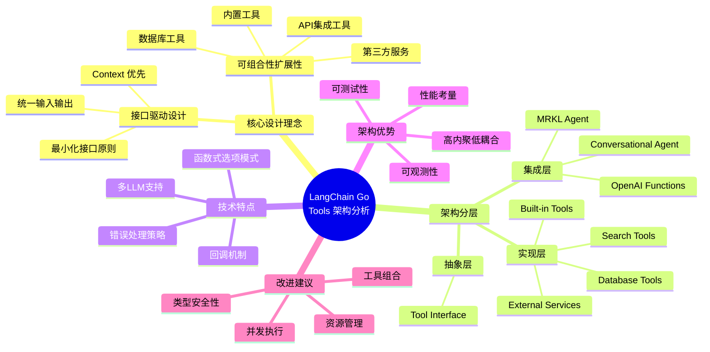
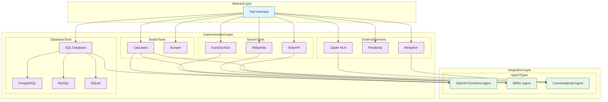
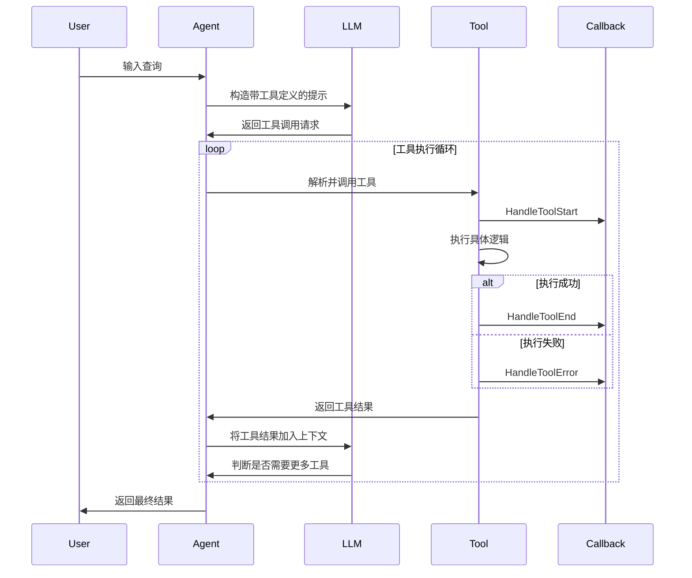
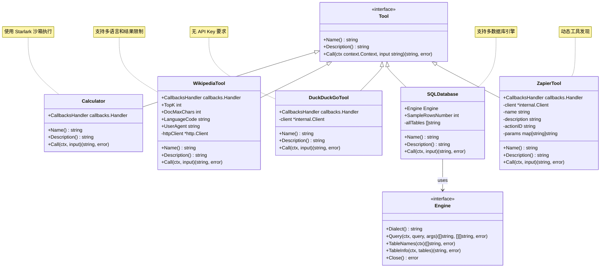
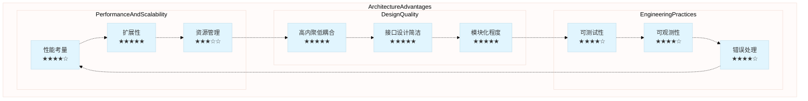
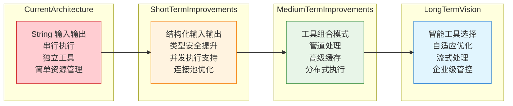

# LangChain Go Tools 模块架构分析

## 概述

从架构师角度分析，LangChain Go 的 tools 模块是一个设计精良的、符合 Go 语言习惯的工具系统，它为 AI Agent 提供了与外部应用程序交互的统一接口。该模块展现了优秀的接口设计、模块化架构和可扩展性。

## 分析框架总览



## 核心设计理念

### 1. 接口驱动的设计（Interface-Driven Design）

```go
// 核心接口定义 - 简洁而强大
type Tool interface {
    Name() string
    Description() string
    Call(ctx context.Context, input string) (string, error)
}
```

**设计亮点：**
- **最小化接口原则**：仅包含必要的 3 个方法，遵循 Go 的小接口设计哲学
- **context.Context 优先**：Call 方法接受 context，支持取消、超时和追踪
- **统一的输入输出**：使用 string 类型简化了不同工具间的数据交换
- **自描述性**：Name 和 Description 方法使工具具备自我描述能力

### 2. 可组合性和扩展性

工具系统支持多种扩展模式：
- **内置工具**：Calculator、Wikipedia、DuckDuckGo 等
- **API 集成工具**：SerpAPI、Perplexity、Metaphor
- **数据库工具**：SQL Database 工具支持多种数据库引擎
- **第三方服务**：Zapier NLA 集成
- **自定义工具**：通过实现 Tool 接口轻松扩展

## 架构分层

### 整体架构图



## 技术架构特点

### 1. 函数式选项模式（Functional Options Pattern）

多数工具都采用了函数式选项模式，符合 Go 生态的最佳实践：

```go
// 以 Wikipedia 工具为例
func New(opts ...Option) (*Tool, error)

type Option func(*Tool)

func WithHTTPClient(client *http.Client) Option {
    return func(t *Tool) {
        t.httpClient = client
    }
}
```

**优势：**
- **向后兼容**：新增选项不会破坏现有代码
- **可读性强**：选项命名清晰表达意图
- **类型安全**：编译时检查选项类型

### 2. 错误处理策略

工具系统采用显式错误处理，符合 Go 语言习惯：

```go
// Calculator 工具的错误处理示例
func (c Calculator) Call(ctx context.Context, input string) (string, error) {
    v, err := starlark.Eval(&starlark.Thread{Name: "main"}, "input", input, math.Module.Members)
    if err != nil {
        // 将错误转换为字符串返回，让 Agent 有机会重试
        return fmt.Sprintf("error from evaluator: %s", err.Error()), nil
    }
    return v.String(), nil
}
```

**设计考量：**
- **错误恢复**：某些错误作为字符串返回而非 error，让 Agent 能够理解并重试
- **上下文保持**：错误信息保留足够上下文供 Agent 分析
- **渐进式失败**：避免单个工具失败导致整个 Agent 流程中断

### 3. 回调机制（Callback Pattern）

所有工具都支持回调处理，实现可观测性：

```go
type Calculator struct {
    CallbacksHandler callbacks.Handler
}

func (c Calculator) Call(ctx context.Context, input string) (string, error) {
    if c.CallbacksHandler != nil {
        c.CallbacksHandler.HandleToolStart(ctx, input)
    }
    // ... 执行逻辑
    if c.CallbacksHandler != nil {
        c.CallbacksHandler.HandleToolEnd(ctx, result)
    }
    return result, nil
}
```

**回调支持：**
- **工具开始/结束**：HandleToolStart/HandleToolEnd
- **错误处理**：HandleToolError
- **链式组合**：CombiningHandler 支持多个回调处理器

## Agent 集成模式

### 工具调用流程图



### 多 LLM 提供商适配架构

```mermaid
graph LR
    subgraph "UnifiedToolInterface"
        UT[Tool Interface<br/>• Name()<br/>• Description()<br/>• Call()]
    end
    
    subgraph "LLMAdapterLayer"
        OAI_ADAPTER[OpenAI Adapter<br/>toolFromTool()]
        GOOGLE_ADAPTER[Google AI Adapter<br/>convertTools()]
        ANTHROPIC_ADAPTER[Anthropic Adapter<br/>toolsToTools()]
    end
    
    subgraph "LLMProviders"
        OAI_LLM[OpenAI<br/>Function Calling]
        GOOGLE_LLM[Google AI/Vertex<br/>Function Calling]
        ANTHROPIC_LLM[Anthropic Claude<br/>Tool Use]
    end
    
    UT --> OAI_ADAPTER
    UT --> GOOGLE_ADAPTER
    UT --> ANTHROPIC_ADAPTER
    
    OAI_ADAPTER --> OAI_LLM
    GOOGLE_ADAPTER --> GOOGLE_LLM
    ANTHROPIC_ADAPTER --> ANTHROPIC_LLM
    
    classDef toolInterface fill:#e1f5fe,stroke:#01579b
    classDef adapter fill:#fff3e0,stroke:#f57c00
    classDef llmProvider fill:#e8f5e8,stroke:#388e3c
    
    class UT toolInterface
    class OAI_ADAPTER,GOOGLE_ADAPTER,ANTHROPIC_ADAPTER adapter
    class OAI_LLM,GOOGLE_LLM,ANTHROPIC_LLM llmProvider
```

### OpenAI Functions Agent 集成

```go
// 工具转换为 OpenAI 函数定义
func (o *OpenAIFunctionsAgent) functions() []llms.FunctionDefinition {
    res := make([]llms.FunctionDefinition, 0)
    for _, tool := range o.Tools {
        res = append(res, llms.FunctionDefinition{
            Name:        tool.Name(),
            Description: tool.Description(),
            Parameters: map[string]any{
                "properties": map[string]any{
                    "__arg1": map[string]string{"title": "__arg1", "type": "string"},
                },
                "required": []string{"__arg1"},
                "type":     "object",
            },
        })
    }
    return res
}
```

### 工具调用解析

```go
// 解析 LLM 响应中的工具调用
func (o *OpenAIFunctionsAgent) ParseOutput(contentResp *llms.ContentResponse) (
    []schema.AgentAction, *schema.AgentFinish, error,
) {
    // 支持新式工具调用（带 ID）
    if len(choice.ToolCalls) > 0 {
        toolCall := choice.ToolCalls[0]
        return []schema.AgentAction{
            {
                Tool:      toolCall.FunctionCall.Name,
                ToolInput: toolCall.FunctionCall.Arguments,
                ToolID:    toolCall.ID,
                Log:       fmt.Sprintf("Invoking: %s with %s\n", toolCall.FunctionCall.Name, toolCall.FunctionCall.Arguments),
            },
        }, nil, nil
    }
    // 还支持传统函数调用模式...
}
```

## 具体工具实现分析

### 工具实现类图



### Calculator 工具

**技术特点：**
- 使用 Starlark 语言作为计算引擎
- 沙箱执行环境，安全性好
- 支持复杂数学表达式

**架构设计：**
```go
type Calculator struct {
    CallbacksHandler callbacks.Handler
}
```

### Search 工具家族

**DuckDuckGo、SerpAPI、Wikipedia** 等搜索工具共享相似的设计模式：
- HTTP 客户端可配置
- 结果格式化统一
- 错误处理一致

### Database 工具

**引擎抽象模式：**
```go
type Engine interface {
    Dialect() string
    Query(ctx context.Context, query string, args ...any) (cols []string, results [][]string, err error)
    TableNames(ctx context.Context) ([]string, error)
    TableInfo(ctx context.Context, tables string) (string, error)
    Close() error
}
```

**注册机制：**
```go
var engines = make(map[string]EngineFunc)

func RegisterEngine(name string, engineFunc EngineFunc) {
    engines[name] = engineFunc
}
```

### Zapier NLA 集成

**企业级集成模式：**
- 支持 OAuth 和 API Key 认证
- 动态工具发现（Toolkit 模式）
- 参数化工具配置

## 多 LLM 提供商支持

工具系统巧妙地处理了不同 LLM 提供商的工具调用差异：

### 提供商适配对比

```mermaid
graph TD
    subgraph "LangChainGoUnifiedTools"
        LCT[llms.Tool<br/>• Type: string<br/>• Function: *FunctionDefinition<br/>  - Name: string<br/>  - Description: string<br/>  - Parameters: any]
    end
    
    subgraph "OpenAIFormat"
        OAI_TOOL[openaiclient.Tool<br/>• Type: ToolType<br/>• Function: FunctionDefinition<br/>  - Name: string<br/>  - Description: string<br/>  - Parameters: any<br/>  - Strict: bool]
    end
    
    subgraph "GoogleAIFormat"
        GOOGLE_TOOL[genai.Tool<br/>• FunctionDeclarations: []FunctionDeclaration<br/>  - Name: string<br/>  - Description: string<br/>  - Parameters: *Schema]
    end
    
    subgraph "AnthropicFormat"
        ANTHROPIC_TOOL[anthropicclient.Tool<br/>• Name: string<br/>• Description: string<br/>• InputSchema: any]
    end
    
    LCT -->|toolFromTool| OAI_TOOL
    LCT -->|convertTools| GOOGLE_TOOL
    LCT -->|toolsToTools| ANTHROPIC_TOOL
    
    classDef unified fill:#e1f5fe,stroke:#01579b
    classDef provider fill:#fff3e0,stroke:#f57c00
    
    class LCT unified
    class OAI_TOOL,GOOGLE_TOOL,ANTHROPIC_TOOL provider
```

### OpenAI
```go
func toolFromTool(t llms.Tool) (openaiclient.Tool, error) {
    return openaiclient.Tool{
        Type: openaiclient.ToolType(t.Type),
        Function: openaiclient.FunctionDefinition{
            Name:        t.Function.Name,
            Description: t.Function.Description,
            Parameters:  t.Function.Parameters,
        },
    }, nil
}
```

### Google AI / Vertex AI
```go
func convertTools(tools []llms.Tool) ([]*genai.Tool, error) {
    // 将 langchaingo 工具转换为 Google AI 格式
    // 处理参数 schema 映射
    // 支持类型转换
}
```

### Anthropic
```go
func toolsToTools(tools []llms.Tool) []anthropicclient.Tool {
    toolReq := make([]anthropicclient.Tool, len(tools))
    for i, tool := range tools {
        toolReq[i] = anthropicclient.Tool{
            Name:        tool.Function.Name,
            Description: tool.Function.Description,
            InputSchema: tool.Function.Parameters,
        }
    }
    return toolReq
}
```

## 架构优势

### 系统优势雷达图



### 核心优势详述
#### 1. 高内聚、低耦合
- 每个工具都是独立的模块
- 工具间没有直接依赖
- 通过统一接口组合

#### 2. 可测试性
- 接口易于 Mock
- HTTP 客户端可注入
- 支持集成测试

#### 3. 可观测性
- 全面的回调支持
- 结构化日志
- 错误追踪

#### 4. 性能考量
- Context 支持取消和超时
- HTTP 客户端复用
- 资源管理清晰

## 架构挑战与改进建议

### 改进路线图



### 具体改进建议
#### 1. 类型安全性
**现状**：工具输入输出都是 string 类型
**建议**：考虑支持结构化输入输出，提高类型安全性

#### 2. 并发执行
**现状**：工具串行执行
**建议**：支持并行工具执行，提高性能

#### 3. 工具组合
**现状**：工具相对独立
**建议**：支持工具管道和组合模式

#### 4. 资源管理
**现状**：工具生命周期管理较简单
**建议**：增强资源池和连接管理

## 总结

LangChain Go 的 tools 模块展现了优秀的 Go 语言架构设计：

1. **接口设计精简而强大**，符合 Go 的小接口哲学
2. **模块化程度高**，每个工具都是独立可替换的组件
3. **扩展性优秀**，支持多种工具类型和集成模式
4. **与 Agent 系统深度集成**，支持多种 LLM 提供商
5. **工程实践成熟**，包含完整的错误处理、回调机制和测试支持

这个架构为构建强大的 AI Agent 系统提供了坚实的基础，是 Go 语言在 AI 领域的优秀实践案例。工具系统的设计思路不仅适用于 LLM 应用，对其他需要插件化架构的系统也有很好的参考价值。
