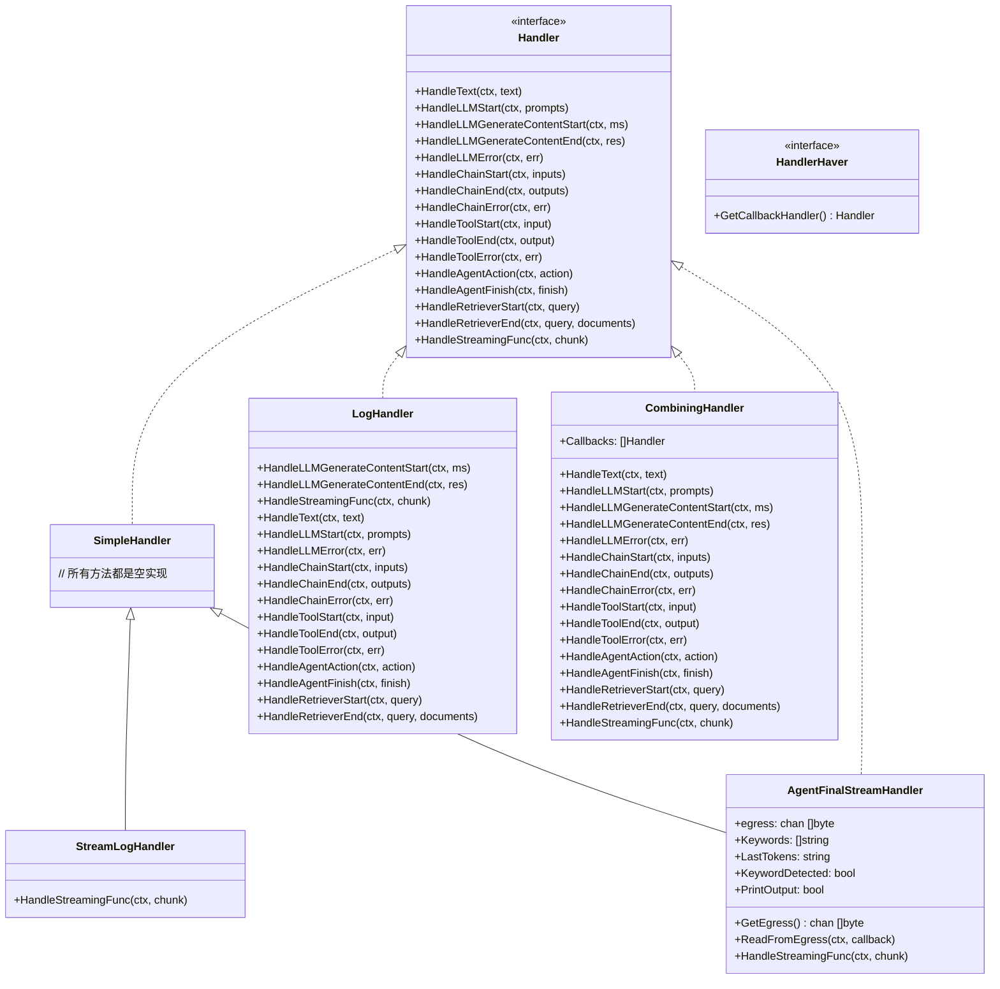
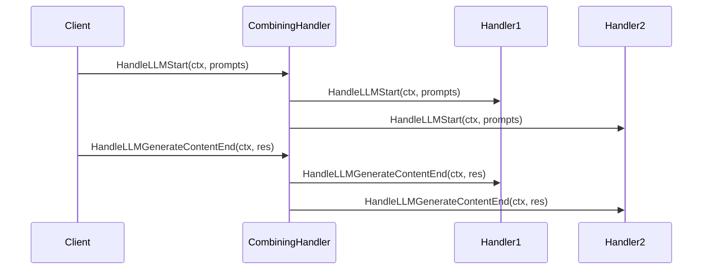
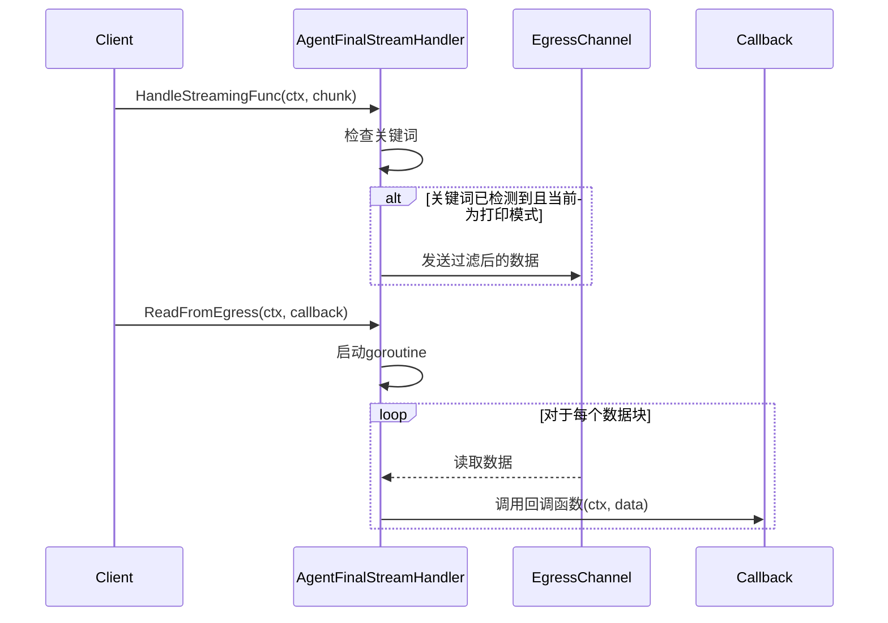

# LangChainGo Callbacks 包分析

## 1. 概述

LangChainGo 的 `callbacks` 包提供了一个标准接口，用于在 LLM 应用程序的各个阶段进行钩子处理。该包包含了这个接口的多种实现，允许开发者在 LLM 应用程序的不同阶段（如 LLM 调用开始/结束、链处理开始/结束、工具使用开始/结束等）执行自定义操作。

## 2. 核心接口与结构

### 2.1 Handler 接口

`Handler` 接口是 callbacks 包的核心，定义了在 LLM 应用程序的各个阶段可以钩入的方法：

```go
type Handler interface {
	HandleText(ctx context.Context, text string)
	HandleLLMStart(ctx context.Context, prompts []string)
	HandleLLMGenerateContentStart(ctx context.Context, ms []llms.MessageContent)
	HandleLLMGenerateContentEnd(ctx context.Context, res *llms.ContentResponse)
	HandleLLMError(ctx context.Context, err error)
	HandleChainStart(ctx context.Context, inputs map[string]any)
	HandleChainEnd(ctx context.Context, outputs map[string]any)
	HandleChainError(ctx context.Context, err error)
	HandleToolStart(ctx context.Context, input string)
	HandleToolEnd(ctx context.Context, output string)
	HandleToolError(ctx context.Context, err error)
	HandleAgentAction(ctx context.Context, action schema.AgentAction)
	HandleAgentFinish(ctx context.Context, finish schema.AgentFinish)
	HandleRetrieverStart(ctx context.Context, query string)
	HandleRetrieverEnd(ctx context.Context, query string, documents []schema.Document)
	HandleStreamingFunc(ctx context.Context, chunk []byte)
}
```

### 2.2 HandlerHaver 接口

`HandlerHaver` 接口用于获取回调处理器：

```go
type HandlerHaver interface {
	GetCallbackHandler() Handler
}
```

## 3. 实现类

### 3.1 SimpleHandler

`SimpleHandler` 是 `Handler` 接口的基本实现，所有方法都是空操作（no-op）。它可以作为其他处理器的基类，或在只需要实现部分回调方法时使用。

```go
type SimpleHandler struct{}
```

### 3.2 LogHandler

`LogHandler` 实现了 `Handler` 接口，将各种回调事件打印到标准输出。

```go
type LogHandler struct{}
```

主要功能：
- 记录 LLM 调用的输入和输出
- 记录链处理的输入和输出
- 记录工具使用的输入和输出
- 记录代理操作和完成情况
- 记录检索器的查询和结果

### 3.3 StreamLogHandler

`StreamLogHandler` 继承自 `SimpleHandler`，专门用于处理流式数据的输出。

```go
type StreamLogHandler struct {
	SimpleHandler
}
```

### 3.4 CombiningHandler

`CombiningHandler` 允许组合多个处理器，当调用其方法时，会依次调用所有注册的处理器的相应方法。

```go
type CombiningHandler struct {
	Callbacks []Handler
}
```

### 3.5 AgentFinalStreamHandler

`AgentFinalStreamHandler` 是一个特殊的处理器，用于处理代理的最终输出流。它会检测特定的关键词（如 "Final Answer:"），并只输出关键词后的内容。

```go
type AgentFinalStreamHandler struct {
	SimpleHandler
	egress          chan []byte
	Keywords        []string
	LastTokens      string
	KeywordDetected bool
	PrintOutput     bool
}
```

主要功能：
- 检测代理输出中的特定关键词
- 过滤输出，只保留关键词后的内容
- 通过 egress 通道提供过滤后的输出

## 4. 类图



## 5. 序列图

### 5.1 CombiningHandler 处理流程



### 5.2 AgentFinalStreamHandler 处理流程



## 6. 设计模式

### 6.1 观察者模式

`callbacks` 包实现了观察者模式，其中：
- LLM 应用程序的各个组件（如 LLM、链、工具、代理等）是被观察者
- `Handler` 接口的实现类是观察者
- 当被观察者的状态发生变化时（如开始执行、结束执行、发生错误等），会通知观察者

### 6.2 组合模式

`CombiningHandler` 实现了组合模式，允许将多个处理器组合成一个处理器，客户端代码可以一致地处理单个处理器和组合处理器。

### 6.3 模板方法模式

`SimpleHandler` 提供了 `Handler` 接口所有方法的默认空实现，子类可以选择性地覆盖某些方法，而不必实现所有方法。这是模板方法模式的一种变体。

### 6.4 装饰器模式

`AgentFinalStreamHandler` 在某种程度上实现了装饰器模式，它扩展了基本的流处理功能，添加了关键词检测和过滤的能力。

## 7. 最佳实践

### 7.1 使用 SimpleHandler 作为基类

当你只需要实现 `Handler` 接口的部分方法时，可以继承 `SimpleHandler`，这样你只需要覆盖你关心的方法，而不必实现所有方法。

```go
type MyHandler struct {
    callbacks.SimpleHandler
}

func (h MyHandler) HandleLLMStart(ctx context.Context, prompts []string) {
    // 自定义实现
}
```

### 7.2 组合多个处理器

使用 `CombiningHandler` 可以组合多个处理器，例如同时使用日志处理器和自定义处理器：

```go
handler := callbacks.CombiningHandler{
    Callbacks: []callbacks.Handler{
        callbacks.LogHandler{},
        MyHandler{},
    },
}
```

### 7.3 处理流式输出

对于流式输出，可以使用 `StreamLogHandler` 或 `AgentFinalStreamHandler`：

```go
// 简单的流式日志
streamHandler := callbacks.StreamLogHandler{}

// 或者使用代理最终输出处理器
finalHandler := callbacks.NewFinalStreamHandler()
finalHandler.ReadFromEgress(ctx, func(ctx context.Context, chunk []byte) {
    fmt.Print(string(chunk))
})
```

## 8. 总结

LangChainGo 的 `callbacks` 包提供了一个灵活的回调机制，允许开发者在 LLM 应用程序的各个阶段执行自定义操作。通过实现 `Handler` 接口或继承现有的处理器类，开发者可以轻松地添加日志记录、监控、调试等功能。

该包的设计遵循了多种设计模式，如观察者模式、组合模式、模板方法模式和装饰器模式，使其既灵活又易于扩展。通过组合不同的处理器，开发者可以构建复杂的回调处理逻辑，满足各种应用场景的需求。