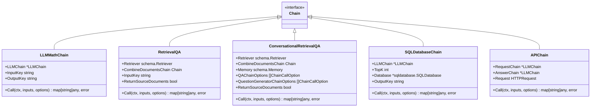

# LangChainGo Chains 包架构分析

## 概述

LangChainGo 的 `chains` 包提供了一系列链式组件，用于构建复杂的语言处理流程。链（Chain）是 LangChainGo 的核心概念之一，它允许将多个组件（如 LLM、提示模板、内存等）组合在一起，形成一个完整的处理流程。

## 包的组织与项目地位

### 包的组织方式

`chains` 包是 LangChainGo 项目的核心包之一，它的代码组织遵循以下结构：

1. **核心接口与功能**：
   - `chains.go`：定义了 `Chain` 接口和核心功能函数（`Call`、`Run`、`Predict`、`Apply`）
   - `errors.go`：定义了链相关的错误类型
   - `options.go`：定义了链调用的选项参数

2. **基础链实现**：
   - `llm.go`：实现了 `LLMChain`，这是最基础的链类型，直接与语言模型交互
   - `transform.go`：实现了 `Transform` 链，用于执行任意转换逻辑
   - `sequential.go`：实现了 `SequentialChain` 和 `SimpleSequentialChain`，用于按顺序执行多个链

3. **文档处理链**：
   - `stuff_documents.go`：实现了 `StuffDocuments` 链，将多个文档合并后处理
   - `refine_documents.go`：实现了 `RefineDocuments` 链，通过迭代细化处理文档
   - `map_reduce.go`：实现了 `MapReduceDocuments` 链，并行处理文档后合并结果
   - `map_rerank_documents.go`：实现了 `MapRerankDocuments` 链，对文档处理结果进行排序

4. **特定任务链**：
   - `retrieval_qa.go`：实现了 `RetrievalQA` 链，结合检索和问答功能
   - `sql_database.go`：实现了 `SQLDatabaseChain` 链，用于SQL数据库交互
   - `api.go`：实现了 `APIChain` 链，用于API调用
   - `llm_math.go`：实现了 `LLMMathChain` 链，用于数学计算
   - `conversation.go`：实现了会话链，用于管理对话

5. **辅助功能**：
   - `question_answering.go`：提供了加载不同问答链的函数
   - `summarization.go`：提供了加载不同摘要链的函数
   - `prompt_selector.go`：用于选择适当的提示模板

### 在项目中的地位

`chains` 包在 LangChainGo 项目中占据核心地位，它是连接各种组件的枢纽：

1. **连接底层与应用层**：链将底层的语言模型（`llms` 包）、提示模板（`prompts` 包）、内存（`memory` 包）等组件连接起来，形成可用的应用层组件。

2. **提供标准接口**：通过 `Chain` 接口，提供了统一的调用方式，使得不同类型的链可以互相组合，形成更复杂的处理流程。

3. **支持高级应用**：链是构建代理（`agents` 包）等高级应用的基础，代理通常会使用链来执行具体的任务。

4. **实现核心功能**：LangChainGo 的许多核心功能，如问答、摘要、对话等，都是通过不同类型的链来实现的。

### 设计理念

`chains` 包的设计体现了以下理念：

1. **组合优于继承**：通过组合不同的链，可以构建复杂的处理流程，而不是通过继承来扩展功能。

2. **接口分离**：通过 `Chain` 接口，将链的行为与实现分离，使得不同类型的链可以互相替换。

3. **并行处理**：对于处理大量数据的场景，如 `MapReduceDocuments`，采用并行处理的方式提高效率。

4. **内存管理**：每个链都可以有自己的内存，用于存储上下文信息，支持有状态的处理流程。

5. **可扩展性**：通过实现 `Chain` 接口，可以轻松添加新的链类型，扩展系统功能。

## 核心接口与组件

### Chain 接口

`Chain` 是所有链的基础接口，定义了链的基本行为：

- `Call`: 执行链的逻辑并返回输出
- `GetMemory`: 获取链的内存
- `GetInputKeys`: 返回链期望的输入键
- `GetOutputKeys`: 返回链返回的输出键

### 核心功能函数

- `Call`: 执行链并返回输出，处理内存和回调
- `Run`: 简化版的 Call，接受单个输入并返回单个字符串输出
- `Predict`: 类似于 Run，但接受多个输入
- `Apply`: 并行执行链，处理多个输入并返回多个输出

## 文档处理链

### StuffDocuments

将多个文档合并成一个字符串，然后传递给 LLMChain 处理。

### RefineDocuments

迭代处理文档，每次使用一个文档和之前的结果来细化答案。

### MapReduceDocuments

对每个文档应用 LLMChain，然后使用 ReduceChain 合并结果。

### MapRerankDocuments

对每个文档应用 LLMChain，然后根据评分对结果进行排序。

## 特定任务链

### LLMMathChain

使用 LLM 解析数学表达式并计算结果。这个链首先使用 LLM 将自然语言数学问题转换为可执行的表达式，然后使用 Go 的 `eval` 函数计算结果。

### RetrievalQA

结合检索器和文档处理链，实现基于检索的问答。这个链首先使用检索器获取相关文档，然后将文档和查询传递给文档处理链（如 `StuffDocuments`）生成答案。

### ConversationalRetrievalQA

在 `RetrievalQA` 的基础上增加了对话历史管理功能，能够处理依赖于上下文的问题。它使用问题生成器根据当前问题和对话历史生成独立的查询，然后使用检索器和文档处理链生成答案。

### SQLDatabaseChain

使用 LLM 将自然语言转换为 SQL 查询，并返回查询结果。这个链首先使用 LLM 生成 SQL 查询，然后执行查询，最后将查询结果和原始问题一起传递给 LLM 生成最终答案。

### APIChain

使用 LLM 生成 API 请求，并解析 API 响应。这个链包含两个 `LLMChain`：一个用于生成 API 请求，另一个用于解析 API 响应并生成最终答案。

## 内存管理

### Memory 接口

`Memory` 接口定义了链的内存管理功能，用于存储和检索对话历史。

### Simple

一个简单的内存实现，不做任何操作，用作默认内存。

### ConversationBuffer

存储对话历史的内存实现，可以返回消息或缓冲字符串。

### ChatMessageHistory

存储聊天消息的历史记录，支持添加 AI 消息和用户消息。

## 总结

LangChainGo 的 `chains` 包是整个框架的核心组件之一，它提供了丰富的链式组件，用于构建复杂的语言处理流程。通过组合不同的链，可以实现各种复杂的任务，如问答、摘要、数学计算、SQL 查询等。

### 核心价值

1. **模块化设计**：`chains` 包采用模块化设计，每个链都专注于特定的功能，可以独立使用，也可以组合使用。

2. **灵活组合**：通过 `Chain` 接口的统一抽象，不同类型的链可以灵活组合，形成复杂的处理流程。例如，`SequentialChain` 可以将多个链按顺序执行，`MapReduceDocuments` 可以并行处理文档后合并结果。

3. **状态管理**：通过内存管理机制，链可以保持对话状态，支持有状态的处理流程，这对于构建对话系统尤为重要。

4. **并发处理**：对于处理大量数据的场景，如 `MapReduceDocuments`，采用并行处理的方式提高效率，充分利用 Go 语言的并发特性。

### 设计理念

`chains` 包的设计体现了以下理念：

1. **组合优于继承**：通过组合不同的链，可以构建复杂的处理流程，而不是通过继承来扩展功能。

2. **接口分离**：通过 `Chain` 接口，将链的行为与实现分离，使得不同类型的链可以互相替换。

3. **单一职责**：每个链都专注于特定的功能，遵循单一职责原则，使得代码更易于理解和维护。

4. **可扩展性**：通过实现 `Chain` 接口，可以轻松添加新的链类型，扩展系统功能。

### 在项目中的地位

`chains` 包在 LangChainGo 项目中占据核心地位，它是连接各种组件的枢纽：

1. **连接底层与应用层**：链将底层的语言模型（`llms` 包）、提示模板（`prompts` 包）、内存（`memory` 包）等组件连接起来，形成可用的应用层组件。

2. **提供标准接口**：通过 `Chain` 接口，提供了统一的调用方式，使得不同类型的链可以互相组合，形成更复杂的处理流程。

3. **支持高级应用**：链是构建代理（`agents` 包）等高级应用的基础，代理通常会使用链来执行具体的任务。

4. **实现核心功能**：LangChainGo 的许多核心功能，如问答、摘要、对话等，都是通过不同类型的链来实现的。

总之，`chains` 包是 LangChainGo 的核心组件，它通过提供丰富的链式组件和统一的接口，使得开发者可以轻松构建复杂的语言处理流程，实现各种基于 LLM 的应用。

4. **实现核心功能**：LangChainGo 的许多核心功能，如问答、摘要、对话等，都是通过不同类型的链来实现的。

总之，`chains` 包是 LangChainGo 的核心组件，它通过提供丰富的链式组件和统一的接口，使得开发者可以轻松构建复杂的语言处理流程，实现各种基于 LLM 的应用。

> 注：完整的用例示例请参考 [chains_examples.md](chains_examples.md) 文件。