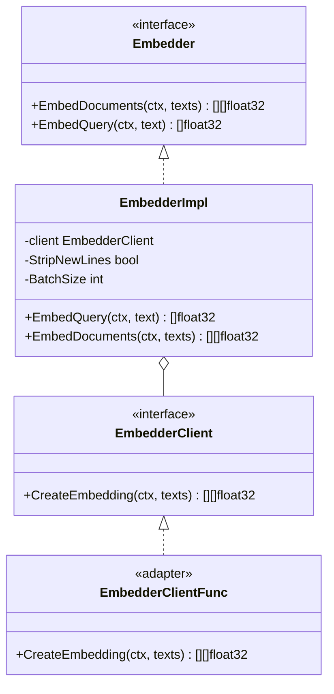
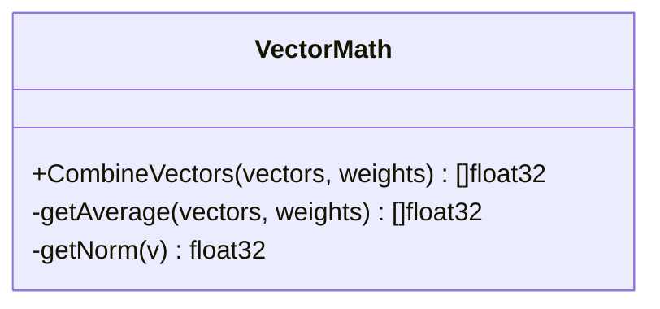
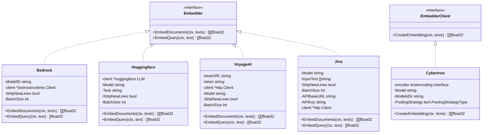
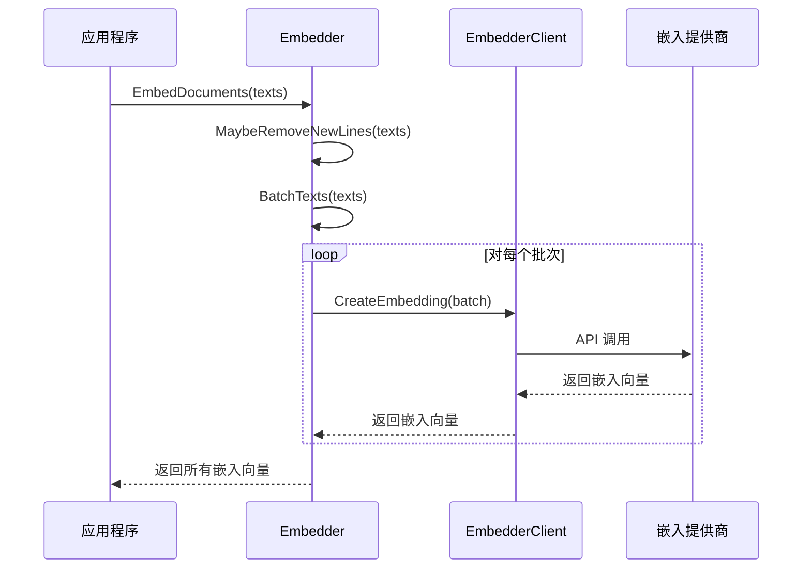
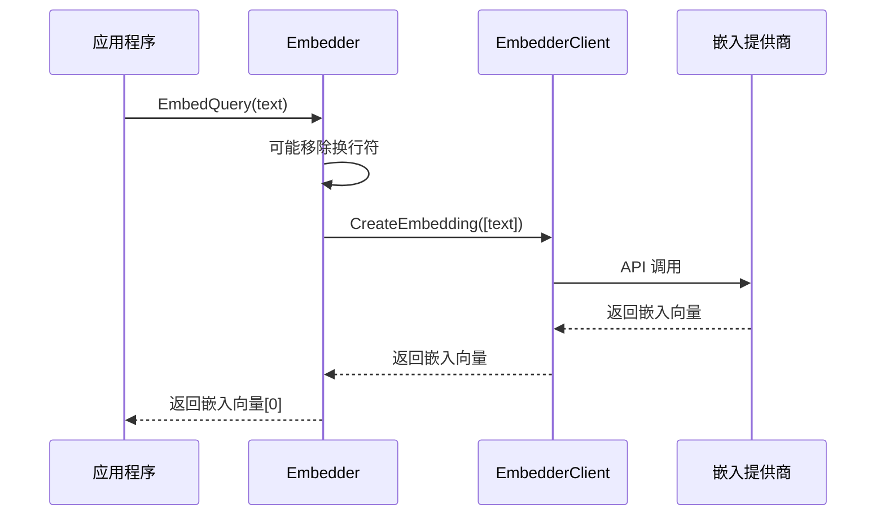
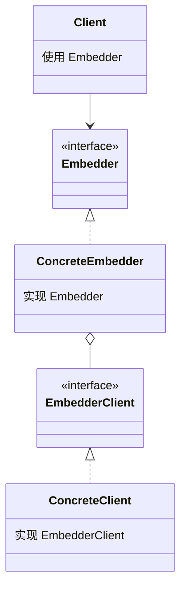

# LangChainGo Embeddings 包分析

## 1. 概述

`embeddings` 包是 LangChainGo 中用于创建文本向量嵌入的核心组件，它提供了一个统一的接口来使用不同的嵌入模型提供商。向量嵌入是将文本转换为数值向量的过程，这些向量可以用于语义搜索、文档相似度比较等任务。

## 2. 核心接口与结构

### 2.1 核心接口



- **Embedder 接口**：定义了创建向量嵌入的核心方法
  - `EmbedDocuments`：为多个文本创建向量嵌入
  - `EmbedQuery`：为单个查询文本创建向量嵌入

- **EmbedderClient 接口**：由各种 LLM 客户端实现的接口
  - `CreateEmbedding`：为文本列表创建向量嵌入

- **EmbedderImpl**：`Embedder` 接口的默认实现
  - 封装了一个 `EmbedderClient`
  - 提供了批处理和新行处理等功能

- **EmbedderClientFunc**：函数适配器，允许将普通函数用作 `EmbedderClient`

### 2.2 辅助函数

- `NewEmbedder`：创建一个新的 `EmbedderImpl` 实例
- `MaybeRemoveNewLines`：根据配置可能移除文本中的换行符
- `BatchTexts`：将文本列表分割成批次
- `BatchedEmbed`：批量创建嵌入

### 2.3 向量数学



- `CombineVectors`：组合多个向量，使用权重
- `getAverage`：计算加权平均值
- `getNorm`：计算向量的范数

## 3. 嵌入器实现

### 3.1 实现概览



### 3.2 AWS Bedrock

`bedrock` 包提供了使用 Amazon Bedrock 服务创建嵌入的功能。

**主要特点**：
- 支持多种模型提供商（Amazon、Cohere）
- 提供批处理功能
- 支持不同的输入类型（文本、查询）

**配置选项**：
- `WithModel`：设置模型 ID
- `WithClient`：提供自定义 Bedrock 客户端
- `WithStripNewLines`：是否移除换行符
- `WithBatchSize`：设置批处理大小

### 3.3 HuggingFace

`huggingface` 包提供了使用 HuggingFace 模型创建嵌入的功能。

**主要特点**：
- 使用 HuggingFace Hub API
- 支持不同的模型和任务
- 提供批处理功能

**配置选项**：
- `WithModel`：设置模型名称
- `WithTask`：设置任务类型
- `WithClient`：提供自定义 LLM 客户端
- `WithStripNewLines`：是否移除换行符
- `WithBatchSize`：设置批处理大小

### 3.4 VoyageAI

`voyageai` 包提供了使用 VoyageAI API 创建嵌入的功能。

**主要特点**：
- 支持文档和查询的不同嵌入方式
- 提供批处理功能
- 使用 REST API 与 VoyageAI 服务通信

**配置选项**：
- `WithModel`：设置模型名称
- `WithClient`：提供自定义 HTTP 客户端
- `WithToken`：设置 API 令牌
- `WithStripNewLines`：是否移除换行符
- `WithBatchSize`：设置批处理大小

### 3.5 Jina

`jina` 包提供了使用 Jina AI 服务创建嵌入的功能。

**主要特点**：
- 支持多种模型大小（small、base、large）
- 提供批处理功能
- 使用 REST API 与 Jina AI 服务通信

**配置选项**：
- `WithModel`：设置模型名称
- `WithStripNewLines`：是否移除换行符
- `WithBatchSize`：设置批处理大小
- `WithAPIBaseURL`：设置 API 基础 URL
- `WithAPIKey`：设置 API 密钥
- `WithClient`：提供自定义 HTTP 客户端

### 3.6 Cybertron

`cybertron` 包提供了使用本地运行的嵌入模型创建嵌入的功能。

**主要特点**：
- 在本地 CPU 上运行嵌入模型
- 自动下载和缓存模型
- 支持不同的池化策略

**配置选项**：
- `WithModel`：设置模型名称
- `WithModelsDir`：设置模型存储目录
- `WithPoolingStrategy`：设置池化策略
- `WithEncoder`：提供自定义编码器

## 4. 核心流程

### 4.1 嵌入创建流程



### 4.2 查询嵌入流程



## 5. 嵌入器比较

| 嵌入器 | 运行位置 | 主要特点 | 适用场景 |
|-------|---------|---------|----------|
| Bedrock | 云端 (AWS) | 支持多种模型提供商，集成 AWS 生态系统 | 需要企业级可靠性和扩展性的应用 |
| HuggingFace | 云端 | 支持大量开源模型，灵活性高 | 需要特定领域模型或多语言支持的应用 |
| VoyageAI | 云端 | 高质量嵌入，针对搜索优化 | 需要高质量语义搜索的应用 |
| Jina | 云端 | 多种模型大小，性能与资源平衡 | 需要平衡性能和成本的应用 |
| Cybertron | 本地 | 无需网络连接，隐私保护 | 对隐私敏感或需要离线运行的应用 |

## 6. 使用示例

### 6.1 基本使用

```go
// 创建一个 OpenAI 嵌入器
llm, err := openai.New()
if err != nil {
    log.Fatal(err)
}

// 从 LLM 创建一个新的 Embedder
embedder, err := embeddings.NewEmbedder(llm)
if err != nil {
    log.Fatal(err)
}

// 为多个文档创建嵌入
docs := []string{"doc 1", "another doc"}
embs, err := embedder.EmbedDocuments(context.Background(), docs)
if err != nil {
    log.Fatal(err)
}
```

### 6.2 使用 Bedrock

```go
// 创建一个 Bedrock 嵌入器
embedder, err := bedrock.NewBedrock(
    bedrock.WithModel(bedrock.ModelTitanEmbedG1),
    bedrock.WithBatchSize(10),
)
if err != nil {
    log.Fatal(err)
}

// 为查询创建嵌入
query := "What is machine learning?"
emb, err := embedder.EmbedQuery(context.Background(), query)
if err != nil {
    log.Fatal(err)
}
```

### 6.3 使用 HuggingFace

```go
// 创建一个 HuggingFace 嵌入器
embedder, err := huggingface.NewHuggingface(
    huggingface.WithModel("BAAI/bge-small-en-v1.5"),
    huggingface.WithTask("feature-extraction"),
)
if err != nil {
    log.Fatal(err)
}

// 为多个文档创建嵌入
docs := []string{"doc 1", "another doc"}
embs, err := embedder.EmbedDocuments(context.Background(), docs)
if err != nil {
    log.Fatal(err)
}
```

## 7. 设计模式与最佳实践

### 7.1 设计模式



**使用的设计模式**：

1. **策略模式**：`Embedder` 接口定义了嵌入策略，不同的实现提供不同的嵌入方法
2. **适配器模式**：`EmbedderClientFunc` 允许将普通函数适配为 `EmbedderClient` 接口
3. **工厂方法**：各种 `New*` 函数作为工厂方法创建嵌入器实例
4. **选项模式**：使用函数选项模式配置嵌入器

### 7.2 最佳实践

1. **接口分离**：将 `Embedder` 和 `EmbedderClient` 分开，允许更灵活的组合
2. **批处理**：自动将大量文本分批处理，避免超出 API 限制
3. **统一接口**：所有嵌入器实现相同的接口，便于切换
4. **可配置性**：使用选项模式提供灵活的配置
5. **错误处理**：详细的错误信息和适当的错误包装

## 8. 总结

LangChainGo 的 `embeddings` 包提供了一个强大而灵活的框架，用于创建文本的向量嵌入。它的主要优势包括：

1. **统一接口**：所有嵌入器实现相同的接口，便于切换和测试
2. **多种实现**：支持多种嵌入提供商，包括云服务和本地运行
3. **灵活配置**：使用选项模式提供灵活的配置
4. **批处理支持**：自动处理大量文本的批处理
5. **向量数学**：提供向量操作的辅助函数

这个包的设计使得开发者可以轻松地将向量嵌入集成到他们的应用程序中，无论是用于语义搜索、文档相似度比较还是其他需要文本向量表示的任务。