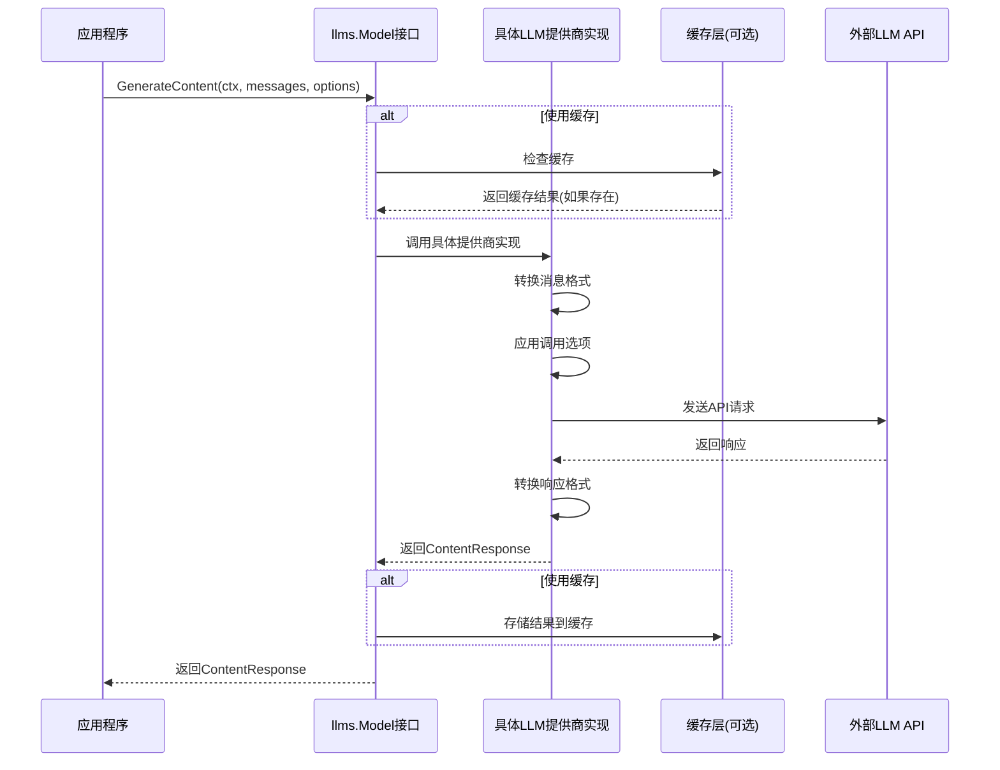
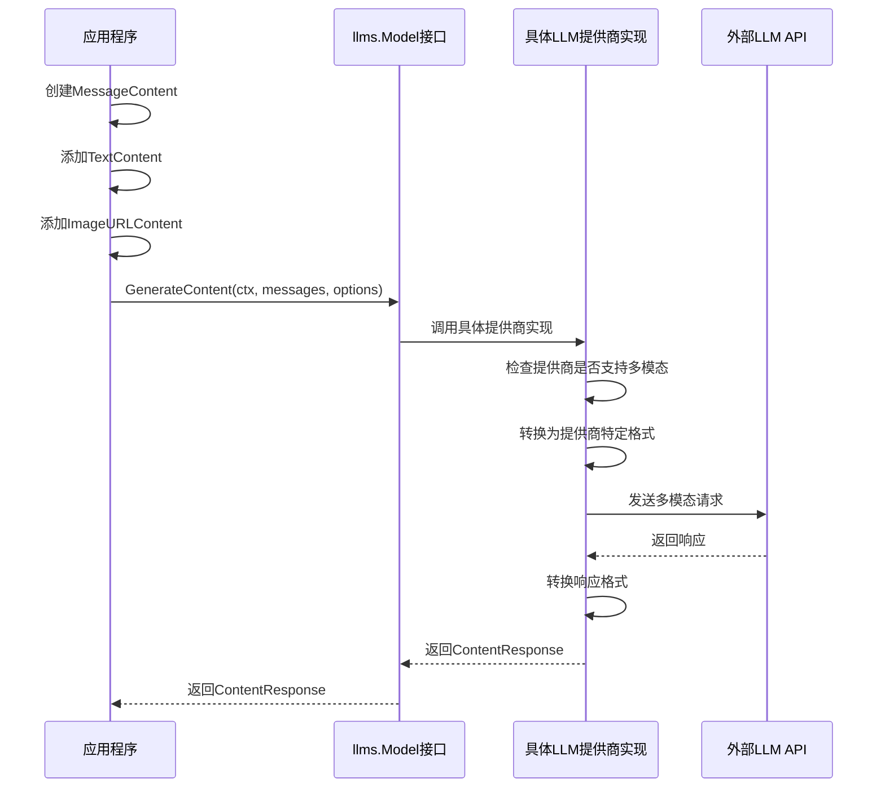
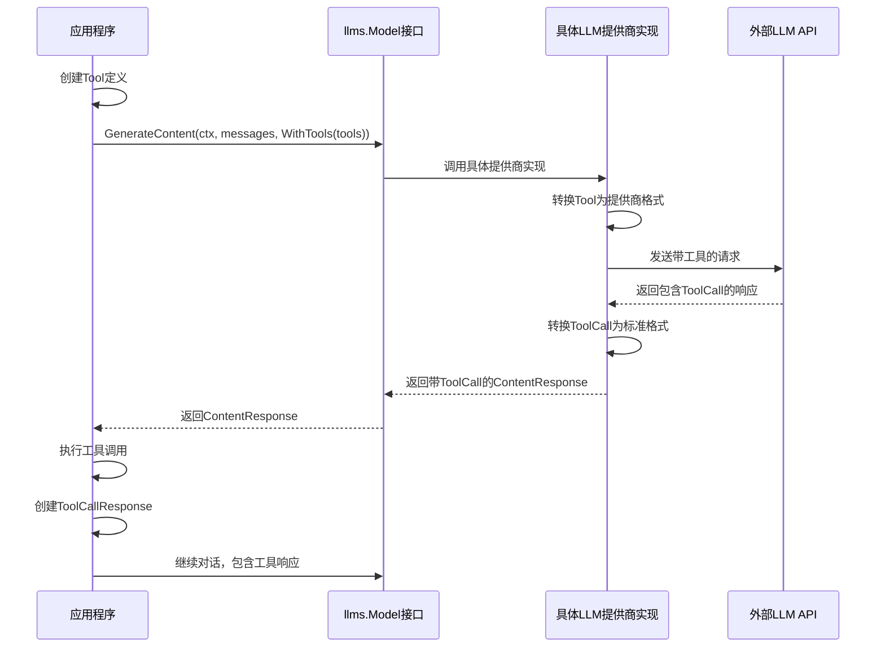
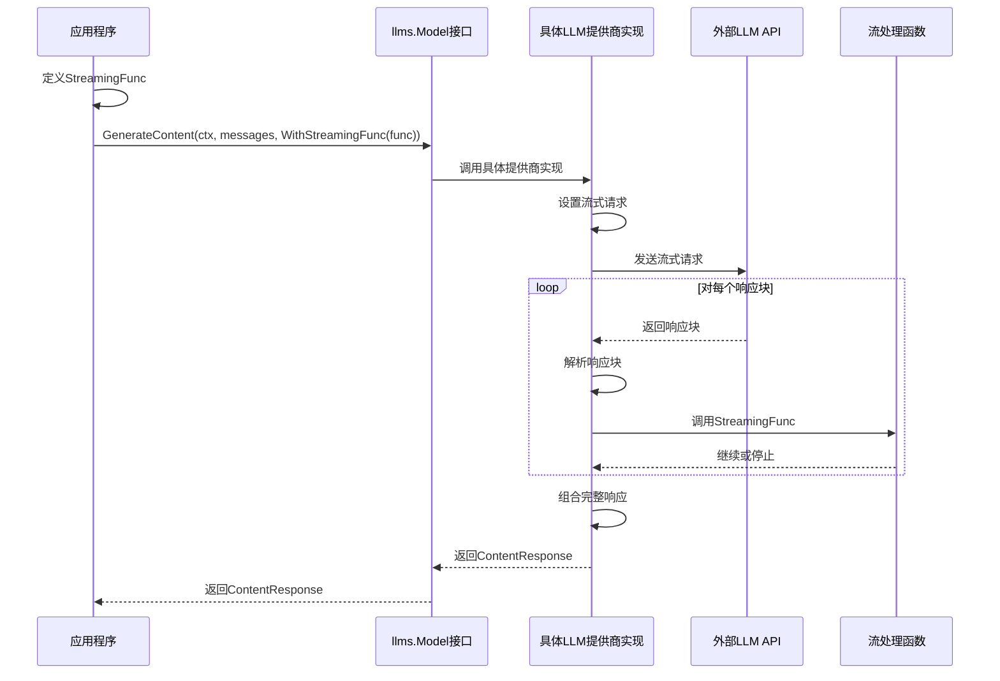
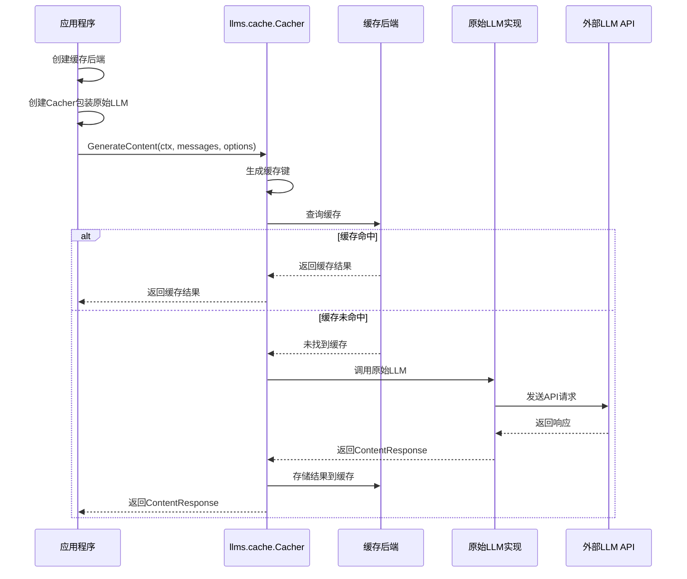
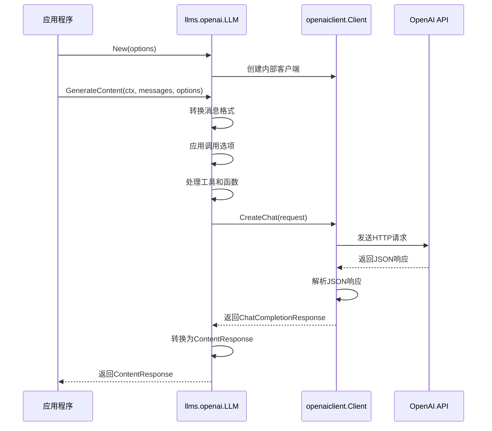

# LangChainGo llms 包流程分析

本文档通过泳道图分析 LangChainGo 中 llms 包的主要流程，以帮助理解其工作原理。

## 核心接口与结构

llms 包对外暴露的主要内容包括：

1. **Model 接口**：所有 LLM 提供商必须实现的核心接口
2. **MessageContent**：消息内容结构体，包含角色和内容部分
3. **ContentPart**：内容部分接口，有多种实现（文本、图像URL、二进制数据等）
4. **CallOptions**：调用选项，用于配置 LLM 调用的参数
5. **ChatMessage**：聊天消息接口，有多种实现（AI、人类、系统等）
6. **Tool 和 ToolCall**：工具和工具调用相关结构体
7. **ContentResponse**：LLM 响应结构体

## 基本调用流程泳道图

## 多模态内容处理流程

## 工具调用流程

## 流式响应处理流程

## 缓存机制流程

## 提供商实现流程

以 OpenAI 为例：

## 总结

LangChainGo 的 llms 包通过清晰的接口设计和灵活的结构，提供了统一的 LLM 调用方式，支持多模态内容、工具调用、流式响应和缓存机制。通过实现 Model 接口，可以轻松集成不同的 LLM 提供商，而应用程序只需要使用统一的 API 即可。

这种设计使得应用程序可以轻松切换不同的 LLM 提供商，而不需要修改大量代码，同时也方便添加新的功能和提供商支持。