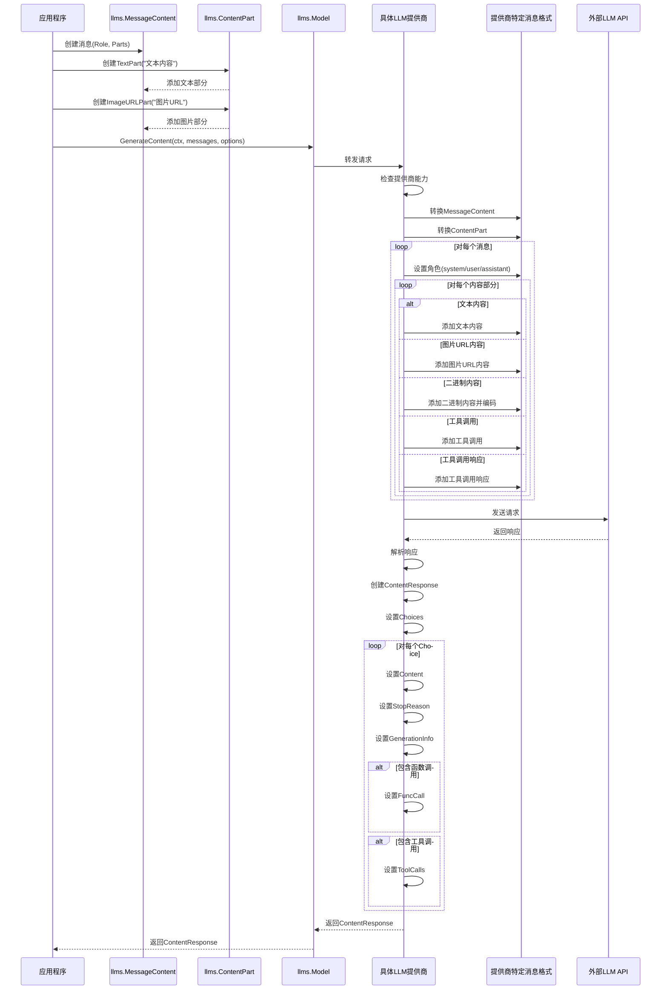
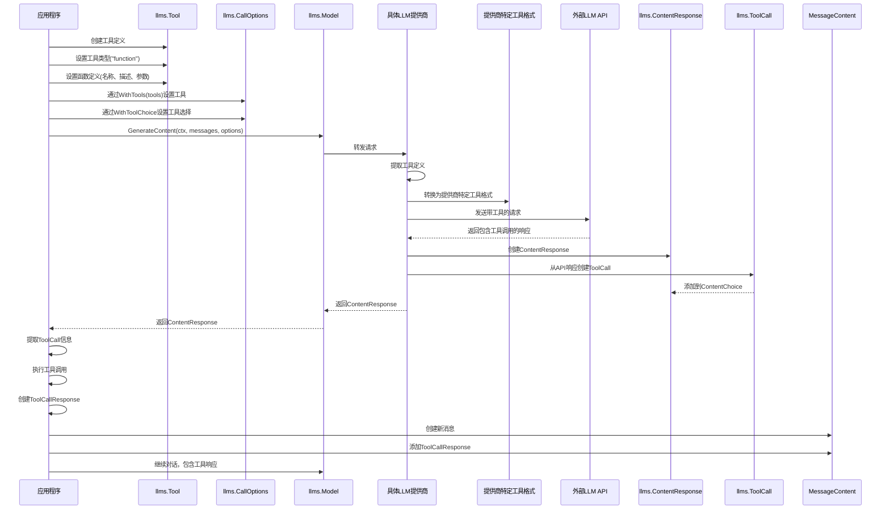
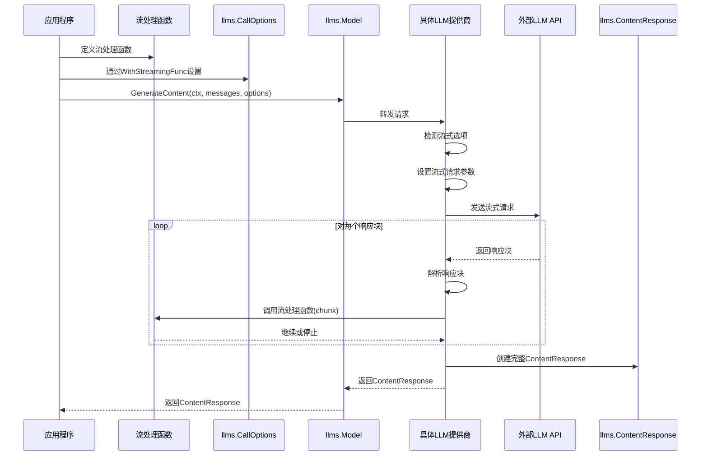
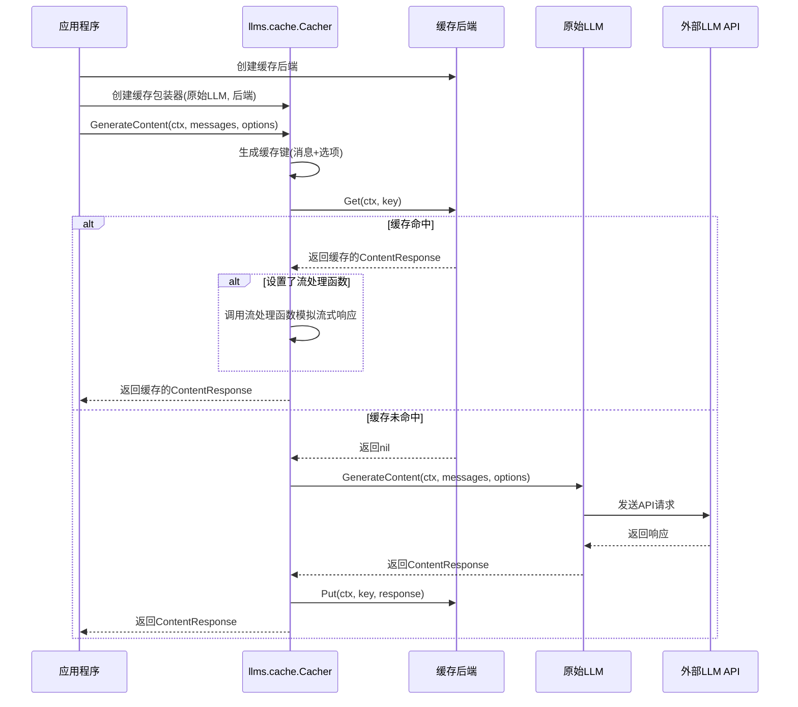
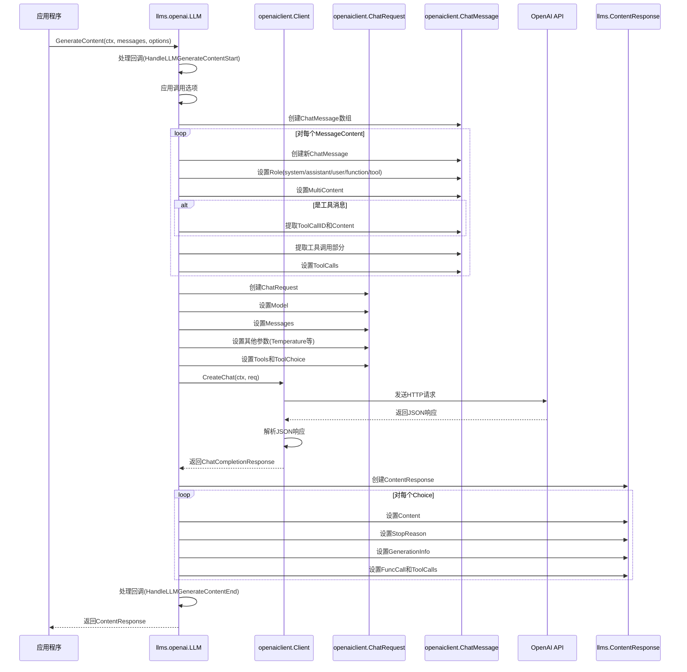

# LangChainGo llms 包消息处理流程

本文档通过泳道图分析 LangChainGo 中 llms 包的消息处理流程，以帮助理解其工作原理。

## 消息处理流程

## 工具调用处理流程

## 流式响应处理流程

## 缓存处理流程

## 提供商特定实现流程 (以OpenAI为例)

## 总结

LangChainGo 的 llms 包通过一系列结构化的流程处理消息、工具调用、流式响应和缓存。这些流程通过清晰的接口和抽象层次，使得不同的 LLM 提供商可以统一集成到框架中，同时保持各自的特性和功能。

通过这些泳道图，我们可以更清晰地理解 llms 包的工作原理，以及各个组件之间的交互关系。这有助于开发者更好地使用和扩展 LangChainGo 框架。