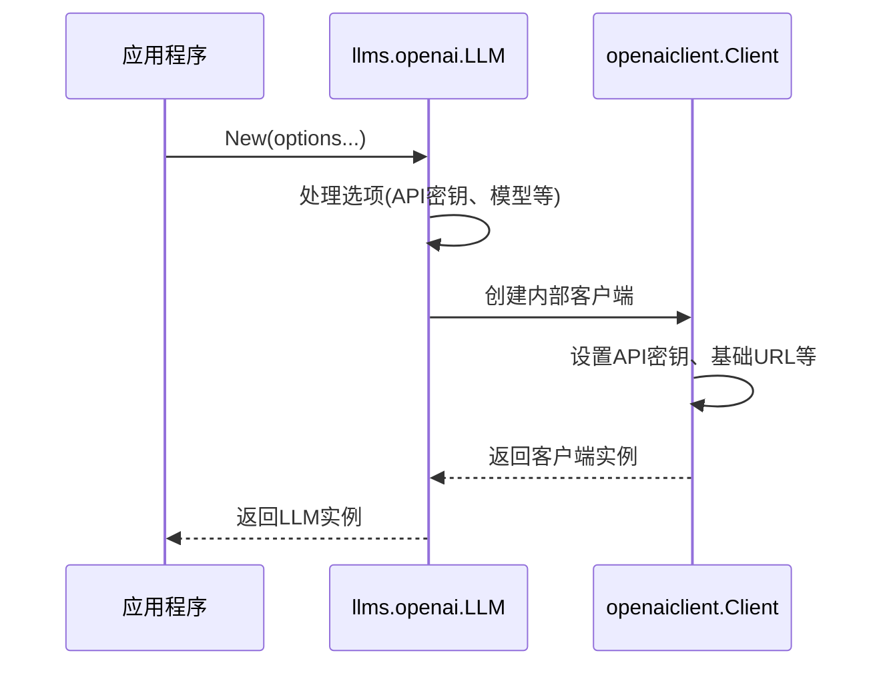
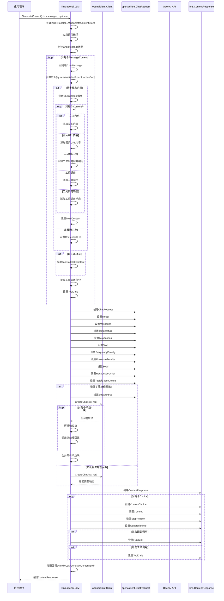
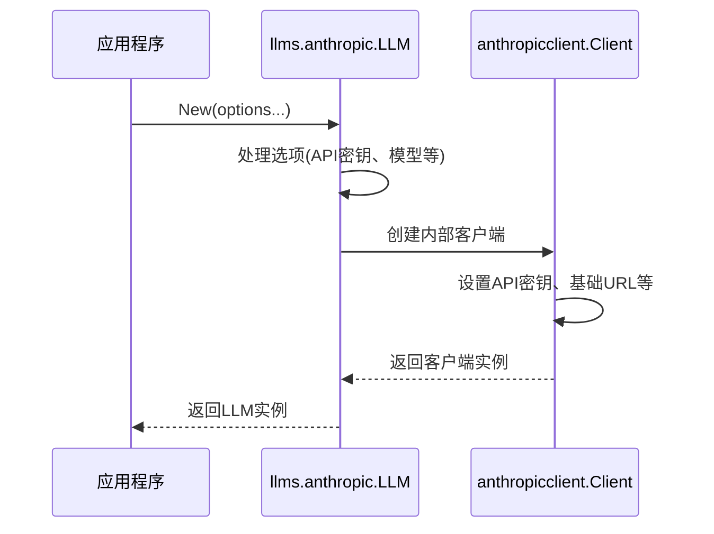
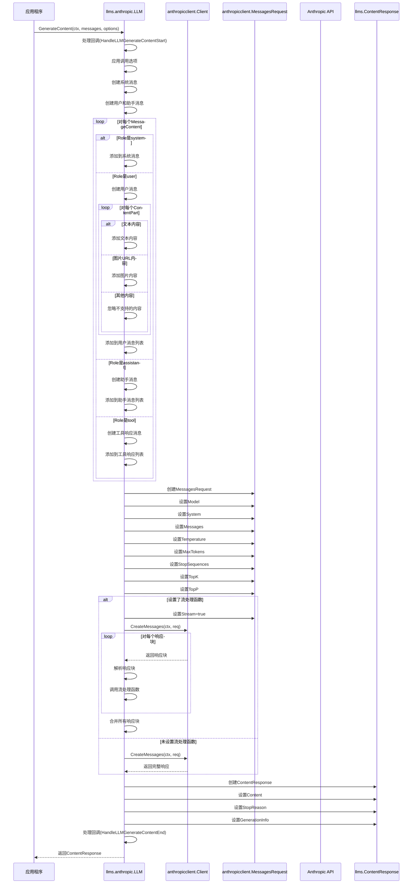
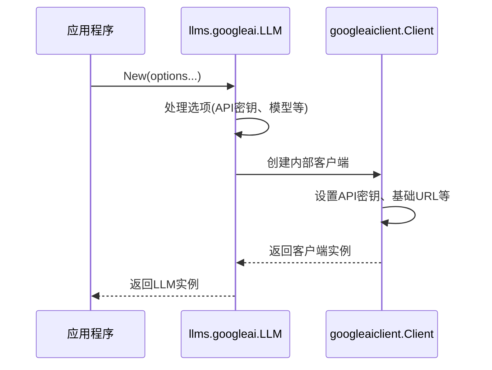
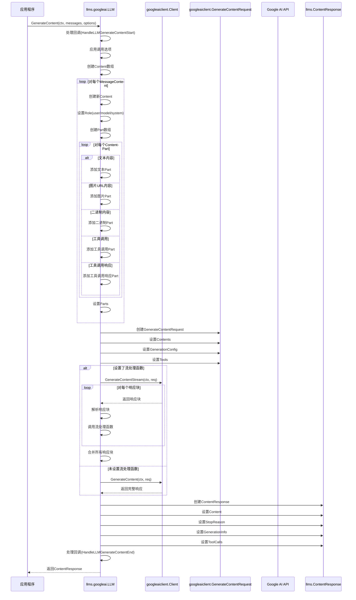
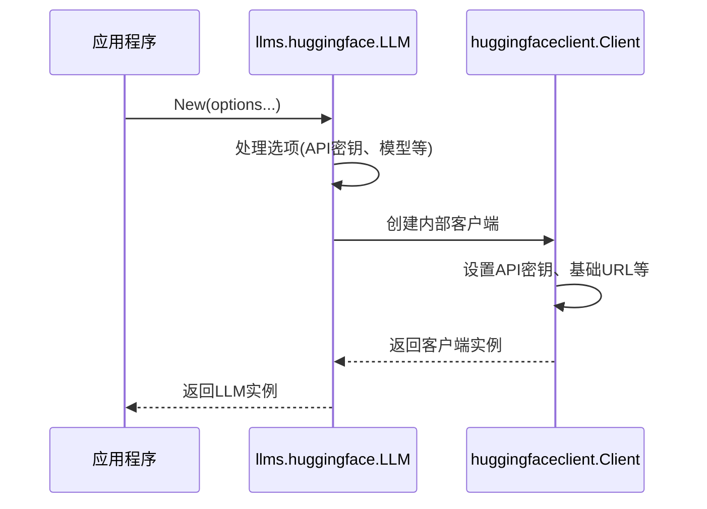
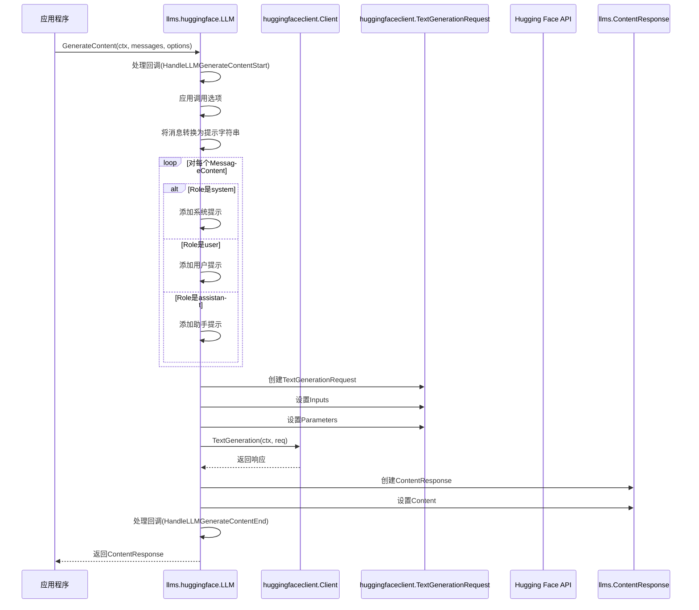
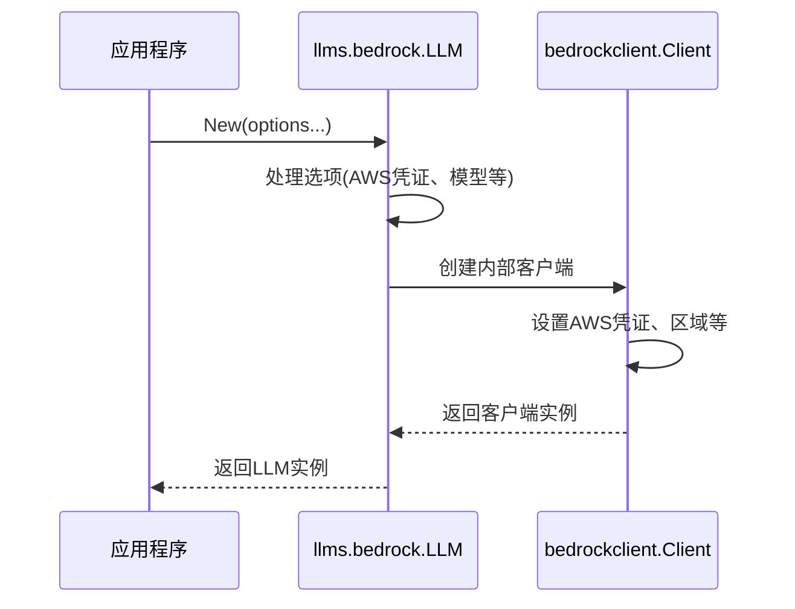
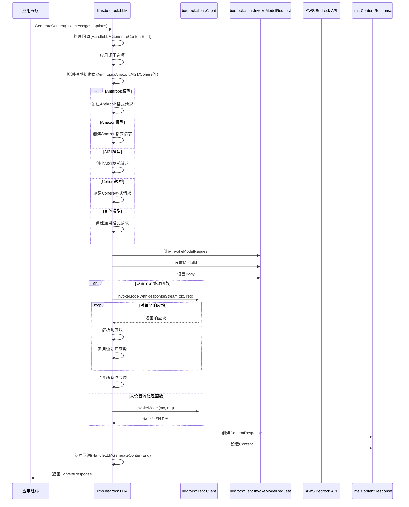

# LangChainGo llms 包提供商实现分析

本文档详细分析了 LangChainGo 中 llms 包各个提供商的实现方式和差异，帮助理解不同 LLM 提供商的集成方式。

## 目录

1. [提供商实现概述](#提供商实现概述)
2. [OpenAI 实现分析](#openai-实现分析)
3. [Anthropic 实现分析](#anthropic-实现分析)
4. [Google AI 实现分析](#google-ai-实现分析)
5. [Hugging Face 实现分析](#hugging-face-实现分析)
6. [Bedrock 实现分析](#bedrock-实现分析)
7. [提供商实现对比](#提供商实现对比)
8. [自定义提供商实现指南](#自定义提供商实现指南)

## 提供商实现概述

LangChainGo 的 llms 包支持多种 LLM 提供商，每个提供商都需要实现 `Model` 接口：

```go
type Model interface {
    GenerateContent(ctx context.Context, messages []MessageContent, options ...CallOption) (ContentResponse, error)
    Call(ctx context.Context, prompt string, options ...CallOption) (*Response, error) // 已弃用
}
```

各个提供商的实现通常遵循以下模式：

1. 创建提供商特定的客户端
2. 实现 `GenerateContent` 方法，将 LangChainGo 的消息格式转换为提供商特定的格式
3. 调用提供商的 API
4. 将提供商的响应转换回 LangChainGo 的 `ContentResponse` 格式

下面我们将详细分析各个主要提供商的实现。

## OpenAI 实现分析

### 核心结构

```go
type LLM struct {
    client          *openaiclient.Client
    model           string
    callbackManager *callbacks.Manager
}
```

### 初始化流程



### GenerateContent 实现



### 错误处理

OpenAI 实现会将 OpenAI API 的错误映射为 LangChainGo 的标准错误：

- 速率限制错误 -> `ErrRateLimitExceeded`
- 无效请求错误 -> `ErrInvalidRequest`
- 认证错误 -> `ErrAuthenticationFailed`
- 权限错误 -> `ErrPermissionDenied`
- 服务不可用错误 -> `ErrServiceUnavailable`
- 内容过滤错误 -> `ErrContentFiltered`
- 上下文长度错误 -> `ErrContextLengthExceeded`

## Anthropic 实现分析

### 核心结构

```go
type LLM struct {
    client          *anthropicclient.Client
    model           string
    callbackManager *callbacks.Manager
}
```

### 初始化流程



### GenerateContent 实现



### 特殊处理

Anthropic 实现有一些特殊处理：

1. 系统消息处理：Anthropic 将所有系统消息合并为一个系统消息
2. 多模态支持：仅支持文本和图片，不支持其他类型的内容
3. 工具调用：Claude 3 开始支持工具调用，但实现方式与 OpenAI 有所不同

## Google AI 实现分析

### 核心结构

```go
type LLM struct {
    client          *googleaiclient.Client
    model           string
    callbackManager *callbacks.Manager
}
```

### 初始化流程



### GenerateContent 实现



### 特殊处理

Google AI 实现有一些特殊处理：

1. 角色映射：将 LangChainGo 的角色映射到 Google AI 的角色（user/model/system）
2. 多模态支持：完全支持文本、图片和二进制内容
3. 工具调用：支持 Google AI 特定的工具调用格式

## Hugging Face 实现分析

### 核心结构

```go
type LLM struct {
    client          *huggingfaceclient.Client
    model           string
    callbackManager *callbacks.Manager
}
```

### 初始化流程



### GenerateContent 实现



### 特殊处理

Hugging Face 实现有一些特殊处理：

1. 提示格式化：将消息转换为单一提示字符串
2. 多模态支持：仅支持文本，不支持图片和其他类型的内容
3. 工具调用：不支持工具调用

## Bedrock 实现分析

### 核心结构

```go
type LLM struct {
    client          *bedrockclient.Client
    model           string
    callbackManager *callbacks.Manager
}
```

### 初始化流程



### GenerateContent 实现



### 特殊处理

Bedrock 实现有一些特殊处理：

1. 模型提供商检测：根据模型 ID 检测提供商，并使用相应的请求格式
2. 多模态支持：根据模型提供商的能力支持不同类型的内容
3. 工具调用：根据模型提供商的能力支持工具调用

## 提供商实现对比

| 提供商 | 多模态支持 | 工具调用 | 流式响应 | 特殊处理 |
|-------|----------|---------|---------|--------|
| OpenAI | 文本、图片、二进制 | 完全支持 | 支持 | 完整的工具调用支持 |
| Anthropic | 文本、图片 | 部分支持 | 支持 | 系统消息合并 |
| Google AI | 文本、图片、二进制 | 支持 | 支持 | 特定的工具调用格式 |
| Hugging Face | 仅文本 | 不支持 | 不支持 | 提示格式化 |
| Bedrock | 根据模型而定 | 根据模型而定 | 支持 | 模型提供商检测 |

## 自定义提供商实现指南

要实现自定义 LLM 提供商，需要遵循以下步骤：

1. 创建提供商特定的客户端
2. 实现 `Model` 接口
3. 实现 `GenerateContent` 方法，将 LangChainGo 的消息格式转换为提供商特定的格式
4. 调用提供商的 API
5. 将提供商的响应转换回 LangChainGo 的 `ContentResponse` 格式

示例框架：

```go
package customllm

import (
    "context"
    
    "github.com/tmc/langchaingo/llms"
)

type LLM struct {
    client          *CustomClient
    model           string
    callbackManager *callbacks.Manager
}

func New(options ...Option) (*LLM, error) {
    llm := &LLM{}
    
    // 应用选项
    for _, option := range options {
        option(llm)
    }
    
    // 创建客户端
    client, err := NewClient(llm.apiKey, llm.baseURL)
    if err != nil {
        return nil, err
    }
    llm.client = client
    
    return llm, nil
}

func (l *LLM) GenerateContent(ctx context.Context, messages []llms.MessageContent, options ...llms.CallOption) (llms.ContentResponse, error) {
    // 处理回调
    if l.callbackManager != nil {
        l.callbackManager.HandleLLMGenerateContentStart(ctx, messages)
    }
    
    // 应用选项
    opts := llms.ApplyOptions(options...)
    
    // 转换消息格式
    customMessages := convertMessages(messages)
    
    // 创建请求
    req := &CustomRequest{
        Model:       l.model,
        Messages:    customMessages,
        Temperature: opts.Temperature,
        MaxTokens:   opts.MaxTokens,
        // 其他参数
    }
    
    // 调用 API
    var resp *CustomResponse
    var err error
    
    if opts.StreamingFunc != nil {
        // 流式处理
        resp, err = l.client.StreamGenerate(ctx, req, opts.StreamingFunc)
    } else {
        // 非流式处理
        resp, err = l.client.Generate(ctx, req)
    }
    
    if err != nil {
        return llms.ContentResponse{}, err
    }
    
    // 转换响应格式
    contentResp := convertResponse(resp)
    
    // 处理回调
    if l.callbackManager != nil {
        l.callbackManager.HandleLLMGenerateContentEnd(ctx, contentResp)
    }
    
    return contentResp, nil
}

func (l *LLM) Call(ctx context.Context, prompt string, options ...llms.CallOption) (*llms.Response, error) {
    // 已弃用，但为了兼容性仍需实现
    // 将单一提示转换为消息格式，然后调用 GenerateContent
    messages := []llms.MessageContent{
        {
            Role: "user",
            Parts: []llms.ContentPart{
                llms.TextContent{
                    Text: prompt,
                },
            },
        },
    }
    
    resp, err := l.GenerateContent(ctx, messages, options...)
    if err != nil {
        return nil, err
    }
    
    // 转换为旧的响应格式
    return &llms.Response{
        Content: resp.Choices[0].Content.Parts[0].(llms.TextContent).Text,
        // 其他字段
    }, nil
}
```

## 总结

LangChainGo 的 llms 包通过统一的 `Model` 接口支持多种 LLM 提供商，每个提供商的实现都遵循类似的模式，但也有各自的特殊处理。了解这些实现细节和差异，有助于开发者选择合适的提供商，并在需要时实现自定义提供商。

通过本文的分析，我们可以看到 LangChainGo 的 llms 包设计得非常灵活，能够适应不同提供商的 API 差异，同时为应用程序提供统一的接口。这种设计使得开发者可以轻松地切换不同的 LLM 提供商，而不需要修改应用程序的核心逻辑。