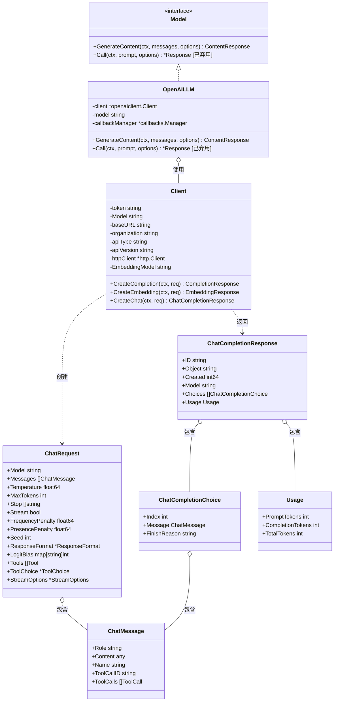
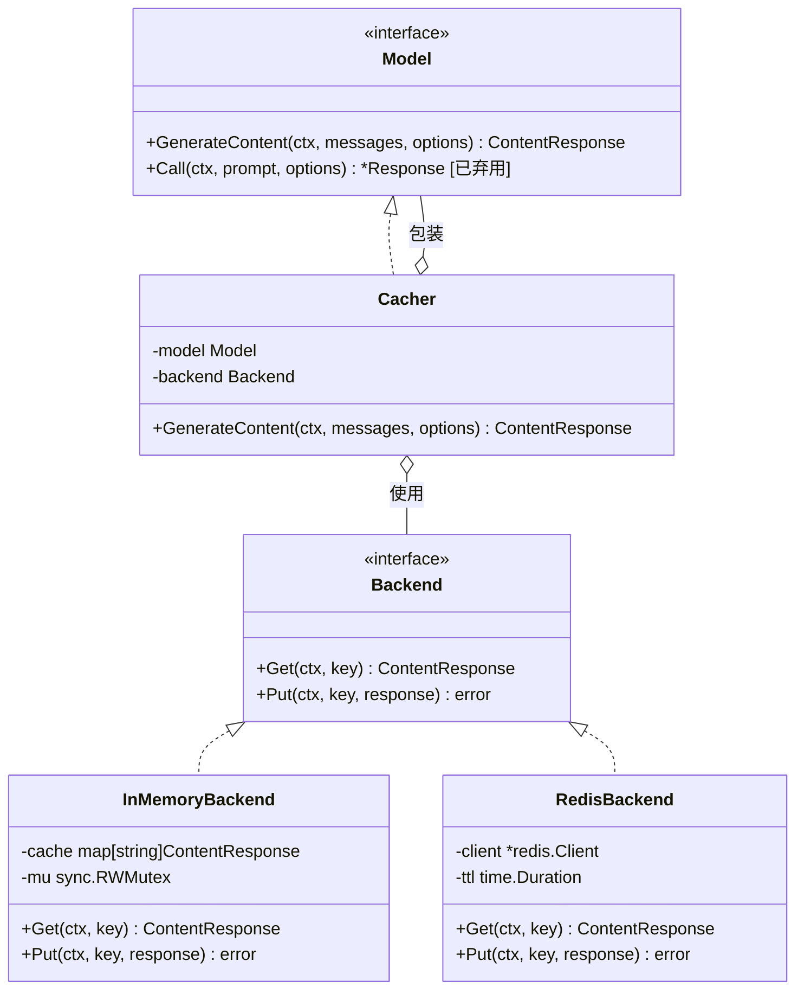
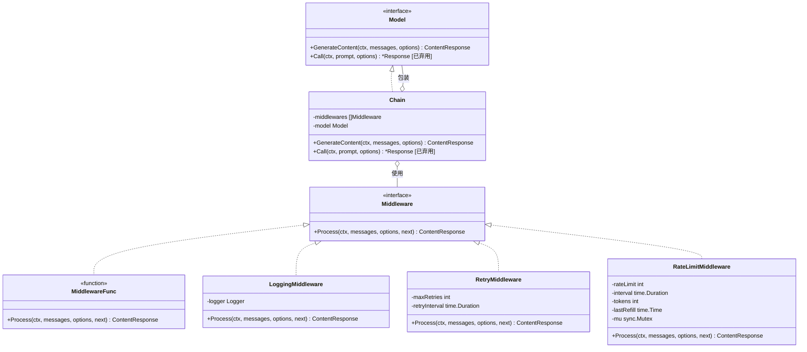
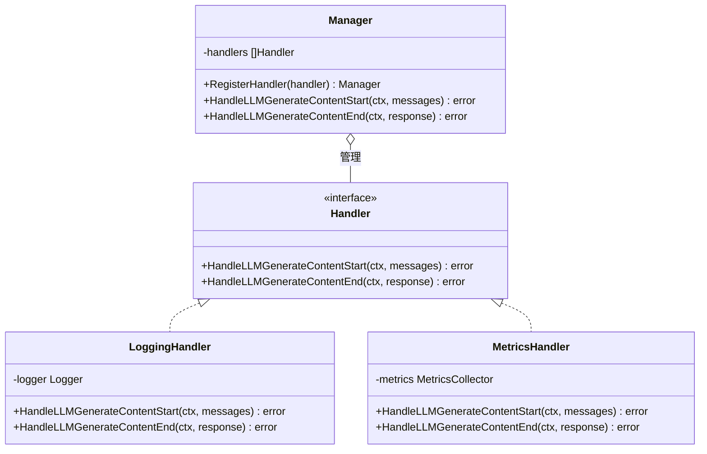

# LangChainGo llms 包类图分析

本文档提供了 LangChainGo 中 llms 包的类图分析，帮助理解各个接口和结构体之间的关系。

## 核心接口与结构体类图

```mermaid
classDiagram
    %% 核心接口
    class Model {
        <<interface>>
        +GenerateContent(ctx, messages, options) ContentResponse
        +Call(ctx, prompt, options) *Response [已弃用]
    }
    
    class LLM {
        <<interface>>
        +Call(ctx, prompt, options) *Response [已弃用]
    }
    
    %% 消息相关
    class ChatMessage {
        <<interface>>
        +GetType() ChatMessageType
        +GetContent() string
    }
    
    class ChatMessageType {
        <<enumeration>>
        AI
        Human
        System
        Generic
        Function
        Tool
    }
    
    class AIChatMessage {
        +Content string
        +FunctionCall *FunctionCall
        +ToolCalls []*ToolCall
        +ReasoningContent string
        +GetType() ChatMessageType
        +GetContent() string
    }
    
    class HumanChatMessage {
        +Content string
        +GetType() ChatMessageType
        +GetContent() string
    }
    
    class SystemChatMessage {
        +Content string
        +GetType() ChatMessageType
        +GetContent() string
    }
    
    class GenericChatMessage {
        +Content string
        +Role string
        +GetType() ChatMessageType
        +GetContent() string
    }
    
    class FunctionChatMessage {
        +Content string
        +Name string
        +GetType() ChatMessageType
        +GetContent() string
    }
    
    class ToolChatMessage {
        +Content string
        +ID string
        +Name string
        +GetType() ChatMessageType
        +GetContent() string
    }
    
    %% 内容相关
    class ContentPart {
        <<interface>>
    }
    
    class TextContent {
        +Text string
    }
    
    class ImageURLContent {
        +URL string
        +Detail string
    }
    
    class BinaryContent {
        +MIMEType string
        +Data []byte
    }
    
    class FunctionCall {
        +Name string
        +Arguments string
    }
    
    class ToolCall {
        +ID string
        +Type string
        +Function FunctionDefinition
    }
    
    class ToolCallResponse {
        +ToolCallID string
        +Content string
    }
    
    class MessageContent {
        +Role string
        +Parts []ContentPart
    }
    
    %% 响应相关
    class ContentResponse {
        +Choices []ContentChoice
    }
    
    class ContentChoice {
        +Content MessageContent
        +StopReason string
        +GenerationInfo *GenerationInfo
        +FuncCall *FunctionCall
        +ToolCalls []*ToolCall
    }
    
    class GenerationInfo {
        +PromptTokens int
        +CompletionTokens int
        +TotalTokens int
    }
    
    %% 选项相关
    class CallOptions {
        +Model string
        +CandidateCount int
        +MaxTokens int
        +Temperature float64
        +StopWords []string
        +StreamingFunc func(ctx, chunk) bool
        +StreamingReasoningFunc func(ctx, chunk) bool
        +TopK int
        +TopP float64
        +Seed int
        +MinLength int
        +MaxLength int
        +N int
        +RepetitionPenalty float64
        +FrequencyPenalty float64
        +PresencePenalty float64
        +JSONMode bool
        +Tools []Tool
        +ToolChoice *ToolChoice
        +Functions []FunctionDefinition [已弃用]
        +FunctionCallBehavior FunctionCallBehavior [已弃用]
        +Metadata map[string]string
        +ResponseMIMEType string
    }
    
    class Tool {
        +Type string
        +Function FunctionDefinition
    }
    
    class FunctionDefinition {
        +Name string
        +Description string
        +Parameters map[string]any
    }
    
    class ToolChoice {
        +Type string
        +Function *FunctionReference
    }
    
    class FunctionReference {
        +Name string
    }
    
    class FunctionCallBehavior {
        <<enumeration>>
        None
        Auto
        Required
    }
    
    %% 缓存相关
    class Cacher {
        -model Model
        -backend Backend
        +GenerateContent(ctx, messages, options) ContentResponse
    }
    
    class Backend {
        <<interface>>
        +Get(ctx, key) ContentResponse
        +Put(ctx, key, response) error
    }
    
    %% 关系连接
    ChatMessage <|.. AIChatMessage
    ChatMessage <|.. HumanChatMessage
    ChatMessage <|.. SystemChatMessage
    ChatMessage <|.. GenericChatMessage
    ChatMessage <|.. FunctionChatMessage
    ChatMessage <|.. ToolChatMessage
    
    ContentPart <|.. TextContent
    ContentPart <|.. ImageURLContent
    ContentPart <|.. BinaryContent
    ContentPart <|.. FunctionCall
    ContentPart <|.. ToolCall
    ContentPart <|.. ToolCallResponse
    
    MessageContent o-- ContentPart : 包含
    
    ContentResponse o-- ContentChoice : 包含
    ContentChoice o-- MessageContent : 包含
    ContentChoice o-- GenerationInfo : 包含
    ContentChoice o-- FunctionCall : 包含
    ContentChoice o-- ToolCall : 包含
    
    CallOptions o-- Tool : 包含
    Tool o-- FunctionDefinition : 包含
    CallOptions o-- ToolChoice : 包含
    ToolChoice o-- FunctionReference : 包含
    
    Model <|.. Cacher
    Cacher o-- Model : 包装
    Cacher o-- Backend : 使用
```

## 提供商实现类图

以 OpenAI 为例：

## 缓存实现类图

## 中间件模式类图

## 回调处理类图

## 总结

LangChainGo 的 llms 包通过清晰的接口设计和灵活的结构，提供了统一的 LLM 调用方式。核心接口 Model 定义了与 LLM 交互的标准方法，而各种结构体和实现类则提供了丰富的功能，包括多模态内容处理、工具调用、流式响应、缓存机制、中间件模式和回调处理等。

通过这些类图，可以清晰地看到各个接口和结构体之间的关系，帮助开发者更好地理解和使用 LangChainGo 的 llms 包，构建强大的 LLM 应用。