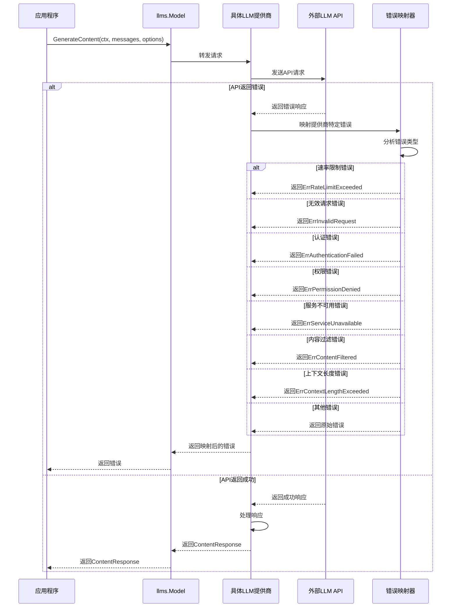
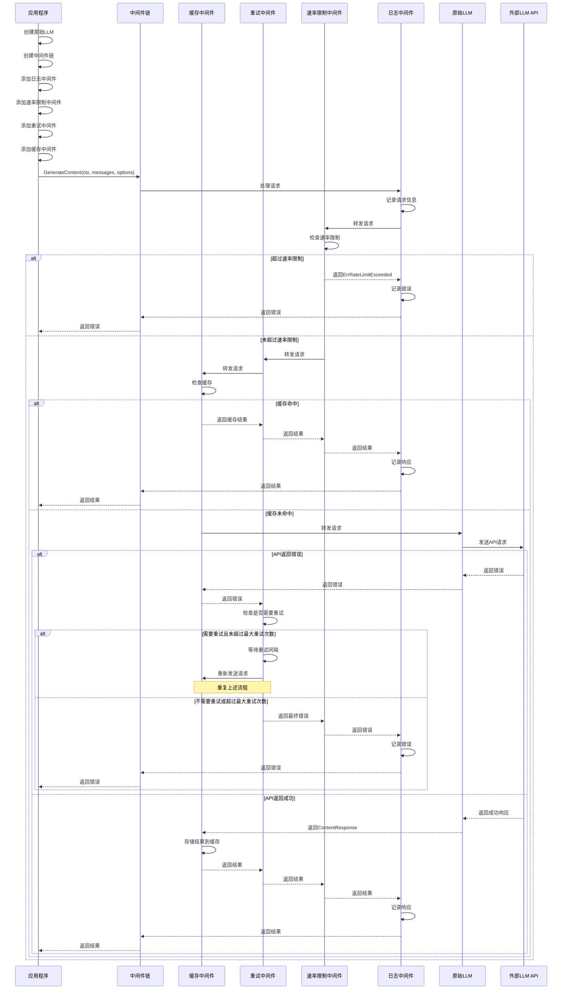
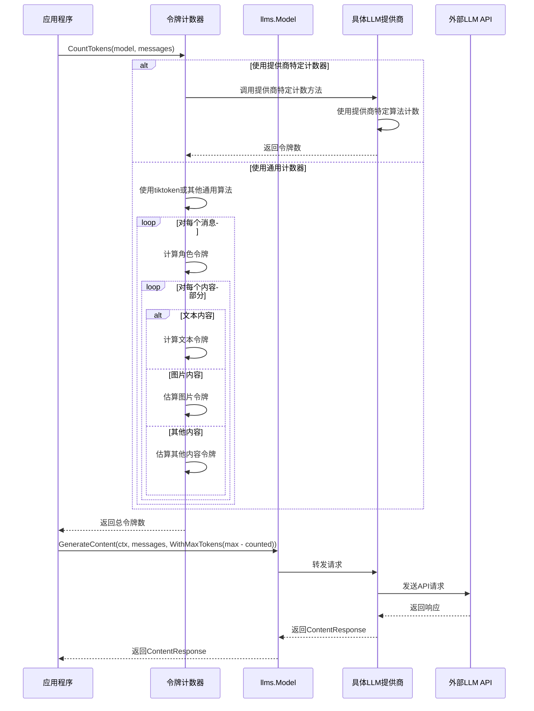
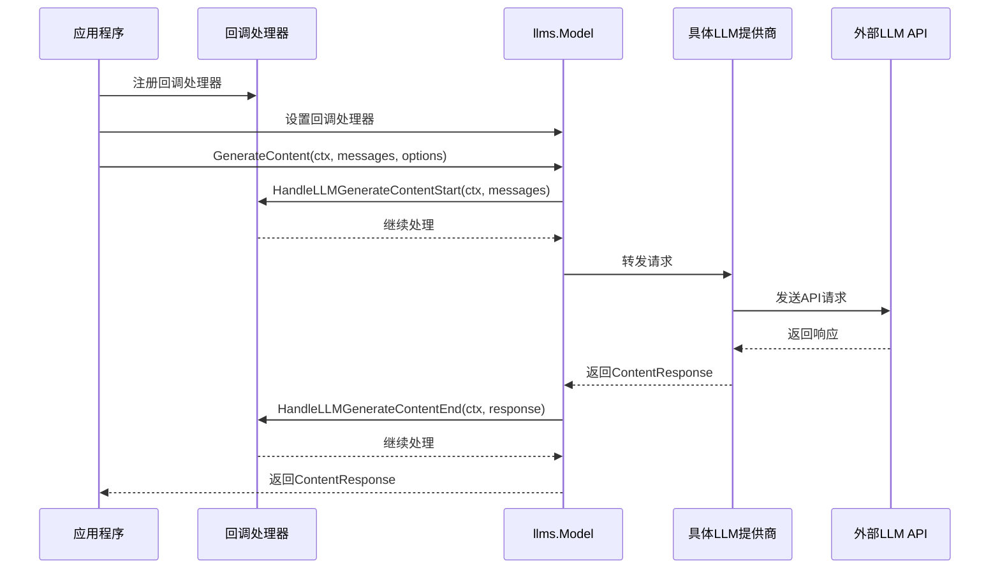
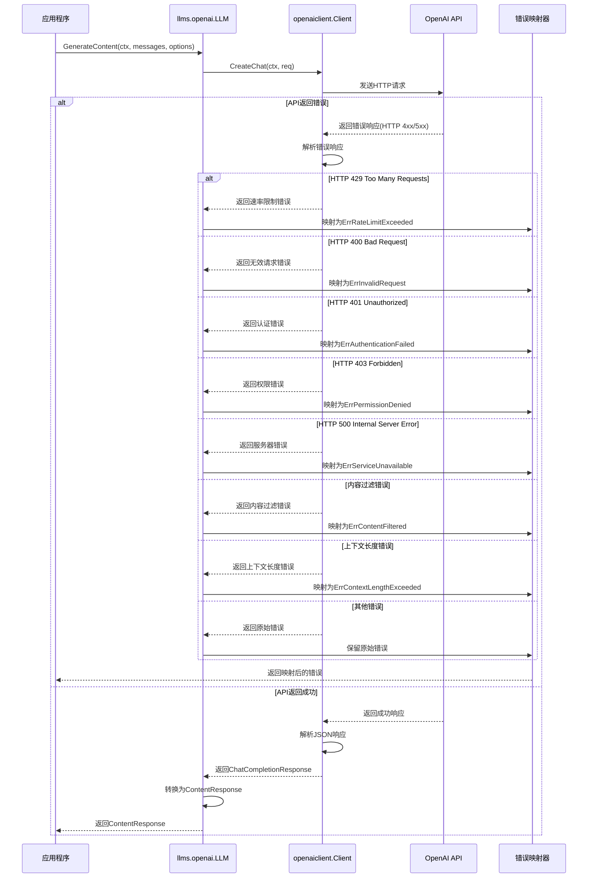

# LangChainGo llms 包错误处理与中间件流程

本文档通过泳道图分析 LangChainGo 中 llms 包的错误处理和中间件流程，以帮助理解其工作原理。

## 错误处理流程

## 中间件模式流程

## 令牌计数流程

## 回调处理流程

## 提供商特定错误处理流程 (以OpenAI为例)

## 总结

LangChainGo 的 llms 包通过一系列结构化的流程处理错误、中间件、令牌计数和回调。这些流程通过清晰的接口和抽象层次，使得不同的 LLM 提供商可以统一集成到框架中，同时保持各自的特性和功能。

通过这些泳道图，我们可以更清晰地理解 llms 包的工作原理，以及各个组件之间的交互关系。这有助于开发者更好地使用和扩展 LangChainGo 框架。