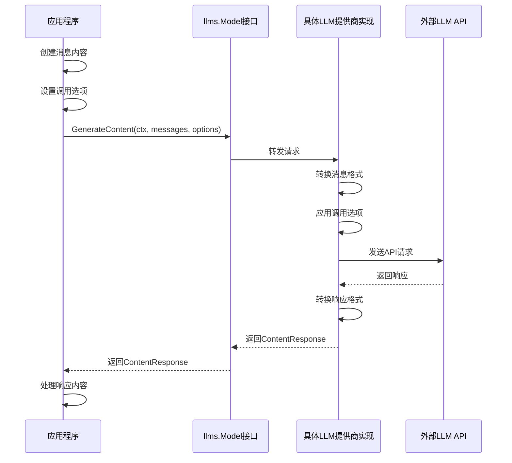
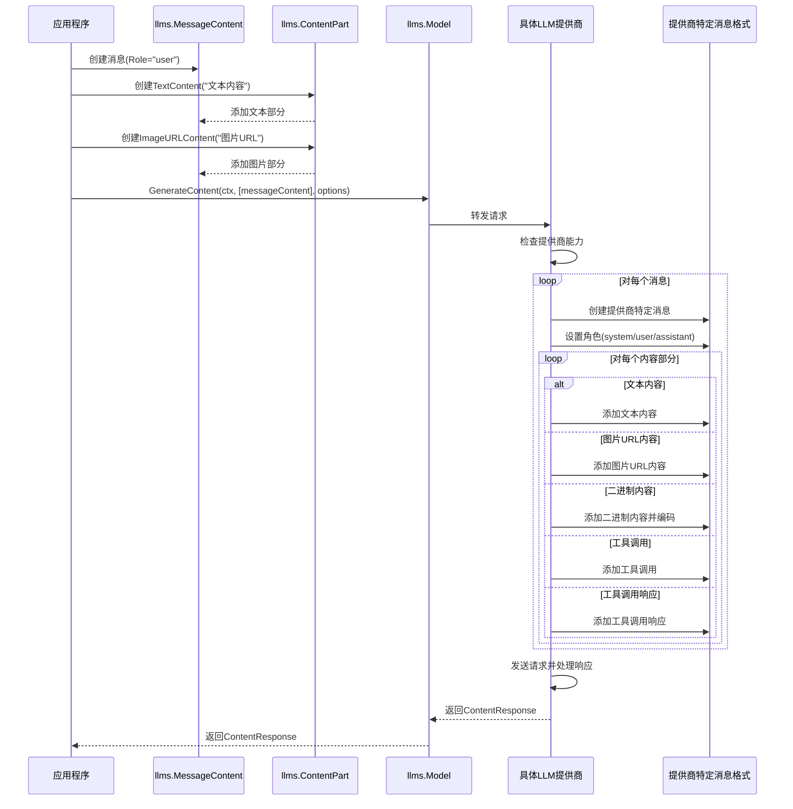
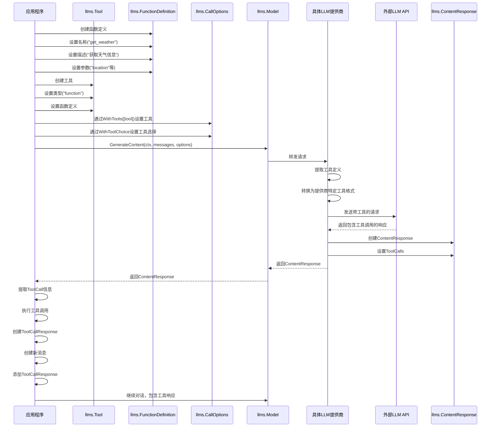
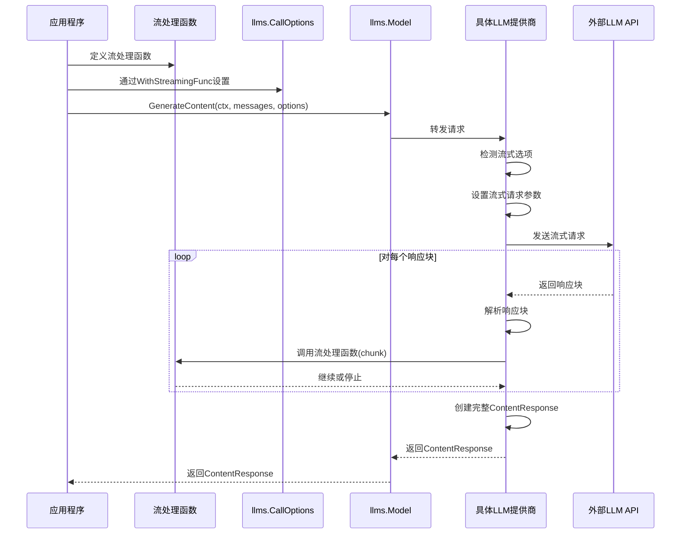
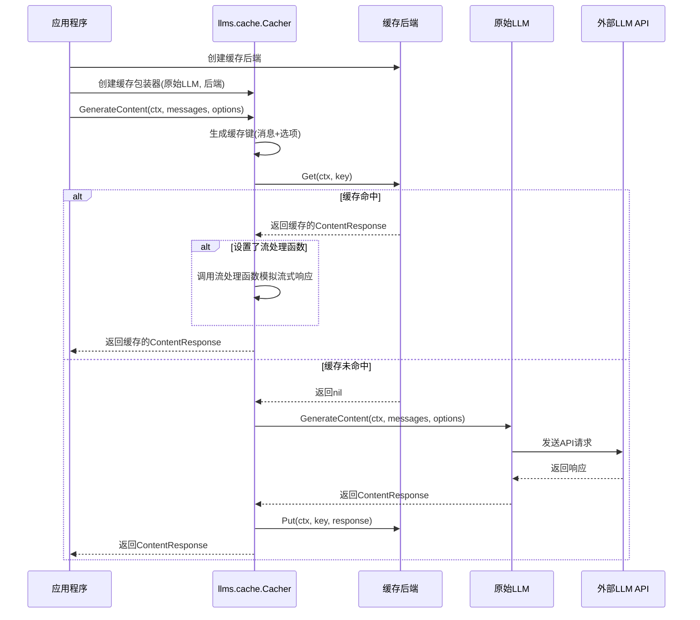
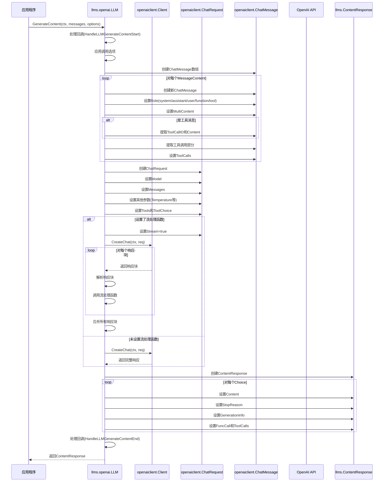

# LangChainGo llms 包对外暴露 API 分析

本文档详细分析了 LangChainGo 中 llms 包对外暴露的 API，并以此为抓手对各部分流程进行泳道图分析。

## 目录

1. [对外暴露的核心 API](#对外暴露的核心-api)
2. [Model 接口调用流程](#model-接口调用流程)
3. [消息处理流程](#消息处理流程)
4. [工具调用流程](#工具调用流程)
5. [流式响应处理流程](#流式响应处理流程)
6. [缓存机制流程](#缓存机制流程)
7. [提供商实现流程](#提供商实现流程)

## 对外暴露的核心 API

LangChainGo 的 llms 包对外暴露的主要 API 包括：

### 1. Model 接口

```go
type Model interface {
    GenerateContent(ctx context.Context, messages []MessageContent, options ...CallOption) (ContentResponse, error)
    Call(ctx context.Context, prompt string, options ...CallOption) (*Response, error) // 已弃用
}
```

这是 llms 包的核心接口，所有 LLM 提供商必须实现此接口。`GenerateContent` 方法是主要方法，用于生成内容，而 `Call` 方法已弃用。

### 2. MessageContent 结构体

```go
type MessageContent struct {
    Role  string
    Parts []ContentPart
}
```

用于表示消息内容，包含角色和内容部分。

### 3. ContentPart 接口及其实现

```go
type ContentPart interface {
    // 标记接口
}

type TextContent struct {
    Text string
}

type ImageURLContent struct {
    URL    string
    Detail string
}

type BinaryContent struct {
    MIMEType string
    Data     []byte
}

type FunctionCall struct {
    Name      string
    Arguments string
}

type ToolCall struct {
    ID       string
    Type     string
    Function FunctionDefinition
}

type ToolCallResponse struct {
    ToolCallID string
    Content    string
}
```

这些结构体实现了 ContentPart 接口，用于表示不同类型的内容部分。

### 4. ContentResponse 结构体

```go
type ContentResponse struct {
    Choices []ContentChoice
}

type ContentChoice struct {
    Content        MessageContent
    StopReason     string
    GenerationInfo *GenerationInfo
    FuncCall       *FunctionCall
    ToolCalls      []*ToolCall
}

type GenerationInfo struct {
    PromptTokens     int
    CompletionTokens int
    TotalTokens      int
}
```

用于表示 LLM 的响应内容。

### 5. CallOptions 结构体及相关选项

```go
type CallOptions struct {
    Model                  string
    CandidateCount        int
    MaxTokens             int
    Temperature           float64
    StopWords             []string
    StreamingFunc         func(ctx context.Context, chunk []byte) bool
    StreamingReasoningFunc func(ctx context.Context, chunk []byte) bool
    TopK                  int
    TopP                  float64
    Seed                  int
    MinLength             int
    MaxLength             int
    N                     int
    RepetitionPenalty     float64
    FrequencyPenalty      float64
    PresencePenalty       float64
    JSONMode              bool
    Tools                 []Tool
    ToolChoice            *ToolChoice
    Functions             []FunctionDefinition // 已弃用
    FunctionCallBehavior  FunctionCallBehavior // 已弃用
    Metadata              map[string]string
    ResponseMIMEType      string
}
```

用于配置 LLM 调用的参数，包括模型参数、流式处理函数、工具和函数定义等。

### 6. ChatMessage 接口及其实现

```go
type ChatMessage interface {
    GetType() ChatMessageType
    GetContent() string
}

type AIChatMessage struct {
    Content          string
    FunctionCall     *FunctionCall
    ToolCalls        []*ToolCall
    ReasoningContent string
}

type HumanChatMessage struct {
    Content string
}

type SystemChatMessage struct {
    Content string
}

type GenericChatMessage struct {
    Content string
    Role    string
}

type FunctionChatMessage struct {
    Content string
    Name    string
}

type ToolChatMessage struct {
    Content string
    ID      string
    Name    string
}
```

这些结构体实现了 ChatMessage 接口，用于表示不同类型的聊天消息。

### 7. 工具和函数相关结构体

```go
type Tool struct {
    Type     string
    Function FunctionDefinition
}

type FunctionDefinition struct {
    Name        string
    Description string
    Parameters  map[string]interface{}
}

type ToolChoice struct {
    Type     string
    Function *FunctionReference
}

type FunctionReference struct {
    Name string
}
```

用于定义工具和函数，以及工具选择。

### 8. 缓存相关接口和结构体

```go
type Backend interface {
    Get(ctx context.Context, key string) (ContentResponse, error)
    Put(ctx context.Context, key string, response ContentResponse) error
}

type Cacher struct {
    model   Model
    backend Backend
}
```

用于缓存 LLM 响应，减少 API 调用。

## Model 接口调用流程



## 消息处理流程



## 工具调用流程



## 流式响应处理流程



## 缓存机制流程



## 提供商实现流程

以 OpenAI 为例：



## 总结

LangChainGo 的 llms 包通过清晰的接口设计和灵活的结构，提供了统一的 LLM 调用方式。对外暴露的 API 主要包括 Model 接口、MessageContent 结构体、ContentPart 接口及其实现、ContentResponse 结构体、CallOptions 结构体及相关选项、ChatMessage 接口及其实现、工具和函数相关结构体以及缓存相关接口和结构体。

通过这些 API，开发者可以轻松地与不同的 LLM 提供商进行交互，处理多模态内容、工具调用、流式响应和缓存机制等功能。泳道图分析展示了各个流程的详细步骤，帮助开发者更好地理解和使用 llms 包。