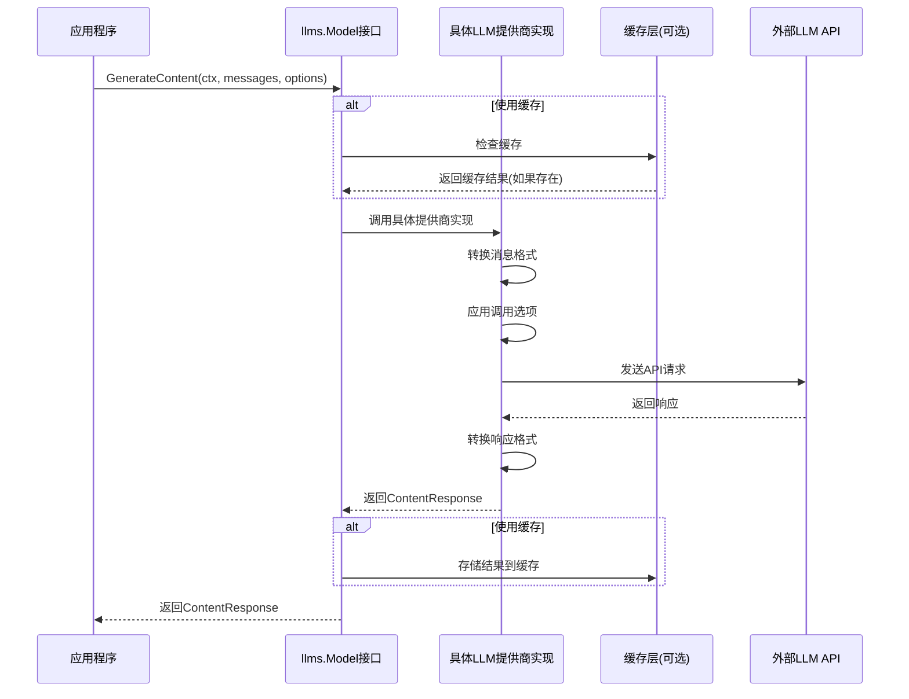
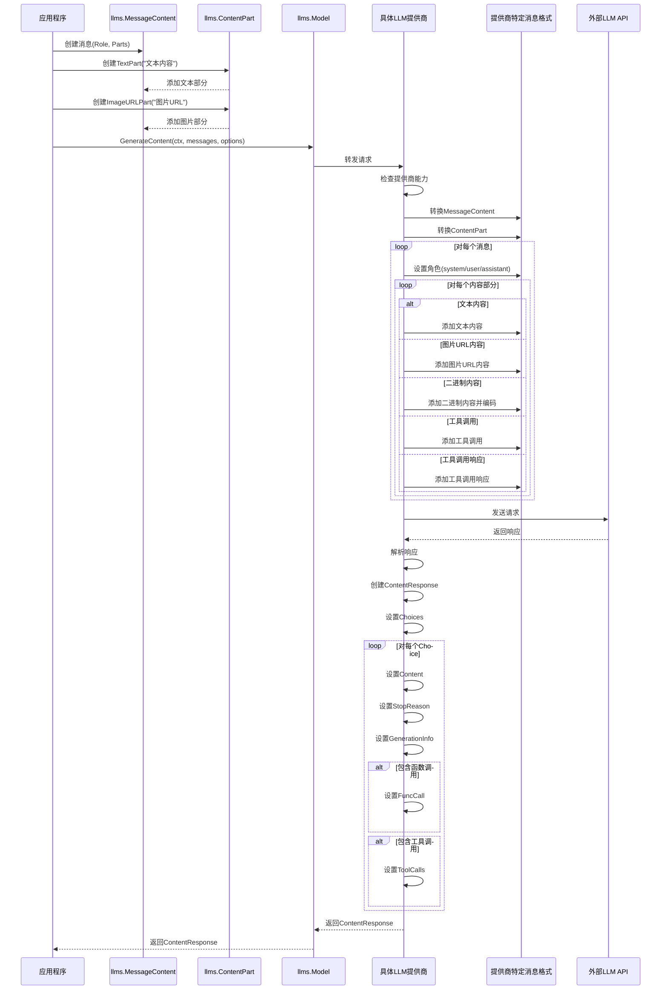
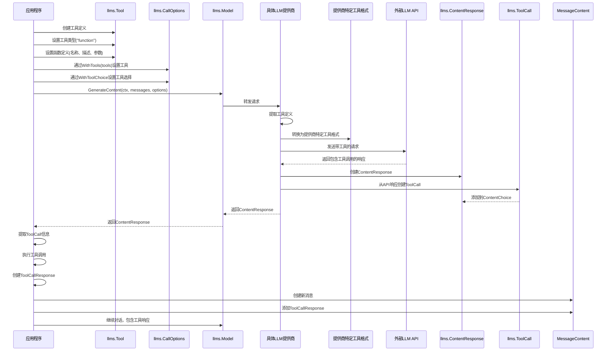
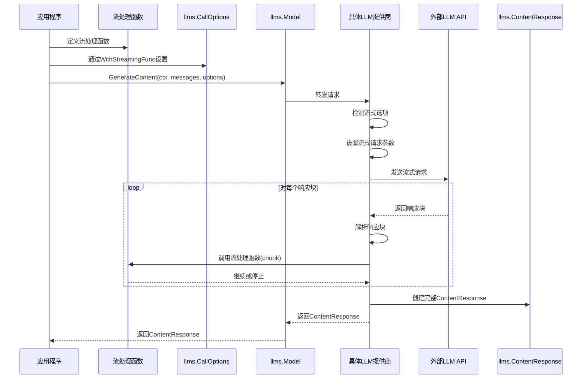
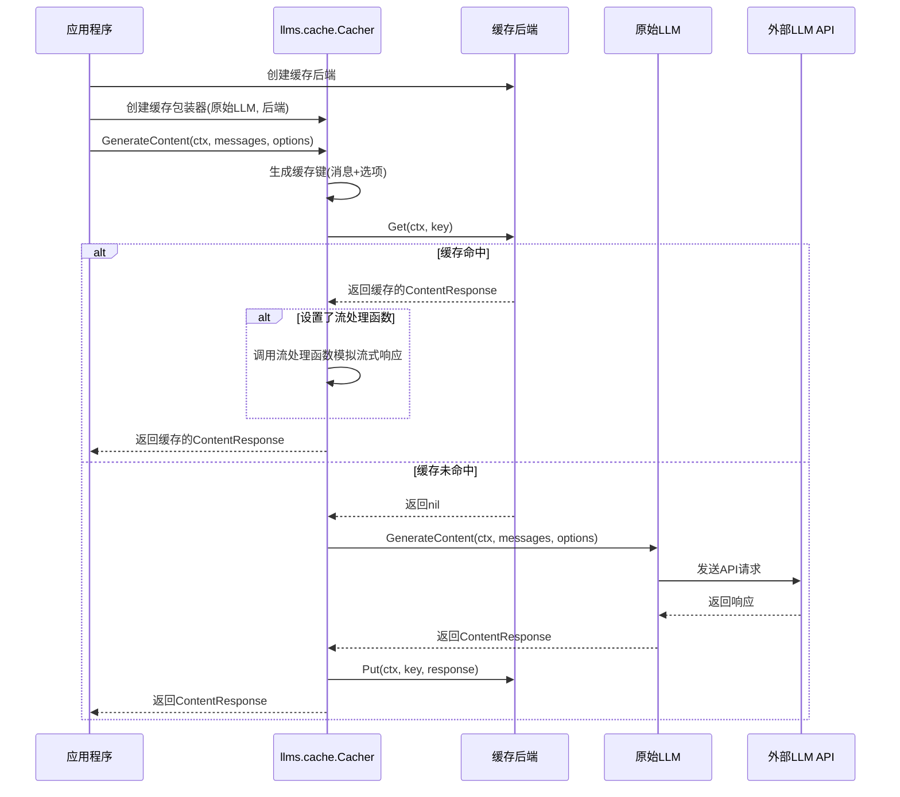
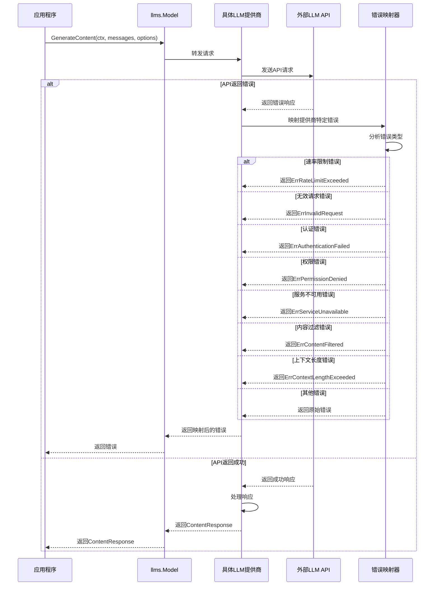
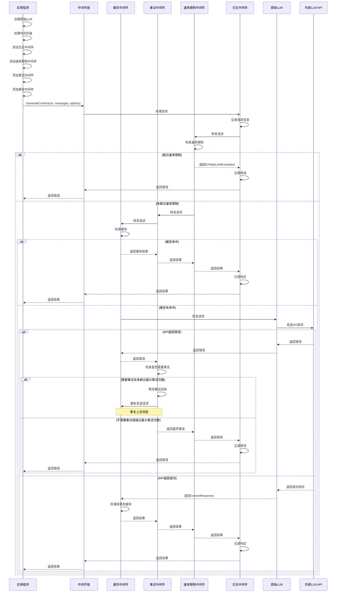
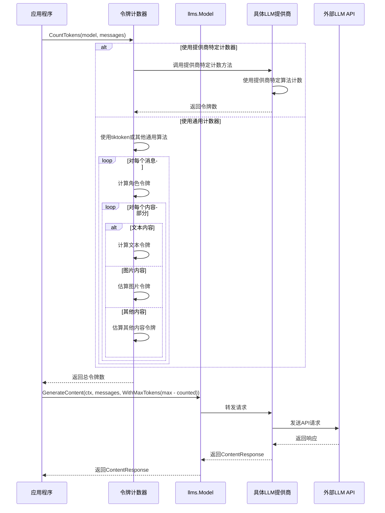
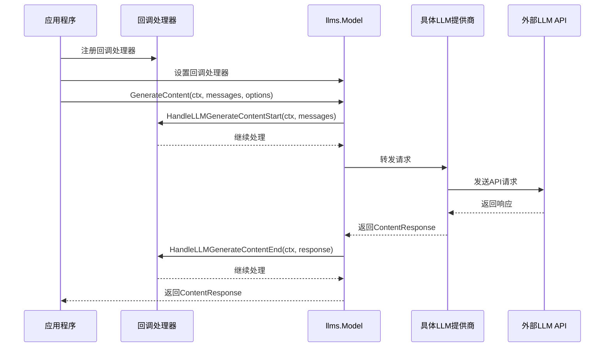
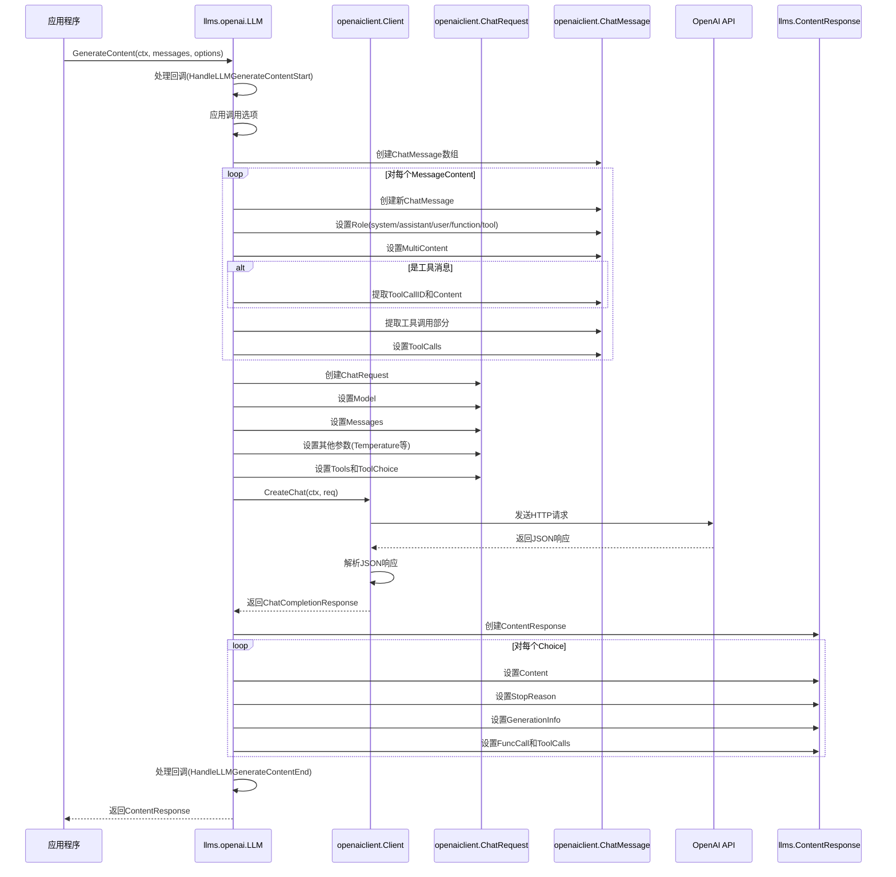

# LangChainGo llms 包全面分析

本文档提供了 LangChainGo 中 llms 包的全面分析，通过泳道图展示了各个核心流程，帮助理解其工作原理。

## 目录

1. [核心接口与结构](#核心接口与结构)
2. [基本调用流程](#基本调用流程)
3. [消息处理流程](#消息处理流程)
4. [工具调用流程](#工具调用流程)
5. [流式响应处理流程](#流式响应处理流程)
6. [缓存机制流程](#缓存机制流程)
7. [错误处理流程](#错误处理流程)
8. [中间件模式流程](#中间件模式流程)
9. [令牌计数流程](#令牌计数流程)
10. [回调处理流程](#回调处理流程)
11. [提供商实现流程](#提供商实现流程)
12. [总结与最佳实践](#总结与最佳实践)

## 核心接口与结构

llms 包对外暴露的主要内容包括：

1. **Model 接口**：所有 LLM 提供商必须实现的核心接口
   - `GenerateContent(ctx, messages, options)` - 主要方法，生成内容
   - `Call(ctx, prompt, options)` - 简化方法，已弃用

2. **MessageContent**：消息内容结构体
   - `Role` - 消息角色（人类、AI、系统等）
   - `Parts` - 内容部分的切片

3. **ContentPart**：内容部分接口，有多种实现
   - `TextContent` - 文本内容
   - `ImageURLContent` - 图像URL内容
   - `BinaryContent` - 二进制数据内容
   - `ToolCall` - 工具调用
   - `ToolCallResponse` - 工具调用响应

4. **CallOptions**：调用选项，用于配置 LLM 调用的参数
   - 模型参数（温度、最大令牌数等）
   - 流式处理函数
   - 工具和函数定义

5. **ChatMessage**：聊天消息接口，有多种实现
   - `AIChatMessage` - AI消息
   - `HumanChatMessage` - 人类消息
   - `SystemChatMessage` - 系统消息
   - `GenericChatMessage` - 通用消息
   - `FunctionChatMessage` - 函数消息
   - `ToolChatMessage` - 工具消息

6. **Tool 和 ToolCall**：工具和工具调用相关结构体
   - `Tool` - 工具定义
   - `FunctionDefinition` - 函数定义
   - `ToolCall` - 工具调用
   - `FunctionCall` - 函数调用

7. **ContentResponse**：LLM 响应结构体
   - `Choices` - 响应选项数组
   - 每个 Choice 包含内容、停止原因、生成信息等

## 基本调用流程

## 消息处理流程

## 工具调用流程

## 流式响应处理流程

## 缓存机制流程

## 错误处理流程

## 中间件模式流程

## 令牌计数流程

## 回调处理流程

## 提供商实现流程

以 OpenAI 为例：

## 总结与最佳实践

LangChainGo 的 llms 包通过清晰的接口设计和灵活的结构，提供了统一的 LLM 调用方式，支持多模态内容、工具调用、流式响应和缓存机制。通过实现 Model 接口，可以轻松集成不同的 LLM 提供商，而应用程序只需要使用统一的 API 即可。

### 最佳实践

1. **使用 GenerateContent 而非 Call**：Call 方法已弃用，应使用更通用的 GenerateContent 方法。

2. **利用缓存减少 API 调用**：对于重复的请求，使用缓存可以减少 API 调用，降低成本和延迟。

3. **合理设置 CallOptions**：根据需要设置适当的选项，如温度、最大令牌数等，以获得最佳结果。

4. **处理错误**：LLM API 可能会返回各种错误，应当妥善处理这些错误，特别是速率限制和上下文长度错误。

5. **使用中间件模式**：通过中间件模式可以添加日志、重试、缓存等功能，而不需要修改核心代码。

6. **计算令牌数**：在发送请求前计算令牌数，可以避免超出上下文长度限制，并优化成本。

7. **使用流式响应**：对于长响应，使用流式响应可以提供更好的用户体验，让用户更快看到结果。

8. **合理使用工具调用**：工具调用可以扩展 LLM 的能力，但应当谨慎使用，确保工具定义清晰且安全。

通过这些泳道图和最佳实践，开发者可以更好地理解和使用 LangChainGo 的 llms 包，构建强大的 LLM 应用。