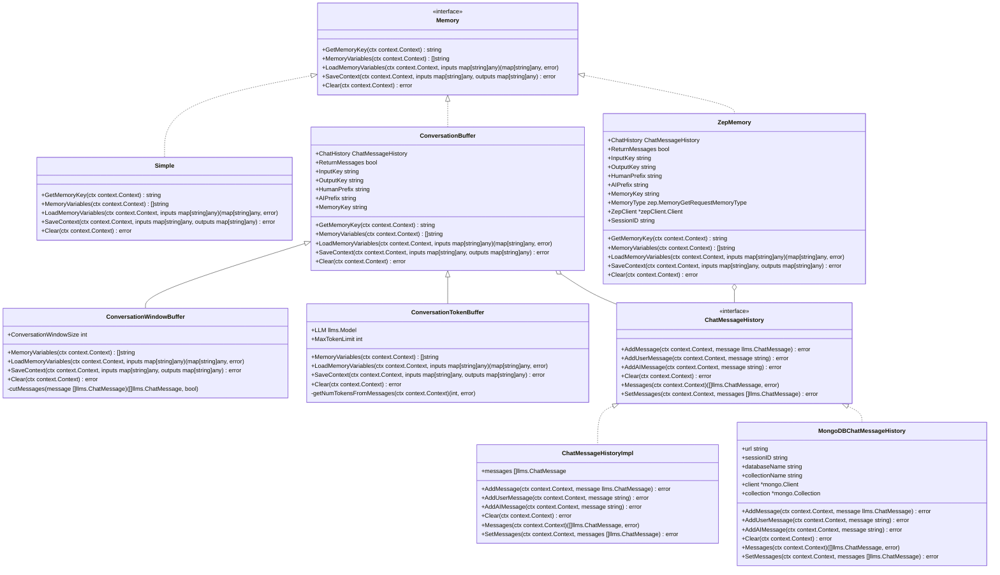
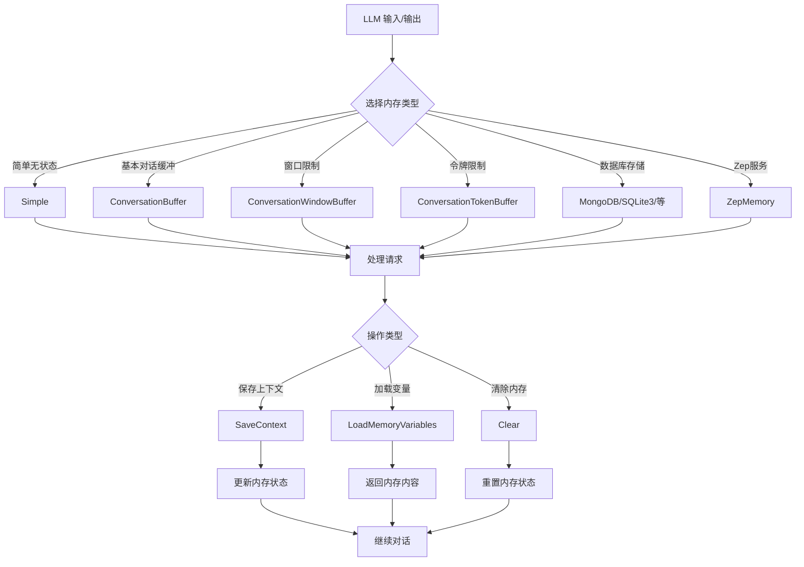

# LangChainGo Memory 包分析

## 1. 概述

LangChainGo 的 `memory` 包提供了一系列用于管理对话数据的接口和实现。这些内存组件负责存储和检索与大型语言模型（LLMs）交互过程中的对话历史，使得 LLM 能够保持上下文连贯性，记住之前的交互内容。

根据包的文档描述，`memory` 包的主要组件包括：

- **ChatMessageHistory**：存储聊天消息的结构体
- **ConversationBuffer**：一种简单的内存形式，直接记住之前的对话来回内容

此外，该包还提供了多种内存实现，支持不同的存储后端和管理策略。

## 2. 核心接口与结构

### 2.1 Memory 接口

所有内存实现都基于 `schema.Memory` 接口，该接口定义了以下方法：

```go
type Memory interface {
	// GetMemoryKey getter for memory key.
	GetMemoryKey(ctx context.Context) string
	// MemoryVariables Input keys this memory class will load dynamically.
	MemoryVariables(ctx context.Context) []string
	// LoadMemoryVariables Return key-value pairs given the text input to the chain.
	// If None, return all memories
	LoadMemoryVariables(ctx context.Context, inputs map[string]any) (map[string]any, error)
	// SaveContext Save the context of this model run to memory.
	SaveContext(ctx context.Context, inputs map[string]any, outputs map[string]any) error
	// Clear memory contents.
	Clear(ctx context.Context) error
}
```

- `GetMemoryKey`：获取内存键
- `MemoryVariables`：获取此内存类将动态加载的输入键
- `LoadMemoryVariables`：根据链的文本输入返回键值对
- `SaveContext`：将此模型运行的上下文保存到内存中
- `Clear`：清除内存内容

### 2.2 ChatMessageHistory 接口

`ChatMessageHistory` 接口定义了存储和检索聊天消息的方法：

```go
type ChatMessageHistory interface {
	// AddMessage adds a message to the store.
	AddMessage(ctx context.Context, message llms.ChatMessage) error

	// AddUserMessage is a convenience method for adding a human message string
	// to the store.
	AddUserMessage(ctx context.Context, message string) error

	// AddAIMessage is a convenience method for adding an AI message string to
	// the store.
	AddAIMessage(ctx context.Context, message string) error

	// Clear removes all messages from the store.
	Clear(ctx context.Context) error

	// Messages retrieves all messages from the store
	Messages(ctx context.Context) ([]llms.ChatMessage, error)

	// SetMessages replaces existing messages in the store
	SetMessages(ctx context.Context, messages []llms.ChatMessage) error
}
```

- `AddMessage`：添加消息到存储
- `AddUserMessage`：添加用户消息到存储
- `AddAIMessage`：添加 AI 消息到存储
- `Clear`：清除所有消息
- `Messages`：检索所有消息
- `SetMessages`：替换存储中的现有消息

## 3. 内存实现类型

### 3.1 Simple

`Simple` 是最基本的内存实现，它实现了 `Memory` 接口但实际上不做任何事情。这个类通常作为多个链中的默认内存实现。

```go
type Simple struct{}
```

### 3.2 ConversationBuffer

`ConversationBuffer` 是一种简单的内存形式，直接记住之前的对话来回内容。

```go
type ConversationBuffer struct {
	ChatHistory schema.ChatMessageHistory

	ReturnMessages bool
	InputKey       string
	OutputKey      string
	HumanPrefix    string
	AIPrefix       string
	MemoryKey      string
}
```

### 3.3 ConversationWindowBuffer

`ConversationWindowBuffer` 是一种窗口缓冲区，只保留最近的 N 个对话轮次。

```go
type ConversationWindowBuffer struct {
	ConversationBuffer
	ConversationWindowSize int
}
```

### 3.4 ConversationTokenBuffer

`ConversationTokenBuffer` 是一种基于令牌数量的缓冲区，确保存储的对话历史不超过指定的令牌限制。

```go
type ConversationTokenBuffer struct {
	ConversationBuffer
	LLM           llms.Model
	MaxTokenLimit int
}
```

### 3.5 数据库支持的内存实现

`memory` 包还提供了多种数据库支持的内存实现，包括：

- **MongoDB**：使用 MongoDB 存储聊天历史
- **SQLite3**：使用 SQLite3 存储聊天历史
- **AlloyDB**：使用 AlloyDB 存储聊天历史
- **CloudSQL**：使用 CloudSQL 存储聊天历史

### 3.6 Zep 内存

Zep 是一个外部的内存存储服务，`memory` 包提供了与 Zep 集成的内存实现。

```go
type Memory struct {
	ChatHistory    schema.ChatMessageHistory
	ReturnMessages bool
	InputKey       string
	OutputKey      string
	HumanPrefix    string
	AIPrefix       string
	MemoryKey      string
	MemoryType     zep.MemoryGetRequestMemoryType
	ZepClient      *zepClient.Client
	SessionID      string
}
```

## 4. 类图



## 5. 内存工作流程



## 6. 设计模式与最佳实践

### 6.1 设计模式

1. **策略模式**：不同的内存实现提供了相同的接口，但有不同的存储和检索策略。
2. **组合模式**：`ConversationWindowBuffer` 和 `ConversationTokenBuffer` 通过组合 `ConversationBuffer` 来扩展功能。
3. **装饰器模式**：通过选项模式（Option Pattern）来配置内存实现。
4. **适配器模式**：为不同的存储后端（MongoDB、SQLite3、Zep 等）提供统一的接口。

### 6.2 最佳实践

1. **接口分离**：通过 `Memory` 和 `ChatMessageHistory` 两个接口分离关注点。
2. **依赖注入**：通过构造函数注入依赖，如 LLM 模型、客户端等。
3. **选项模式**：使用函数选项模式来配置内存实现，提高灵活性。
4. **静态类型检查**：使用 `var _ schema.Memory = &XXX{}` 进行静态类型检查，确保实现了接口。
5. **上下文传递**：所有方法都接受 `context.Context` 参数，支持取消和超时。

## 7. 使用示例

### 7.1 Simple 内存

```go
memory := memory.NewSimple()
// 不会保存任何对话历史
```

### 7.2 ConversationBuffer 内存

```go
memory := memory.NewConversationBuffer(
    memory.WithMemoryKey("history"),
    memory.WithHumanPrefix("Human"),
    memory.WithAIPrefix("AI"),
)

// 保存对话上下文
err := memory.SaveContext(ctx, 
    map[string]any{"input": "你好！"}, 
    map[string]any{"output": "你好！有什么可以帮助你的？"})

// 加载内存变量
vars, err := memory.LoadMemoryVariables(ctx, map[string]any{})
// vars["history"] = "Human: 你好！\nAI: 你好！有什么可以帮助你的？"
```

### 7.3 ConversationWindowBuffer 内存

```go
// 只保留最近 5 轮对话
memory := memory.NewConversationWindowBuffer(5,
    memory.WithMemoryKey("history"),
    memory.WithReturnMessages(true),
)
```

### 7.4 ConversationTokenBuffer 内存

```go
// 限制对话历史的令牌数量不超过 2000
memory := memory.NewConversationTokenBuffer(llm, 2000,
    memory.WithMemoryKey("history"),
)
```

### 7.5 MongoDB 内存

```go
// 使用 MongoDB 存储聊天历史
history, err := mongo.NewMongoDBChatMessageHistory(ctx,
    mongo.WithConnectionURL("mongodb://localhost:27017"),
    mongo.WithSessionID("user123"),
)
if err != nil {
    // 处理错误
}

memory := memory.NewConversationBuffer(
    memory.WithChatHistory(history),
)
```

### 7.6 Zep 内存

```go
// 使用 Zep 服务存储内存
client := zepClient.NewClient("http://localhost:8000")
memory := zep.NewMemory(client, "session123",
    zep.WithMemoryKey("history"),
    zep.WithReturnMessages(true),
)
```

## 8. 总结

LangChainGo 的 `memory` 包提供了一套灵活、可扩展的内存管理系统，用于存储和检索与 LLM 交互的对话历史。这些内存组件使得 LLM 能够保持上下文连贯性，记住之前的交互内容，从而提供更自然、更连贯的对话体验。

该包的设计遵循了良好的软件工程实践，如接口分离、依赖注入和静态类型检查。它还提供了多种内存实现，支持不同的存储后端和管理策略，以满足不同的应用需求。

总的来说，`memory` 包是 LangChainGo 框架的重要组成部分，它简化了与 LLM 的交互，并使其更加智能和上下文感知。