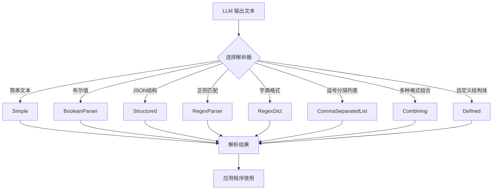

# LangChainGo OutputParser 包分析

## 1. 概述

LangChainGo 的 `outputparser` 包提供了一系列解析器，用于处理来自大型语言模型（LLMs）的结构化或非结构化数据。这些解析器可以将 LLM 的原始文本输出转换为各种有用的数据结构，如布尔值、字符串列表、映射或自定义结构体。

## 2. 核心接口与结构

### 2.1 OutputParser 接口

所有解析器都实现了 `schema.OutputParser` 接口，该接口定义了以下方法：

```go
type OutputParser[T any] interface {
    Parse(text string) (T, error)
    ParseWithPrompt(text string, prompt PromptValue) (T, error)
    GetFormatInstructions() string
    Type() string
}
```

- `Parse`: 将文本解析为指定类型
- `ParseWithPrompt`: 将文本与提示一起解析为指定类型
- `GetFormatInstructions`: 返回格式说明，告诉 LLM 如何格式化其输出
- `Type`: 返回解析器的类型标识符

### 2.2 ParseError

`ParseError` 是解析器返回的错误类型，包含原始文本和错误原因：

```go
type ParseError struct {
    Text   string
    Reason string
}
```

## 3. 解析器类型

### 3.1 Simple

`Simple` 是最基本的解析器，它只是返回去除前后空格的原始文本：

```go
type Simple struct{}
```

### 3.2 BooleanParser

`BooleanParser` 将文本解析为布尔值，基于预定义的真值和假值字符串：

```go
type BooleanParser struct {
    TrueStrings  []string
    FalseStrings []string
}
```

### 3.3 Structured

`Structured` 解析器期望 JSON 格式的响应，并将其解析为 `map[string]string`，同时根据提供的模式进行验证：

```go
type Structured struct {
    ResponseSchemas []ResponseSchema
}

type ResponseSchema struct {
    Name        string
    Description string
}
```

### 3.4 RegexParser

`RegexParser` 使用正则表达式从文本中提取信息，并将其解析为 `map[string]string`：

```go
type RegexParser struct {
    Expression *regexp.Regexp
    OutputKeys []string
}
```

### 3.5 RegexDict

`RegexDict` 在字典格式的字符串中搜索值，并返回键及其关联值的 `map[string]string`：

```go
type RegexDict struct {
    OutputKeyToFormat map[string]string
    NoUpdateValue     string
}
```

### 3.6 CommaSeparatedList

`CommaSeparatedList` 将逗号分隔的值字符串解析为字符串切片：

```go
type CommaSeparatedList struct{}
```

### 3.7 Combining

`Combining` 将多个解析器的输出组合成一个解析器：

```go
type Combining struct {
    Parsers []schema.OutputParser[any]
}
```

### 3.8 Defined

`Defined` 根据提供的结构体定义解析 JSON 输出，并生成 TypeScript 接口来帮助 LLM 格式化响应：

```go
type Defined[T any] struct {
    schema string
}
```

## 4. 类图

```mermaid
classDiagram
    class OutputParser~T~ {
        <<interface>>
        +Parse(text string) (T, error)
        +ParseWithPrompt(text string, prompt PromptValue) (T, error)
        +GetFormatInstructions() string
        +Type() string
    }
    
    class ParseError {
        +Text string
        +Reason string
        +Error() string
    }
    
    class Simple {
        +Parse(text string) (any, error)
        +ParseWithPrompt(text string, prompt PromptValue) (any, error)
        +GetFormatInstructions() string
        +Type() string
    }
    
    class BooleanParser {
        +TrueStrings []string
        +FalseStrings []string
        +Parse(text string) (any, error)
        +ParseWithPrompt(text string, prompt PromptValue) (any, error)
        +GetFormatInstructions() string
        +Type() string
    }
    
    class Structured {
        +ResponseSchemas []ResponseSchema
        +Parse(text string) (any, error)
        +ParseWithPrompt(text string, prompt PromptValue) (any, error)
        +GetFormatInstructions() string
        +Type() string
    }
    
    class ResponseSchema {
        +Name string
        +Description string
    }
    
    class RegexParser {
        +Expression *regexp.Regexp
        +OutputKeys []string
        +Parse(text string) (any, error)
        +ParseWithPrompt(text string, prompt PromptValue) (any, error)
        +GetFormatInstructions() string
        +Type() string
    }
    
    class RegexDict {
        +OutputKeyToFormat map[string]string
        +NoUpdateValue string
        +Parse(text string) (any, error)
        +ParseWithPrompt(text string, prompt PromptValue) (any, error)
        +GetFormatInstructions() string
        +Type() string
    }
    
    class CommaSeparatedList {
        +Parse(text string) ([]string, error)
        +ParseWithPrompt(text string, prompt PromptValue) ([]string, error)
        +GetFormatInstructions() string
        +Type() string
    }
    
    class Combining {
        +Parsers []OutputParser~any~
        +Parse(text string) (any, error)
        +ParseWithPrompt(text string, prompt PromptValue) (any, error)
        +GetFormatInstructions() string
        +Type() string
    }
    
    class Defined~T~ {
        +schema string
        +Parse(text string) (T, error)
        +ParseWithPrompt(text string, prompt PromptValue) (T, error)
        +GetFormatInstructions() string
        +Type() string
    }
    
    OutputParser <|.. Simple
    OutputParser <|.. BooleanParser
    OutputParser <|.. Structured
    OutputParser <|.. RegexParser
    OutputParser <|.. RegexDict
    OutputParser <|.. CommaSeparatedList
    OutputParser <|.. Combining
    OutputParser <|.. Defined
    
    Structured -- ResponseSchema
```



## 5. 解析流程



## 6. 设计模式与最佳实践

### 6.1 设计模式

1. **策略模式**：不同的解析器实现了相同的接口，但提供了不同的解析策略。
2. **组合模式**：`Combining` 解析器可以组合多个解析器的结果。
3. **泛型**：`Defined` 解析器使用泛型来支持任意类型的结构体。

### 6.2 最佳实践

1. **接口分离**：所有解析器都实现了相同的接口，使它们可以互换使用。
2. **错误处理**：使用专门的 `ParseError` 类型提供详细的错误信息。
3. **格式指导**：每个解析器都提供格式说明，告诉 LLM 如何格式化其输出。
4. **静态类型检查**：使用 `var _ schema.OutputParser[any] = XXX{}` 进行静态类型检查，确保实现了接口。

## 7. 使用示例

### 7.1 Simple 解析器

```go
parser := outputparser.NewSimple()
result, err := parser.Parse("Hello, world!")
// result = "Hello, world!"
```

### 7.2 BooleanParser 解析器

```go
parser := outputparser.NewBooleanParser()
result, err := parser.Parse("YES")
// result = true
```

### 7.3 Structured 解析器

```go
schemas := []outputparser.ResponseSchema{
    {Name: "name", Description: "人的名字"},
    {Name: "age", Description: "人的年龄"},
}
parser := outputparser.NewStructured(schemas)
result, err := parser.Parse("```json\n{\"name\":\"张三\",\"age\":\"30\"}\n```")
// result = map[string]string{"name": "张三", "age": "30"}
```

### 7.4 RegexParser 解析器

```go
parser := outputparser.NewRegexParser(`Score: (?P<score>\d+)`)
result, err := parser.Parse("Score: 100")
// result = map[string]string{"score": "100"}
```

### 7.5 Defined 解析器

```go
type Person struct {
    Name string `json:"name" describe:"人的名字"`
    Age  int    `json:"age" describe:"人的年龄"`
}
parser, err := outputparser.NewDefined(Person{})
result, err := parser.Parse("```json\n{\"name\":\"张三\",\"age\":30}\n```")
// result = Person{Name: "张三", Age: 30}
```

## 8. 总结

LangChainGo 的 `outputparser` 包提供了一套灵活、可扩展的解析器，用于处理 LLM 的输出。这些解析器可以将原始文本转换为各种有用的数据结构，从简单的字符串到复杂的结构体。通过实现相同的接口，这些解析器可以互换使用，并且可以组合在一起处理复杂的输出格式。

该包的设计遵循了良好的软件工程实践，如接口分离、错误处理和静态类型检查。它还提供了详细的格式说明，帮助 LLM 生成正确格式的输出。

总的来说，`outputparser` 包是 LangChainGo 框架的重要组成部分，它简化了与 LLM 的交互，并使其输出更加可用和可靠。
