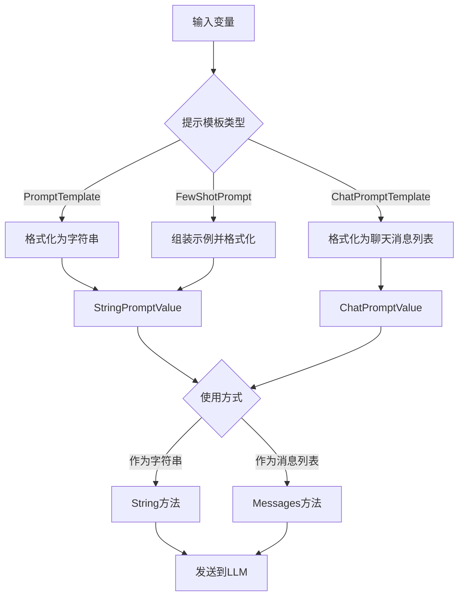

# LangChainGo Prompts 包分析

## 概述

`prompts` 包是 LangChainGo 中用于处理和管理大语言模型提示的核心组件。该包提供了一系列类型、提示模板、加载工具、输出解析器、示例选择器和其他与 LLM 提示相关的实用工具。

## 核心接口

`prompts` 包定义了三个核心接口，它们构成了整个提示系统的基础：

### Formatter 接口

```go
type Formatter interface {
	Format(values map[string]any) (string, error)
}
```

`Formatter` 接口用于将值映射格式化为字符串。实现此接口的类型能够将变量值替换到模板中，生成最终的提示文本。

### MessageFormatter 接口

```go
type MessageFormatter interface {
	FormatMessages(values map[string]any) ([]llms.ChatMessage, error)
	GetInputVariables() []string
}
```

`MessageFormatter` 接口用于将值映射格式化为聊天消息列表。它不仅能够格式化消息，还能够返回模板中使用的输入变量列表。

### FormatPrompter 接口

```go
type FormatPrompter interface {
	FormatPrompt(values map[string]any) (llms.PromptValue, error)
	GetInputVariables() []string
}
```

`FormatPrompter` 接口用于将值映射格式化为提示值。提示值可以是字符串或聊天消息列表，这取决于具体的实现。

## 提示值类型

### StringPromptValue

```go
type StringPromptValue string
```

`StringPromptValue` 是一个字符串类型的提示值，它实现了 `llms.PromptValue` 接口。它可以直接作为字符串使用，也可以转换为单个人类消息的聊天消息列表。

### ChatPromptValue

```go
type ChatPromptValue []llms.ChatMessage
```

`ChatPromptValue` 是一个聊天消息列表类型的提示值，它也实现了 `llms.PromptValue` 接口。它可以直接作为聊天消息列表使用，也可以转换为缓冲区字符串。

## 模板格式

`prompts` 包支持三种模板格式：

```go
type TemplateFormat string

const (
	TemplateFormatGoTemplate TemplateFormat = "go-template"
	TemplateFormatJinja2 TemplateFormat = "jinja2"
	TemplateFormatFString TemplateFormat = "f-string"
)
```

1. **Go Template**：使用 Go 的 `text/template` 包实现的模板格式。
2. **Jinja2**：使用 `gonja` 库实现的类似 Python Jinja2 的模板格式。
3. **F-String**：使用自定义实现的类似 Python f-string 的模板格式。

每种模板格式都有对应的插值函数，用于将变量值替换到模板中。

## 提示模板

### PromptTemplate

```go
type PromptTemplate struct {
	Template string
	InputVariables []string
	TemplateFormat TemplateFormat
	OutputParser schema.OutputParser[any]
	PartialVariables map[string]any
}
```

`PromptTemplate` 是最基本的提示模板类型，它包含了模板字符串、输入变量列表、模板格式、输出解析器和部分变量映射。它实现了 `Formatter` 和 `FormatPrompter` 接口，可以将变量值替换到模板中，生成最终的提示文本或提示值。

### ChatPromptTemplate

```go
type ChatPromptTemplate struct {
	Messages []MessageFormatter
	PartialVariables map[string]any
}
```

`ChatPromptTemplate` 是用于聊天消息的提示模板，它包含了消息格式化器列表和部分变量映射。它实现了 `Formatter`、`MessageFormatter` 和 `FormatPrompter` 接口，可以将变量值替换到模板中，生成最终的聊天消息列表或提示值。

## 消息提示模板

`prompts` 包提供了多种消息提示模板，用于生成不同角色的聊天消息：

### SystemMessagePromptTemplate

```go
type SystemMessagePromptTemplate struct {
	Prompt PromptTemplate
}
```

`SystemMessagePromptTemplate` 用于生成系统消息，它包装了一个 `PromptTemplate`，并将格式化后的文本作为系统消息的内容。

### AIMessagePromptTemplate

```go
type AIMessagePromptTemplate struct {
	Prompt PromptTemplate
}
```

`AIMessagePromptTemplate` 用于生成 AI 消息，它包装了一个 `PromptTemplate`，并将格式化后的文本作为 AI 消息的内容。

### HumanMessagePromptTemplate

```go
type HumanMessagePromptTemplate struct {
	Prompt PromptTemplate
}
```

`HumanMessagePromptTemplate` 用于生成人类消息，它包装了一个 `PromptTemplate`，并将格式化后的文本作为人类消息的内容。

### GenericMessagePromptTemplate

```go
type GenericMessagePromptTemplate struct {
	Prompt PromptTemplate
	Role string
}
```

`GenericMessagePromptTemplate` 用于生成指定角色的消息，它包装了一个 `PromptTemplate` 和一个角色字符串，并将格式化后的文本作为指定角色消息的内容。

### MessagesPlaceholder

```go
type MessagesPlaceholder struct {
	VariableName string
}
```

`MessagesPlaceholder` 用于从变量值中获取聊天消息列表，它包含了变量名，并将变量值作为聊天消息列表返回。

## 少样本提示

### FewShotPrompt

```go
type FewShotPrompt struct {
	Examples []map[string]string
	ExampleSelector ExampleSelector
	ExamplePrompt PromptTemplate
	Prefix string
	Suffix string
	InputVariables []string
	PartialVariables map[string]any
	ExampleSeparator string
	TemplateFormat TemplateFormat
	ValidateTemplate bool
}
```

`FewShotPrompt` 用于生成包含示例的提示，它可以包含固定的示例列表或使用示例选择器动态选择示例。它将前缀、示例和后缀组合成最终的提示文本。

### ExampleSelector 接口

```go
type ExampleSelector interface {
	AddExample(example map[string]string) string
	SelectExamples(inputVariables map[string]string) []map[string]string
}
```

`ExampleSelector` 接口用于选择示例，它可以添加示例并根据输入变量选择合适的示例。

## 内部实现

### F-String 解析器

`prompts/internal/fstring` 包提供了 F-String 模板格式的解析器，它可以将类似 Python f-string 的模板字符串解析为最终的文本。

```go
func Format(template string, values map[string]any) (string, error)
```

`Format` 函数使用给定的值映射插值给定的模板，生成最终的文本。

## 类图

```mermaid
classDiagram
    class Formatter {
        <<interface>>
        +Format(values map[string]any) (string, error)
    }
    
    class MessageFormatter {
        <<interface>>
        +FormatMessages(values map[string]any) ([]llms.ChatMessage, error)
        +GetInputVariables() []string
    }
    
    class FormatPrompter {
        <<interface>>
        +FormatPrompt(values map[string]any) (llms.PromptValue, error)
        +GetInputVariables() []string
    }
    
    class llms.PromptValue {
        <<interface>>
        +String() string
        +Messages() []llms.ChatMessage
    }
    
    class StringPromptValue {
        +String() string
        +Messages() []llms.ChatMessage
    }
    
    class ChatPromptValue {
        +String() string
        +Messages() []llms.ChatMessage
    }
    
    class PromptTemplate {
        +Template string
        +InputVariables []string
        +TemplateFormat TemplateFormat
        +OutputParser schema.OutputParser[any]
        +PartialVariables map[string]any
        +Format(values map[string]any) (string, error)
        +FormatPrompt(values map[string]any) (llms.PromptValue, error)
        +GetInputVariables() []string
    }
    
    class ChatPromptTemplate {
        +Messages []MessageFormatter
        +PartialVariables map[string]any
        +FormatPrompt(values map[string]any) (llms.PromptValue, error)
        +Format(values map[string]any) (string, error)
        +FormatMessages(values map[string]any) ([]llms.ChatMessage, error)
        +GetInputVariables() []string
    }
    
    class SystemMessagePromptTemplate {
        +Prompt PromptTemplate
        +FormatMessages(values map[string]any) ([]llms.ChatMessage, error)
        +GetInputVariables() []string
    }
    
    class AIMessagePromptTemplate {
        +Prompt PromptTemplate
        +FormatMessages(values map[string]any) ([]llms.ChatMessage, error)
        +GetInputVariables() []string
    }
    
    class HumanMessagePromptTemplate {
        +Prompt PromptTemplate
        +FormatMessages(values map[string]any) ([]llms.ChatMessage, error)
        +GetInputVariables() []string
    }
    
    class GenericMessagePromptTemplate {
        +Prompt PromptTemplate
        +Role string
        +FormatMessages(values map[string]any) ([]llms.ChatMessage, error)
        +GetInputVariables() []string
    }
    
    class MessagesPlaceholder {
        +VariableName string
        +FormatMessages(values map[string]any) ([]llms.ChatMessage, error)
        +GetInputVariables() []string
    }
    
    class FewShotPrompt {
        +Examples []map[string]string
        +ExampleSelector ExampleSelector
        +ExamplePrompt PromptTemplate
        +Prefix string
        +Suffix string
        +InputVariables []string
        +PartialVariables map[string]any
        +ExampleSeparator string
        +TemplateFormat TemplateFormat
        +ValidateTemplate bool
        +Format(values map[string]any) (string, error)
        +FormatPrompt(values map[string]any) (llms.PromptValue, error)
        +GetInputVariables() []string
    }
    
    class ExampleSelector {
        <<interface>>
        +AddExample(example map[string]string) string
        +SelectExamples(inputVariables map[string]string) []map[string]string
    }
    
    StringPromptValue ..|> llms.PromptValue
    ChatPromptValue ..|> llms.PromptValue
    
    PromptTemplate ..|> Formatter
    PromptTemplate ..|> FormatPrompter
    
    ChatPromptTemplate ..|> Formatter
    ChatPromptTemplate ..|> MessageFormatter
    ChatPromptTemplate ..|> FormatPrompter
    
    SystemMessagePromptTemplate ..|> MessageFormatter
    AIMessagePromptTemplate ..|> MessageFormatter
    HumanMessagePromptTemplate ..|> MessageFormatter
    GenericMessagePromptTemplate ..|> MessageFormatter
    MessagesPlaceholder ..|> MessageFormatter
    
    FewShotPrompt ..|> Formatter
    FewShotPrompt ..|> FormatPrompter
```



## 提示流程图



## 设计模式与最佳实践

1. **接口分离原则**：`prompts` 包定义了多个接口，每个接口都有明确的职责，这符合接口分离原则。

2. **组合优于继承**：`prompts` 包中的类型大多使用组合而非继承，例如 `SystemMessagePromptTemplate` 包含了一个 `PromptTemplate`，而不是继承自它。

3. **策略模式**：模板格式的选择使用了策略模式，不同的模板格式对应不同的插值函数。

4. **工厂方法**：`prompts` 包提供了多个 `New*` 函数，用于创建不同类型的提示模板，这是工厂方法模式的应用。

5. **适配器模式**：`StringPromptValue` 和 `ChatPromptValue` 都实现了 `llms.PromptValue` 接口，它们可以适配不同类型的 LLM。

## 使用示例

### 基本提示模板

```go
template := prompts.NewPromptTemplate("Hello {{.name}}", []string{"name"})
result, err := template.Format(map[string]any{"name": "world"})
// result = "Hello world"
```

### 聊天提示模板

```go
template := prompts.NewChatPromptTemplate([]prompts.MessageFormatter{
    prompts.NewSystemMessagePromptTemplate(
        "You are a translation engine that can only translate text and cannot interpret it.",
        nil,
    ),
    prompts.NewHumanMessagePromptTemplate(
        `translate this text from {{.inputLang}} to {{.outputLang}}:\n{{.input}}`,
        []string{"inputLang", "outputLang", "input"},
    ),
})
value, err := template.FormatPrompt(map[string]any{
    "inputLang":  "English",
    "outputLang": "Chinese",
    "input":      "I love programming",
})
// value.Messages() 返回两个消息：系统消息和人类消息
```

### 少样本提示

```go
examplePrompt := prompts.NewPromptTemplate("Input: {{.input}}\nOutput: {{.output}}", []string{"input", "output"})
examples := []map[string]string{
    {"input": "2+2", "output": "4"},
    {"input": "2+3", "output": "5"},
}
fewShotPrompt, err := prompts.NewFewShotPrompt(
    examplePrompt,
    examples,
    nil,
    "You are a calculator. Solve the following arithmetic problems:\n",
    "Input: {{.input}}\nOutput: ",
    []string{"input"},
    nil,
    "\n",
    prompts.TemplateFormatGoTemplate,
    true,
)
result, err := fewShotPrompt.Format(map[string]any{"input": "3+3"})
// result 包含前缀、示例和后缀，最终形成一个完整的提示
```

## 总结

`prompts` 包是 LangChainGo 中用于处理和管理大语言模型提示的核心组件。它提供了丰富的接口和类型，支持多种模板格式和提示类型，可以满足各种提示需求。通过组合不同的提示模板和消息格式化器，可以构建复杂的提示系统，提高大语言模型的输出质量和可控性。