# MCP-Go Client 包架构分析

## 概述

MCP-Go Client 包是 Model Context Protocol (MCP) 的 Go 语言客户端实现，提供了与 MCP 服务器进行通信的功能。该包采用了模块化设计，通过接口抽象和多种传输层实现，使客户端能够灵活地适应不同的通信场景。

## 接口定义

MCP-Go Client 包的核心是 `MCPClient` 接口，定义在 `interface.go` 文件中。该接口定义了客户端与 MCP 服务器交互的所有方法：

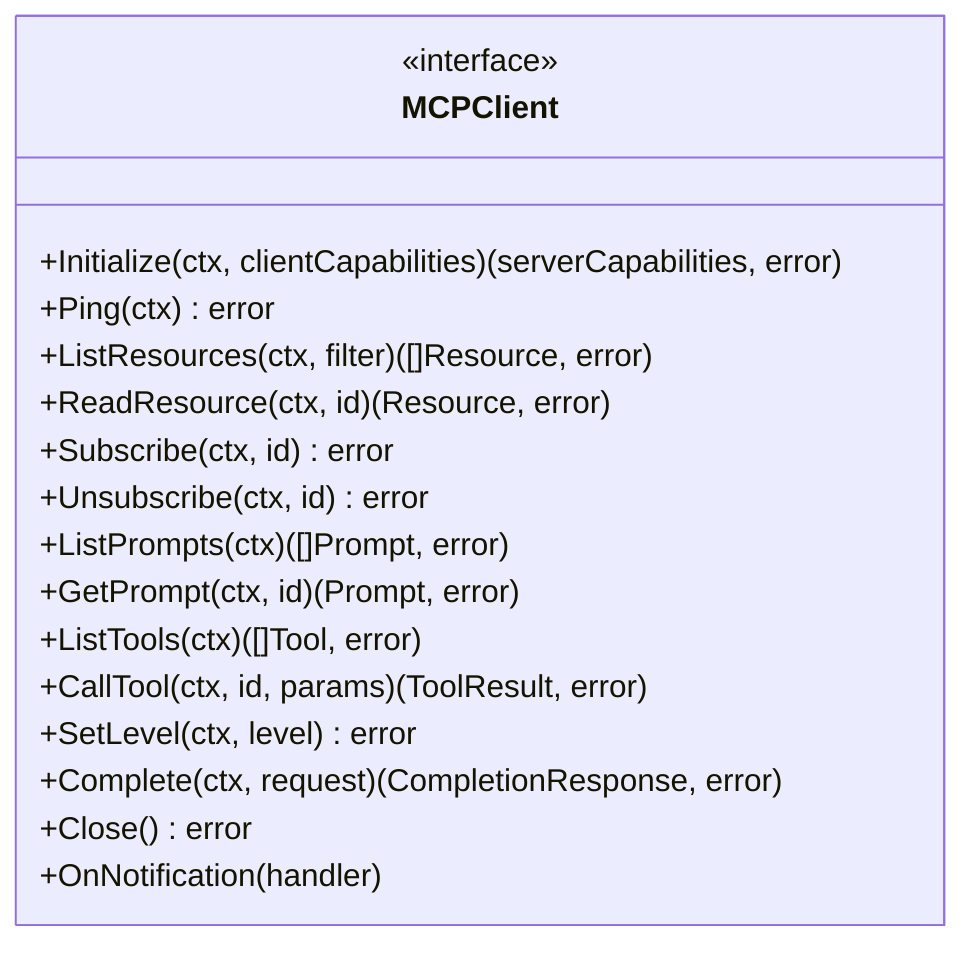
```mermaid
classDiagram
    class MCPClient {
        <<interface>>
        +Initialize(ctx, clientCapabilities) (serverCapabilities, error)
        +Ping(ctx) error
        +ListResources(ctx, filter) ([]Resource, error)
        +ReadResource(ctx, id) (Resource, error)
        +Subscribe(ctx, id) error
        +Unsubscribe(ctx, id) error
        +ListPrompts(ctx) ([]Prompt, error)
        +GetPrompt(ctx, id) (Prompt, error)
        +ListTools(ctx) ([]Tool, error)
        +CallTool(ctx, id, params) (ToolResult, error)
        +SetLevel(ctx, level) error
        +Complete(ctx, request) (CompletionResponse, error)
        +Close() error
        +OnNotification(handler)
    }
```

这个接口涵盖了：
- 连接初始化和管理（Initialize、Ping、Close）
- 资源管理（ListResources、ReadResource、Subscribe、Unsubscribe）
- 提示管理（ListPrompts、GetPrompt）
- 工具管理（ListTools、CallTool）
- 日志级别设置（SetLevel）
- 完成请求（Complete）
- 通知处理（OnNotification）

### 接口分层架构

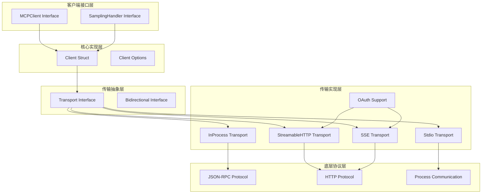
```mermaid
graph TB
    subgraph "客户端接口层"
        MCPClient[MCPClient Interface]
        SamplingHandler[SamplingHandler Interface]
    end
    
    subgraph "核心实现层"
        Client[Client Struct]
        ClientOptions[Client Options]
    end
    
    subgraph "传输抽象层"
        TransportInterface[Transport Interface]
        BidirectionalInterface[Bidirectional Interface]
    end
    
    subgraph "传输实现层"
        Stdio[Stdio Transport]
        StreamableHTTP[StreamableHTTP Transport]
        SSE[SSE Transport]
        InProcess[InProcess Transport]
        OAuth[OAuth Support]
    end
    
    subgraph "底层协议层"
        JSONRPC[JSON-RPC Protocol]
        HTTPProtocol[HTTP Protocol]
        ProcessComm[Process Communication]
    end
    
    MCPClient --> Client
    SamplingHandler --> Client
    Client --> TransportInterface
    TransportInterface --> Stdio
    TransportInterface --> StreamableHTTP
    TransportInterface --> SSE
    TransportInterface --> InProcess
    
    Stdio --> ProcessComm
    StreamableHTTP --> HTTPProtocol
    SSE --> HTTPProtocol
    InProcess --> JSONRPC
    
    OAuth --> StreamableHTTP
    OAuth --> SSE
```

### 客户端状态管理

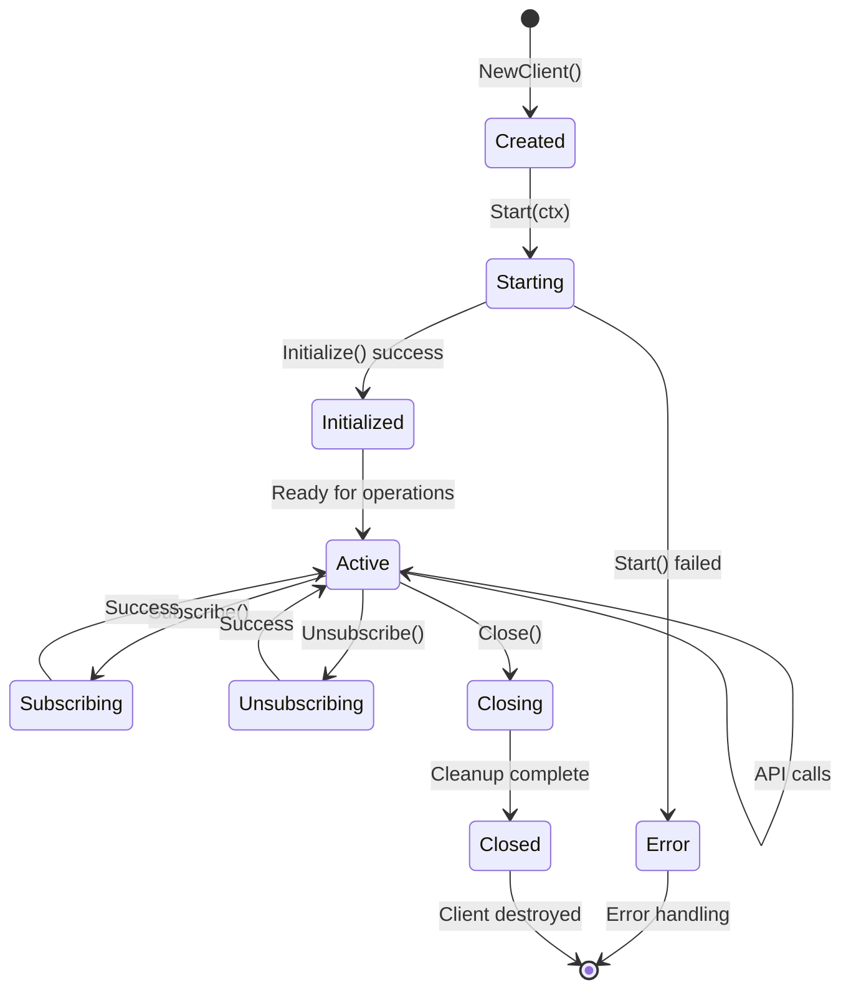
```mermaid
stateDiagram-v2
    [*] --> Created: NewClient()
    Created --> Starting: Start(ctx)
    Starting --> Initialized: Initialize() success
    Starting --> Error: Start() failed
    
    Initialized --> Active: Ready for operations
    Active --> Active: API calls
    Active --> Subscribing: Subscribe()
    Active --> Unsubscribing: Unsubscribe()
    
    Subscribing --> Active: Success
    Unsubscribing --> Active: Success
    
    Active --> Closing: Close()
    Closing --> Closed: Cleanup complete
    
    Error --> [*]: Error handling
    Closed --> [*]: Client destroyed
```

## 核心客户端实现

`Client` 结构体（定义在 `client.go` 文件中）是 `MCPClient` 接口的主要实现：

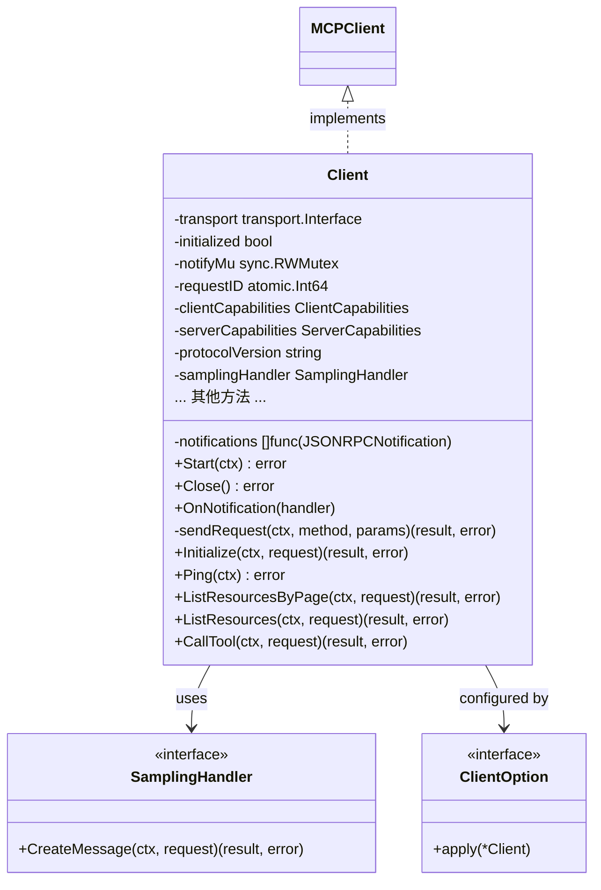
```mermaid
classDiagram
    class Client {
        -transport transport.Interface
        -initialized bool
        -notifications []func(JSONRPCNotification)
        -notifyMu sync.RWMutex
        -requestID atomic.Int64
        -clientCapabilities ClientCapabilities
        -serverCapabilities ServerCapabilities
        -protocolVersion string
        -samplingHandler SamplingHandler
        +Start(ctx) error
        +Close() error
        +OnNotification(handler)
        -sendRequest(ctx, method, params) (result, error)
        +Initialize(ctx, request) (result, error)
        +Ping(ctx) error
        +ListResourcesByPage(ctx, request) (result, error)
        +ListResources(ctx, request) (result, error)
        +CallTool(ctx, request) (result, error)
        ... 其他方法 ...
    }

    MCPClient <|.. Client : implements
    
    class ClientOption {
        <<interface>>
        +apply(*Client)
    }
    
    class SamplingHandler {
        <<interface>>
        +CreateMessage(ctx, request) (result, error)
    }
    
    Client --> SamplingHandler : uses
    Client --> ClientOption : configured by
```

### 客户端核心架构

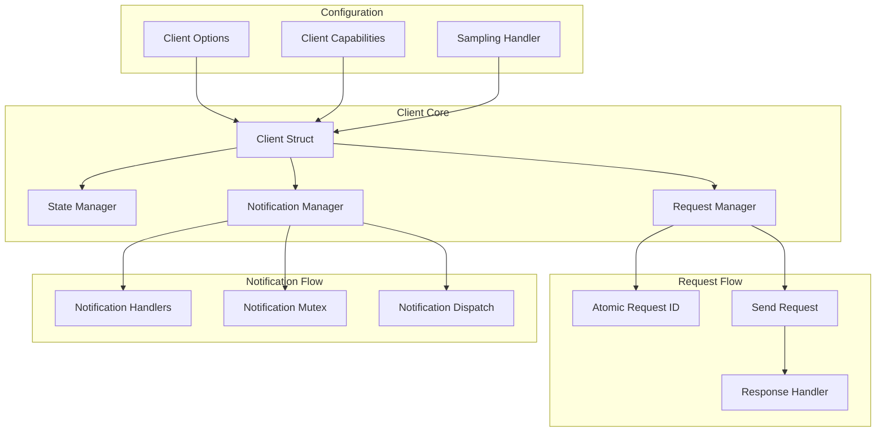
```mermaid
graph TB
    subgraph "Client Core"
        ClientStruct[Client Struct]
        StateManager[State Manager]
        RequestManager[Request Manager]
        NotificationManager[Notification Manager]
    end
    
    subgraph "Configuration"
        ClientOptions[Client Options]
        Capabilities[Client Capabilities]
        SamplingHandler[Sampling Handler]
    end
    
    subgraph "Request Flow"
        RequestID[Atomic Request ID]
        SendRequest[Send Request]
        ResponseHandler[Response Handler]
    end
    
    subgraph "Notification Flow"
        NotificationHandlers[Notification Handlers]
        NotificationMutex[Notification Mutex]
        NotificationDispatch[Notification Dispatch]
    end
    
    ClientStruct --> StateManager
    ClientStruct --> RequestManager
    ClientStruct --> NotificationManager
    
    ClientOptions --> ClientStruct
    Capabilities --> ClientStruct
    SamplingHandler --> ClientStruct
    
    RequestManager --> RequestID
    RequestManager --> SendRequest
    SendRequest --> ResponseHandler
    
    NotificationManager --> NotificationHandlers
    NotificationManager --> NotificationMutex
    NotificationManager --> NotificationDispatch
```

`Client` 结构体的主要特点：
1. **传输层抽象**: 使用传输层接口（`transport.Interface`）进行通信，支持多种传输方式
2. **状态管理**: 维护客户端状态（初始化状态、请求ID、能力等）
3. **并发安全**: 使用原子操作和互斥锁确保线程安全
4. **通知处理**: 处理通知的异步传递，支持多个处理器
5. **采样支持**: 集成采样处理器，支持LLM采样请求
6. **选项模式**: 使用函数选项模式进行灵活配置

### 请求-响应流程

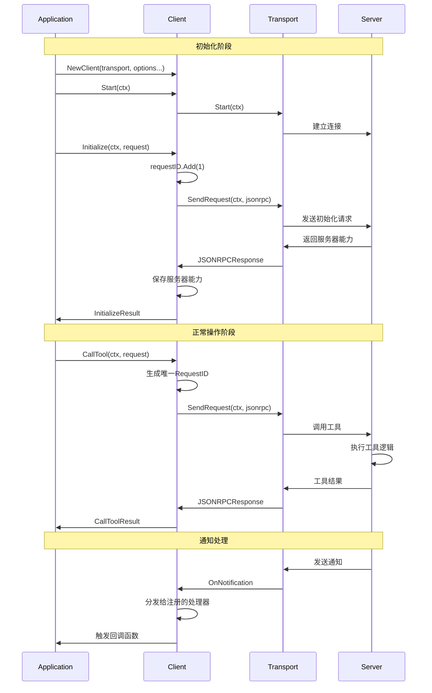
```mermaid
sequenceDiagram
    participant App as Application
    participant C as Client
    participant T as Transport
    participant S as Server
    
    Note over App,S: 初始化阶段
    App->>C: NewClient(transport, options...)
    App->>C: Start(ctx)
    C->>T: Start(ctx)
    T->>S: 建立连接
    
    App->>C: Initialize(ctx, request)
    C->>C: requestID.Add(1)
    C->>T: SendRequest(ctx, jsonrpc)
    T->>S: 发送初始化请求
    S->>T: 返回服务器能力
    T->>C: JSONRPCResponse
    C->>C: 保存服务器能力
    C->>App: InitializeResult
    
    Note over App,S: 正常操作阶段
    App->>C: CallTool(ctx, request)
    C->>C: 生成唯一RequestID
    C->>T: SendRequest(ctx, jsonrpc)
    T->>S: 调用工具
    S->>S: 执行工具逻辑
    S->>T: 工具结果
    T->>C: JSONRPCResponse
    C->>App: CallToolResult
    
    Note over App,S: 通知处理
    S->>T: 发送通知
    T->>C: OnNotification
    C->>C: 分发给注册的处理器
    C->>App: 触发回调函数
```

## 传输层实现

传输层是 MCP-Go Client 包的核心组件之一，定义在 `transport` 子包中。传输层通过 `transport.Interface` 接口进行抽象：

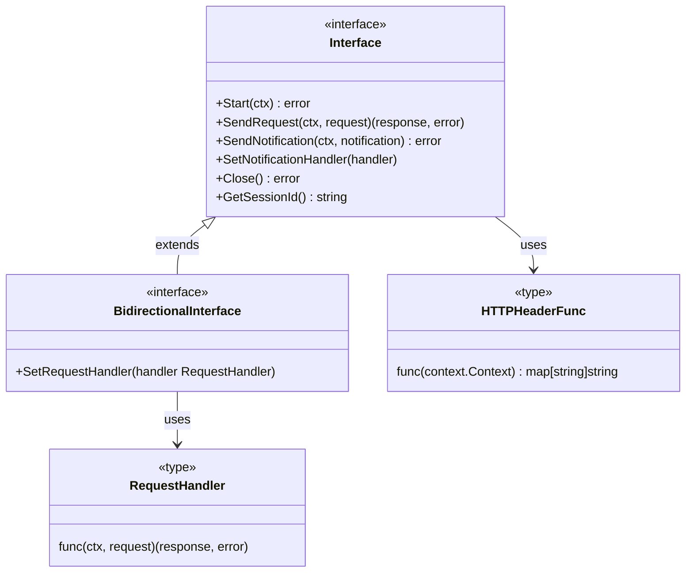
```mermaid
classDiagram
    class Interface {
        <<interface>>
        +Start(ctx) error
        +SendRequest(ctx, request) (response, error)
        +SendNotification(ctx, notification) error
        +SetNotificationHandler(handler)
        +Close() error
        +GetSessionId() string
    }
    
    class BidirectionalInterface {
        <<interface>>
        +SetRequestHandler(handler RequestHandler)
    }
    
    class RequestHandler {
        <<type>>
        func(ctx, request) (response, error)
    }
    
    class HTTPHeaderFunc {
        <<type>>
        func(context.Context) map[string]string
    }
    
    Interface <|-- BidirectionalInterface : extends
    BidirectionalInterface --> RequestHandler : uses
    Interface --> HTTPHeaderFunc : uses
```

### 传输层架构设计

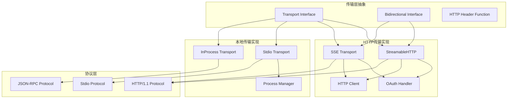
```mermaid
graph TB
    subgraph "传输层抽象"
        TInterface[Transport Interface]
        BInterface[Bidirectional Interface]
        HeaderFunc[HTTP Header Function]
    end
    
    subgraph "HTTP传输实现"
        StreamableHTTP[StreamableHTTP]
        SSE[SSE Transport]
        OAuthHandler[OAuth Handler]
        HTTPClient[HTTP Client]
    end
    
    subgraph "本地传输实现"
        Stdio[Stdio Transport]
        InProcess[InProcess Transport]
        ProcessManager[Process Manager]
    end
    
    subgraph "协议层"
        JSONRPC[JSON-RPC Protocol]
        HTTPProtocol[HTTP/1.1 Protocol]
        StdioProtocol[Stdio Protocol]
    end
    
    TInterface --> StreamableHTTP
    TInterface --> SSE
    TInterface --> Stdio
    TInterface --> InProcess
    
    BInterface --> StreamableHTTP
    BInterface --> SSE
    
    StreamableHTTP --> OAuthHandler
    StreamableHTTP --> HTTPClient
    SSE --> OAuthHandler
    SSE --> HTTPClient
    
    Stdio --> ProcessManager
    
    StreamableHTTP --> HTTPProtocol
    SSE --> HTTPProtocol
    Stdio --> StdioProtocol
    InProcess --> JSONRPC
```

该包提供了多种传输层实现，以适应不同的通信场景：

### StreamableHTTP 传输（增强版）

基于检查代码发现的新特性，`StreamableHTTP` 传输实现更加复杂和功能丰富：

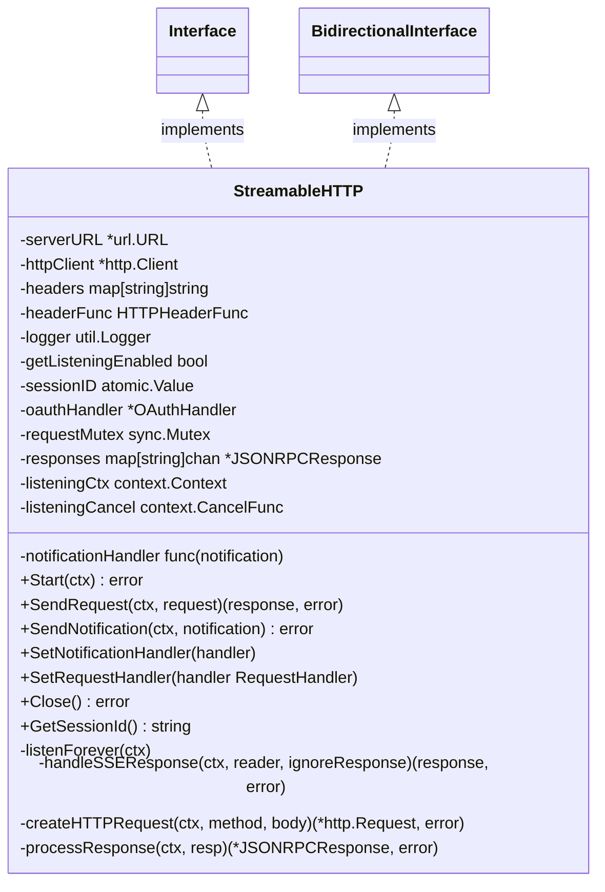
```mermaid
classDiagram
    class StreamableHTTP {
        -serverURL *url.URL
        -httpClient *http.Client
        -headers map[string]string
        -headerFunc HTTPHeaderFunc
        -logger util.Logger
        -getListeningEnabled bool
        -sessionID atomic.Value
        -notificationHandler func(notification)
        -oauthHandler *OAuthHandler
        -requestMutex sync.Mutex
        -responses map[string]chan *JSONRPCResponse
        -listeningCtx context.Context
        -listeningCancel context.CancelFunc
        +Start(ctx) error
        +SendRequest(ctx, request) (response, error)
        +SendNotification(ctx, notification) error
        +SetNotificationHandler(handler)
        +SetRequestHandler(handler RequestHandler)
        +Close() error
        +GetSessionId() string
        -listenForever(ctx)
        -handleSSEResponse(ctx, reader, ignoreResponse) (response, error)
        -createHTTPRequest(ctx, method, body) (*http.Request, error)
        -processResponse(ctx, resp) (*JSONRPCResponse, error)
    }

    Interface <|.. StreamableHTTP : implements
    BidirectionalInterface <|.. StreamableHTTP : implements
```

#### StreamableHTTP 特性分析

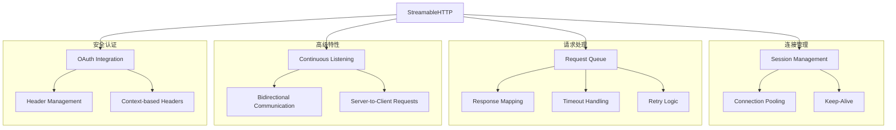
```mermaid
graph TB
    subgraph "连接管理"
        SessionMgmt[Session Management]
        ConnPool[Connection Pooling]
        KeepAlive[Keep-Alive]
    end
    
    subgraph "请求处理"
        ReqQueue[Request Queue]
        ResponseMap[Response Mapping]
        Timeout[Timeout Handling]
        Retry[Retry Logic]
    end
    
    subgraph "高级特性"
        ContinuousListening[Continuous Listening]
        BidirectionalComm[Bidirectional Communication]
        ServerToClient[Server-to-Client Requests]
    end
    
    subgraph "安全认证"
        OAuthIntegration[OAuth Integration]
        HeaderManagement[Header Management]
        ContextHeaders[Context-based Headers]
    end
    
    StreamableHTTP --> SessionMgmt
    StreamableHTTP --> ReqQueue
    StreamableHTTP --> ContinuousListening
    StreamableHTTP --> OAuthIntegration
    
    SessionMgmt --> ConnPool
    SessionMgmt --> KeepAlive
    
    ReqQueue --> ResponseMap
    ReqQueue --> Timeout
    ReqQueue --> Retry
    
    ContinuousListening --> BidirectionalComm
    ContinuousListening --> ServerToClient
    
    OAuthIntegration --> HeaderManagement
    OAuthIntegration --> ContextHeaders
```

**关键特性**：
1. **持续监听**: 支持`WithContinuousListening()`选项，建立长连接接收服务器主动通知
2. **双向通信**: 实现`BidirectionalInterface`，支持服务器向客户端发送请求
3. **OAuth集成**: 内置OAuth 2.0认证支持
4. **会话管理**: 原子会话ID管理，支持会话隔离
5. **灵活配置**: 支持自定义HTTP客户端、头部函数、超时等

### SSE 传输

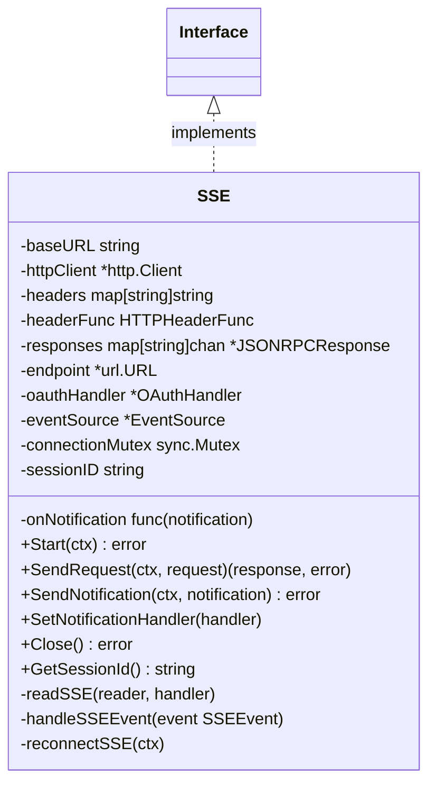
```mermaid
classDiagram
    class SSE {
        -baseURL string
        -httpClient *http.Client
        -headers map[string]string
        -headerFunc HTTPHeaderFunc
        -responses map[string]chan *JSONRPCResponse
        -onNotification func(notification)
        -endpoint *url.URL
        -oauthHandler *OAuthHandler
        -eventSource *EventSource
        -connectionMutex sync.Mutex
        -sessionID string
        +Start(ctx) error
        +SendRequest(ctx, request) (response, error)
        +SendNotification(ctx, notification) error
        +SetNotificationHandler(handler)
        +Close() error
        +GetSessionId() string
        -readSSE(reader, handler)
        -handleSSEEvent(event SSEEvent)
        -reconnectSSE(ctx)
    }

    Interface <|.. SSE : implements
```

#### SSE 实时通信流程

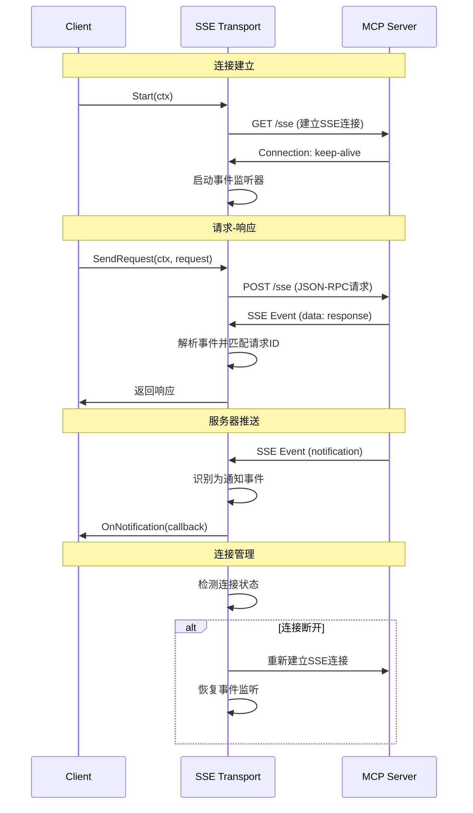
```mermaid
sequenceDiagram
    participant C as Client
    participant SSE as SSE Transport
    participant Server as MCP Server
    
    Note over C,Server: 连接建立
    C->>SSE: Start(ctx)
    SSE->>Server: GET /sse (建立SSE连接)
    Server->>SSE: Connection: keep-alive
    SSE->>SSE: 启动事件监听器
    
    Note over C,Server: 请求-响应
    C->>SSE: SendRequest(ctx, request)
    SSE->>Server: POST /sse (JSON-RPC请求)
    Server->>SSE: SSE Event (data: response)
    SSE->>SSE: 解析事件并匹配请求ID
    SSE->>C: 返回响应
    
    Note over C,Server: 服务器推送
    Server->>SSE: SSE Event (notification)
    SSE->>SSE: 识别为通知事件
    SSE->>C: OnNotification(callback)
    
    Note over C,Server: 连接管理
    SSE->>SSE: 检测连接状态
    alt 连接断开
        SSE->>Server: 重新建立SSE连接
        SSE->>SSE: 恢复事件监听
    end
```

### SSE 传输

`SSE`（Server-Sent Events）传输实现使用 HTTP 长连接接收服务器推送的事件，并通过 HTTP POST 发送请求：

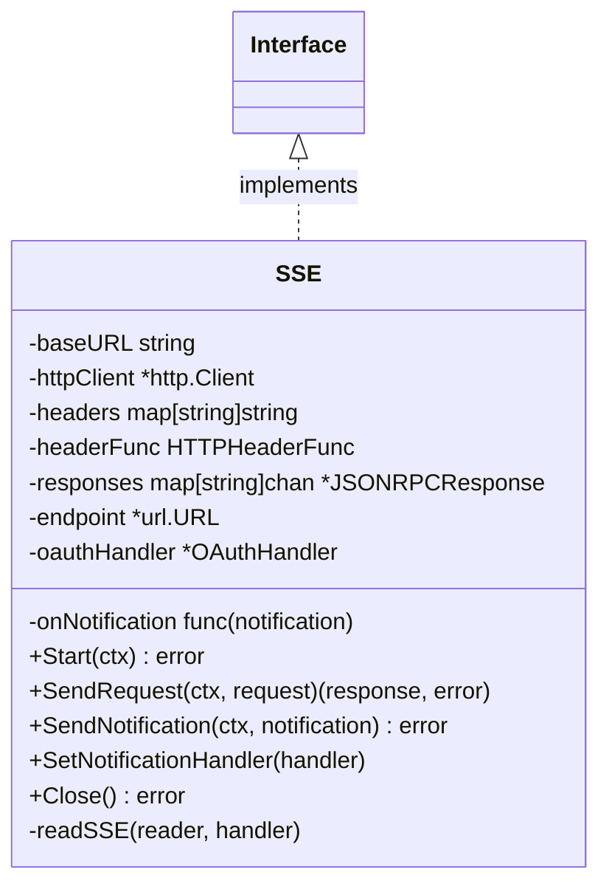
```mermaid
classDiagram
    class SSE {
        -baseURL string
        -httpClient *http.Client
        -headers map[string]string
        -headerFunc HTTPHeaderFunc
        -responses map[string]chan *JSONRPCResponse
        -onNotification func(notification)
        -endpoint *url.URL
        -oauthHandler *OAuthHandler
        +Start(ctx) error
        +SendRequest(ctx, request) (response, error)
        +SendNotification(ctx, notification) error
        +SetNotificationHandler(handler)
        +Close() error
        -readSSE(reader, handler)
    }

    Interface <|.. SSE : implements
```

### Streamable HTTP 传输

`StreamableHTTP` 传输实现通过单独的 HTTP 请求传输 JSON-RPC 消息，每个请求一条消息：

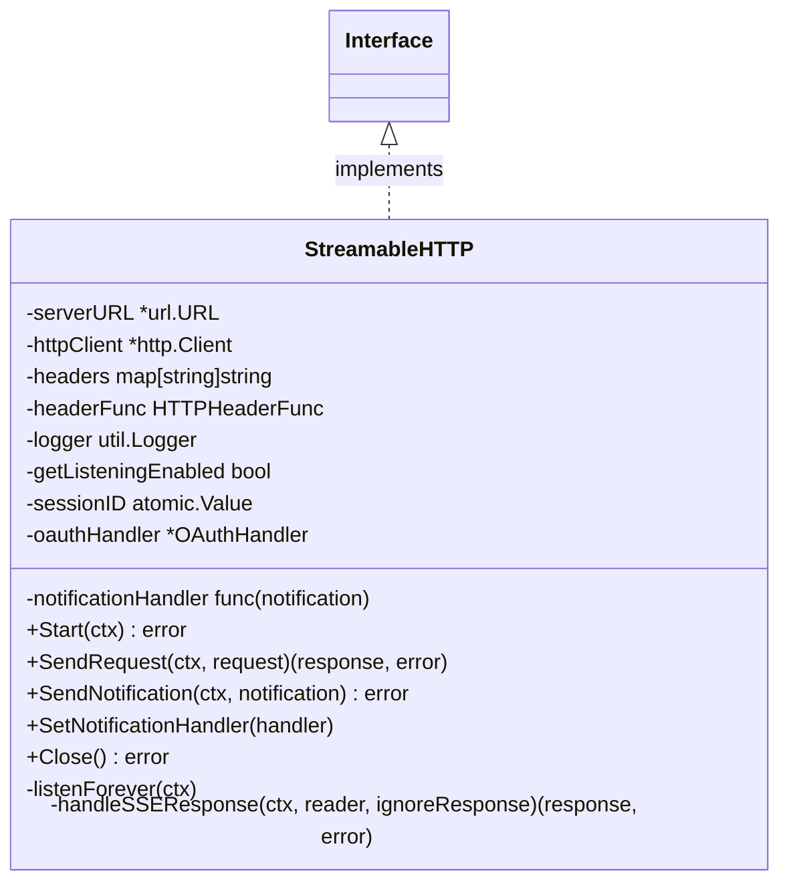
```mermaid
classDiagram
    class StreamableHTTP {
        -serverURL *url.URL
        -httpClient *http.Client
        -headers map[string]string
        -headerFunc HTTPHeaderFunc
        -logger util.Logger
        -getListeningEnabled bool
        -sessionID atomic.Value
        -notificationHandler func(notification)
        -oauthHandler *OAuthHandler
        +Start(ctx) error
        +SendRequest(ctx, request) (response, error)
        +SendNotification(ctx, notification) error
        +SetNotificationHandler(handler)
        +Close() error
        -listenForever(ctx)
        -handleSSEResponse(ctx, reader, ignoreResponse) (response, error)
    }

    Interface <|.. StreamableHTTP : implements
```

### Stdio 传输

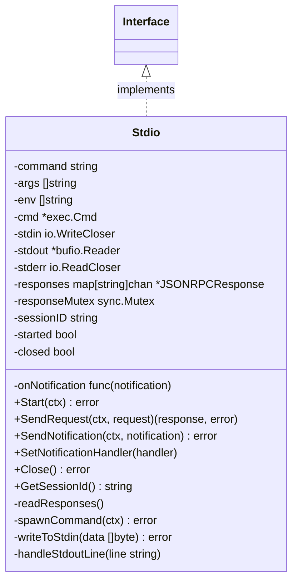
```mermaid
classDiagram
    class Stdio {
        -command string
        -args []string
        -env []string
        -cmd *exec.Cmd
        -stdin io.WriteCloser
        -stdout *bufio.Reader
        -stderr io.ReadCloser
        -responses map[string]chan *JSONRPCResponse
        -responseMutex sync.Mutex
        -onNotification func(notification)
        -sessionID string
        -started bool
        -closed bool
        +Start(ctx) error
        +SendRequest(ctx, request) (response, error)
        +SendNotification(ctx, notification) error
        +SetNotificationHandler(handler)
        +Close() error
        +GetSessionId() string
        -readResponses()
        -spawnCommand(ctx) error
        -writeToStdin(data []byte) error
        -handleStdoutLine(line string)
    }

    Interface <|.. Stdio : implements
```

#### Stdio 进程通信架构

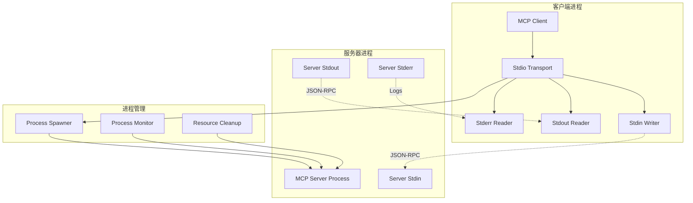
```mermaid
graph TB
    subgraph "客户端进程"
        Client[MCP Client]
        StdioTransport[Stdio Transport]
        StdinWriter[Stdin Writer]
        StdoutReader[Stdout Reader]
        StderrReader[Stderr Reader]
    end
    
    subgraph "服务器进程"
        ServerProcess[MCP Server Process]
        ServerStdin[Server Stdin]
        ServerStdout[Server Stdout]
        ServerStderr[Server Stderr]
    end
    
    subgraph "进程管理"
        ProcessSpawner[Process Spawner]
        ProcessMonitor[Process Monitor]
        ResourceCleanup[Resource Cleanup]
    end
    
    Client --> StdioTransport
    StdioTransport --> StdinWriter
    StdioTransport --> StdoutReader
    StdioTransport --> StderrReader
    StdioTransport --> ProcessSpawner
    
    StdinWriter -.->|JSON-RPC| ServerStdin
    ServerStdout -.->|JSON-RPC| StdoutReader
    ServerStderr -.->|Logs| StderrReader
    
    ProcessSpawner --> ServerProcess
    ProcessMonitor --> ServerProcess
    ResourceCleanup --> ServerProcess
```

### InProcess 传输

`InProcess` 传输实现允许在同一进程内直接与 MCP 服务器通信：

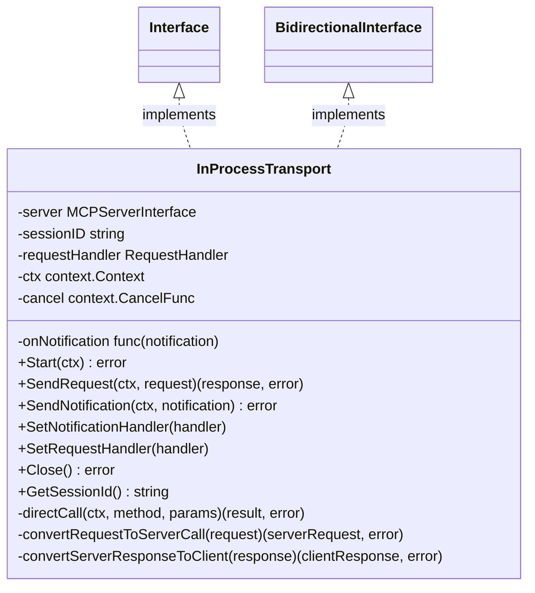
```mermaid
classDiagram
    class InProcessTransport {
        -server MCPServerInterface
        -onNotification func(notification)
        -sessionID string
        -requestHandler RequestHandler
        -ctx context.Context
        -cancel context.CancelFunc
        +Start(ctx) error
        +SendRequest(ctx, request) (response, error)
        +SendNotification(ctx, notification) error
        +SetNotificationHandler(handler)
        +SetRequestHandler(handler)
        +Close() error
        +GetSessionId() string
        -directCall(ctx, method, params) (result, error)
        -convertRequestToServerCall(request) (serverRequest, error)
        -convertServerResponseToClient(response) (clientResponse, error)
    }

    Interface <|.. InProcessTransport : implements
    BidirectionalInterface <|.. InProcessTransport : implements
```

#### InProcess 直接调用流程

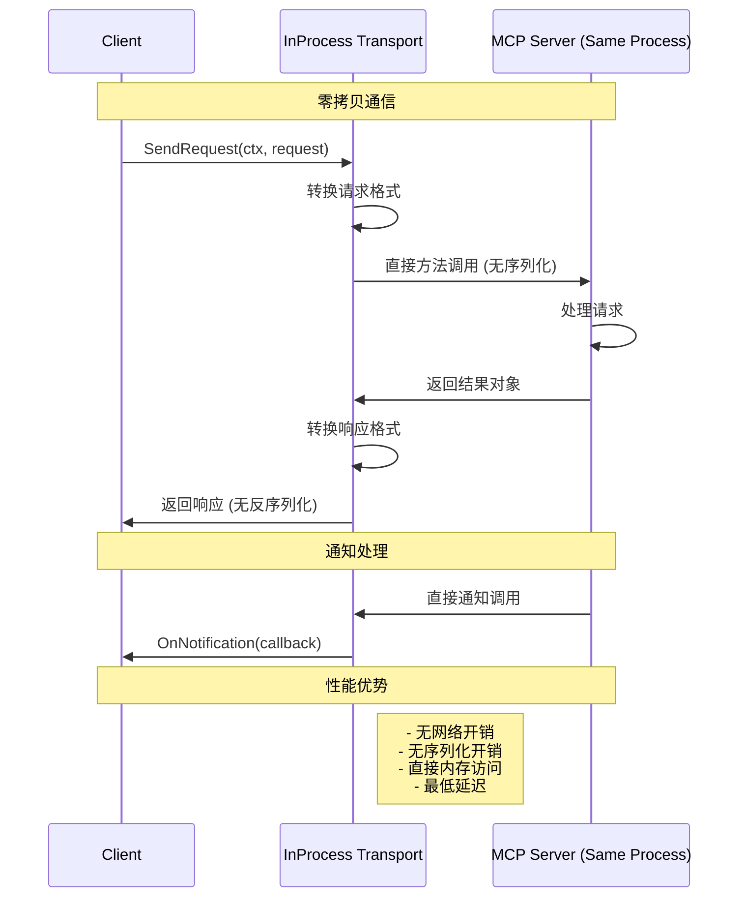
```mermaid
sequenceDiagram
    participant C as Client
    participant IP as InProcess Transport
    participant S as MCP Server (Same Process)
    
    Note over C,S: 零拷贝通信
    C->>IP: SendRequest(ctx, request)
    IP->>IP: 转换请求格式
    IP->>S: 直接方法调用 (无序列化)
    S->>S: 处理请求
    S->>IP: 返回结果对象
    IP->>IP: 转换响应格式
    IP->>C: 返回响应 (无反序列化)
    
    Note over C,S: 通知处理
    S->>IP: 直接通知调用
    IP->>C: OnNotification(callback)
    
    Note over C,S: 性能优势
    Note right of IP: - 无网络开销<br/>- 无序列化开销<br/>- 直接内存访问<br/>- 最低延迟
```

### 传输层选择策略

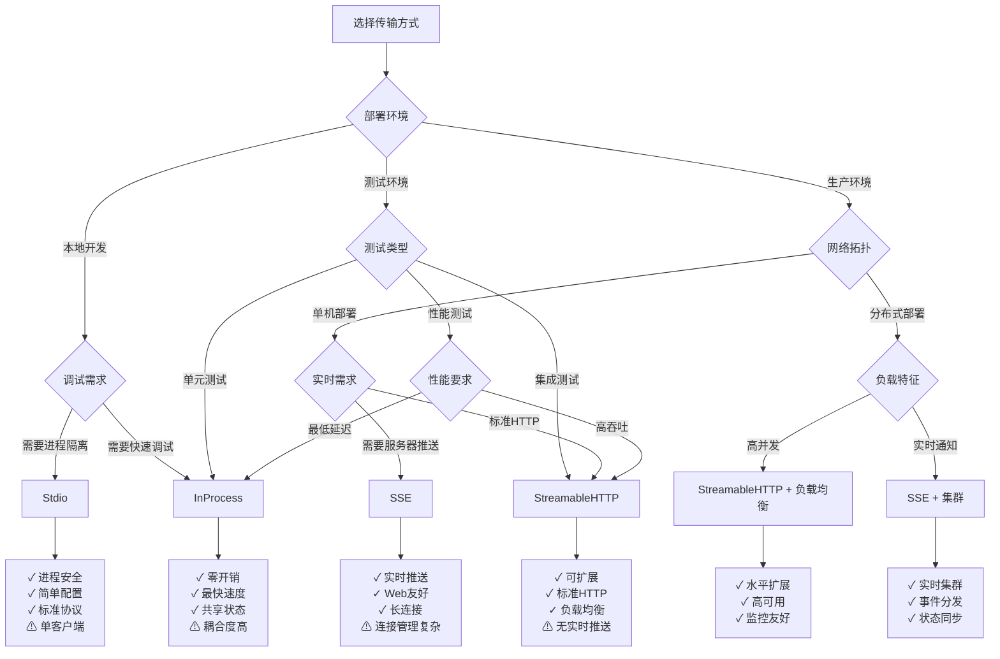
```mermaid
flowchart TD
    A[选择传输方式] --> B{部署环境}
    
    B -->|本地开发| C{调试需求}
    B -->|生产环境| D{网络拓扑}
    B -->|测试环境| E{测试类型}
    
    C -->|需要进程隔离| F[Stdio]
    C -->|需要快速调试| G[InProcess]
    
    D -->|单机部署| H{实时需求}
    D -->|分布式部署| I{负载特征}
    
    E -->|单元测试| G
    E -->|集成测试| J[StreamableHTTP]
    E -->|性能测试| K{性能要求}
    
    H -->|需要服务器推送| L[SSE]
    H -->|标准HTTP| J
    
    I -->|高并发| M[StreamableHTTP + 负载均衡]
    I -->|实时通知| N[SSE + 集群]
    
    K -->|最低延迟| G
    K -->|高吞吐| J
    
    F --> F1[✓ 进程安全<br/>✓ 简单配置<br/>✓ 标准协议<br/>⚠ 单客户端]
    G --> G1[✓ 零开销<br/>✓ 最快速度<br/>✓ 共享状态<br/>⚠ 耦合度高]
    J --> J1[✓ 可扩展<br/>✓ 标准HTTP<br/>✓ 负载均衡<br/>⚠ 无实时推送]
    L --> L1[✓ 实时推送<br/>✓ Web友好<br/>✓ 长连接<br/>⚠ 连接管理复杂]
    M --> M1[✓ 水平扩展<br/>✓ 高可用<br/>✓ 监控友好]
    N --> N1[✓ 实时集群<br/>✓ 事件分发<br/>✓ 状态同步]
```

## 认证机制

MCP-Go Client 包支持 OAuth 2.0 认证，通过 `OAuthHandler` 类实现：

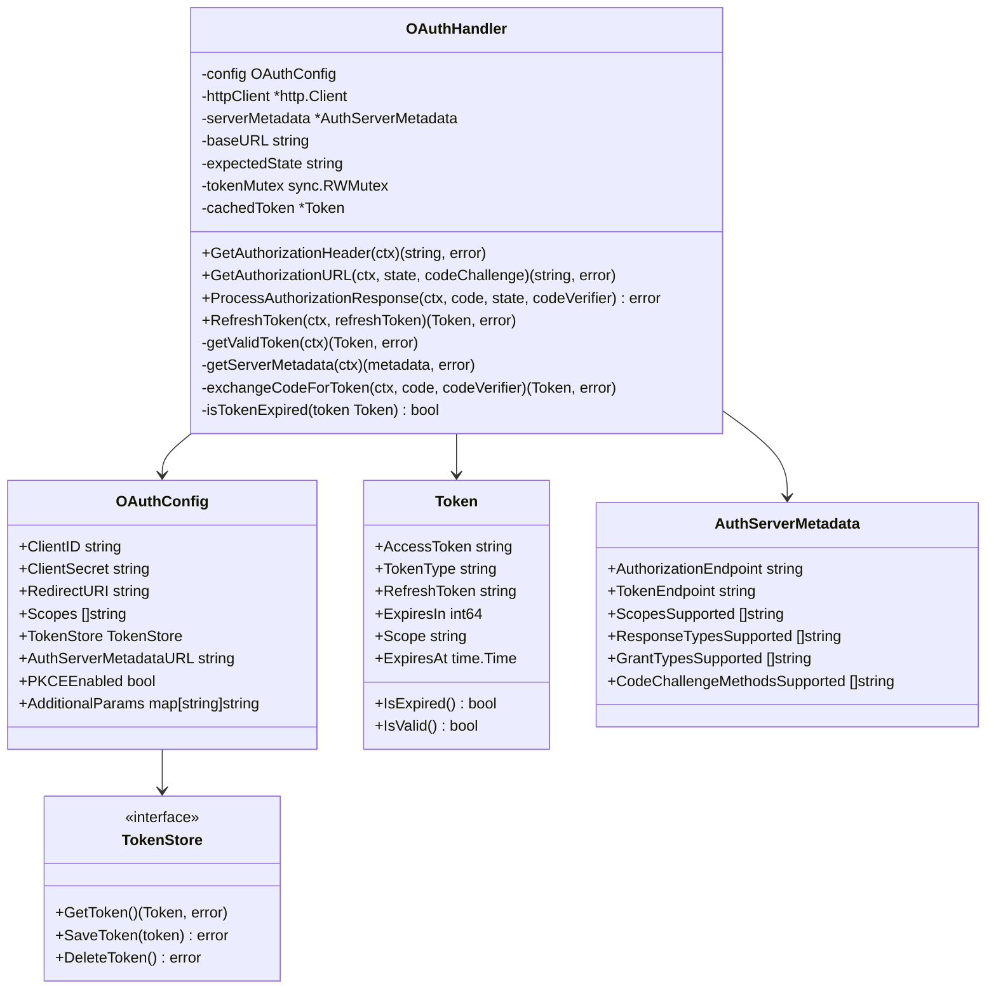
```mermaid
classDiagram
    class OAuthHandler {
        -config OAuthConfig
        -httpClient *http.Client
        -serverMetadata *AuthServerMetadata
        -baseURL string
        -expectedState string
        -tokenMutex sync.RWMutex
        -cachedToken *Token
        +GetAuthorizationHeader(ctx) (string, error)
        +GetAuthorizationURL(ctx, state, codeChallenge) (string, error)
        +ProcessAuthorizationResponse(ctx, code, state, codeVerifier) error
        +RefreshToken(ctx, refreshToken) (Token, error)
        -getValidToken(ctx) (Token, error)
        -getServerMetadata(ctx) (metadata, error)
        -exchangeCodeForToken(ctx, code, codeVerifier) (Token, error)
        -isTokenExpired(token Token) bool
    }

    class OAuthConfig {
        +ClientID string
        +ClientSecret string
        +RedirectURI string
        +Scopes []string
        +TokenStore TokenStore
        +AuthServerMetadataURL string
        +PKCEEnabled bool
        +AdditionalParams map[string]string
    }

    class TokenStore {
        <<interface>>
        +GetToken() (Token, error)
        +SaveToken(token) error
        +DeleteToken() error
    }

    class Token {
        +AccessToken string
        +TokenType string
        +RefreshToken string
        +ExpiresIn int64
        +Scope string
        +ExpiresAt time.Time
        +IsExpired() bool
        +IsValid() bool
    }

    class AuthServerMetadata {
        +AuthorizationEndpoint string
        +TokenEndpoint string
        +ScopesSupported []string
        +ResponseTypesSupported []string
        +GrantTypesSupported []string
        +CodeChallengeMethodsSupported []string
    }

    OAuthHandler --> OAuthConfig
    OAuthConfig --> TokenStore
    OAuthHandler --> Token
    OAuthHandler --> AuthServerMetadata
```

### OAuth 2.0 认证流程

```mermaid
sequenceDiagram
    participant App as Application
    participant Client as MCP Client
    participant OAuth as OAuth Handler
    participant AS as Authorization Server
    participant RS as Resource Server (MCP Server)
    
    Note over App,RS: 初始化阶段
    App->>Client: 创建带OAuth的客户端
    Client->>OAuth: 初始化OAuth配置
    OAuth->>AS: 获取服务器元数据
    AS->>OAuth: 返回授权端点信息
    
    Note over App,RS: 授权码流程 (PKCE)
    App->>OAuth: GetAuthorizationURL(state, challenge)
    OAuth->>OAuth: 生成code_verifier和code_challenge
    OAuth->>App: 返回授权URL
    App->>AS: 重定向到授权页面
    AS->>AS: 用户授权
    AS->>App: 返回授权码
    
    Note over App,RS: 令牌交换
    App->>OAuth: ProcessAuthorizationResponse(code, state, verifier)
    OAuth->>AS: POST /token (code + verifier)
    AS->>AS: 验证code和verifier
    AS->>OAuth: 返回access_token和refresh_token
    OAuth->>OAuth: 保存令牌到TokenStore
    
    Note over App,RS: API调用
    Client->>OAuth: GetAuthorizationHeader()
    OAuth->>OAuth: 检查令牌有效性
    alt 令牌已过期
        OAuth->>AS: 刷新令牌
        AS->>OAuth: 新的access_token
        OAuth->>OAuth: 更新TokenStore
    end
    OAuth->>Client: Authorization: Bearer <token>
    Client->>RS: MCP请求 + Authorization header
    RS->>RS: 验证令牌
    RS->>Client: MCP响应
```

### 安全特性架构

```mermaid
graph TB
    subgraph "认证层"
        OAuthFlow[OAuth 2.0 Flow]
        PKCEProtection[PKCE Protection]
        StateValidation[State Validation]
        TokenManagement[Token Management]
    end
    
    subgraph "令牌存储"
        TokenStore[Token Store Interface]
        FileStore[File Token Store]
        MemoryStore[Memory Token Store]
        CustomStore[Custom Token Store]
    end
    
    subgraph "安全机制"
        TokenRefresh[Automatic Token Refresh]
        SecureStorage[Secure Token Storage]
        NonceValidation[Nonce Validation]
        ScopeValidation[Scope Validation]
    end
    
    subgraph "传输安全"
        TLS[TLS/HTTPS]
        HeaderSecurity[Secure Headers]
        RequestSigning[Request Signing]
    end
    
    OAuthFlow --> PKCEProtection
    OAuthFlow --> StateValidation
    OAuthFlow --> TokenManagement
    
    TokenManagement --> TokenStore
    TokenStore --> FileStore
    TokenStore --> MemoryStore
    TokenStore --> CustomStore
    
    TokenManagement --> TokenRefresh
    TokenManagement --> SecureStorage
    
    PKCEProtection --> NonceValidation
    StateValidation --> ScopeValidation
    
    TokenManagement --> TLS
    TokenManagement --> HeaderSecurity
    TokenManagement --> RequestSigning
```

**关键安全特性**：

1. **PKCE支持**: 防止授权码拦截攻击
2. **State验证**: 防止CSRF攻击
3. **自动令牌刷新**: 无感知的令牌更新
4. **安全存储**: 支持多种令牌存储方式
5. **范围验证**: 确保适当的API访问权限
6. **TLS加密**: 所有通信都通过HTTPS进行

## 采样处理器 (Sampling Handler)

MCP-Go Client 引入了采样处理器，允许客户端为服务器提供LLM采样能力：

```mermaid
classDiagram
    class SamplingHandler {
        <<interface>>
        +CreateMessage(ctx, request) (result, error)
    }
    
    class CreateMessageRequest {
        +Messages []Message
        +ModelPreferences ModelPreferences
        +SystemPrompt string
        +IncludeContext string
        +Temperature float64
        +MaxTokens int
        +StopSequences []string
        +Metadata map[string]interface{}
    }
    
    class CreateMessageResult {
        +Content Content
        +Model string
        +StopReason string
        +Usage Usage
    }
    
    class ModelPreferences {
        +Hints []ModelHint
        +CostPriority float64
        +SpeedPriority float64
        +IntelligencePriority float64
    }
    
    SamplingHandler --> CreateMessageRequest
    SamplingHandler --> CreateMessageResult
    CreateMessageRequest --> ModelPreferences
```

### 采样架构设计

```mermaid
graph TB
    subgraph "MCP Server"
        ServerLogic[Server Logic]
        SamplingRequest[Sampling Request]
        ContextAnalysis[Context Analysis]
    end
    
    subgraph "MCP Client (with Sampling)"
        Client[MCP Client]
        SamplingHandler[Sampling Handler]
        ModelSelector[Model Selector]
        HumanApproval[Human-in-the-Loop]
    end
    
    subgraph "LLM Provider"
        LLMProvider[LLM Provider]
        ModelAPI[Model API]
        ResponseGeneration[Response Generation]
    end
    
    subgraph "安全控制"
        RequestValidation[Request Validation]
        ContentFiltering[Content Filtering]
        UsageTracking[Usage Tracking]
        CostControl[Cost Control]
    end
    
    ServerLogic --> SamplingRequest
    SamplingRequest --> Client
    Client --> SamplingHandler
    
    SamplingHandler --> RequestValidation
    SamplingHandler --> ModelSelector
    SamplingHandler --> HumanApproval
    
    ModelSelector --> LLMProvider
    LLMProvider --> ModelAPI
    ModelAPI --> ResponseGeneration
    
    RequestValidation --> ContentFiltering
    ModelSelector --> UsageTracking
    ModelSelector --> CostControl
    
    ResponseGeneration --> SamplingHandler
    SamplingHandler --> Client
    Client --> ServerLogic
```

### 采样处理流程

```mermaid
sequenceDiagram
    participant S as MCP Server
    participant C as MCP Client
    participant SH as Sampling Handler
    participant User as Human User
    participant LLM as LLM Provider
    
    Note over S,LLM: 服务器请求采样
    S->>C: CreateMessage Request
    C->>SH: CreateMessage(ctx, request)
    
    Note over SH,User: 验证和批准
    SH->>SH: 验证请求参数
    SH->>SH: 检查安全策略
    SH->>User: 显示采样请求
    User->>SH: 批准/拒绝
    
    alt 用户批准
        Note over SH,LLM: 模型选择和调用
        SH->>SH: 根据偏好选择模型
        SH->>LLM: 发送生成请求
        LLM->>LLM: 生成响应
        LLM->>SH: 返回生成结果
        
        Note over SH,S: 结果处理和返回
        SH->>SH: 后处理响应
        SH->>SH: 记录使用情况
        SH->>C: CreateMessageResult
        C->>S: 采样结果
    else 用户拒绝
        SH->>C: 拒绝错误
        C->>S: 采样失败
    end
```

### 实现示例

```go
type CustomSamplingHandler struct {
    llmClient    LLMClient
    userApproval UserApprovalService
    costTracker  CostTracker
    modelConfig  ModelConfiguration
}

func (h *CustomSamplingHandler) CreateMessage(
    ctx context.Context, 
    request mcp.CreateMessageRequest,
) (*mcp.CreateMessageResult, error) {
    // 1. 验证请求
    if err := h.validateRequest(request); err != nil {
        return nil, fmt.Errorf("invalid request: %w", err)
    }
    
    // 2. 人工审批（可选）
    if h.userApproval != nil {
        approved, err := h.userApproval.RequestApproval(ctx, request)
        if err != nil || !approved {
            return nil, fmt.Errorf("request not approved: %w", err)
        }
    }
    
    // 3. 选择最佳模型
    model, err := h.selectBestModel(request.ModelPreferences)
    if err != nil {
        return nil, fmt.Errorf("model selection failed: %w", err)
    }
    
    // 4. 成本检查
    estimatedCost := h.costTracker.EstimateCost(model, request)
    if !h.costTracker.CanAfford(estimatedCost) {
        return nil, fmt.Errorf("cost limit exceeded")
    }
    
    // 5. 调用LLM
    response, err := h.llmClient.Generate(ctx, GenerateRequest{
        Model:        model,
        Messages:     request.Messages,
        System:       request.SystemPrompt,
        Temperature:  request.Temperature,
        MaxTokens:    request.MaxTokens,
        StopSequences: request.StopSequences,
    })
    if err != nil {
        return nil, fmt.Errorf("LLM generation failed: %w", err)
    }
    
    // 6. 记录使用情况
    h.costTracker.RecordUsage(model, response.Usage)
    
    // 7. 构建结果
    return &mcp.CreateMessageResult{
        Content:    response.Content,
        Model:      model,
        StopReason: response.StopReason,
        Usage:      response.Usage,
    }, nil
}
```

## 便捷客户端创建

MCP-Go Client 包提供了多个便捷函数，用于创建不同类型的客户端：

```mermaid
classDiagram
    class ClientFactory {
        <<factory>>
        +NewClient(transport, options) *Client
        +NewSSEClient(url, options) (*Client, error)
        +NewStreamableHttpClient(url, options) (*Client, error)
        +NewStdioClient(command, env, args) (*Client, error)
        +NewInProcessClient(server) *Client
        +NewOAuthStreamableHttpClient(url, oauth, options) (*Client, error)
        +NewOAuthSSEClient(url, oauth, options) (*Client, error)
    }
    
    class ClientOptions {
        +WithClientCapabilities(caps)
        +WithSamplingHandler(handler)
        +WithSession()
        +WithTimeout(duration)
        +WithRetry(config)
    }
    
    class TransportOptions {
        +WithHTTPClient(client)
        +WithHeaders(headers)
        +WithHeaderFunc(func)
        +WithContinuousListening()
        +WithOAuth(config)
    }
    
    ClientFactory --> Client : creates
    ClientFactory --> ClientOptions : uses
    ClientFactory --> TransportOptions : uses
```

### 客户端创建模式

```mermaid
graph TB
    subgraph "简单创建模式"
        BasicClient[基础客户端]
        QuickSetup[快速设置]
        DefaultConfig[默认配置]
    end
    
    subgraph "高级创建模式"
        CustomTransport[自定义传输]
        AdvancedConfig[高级配置]
        PluginSystem[插件系统]
    end
    
    subgraph "企业级模式"
        OAuthIntegration[OAuth集成]
        SecurityConfig[安全配置]
        MonitoringSetup[监控设置]
        LoadBalancing[负载均衡]
    end
    
    BasicClient --> QuickSetup
    QuickSetup --> DefaultConfig
    
    CustomTransport --> AdvancedConfig
    AdvancedConfig --> PluginSystem
    
    OAuthIntegration --> SecurityConfig
    SecurityConfig --> MonitoringSetup
    MonitoringSetup --> LoadBalancing
```

### 创建示例

```go
// 1. 基础Stdio客户端
client, err := client.NewStdioClient("./mcp-server", nil, "--config", "config.json")

// 2. HTTP客户端带自定义选项
httpClient, err := client.NewStreamableHttpClient("http://localhost:8080/mcp",
    transport.WithHTTPClient(&http.Client{Timeout: 30 * time.Second}),
    transport.WithHeaders(map[string]string{
        "User-Agent": "MCP-Go-Client/1.0",
        "X-API-Version": "2025-01-01",
    }),
)

// 3. SSE客户端带持续监听
sseClient, err := client.NewSSEClient("http://localhost:8080/sse",
    transport.WithContinuousListening(),
    transport.WithHTTPClient(customHTTPClient),
)

// 4. OAuth认证的HTTP客户端
oauthConfig := &transport.OAuthConfig{
    ClientID:     "mcp-client",
    ClientSecret: "secret",
    RedirectURI:  "http://localhost:8080/callback",
    Scopes:       []string{"mcp:read", "mcp:write"},
    PKCEEnabled:  true,
}

oauthClient, err := client.NewOAuthStreamableHttpClient(
    "http://api.example.com/mcp",
    oauthConfig,
    transport.WithHeaders(customHeaders),
)

// 5. 带采样处理器的客户端
samplingHandler := &MySamplingHandler{
    llmProvider: openaiClient,
    approvalUI:  webApprovalUI,
}

clientWithSampling := client.NewClient(transport,
    client.WithSamplingHandler(samplingHandler),
    client.WithClientCapabilities(mcp.ClientCapabilities{
        Sampling: &mcp.SamplingCapability{},
        Roots:    &mcp.RootsCapability{ListChanged: true},
    }),
)

// 6. In-Process客户端（测试用）
server := server.NewMCPServer("Test Server", "1.0.0")
inProcessClient := client.NewInProcessClient(server)
```
    class NewClient {
        <<function>>
        NewClient(transport) *Client
    }
    class NewSSEMCPClient {
        <<function>>
        NewSSEMCPClient(baseURL, options) (*Client, error)
    }
    class NewStreamableHttpClient {
        <<function>>
        NewStreamableHttpClient(baseURL, options) (*Client, error)
    }
    class NewStdioMCPClient {
        <<function>>
        NewStdioMCPClient(command, env, args) (*Client, error)
    }
    class NewInProcessClient {
        <<function>>
        NewInProcessClient(server) (*Client, error)
    }
    class NewOAuthStreamableHttpClient {
        <<function>>
        NewOAuthStreamableHttpClient(baseURL, oauthConfig, options) (*Client, error)
    }
    class NewOAuthSSEClient {
        <<function>>
        NewOAuthSSEClient(baseURL, oauthConfig, options) (*Client, error)
    }

    NewClient --> Client : creates
    NewSSEMCPClient --> Client : creates
    NewStreamableHttpClient --> Client : creates
    NewStdioMCPClient --> Client : creates
    NewInProcessClient --> Client : creates
    NewOAuthStreamableHttpClient --> Client : creates
    NewOAuthSSEClient --> Client : creates
```

## 架构分析

### 设计模式

MCP-Go Client 包中使用了多种设计模式：

1. **策略模式**：通过 `transport.Interface` 接口抽象不同的传输策略，客户端可以根据需要选择不同的传输实现。

2. **工厂方法模式**：提供了多个工厂函数（如 `NewSSEMCPClient`、`NewStdioMCPClient` 等）来创建不同类型的客户端实例。

3. **装饰器模式**：OAuth 认证功能作为一种装饰，可以添加到不同的传输实现上。

4. **观察者模式**：通知处理机制使用了观察者模式，客户端可以注册处理函数来接收服务器发送的通知。

5. **选项模式**：使用函数选项模式（如 `WithHeaders`、`WithHTTPClient` 等）来配置客户端和传输层。

### 架构优势

1. **高度模块化**：传输层与客户端逻辑分离，使代码更易于维护和扩展。

2. **接口驱动设计**：通过接口抽象，实现了不同组件之间的松耦合。

3. **可扩展性**：可以轻松添加新的传输实现或认证机制。

4. **灵活配置**：使用选项模式，允许灵活配置客户端和传输层的行为。

5. **完整的错误处理**：提供了详细的错误信息和错误处理机制。

### 潜在改进

通过代码分析，发现以下潜在改进点：

#### 1. 架构改进

```mermaid
graph TB
    subgraph "当前架构"
        CurrentClient[Current Client]
        CurrentTransport[Current Transport]
        CurrentAuth[Current Auth]
    end
    
    subgraph "建议改进"
        ModularClient[模块化客户端]
        PluginSystem[插件系统]
        AdvancedAuth[高级认证]
        ContextMgmt[上下文管理]
    end
    
    subgraph "新增特性"
        RetryMechanism[重试机制]
        CircuitBreaker[熔断器]
        LoadBalancer[负载均衡]
        MetricsCollection[指标收集]
        HealthCheck[健康检查]
    end
    
    CurrentClient --> ModularClient
    CurrentTransport --> PluginSystem
    CurrentAuth --> AdvancedAuth
    
    ModularClient --> RetryMechanism
    PluginSystem --> CircuitBreaker
    AdvancedAuth --> LoadBalancer
    ContextMgmt --> MetricsCollection
    MetricsCollection --> HealthCheck
```

#### 2. 性能优化

```mermaid
graph LR
    subgraph "连接优化"
        A1[连接池] --> A2[复用连接]
        A2 --> A3[预热连接]
    end
    
    subgraph "内存优化"
        B1[对象池] --> B2[零拷贝]
        B2 --> B3[懒加载]
    end
    
    subgraph "网络优化"
        C1[压缩传输] --> C2[批量请求]
        C2 --> C3[管道化]
    end
    
    subgraph "并发优化"
        D1[工作池] --> D2[异步处理]
        D2 --> D3[背压控制]
    end
```

#### 3. 可观测性增强

```mermaid
graph TB
    subgraph "指标收集"
        RequestMetrics[请求指标]
        ErrorMetrics[错误指标]
        PerformanceMetrics[性能指标]
        BusinessMetrics[业务指标]
    end
    
    subgraph "追踪系统"
        DistributedTracing[分布式追踪]
        RequestID[请求ID]
        CorrelationID[关联ID]
    end
    
    subgraph "日志系统"
        StructuredLogging[结构化日志]
        LogLevels[日志级别]
        LogSampling[日志采样]
    end
    
    subgraph "监控告警"
        HealthDashboard[健康仪表板]
        AlertingRules[告警规则]
        SLA[SLA监控]
    end
    
    RequestMetrics --> DistributedTracing
    ErrorMetrics --> StructuredLogging
    PerformanceMetrics --> HealthDashboard
    BusinessMetrics --> AlertingRules
```

**具体改进建议**：

1. **上下文管理增强**: 更一致地使用 `context.Context` 来管理请求的生命周期和取消
2. **重试机制**: 添加指数退避的自动重试机制，处理临时网络故障
3. **连接池**: 对于 HTTP 传输，实现智能连接池以提高性能
4. **指标收集**: 添加 Prometheus 兼容的指标收集功能
5. **熔断器模式**: 实现熔断器模式防止级联故障
6. **泛型支持**: 使用泛型（Go 1.18+）改进类型安全性
7. **插件架构**: 支持第三方插件扩展传输层和认证机制
8. **配置管理**: 统一的配置管理系统
9. **测试覆盖**: 增加更多的单元测试、集成测试和性能测试
10. **文档生成**: 自动生成API文档和示例代码

#### 4. 企业级特性

```mermaid
graph TB
    subgraph "企业安全"
        A1[多因子认证] --> A2[角色访问控制]
        A2 --> A3[审计日志]
        A3 --> A4[合规检查]
    end
    
    subgraph "高可用性"
        B1[故障转移] --> B2[服务发现]
        B2 --> B3[负载均衡]
        B3 --> B4[灾难恢复]
    end
    
    subgraph "运维管理"
        C1[配置中心] --> C2[版本管理]
        C2 --> C3[蓝绿部署]
        C3 --> C4[金丝雀发布]
    end
    
    subgraph "性能管理"
        D1[资源限制] --> D2[自动扩缩]
        D2 --> D3[性能调优]
        D3 --> D4[容量规划]
    end
```

这些改进将使MCP-Go Client更适合企业级生产环境的使用。

## 总结

MCP-Go Client 包是一个设计良好的客户端库，通过接口抽象和多种传输实现，提供了灵活且可扩展的 MCP 客户端功能。该包使用了多种设计模式，实现了高度模块化和松耦合的架构，同时提供了便捷的客户端创建函数和完善的错误处理机制。

通过分析，我们可以看到该包在设计上注重了灵活性、可扩展性和易用性，同时也有一些潜在的改进空间，如增强上下文管理、添加重试机制和指标收集等。总体而言，MCP-Go Client 包是一个功能完善、设计合理的客户端库，适合用于与 MCP 服务器进行通信的各种场景。