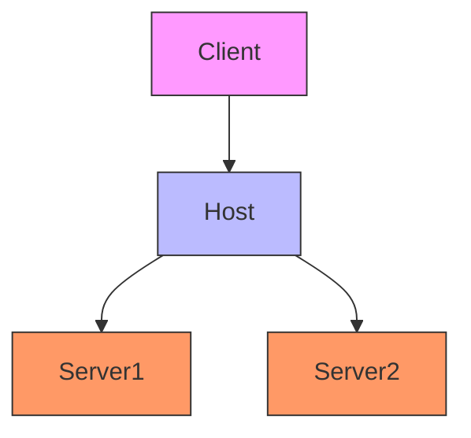
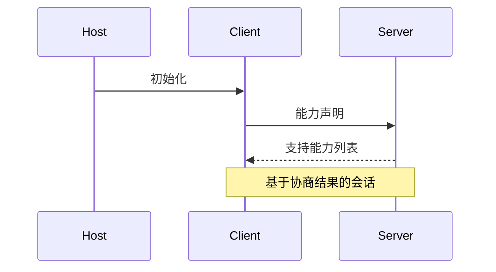

# Model Context Protocol (MCP) 技术解析

## 一、协议概述

### 1.1 基本定义
Model Context Protocol (MCP) 是一种基于JSON-RPC 2.0的AI集成协议，通过标准化的消息格式实现客户端、主机和服务器之间的上下文传递与协调。

### 1.2 核心组件
* **基础协议**：核心JSON-RPC消息类型
* **生命周期管理**：连接初始化、能力协商和会话控制
* **服务器功能**：服务器暴露的资源、提示词和工具
* **客户端功能**：客户端提供的采样和根目录列表
* **工具集**：跨领域关注点如日志记录和参数补全

### 1.3 版本信息
<信息>**当前版本**：2025-03-26</信息>
<信息>**最低兼容版本**：2024-Q3</信息>

## 二、架构设计

### 2.1 架构概览


MCP采用创新的**客户端-主机-服务器**三层架构，主要特点包括：
- **多客户端隔离**：单个主机进程可管理多个独立客户端实例
- **安全边界**：严格隔离不同服务器的访问权限
- **上下文交换**：专注于客户端与服务器间的上下文传递

### 2.2 核心组件
### 2.3 演进路线
* **2024-Q3**：初始规范发布，支持基础AI集成
* **2025-Q1**：新增工具链扩展和资源订阅机制
* **2025-Q3**：计划引入联邦学习支持
* **路线图特点**：
  - 保持向后兼容性
  - 每季度功能增量
  - 社区驱动演进

* **2024-Q3**：初始规范发布，支持基础AI集成
* **2025-Q1**：新增工具链扩展和资源订阅机制
* **2025-Q3**：计划引入联邦学习支持
* **路线图特点**：
  - 保持向后兼容性
  - 每季度功能增量
  - 社区驱动演进
MCP采用创新的**客户端-主机-服务器**三层架构，通过增强版JSON-RPC 2.0协议实现有状态会话管理。设计特点包括：
- **多客户端隔离**：单个主机进程可管理多个独立客户端实例
- **安全边界**：严格隔离不同服务器的访问权限
- **上下文交换**：专注于客户端与服务器间的上下文传递和采样协调

## 三、核心组件详解

### 3.1 主机（Host）
- 作为中央协调器，负责：
  - 客户端生命周期管理
  - 安全策略强制执行
  - 跨客户端上下文聚合
  - AI集成协调（如LLM采样）

### 3.2 客户端（Client）
- 每个客户端具有：
  - 独立服务器连接（1:1关系）
  - 双向消息路由能力
  - 订阅/通知管理
  - 协议协商功能

### 3.3 服务器（Server）
- 提供专业化服务：
  - 通过MCP原语暴露资源/工具
  - 支持本地或远程部署
  - 需遵守主机设定的安全约束
#### 主机（Host）
- 作为中央协调器，负责：
  - 客户端生命周期管理
  - 安全策略强制执行
  - 跨客户端上下文聚合
  - AI集成协调（如LLM采样）

#### 客户端（Client）
- 每个客户端具有：
  - 独立服务器连接（1:1关系）
  - 双向消息路由能力
  - 订阅/通知管理
  - 协议协商功能

#### 服务器（Server）
- 提供专业化服务：
  - 通过MCP原语暴露资源/工具
  - 支持本地或远程部署
  - 需遵守主机设定的安全约束

## 四、设计原则

| 原则 | 实现方式 | 技术价值 |
|------|----------|----------|
| 易构建性 | 主机承担复杂协调逻辑 | 降低服务器实现复杂度 |
| 高组合性 | 模块化设计 | 支持多服务器无缝协作 |
| 隐私保护 | 对话历史仅存主机端 | 符合GDPR等合规要求 |
| 渐进增强 | 通过能力协商实现 | 支持平滑升级 |
| 原则 | 实现方式 |
|------|----------|
| 易构建性 | 主机承担复杂协调逻辑，服务器只需实现单一功能 |
| 高组合性 | 模块化设计支持多服务器无缝协作 |
| 隐私保护 | 对话历史仅存主机端，服务器只能获取必要上下文 |
| 渐进增强 | 通过能力协商实现功能扩展 |

## 五、关键技术实现

### 5.1 能力协商机制


**核心流程**：
1. 主机初始化客户端
2. 客户端向服务器声明能力需求
3. 服务器返回支持能力列表
4. 建立基于协商结果的会话

**技术特点**：
- 动态能力发现
- 功能按需启用
- 强扩展性设计

- **动态能力发现**：双方在会话初始化时交换能力声明
- **功能按需启用**：如工具调用、资源订阅等需显式声明
- **扩展性强**：支持后续通过协议扩展新增能力

### 5.2 典型交互流程

**三种基本模式**：
1. **客户端发起**：
   ```
   用户操作 → 客户端请求 → 服务器响应
   ```
2. **服务器发起**：
   ```
   采样请求 → AI处理 → 返回结果
   ```
3. **通知机制**：
   ```
   资源变更 → 订阅通道 → 实时推送
   ```
1. **客户端发起**：用户操作→客户端请求→服务器响应
2. **服务器发起**：采样请求→AI处理→返回结果
3. **通知机制**：资源变更时通过订阅通道实时推送

## 六、应用场景与价值

### 6.1 架构优势
- **安全性**：通过主机强制实施安全边界
- **灵活性**：支持本地/远程混合部署
- **可扩展性**：能力协商机制支持渐进增强
- **解耦设计**：各组件可独立演进

### 6.2 典型应用场景
* **智能开发环境**：多AI工具协同的IDE插件
* **企业AI中台**：需要严格权限控制的内部系统
* **边缘计算**：分布式AI资源调度
* **研究平台**：可复现的AI实验环境
- **安全性**：通过主机强制实施安全边界
- **灵活性**：支持本地/远程混合部署模式
- **可扩展性**：能力协商机制支持渐进式功能增强
- **解耦设计**：客户端与服务器可独立演进

该架构特别适合以下场景：
* **智能开发环境**：多AI工具协同的IDE插件
* **企业AI中台**：需要严格权限控制的内部系统
* **边缘计算**：分布式AI资源调度
* **研究平台**：可复现的AI实验环境
## 七、协议规范

### 7.1 消息格式

#### 请求格式
```typescript
{
  jsonrpc: "2.0";
  id: string | number;  // 禁止null
  method: string;
  params?: {
    [key: string]: unknown;
  };
}
```

#### 响应格式
```typescript
{
  jsonrpc: "2.0";
  id: string | number;  // 必须匹配请求ID
  result?: object;
  error?: {
    code: number;
    message: string;
    data?: unknown;
  }
}
```

<信息>**协议版本**：2025-03-26</信息>

Model Context Protocol（MCP）由以下核心组件构成：

* **基础协议**：核心JSON-RPC消息类型
* **生命周期管理**：连接初始化、能力协商和会话控制
* **服务器功能**：服务器暴露的资源、提示词和工具
* **客户端功能**：客户端提供的采样和根目录列表
* **工具集**：跨领域关注点如日志记录和参数补全

所有实现**必须**支持基础协议和生命周期管理组件，其他组件可根据应用需求**选择性**实现。

这种分层设计实现了关注点分离，同时支持客户端与服务器间的丰富交互。模块化设计允许实现方按需支持特定功能。

## 消息规范

所有MCP客户端与服务器间的消息**必须**遵循[JSON-RPC 2.0](https://www.jsonrpc.org/specification)规范。协议定义了以下消息类型：

### 请求

请求由客户端或服务器发起，用于启动操作。

```typescript
{
  jsonrpc: "2.0";
  id: string | number;
  method: string;
  params?: {
    [key: string]: unknown;
  };
}
```

* 请求**必须**包含字符串或整数ID
* 与基础JSON-RPC不同，ID**禁止**为`null`
* 请求ID在同一会话中**不得**重复使用

### 响应

响应是对请求的回复，包含操作结果或错误信息。

```typescript
{
  jsonrpc: "2.0";
  id: string | number;
  result?: {
    [key: string]: unknown;
  }
  error?: {
    code: number;
    message: string;
    data?: unknown;
  }
}
```

* 响应**必须**包含与对应请求相同的ID
* 响应进一步分为**成功结果**和**错误响应**，必须包含`result`或`error`其中之一

### 7.2 安全机制

**推荐方案**：
1. **传输层安全**：强制TLS 1.2+加密
2. **认证方式**：
   - OAuth 2.0（用户授权场景）
   - API密钥（服务间认证）
3. **权限控制**：
   - 基于主机的策略执行
   - 最小权限原则

**注意事项**：
- DIO传输需特殊处理
- 支持自定义认证协商

当前MCP规范**不强制**特定认证方案，但建议实现方考虑以下方案：

* **传输层安全**：所有通信应通过TLS加密
* **OAuth 2.0**：适合需要用户授权的场景
* **API密钥**：简单服务间认证

注意：使用DIO传输的实现**不应**遵循此规范，而应从环境中获取凭证。

此外，客户端和服务器**可以**协商自定义的认证授权策略。

关于MCP认证机制的讨论与贡献，欢迎加入[GitHub Discussions](https://github.com/modelcontextprotocol/specification/discussions)共同塑造协议未来！

## 八、开发资源

### 8.1 规范文档
* [TypeScript架构定义](https://github.com/modelcontextprotocol/specification)
* [JSON Schema](https://github.com/modelcontextprotocol/specification/blob/main/schema)

### 8.2 社区支持
* [GitHub Discussions](https://github.com/modelcontextprotocol/specification/discussions)
* 季度版本更新说明
* 参考实现库

完整协议规范定义为[TypeScript架构](https://github.com/modelcontextprotocol/specification/blob/main/schema/2025-03-26/schema.ts)，这是所有协议消息和结构的权威来源。

另提供自动生成的[JSON Schema](https://github.com/modelcontextprotocol/specification/blob/main/schema/2025-03-26/schema.json)，可用于各类自动化工具集成。