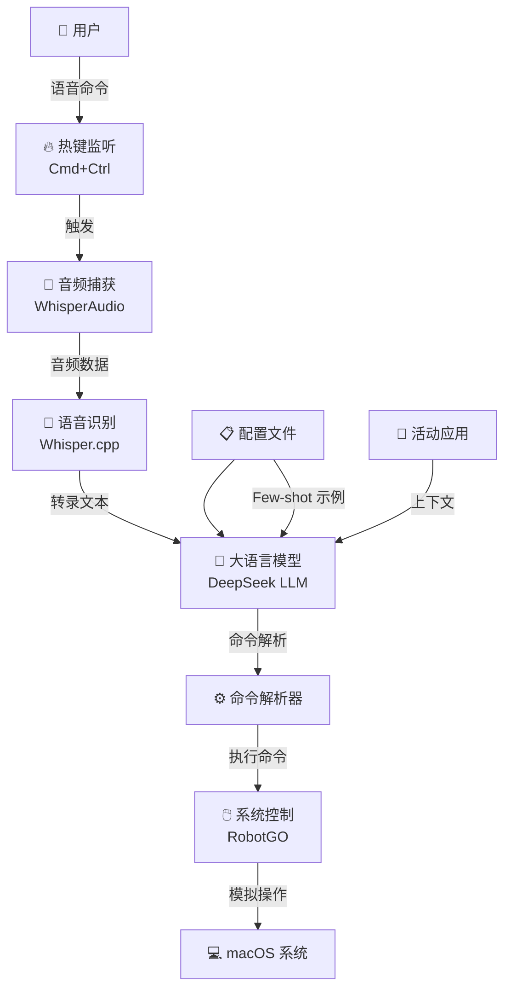
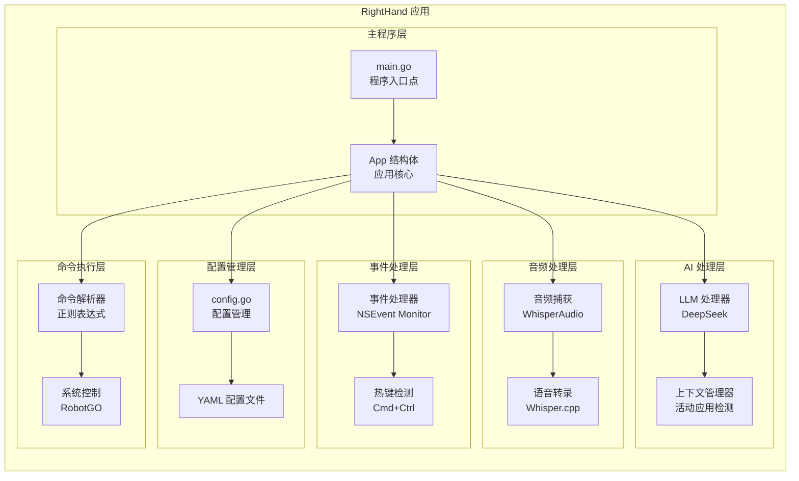
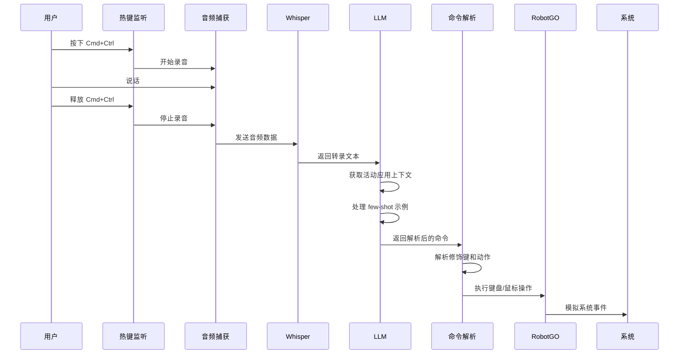
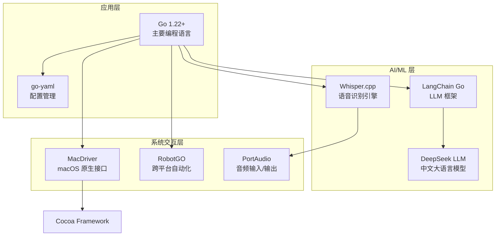
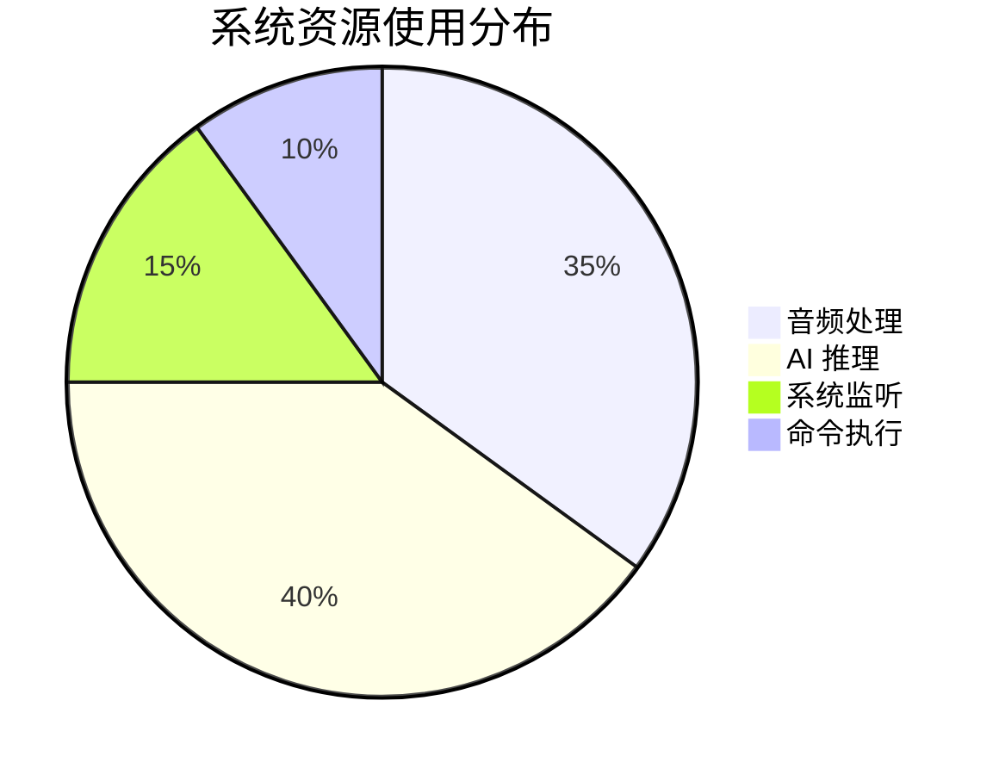
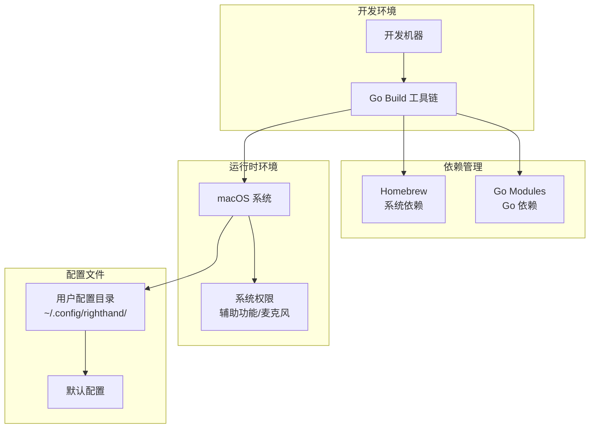

---
title: "RightHand 语音控制助手 - 架构设计文档"
description: "基于 Go 语言开发的 macOS 语音控制助手系统架构深度分析"
date: 2025-01-18T10:00:00+08:00
lastmod: 2025-01-18T10:00:00+08:00
draft: false
tags: 
  - Go
  - 语音识别
  - macOS
  - 系统架构
  - AI
  - LLM
  - Whisper
categories:
  - 架构设计
  - 技术文档
keywords:
  - RightHand
  - 语音控制
  - Go语言
  - macOS应用
  - Whisper.cpp
  - DeepSeek
  - 系统自动化
  - 架构设计
author: "架构师"
toc: true
weight: 1
series: ["系统架构"]
aliases: 
  - /docs/righthand-architecture/
  - /architecture/righthand/
summary: "深入分析 RightHand 语音控制助手的系统架构，包括核心组件设计、数据流分析、技术栈选型、性能优化和未来扩展方向。"
cover:
  image: ""
  alt: "RightHand 语音控制助手架构图"
  caption: "基于 Go 语言的 macOS 语音控制系统"
  relative: false
  hidden: false
showToc: true
tocOpen: true
disableHLJS: false
disableShare: false
searchHidden: false
ShowReadingTime: true
ShowBreadCrumbs: true
ShowPostNavLinks: true
ShowWordCount: true
ShowRssButtonInSectionTermList: true
UseHugoToc: true
math: false
mermaid: true
markup:
  goldmark:
    renderer:
      unsafe: true
---

# RightHand 语音控制助手 - 架构设计文档

## 项目概述

RightHand 是一个基于 Go 语言开发的 macOS 语音控制助手，通过语音识别和大语言模型技术，允许用户使用自然语言命令来控制各种应用程序。

## 系统架构

### 整体架构图



### 核心组件架构



## 数据流架构



## 技术栈分析

### 核心依赖



## 模块详细设计

### 1. 配置管理模块

**文件**: `config.go`

**职责**:
- 管理应用配置文件 (YAML 格式)
- 支持 few-shot 示例配置
- 提供默认配置和配置持久化

**关键结构**:
```go
type RightHandConfig struct {
    LLMModel     string
    WhisperModel string
    Programs     []ProgramFewShotExamples
    DumpWAVFile  bool
}
```

### 2. 事件处理模块

**核心功能**:
- 全局热键监听 (Cmd+Ctrl)
- macOS 系统事件处理
- 异步事件处理架构

### 3. 音频处理模块

**技术特点**:
- 实时音频捕获
- Whisper.cpp 本地语音识别
- 支持多种音频格式和采样率

### 4. AI 处理模块

**特性**:
- 上下文感知 (检测当前活动应用)
- Few-shot 学习支持
- 自定义系统提示词
- DeepSeek 中文 LLM 集成

### 5. 命令执行模块

**解析能力**:
- 支持修饰键解析 (`{Command}+t`)
- 正则表达式模式匹配
- 跨应用命令适配

## 性能与可扩展性

### 性能特点



### 可扩展性设计

1. **配置驱动**: 支持通过配置文件扩展应用支持
2. **插件化架构**: LLM 提供商可替换
3. **模块化设计**: 各模块职责单一，易于维护
4. **异步处理**: 使用 Go routine 和 channel 实现并发

## 安全性考虑

### 隐私保护
- **本地处理**: Whisper 语音识别完全在本地运行
- **数据不留存**: 音频数据处理后即销毁
- **可选功能**: WAV 文件导出为可选功能

### 系统安全
- **权限最小化**: 仅请求必要的系统权限
- **输入验证**: 严格验证 LLM 输出命令
- **错误处理**: 完善的错误处理和日志记录

## 部署架构



## 未来扩展方向

### 技术演进

1. **多模态支持**: 集成图像识别能力
2. **云端集成**: 支持云端 LLM 服务
3. **跨平台支持**: 扩展到 Windows 和 Linux
4. **语音合成**: 添加语音反馈功能

### 功能增强

1. **智能学习**: 基于用户行为的自适应学习
2. **插件生态**: 第三方应用集成 API
3. **团队协作**: 配置共享和同步
4. **性能优化**: 模型量化和边缘计算

## 技术债务与改进建议

### 当前技术债务

1. **依赖版本**: 部分依赖版本较旧，需要升级
2. **错误处理**: 某些边缘情况处理不够完善
3. **测试覆盖**: 缺乏自动化测试

### 改进建议

1. **单元测试**: 增加核心模块的单元测试
2. **集成测试**: 端到端功能测试
3. **性能监控**: 添加性能指标收集
4. **文档完善**: API 文档和用户手册

## 总结

RightHand 项目展现了现代语音控制应用的典型架构模式，通过合理的模块化设计、异步处理机制和本地化 AI 能力，提供了一个高效、安全、可扩展的语音控制解决方案。项目在技术选型上平衡了性能、隐私和易用性，为未来的功能扩展和性能优化奠定了良好的基础。
