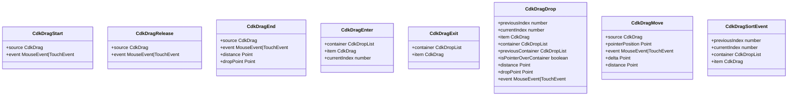

# Angular CDK Drag-Drop 实现原理分析

## 1. 概述

Angular CDK (Component Development Kit) 提供了一套强大的拖放 (Drag and Drop) 功能模块，它简化了在Angular应用中实现拖放交互的复杂性。这个模块抽象了原生HTML5拖放API的复杂细节，提供了一套高级、声明式的API，使开发者能够轻松实现各种拖放交互场景。

本文将深入分析Angular CDK Drag-Drop模块的实现原理和架构设计。

## 2. 核心架构


### 2.1 核心组件

1. **DragDropModule**: 主模块，提供了所有拖放功能的入口点。

2. **DragDrop**: 服务类，负责创建DragRef和DropListRef实例。

3. **DragDropRegistry**: 核心注册表服务，管理所有活动的拖动项和放置区域。

4. **DragRef**: 负责单个可拖动元素的拖动逻辑实现。

5. **DropListRef**: 负责放置区域的逻辑实现。

6. **CdkDrag**: 指令，将HTML元素标记为可拖动。

7. **CdkDropList**: 指令，将HTML元素标记为放置区域。

## 3. 工作流程


### 3.1 拖动开始

1. 用户在带有`cdkDrag`指令的元素上按下鼠标或开始触摸。
2. `CdkDrag`指令通过其关联的`DragRef`实例调用`startDragging()`。
3. `DragRef`向`DragDropRegistry`注册自己作为活动拖动实例。
4. `DragRef`创建预览元素和占位符元素（如果配置了）。
5. `DragRef`触发`dragStarted`事件，`CdkDrag`指令将其转发为输出事件。

### 3.2 拖动过程

1. 用户移动鼠标或触摸点。
2. `DragRef`通过其`_pointerMove`方法处理移动事件。
3. `DragRef`计算新位置并应用变换。
4. `DragRef`触发`moved`事件。
5. 如果拖动元素进入`CdkDropList`区域，`DropListRef`触发`entered`事件。

### 3.3 拖动结束

1. 用户释放鼠标或结束触摸。
2. `DragRef`通过其`_pointerUp`方法处理释放事件。
3. 如果在有效的放置区域内释放，`DropListRef`处理放置操作。
4. `DropListRef`触发`dropped`事件。
5. `DragRef`触发`ended`事件。
6. `DragRef`从`DragDropRegistry`中注销自己。

## 4. 关键实现细节

### 4.1 DragDropRegistry

DragDropRegistry是整个拖放系统的核心，它负责：

- 跟踪所有活动的拖动项和放置区域
- 管理全局事件监听器（如 touchmove、mousemove、touchend、mouseup、scroll 和 selectstart）
- 协调拖动项和放置区域之间的交互
- 优化性能，通过在 NgZone 外部处理频繁事件


### 4.2 DragRef

DragRef封装了单个可拖动元素的所有拖动逻辑：

- 处理鼠标和触摸事件
- 创建和管理预览元素和占位符
- 计算拖动位置和约束
- 处理自动滚动
- 管理拖动约束和边界
- 处理自由拖动和轴锁定


#### 4.2.1 预览元素和占位符

DragRef 使用两种特殊元素来提供视觉反馈：

1. **预览元素 (Preview Element)**：
   - 跟随鼠标/触摸点移动的元素
   - 可以自定义样式和内容
   - 可以设置缩放比例
   - 支持自定义容器（文档、视口或固定元素）

2. **占位符 (Placeholder Element)**：
   - 在原始位置显示的元素
   - 保持布局稳定
   - 可以自定义样式和内容
   - 在拖动结束时与预览元素平滑过渡

#### 4.2.2 拖动约束

DragRef 提供了多种约束拖动的方式：

1. **轴锁定 (Lock Axis)**：
   - 可以锁定为仅水平 ('x') 或仅垂直 ('y') 移动
   - 防止在非预期方向上的移动

2. **边界元素 (Boundary Element)**：
   - 限制拖动范围在指定元素内
   - 自动计算边界矩形

3. **位置约束函数 (Position Constraint Function)**：
   - 自定义函数来约束拖动位置
   - 可以实现复杂的约束逻辑

4. **自由拖动位置 (Free Drag Position)**：
   - 设置元素的初始位置
   - 适用于绝对定位元素

### 4.3 DropListRef

DropListRef封装了放置区域的所有逻辑：

- 跟踪进入和离开的拖动项
- 处理放置操作
- 计算排序位置
- 管理与其他放置区域的连接
- 处理自动滚动
- 管理排序策略


### 4.4 排序策略

Angular CDK 拖放模块提供了两种主要的排序策略，用于处理不同布局下的拖放排序：


#### 4.4.1 SingleAxisSortStrategy

SingleAxisSortStrategy 是默认的排序策略，适用于单轴（水平或垂直）排列的列表：

- 基于项目在单一轴上的位置进行排序
- 使用动画平滑过渡项目位置
- 缓存项目位置以提高性能
- 支持自定义排序谓词函数

#### 4.4.2 MixedSortStrategy

MixedSortStrategy 适用于可能换行的列表（如 flex 布局的 wrap 模式或网格布局）：

- 通过移动 DOM 节点而非使用变换来重新排序项目
- 基于指针位置找到最近的项目
- 支持二维布局中的排序
- 适用于复杂布局场景

## 5. 指令实现

### 5.1 CdkDrag

CdkDrag指令是开发者与拖放系统交互的主要入口点之一：

- 将HTML元素标记为可拖动
- 提供配置选项（如禁用状态、拖动句柄等）
- 暴露拖动事件（开始、移动、结束等）


### 5.2 CdkDropList

CdkDropList指令将HTML元素标记为放置区域：

- 配置放置区域属性（如方向、禁用状态等）
- 暴露放置事件（进入、离开、放置等）
- 管理与其他放置区域的连接


## 6. 辅助功能

### 6.1 拖动工具函数

Angular CDK提供了一些辅助函数来简化常见操作：

- **moveItemInArray**: 在数组内移动项目（用于同一容器内的排序）
- **transferArrayItem**: 在两个数组之间转移项目（用于跨容器拖放）
- **copyArrayItem**: 复制项目到另一个数组（用于克隆拖放）


## 7. 事件系统

### 7.1 事件类型

Angular CDK 拖放模块定义了一系列事件接口，用于在拖放过程中传递信息：



### 7.2 事件流

拖放过程中的事件流如下：


## 8. 配置选项

Angular CDK 拖放模块提供了丰富的配置选项，可以通过 `CDK_DRAG_CONFIG` 注入令牌进行全局配置，或通过指令输入属性进行局部配置：


### 8.1 全局配置

可以通过在模块中提供 `CDK_DRAG_CONFIG` 令牌来设置全局配置：

```typescript
@NgModule({
  providers: [
    {
      provide: CDK_DRAG_CONFIG,
      useValue: {
        dragStartThreshold: 5,
        pointerDirectionChangeThreshold: 5,
        zIndex: 1000
      }
    }
  ]
})
export class AppModule {}
```

### 8.2 局部配置

可以通过指令输入属性来覆盖全局配置：

```html
<div cdkDrag
     [cdkDragLockAxis]="'x'"
     [cdkDragBoundary]="boundaryElement"
     [cdkDragStartDelay]="500"
     [cdkDragDisabled]="disabled">
  拖动我
</div>
```

## 9. 性能优化

### 9.1 事件处理

Angular CDK的拖放实现在事件处理方面做了多项优化：

- 使用`NgZone.runOutsideAngular`处理频繁的鼠标/触摸移动事件，避免不必要的变更检测
- 使用事件捕获而非冒泡来确保事件处理的可靠性
- 实现了触摸事件和鼠标事件的统一处理
- 使用 RxJS 的 `auditTime` 操作符限制事件处理频率
- 智能地管理全局事件监听器，只在拖动过程中添加

### 9.2 DOM操作

- 延迟创建预览元素和占位符，直到实际开始拖动
- 使用CSS变换而非直接修改元素位置属性
- 使用`requestAnimationFrame`进行视觉更新，确保平滑的动画效果
- 缓存元素位置和尺寸信息，减少重排和重绘
- 使用 `will-change` CSS 属性提示浏览器优化渲染

### 9.3 排序优化

- 缓存项目位置，避免在每次移动时重新计算
- 使用高效的算法确定排序位置
- 只在必要时更新 DOM 结构
- 使用 CSS 变换进行视觉位置调整，而非直接修改 DOM 结构

## 10. 总结

Angular CDK的拖放模块是一个设计精良的系统，它通过抽象复杂的DOM操作和事件处理，提供了一套简洁而强大的API。其核心架构围绕着DragDropRegistry、DragRef和DropListRef展开，通过CdkDrag和CdkDropList指令暴露给开发者。


这种设计使得开发者可以轻松实现各种拖放交互场景，同时保持了高性能和良好的用户体验。通过理解其内部实现原理，我们可以更有效地使用这个强大的工具，并在必要时进行自定义扩展。

### 10.1 主要优势

1. **声明式 API**：通过指令简化了拖放功能的实现
2. **高度可配置**：提供了丰富的配置选项，适应各种场景
3. **性能优化**：精心设计的事件处理和 DOM 操作，确保流畅的用户体验
4. **可扩展性**：核心类和接口设计良好，便于扩展和自定义
5. **无障碍性**：内置支持键盘导航和屏幕阅读器

### 10.2 应用场景

1. **列表重排序**：允许用户重新排列列表项
2. **看板和任务管理**：实现拖放任务卡片
3. **表格行重排序**：允许重新排列表格行
4. **文件上传**：实现拖放文件上传区域
5. **自定义界面构建器**：允许用户通过拖放构建界面