# Formly 框架详解

## 概述

Formly 是一个动态表单生成框架，用于 Angular 应用程序。它允许开发者通过 JSON 配置来生成复杂的表单，而不需要编写大量的模板代码。

## 架构层面

### 1. 核心架构

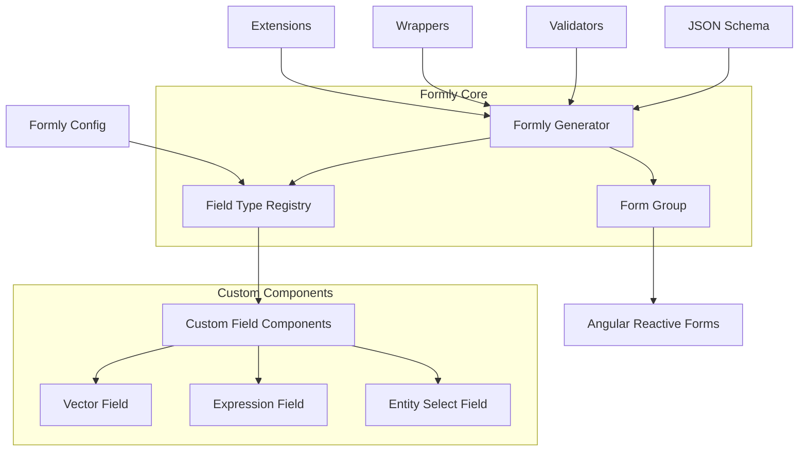

### 2. 数据流架构

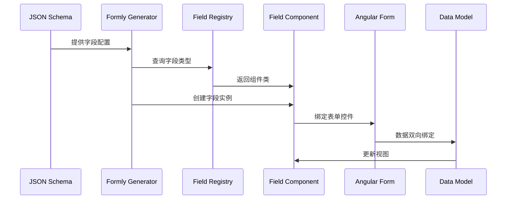

### 3. 扩展架构

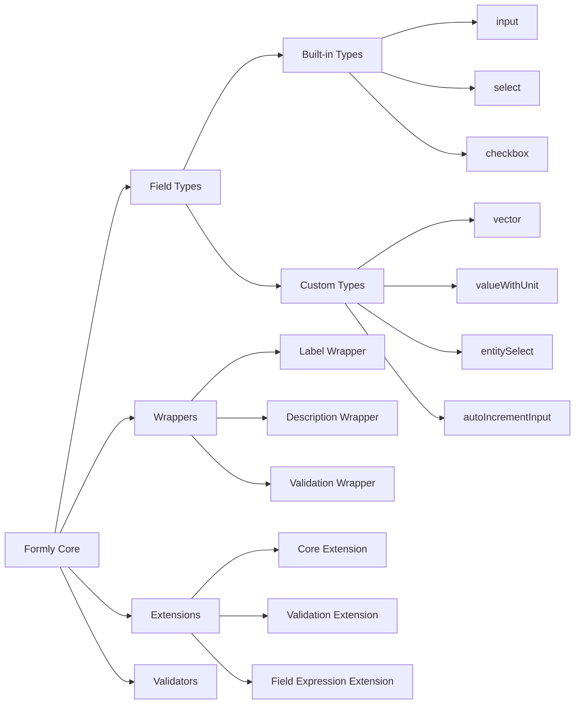

## 使用层面

### 1. 基本使用流程

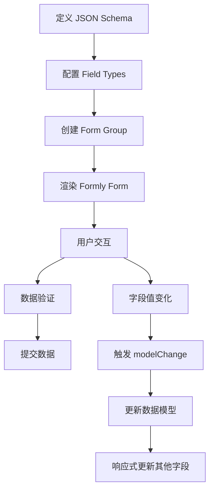

### 2. 字段类型使用

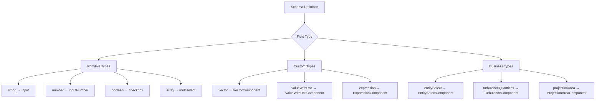

### 3. 表单配置层次

```mermaid
graph TB
    A[Application Level] --> B[FormlyModule.forRoot]
    B --> C[Global Configuration]
    C --> D[Field Types Registry]
    C --> E[Validators Registry]
    C --> F[Wrappers Registry]
    
    G[Component Level] --> H[FormlyForm Component]
    H --> I[Schema Input]
    H --> J[Model Input]
    H --> K[Form Group]
    
    L[Field Level] --> M[Field Configuration]
    M --> N[Type]
    M --> O[Key]
    M --> P[Props]
    M --> Q[Validators]
    M --> R[Expressions]
```

## 三个核心包详解

### @ngx-formly/core (^6.3.1)

**功能说明：**
- Formly 的核心库，提供基础架构和 API
- 包含字段类型注册、表单生成、验证等核心功能

**核心组件：**

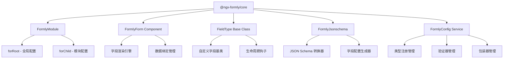

**主要 API：**
- `FormlyFieldConfig`: 字段配置接口
- `FieldType<T>`: 自定义字段基类
- `FormlyJsonschema`: JSON Schema 转换服务

### @ngx-formly/ng-zorro-antd (^6.3.1)

**功能说明：**
- 提供基于 Ng-Zorro-Antd 的预定义字段类型
- 与 Ant Design 样式系统集成

**提供的字段类型：**

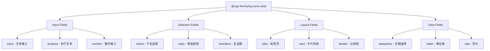

**样式集成：**
- 自动应用 Ant Design 主题
- 支持响应式布局
- 内置验证错误样式

### @ngx-formly/schematics (6.3.1)

**功能说明：**
- 提供 Angular CLI 脚手架工具
- 快速生成 Formly 相关代码

**提供的脚手架：**

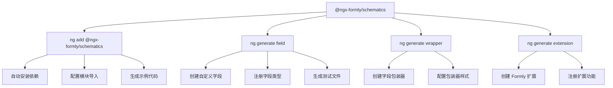

**使用命令：**
```bash
# 安装 Formly
ng add @ngx-formly/schematics

# 生成自定义字段
ng generate @ngx-formly/schematics:field --name=auto-increment-input

# 生成包装器
ng generate @ngx-formly/schematics:wrapper --name=custom-wrapper
```

## Flow360 项目中的 Formly 使用

### 1. 项目架构集成

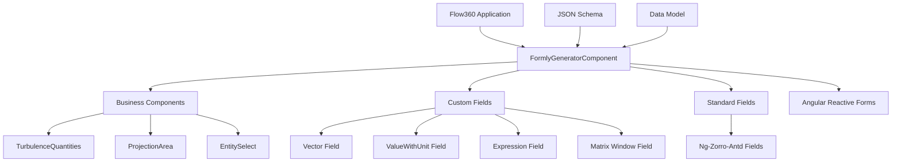

### 2. 自定义字段扩展流程

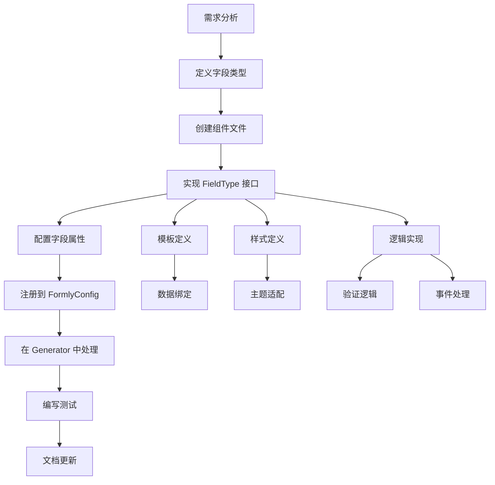

### 3. 数据流管理

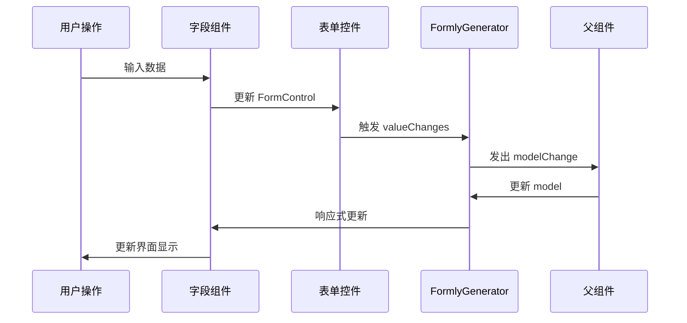

## 最佳实践

### 1. 字段开发原则
- 遵循单一职责原则
- 保持组件无状态（依赖 FormControl）
- 正确处理 disabled 状态
- 实现适当的验证逻辑

### 2. 性能优化
- 使用 OnPush 变更检测策略
- 适当使用 trackBy 函数
- 避免在模板中使用复杂表达式
- 合理使用 async 管道

### 3. 测试策略
- 单元测试：测试字段组件逻辑
- 集成测试：测试与 Formly 的集成
- E2E 测试：测试完整的用户交互流程
