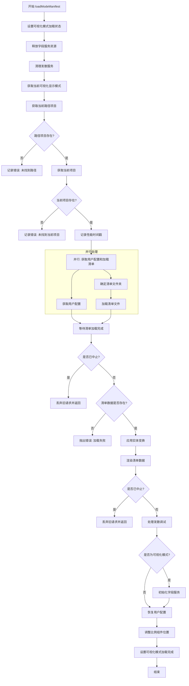

# Flow360 Workbench loadModeManifest 函数分析

`loadModeManifest` 函数是 Flow360 UI 工作台中的一个核心函数，负责加载和渲染可视化模式所需的数据清单(manifest)。以下是该函数的执行流程和功能分析。

## 函数执行流程

## 功能详解

### 1. 初始化与准备

- **设置加载状态**: 开始时，将 `visualizationModeLoading` 状态设置为 `true`
- **资源释放**: 
  - 调用 `fieldsService.dispose()` 释放字段服务资源
  - 调用 `divergenceService.cleanup()` 清理发散服务

### 2. 获取必要信息

- 获取当前可视化显示模式(`showMode`)
- 通过 `getCurrentPathItem()` 获取当前路径项目
- 检查当前项目是否存在

### 3. 并行数据获取

- 同时执行两个操作:
  - 通过 `workbenchService.fetchUserConfig()` 获取用户配置
  - 通过 `visService.loadManifest()` 加载可视化清单数据
  - 对于 GAI 模式，还会获取特定的清单文件夹

### 4. 数据处理与渲染

- **实体变换应用**:
  - 对 `SolidGeometry` 类型的数据应用变换矩阵
  - 使用 `entitiesBodiesDataService.bodyGroupByTag()` 获取分组的实体
- **渲染清单**:
  - 调用 `visService.renderManifest()` 渲染清单数据
  - 传入用户可见性设置和中止信号

### 5. 特殊处理

- **发散调试**:
  - 对于发散的案例，添加发散点和设置切片可见性
- **可视化模式特定操作**:
  - 如果是可视化模式，初始化字段控制器

### 6. 配置恢复与完成

- 恢复用户配置: `workbenchService.restoreUserConfig()`
- 根据当前模式调整比例组件位置
- 设置加载状态为完成

### 7. 错误处理

- 捕获并记录所有错误
- 对于 HTTP 错误，设置具体的错误消息

## 关键依赖服务

该函数依赖以下服务:

- `workbenchService`: 工作台核心服务
- `visService`: 可视化服务
- `fieldsService`: 字段服务
- `divergenceService`: 发散服务
- `entitiesBodiesDataService`: 实体数据服务
- `performanceService`: 性能监控服务

## 中止控制

函数使用 `AbortController` 实现请求中止控制，确保当新请求来临时，可以优雅地取消旧请求，避免资源浪费和数据混乱。

## 总结

`loadModeManifest` 是 Flow360 工作台中负责可视化数据加载和渲染的核心函数，它通过一系列异步操作和服务协调，实现了高效的数据加载、处理和渲染，同时具备良好的错误处理和资源管理机制。
