# Flow360 应用架构分析

## 1. 应用概览与业务背景

Flow360 是由 Flexcompute 公司开发的企业级计算流体力学（CFD）仿真平台。作为一个云原生的 SaaS 应用，它为工程师和研究人员提供了完整的 CFD 仿真工作流，从几何建模、网格生成到仿真计算和结果可视化。

### 业务特点
- **专业领域**: 专注于计算流体力学仿真
- **企业级**: 支持多租户、权限管理、协作功能
- **云原生**: 基于云计算架构，支持弹性扩展
- **工作流导向**: 以完整的仿真工作流为核心设计理念

## 2. 技术栈选型

## 2. 技术栈选型

Flow360 采用现代化的混合技术栈架构，巧妙地结合了 Angular 和 React 两个主流前端框架，以及丰富的可视化技术栈，形成了一个功能强大且灵活的企业级应用。

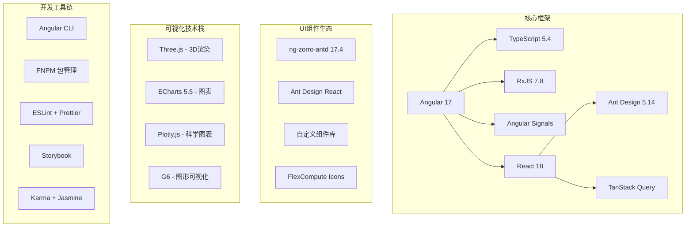

### 技术栈选型理由

1. **Angular 17 主框架**: 
   - 强大的企业级特性支持
   - 优秀的依赖注入和模块化系统
   - 新版本的 Signals 提供更好的响应式能力

2. **React 18 集成**:
   - 利用丰富的 React 生态系统
   - 特定功能模块的最佳实践方案
   - 团队技能栈的有效利用

3. **可视化技术选择**:
   - Three.js: 处理复杂的 3D 流场可视化
   - ECharts: 丰富的 2D 图表支持
   - Plotly.js: 科学计算领域的专业图表

## 3. 总体架构设计

### 3.1 架构模式概览

Flow360 采用单体应用架构模式，但在内部实现了微前端的设计理念，通过模块化的方式组织不同的功能区域。

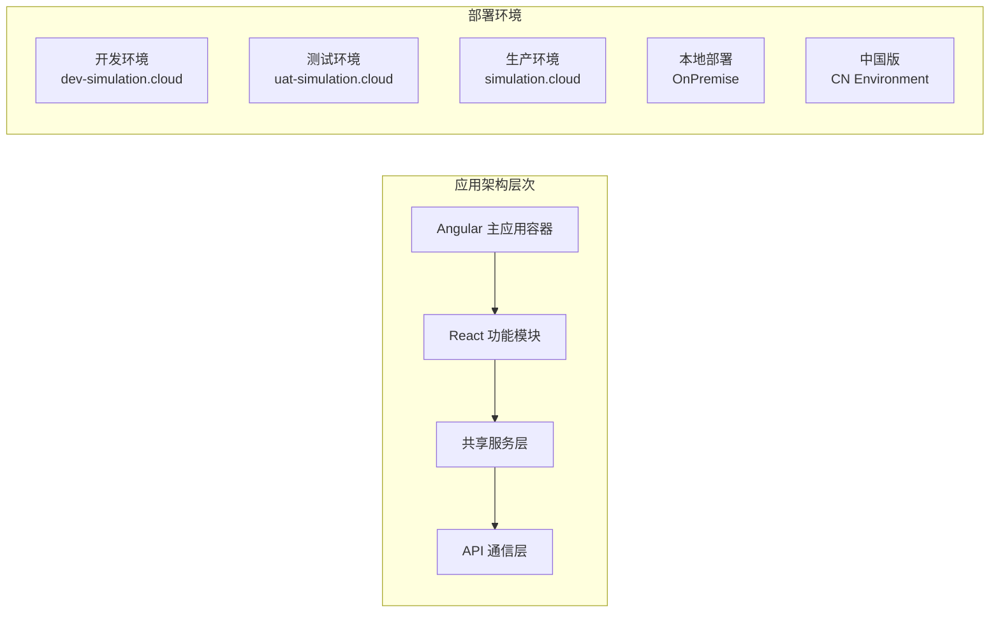

### 3.2 应用路由架构

Flow360 的页面架构围绕 CFD 仿真工作流设计，提供了从项目管理到仿真执行的完整功能体系。

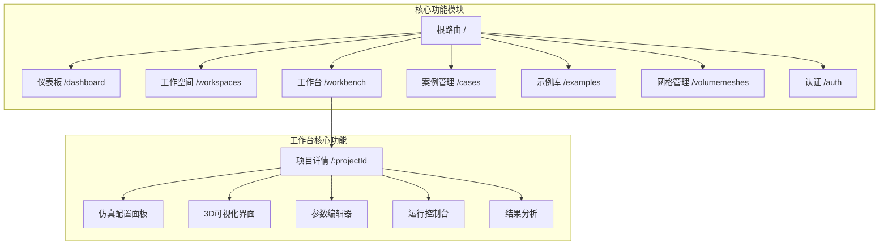

### 3.3 功能模块详解

1. **仪表板 (Dashboard)**: React 实现的项目概览和快速导航
2. **工作空间 (Workspaces)**: Angular 实现的项目管理和文件组织
3. **工作台 (Workbench)**: 核心的仿真配置和可视化界面
4. **案例管理 (Cases)**: 仿真案例的生命周期管理
5. **示例库 (Examples)**: 预建模板和教学案例

## 4. 核心业务架构

### 4.1 工作台架构设计

工作台是 Flow360 的核心模块，承载了完整的 CFD 仿真工作流。

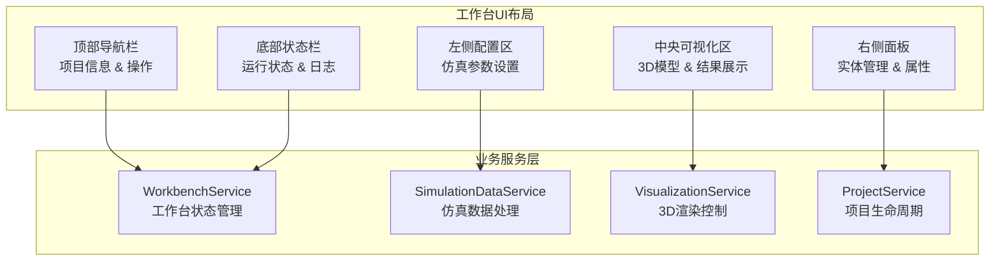

### 4.2 业务服务架构

业务服务层采用领域驱动设计，将复杂的 CFD 业务逻辑进行合理分层。

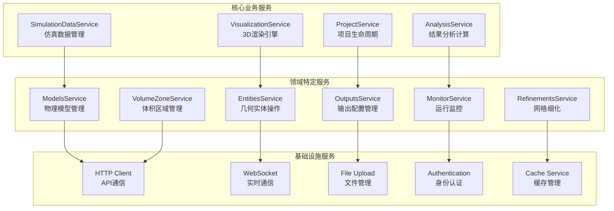

### 4.3 数据流架构

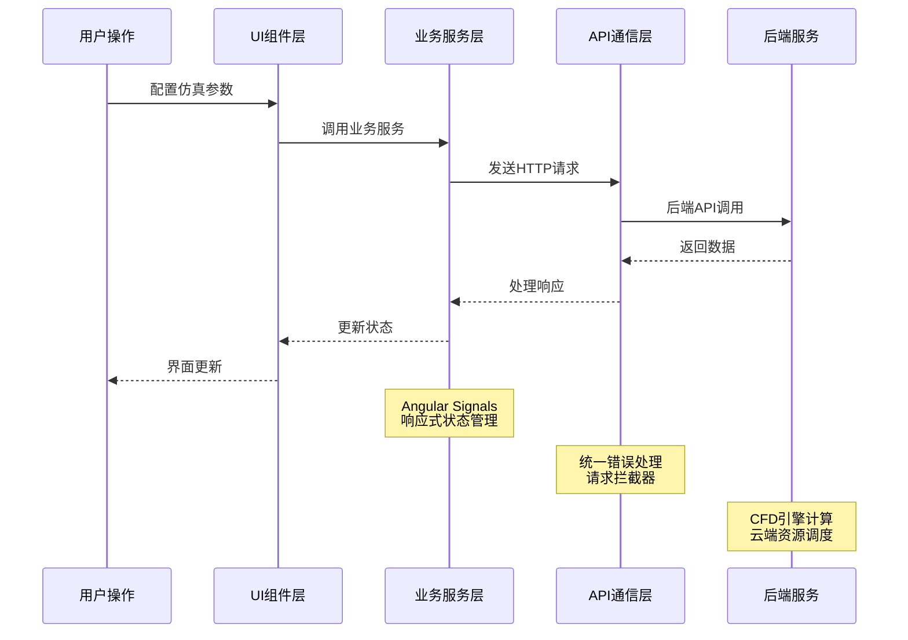

## 5. 混合技术栈实现

### 5.1 Angular-React 集成架构

Flow360 的一个重要技术特色是成功集成了 Angular 和 React 两个框架，充分发挥各自优势。

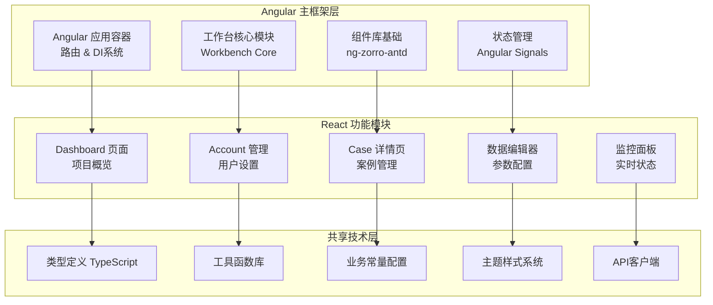

### 5.2 框架间通信机制

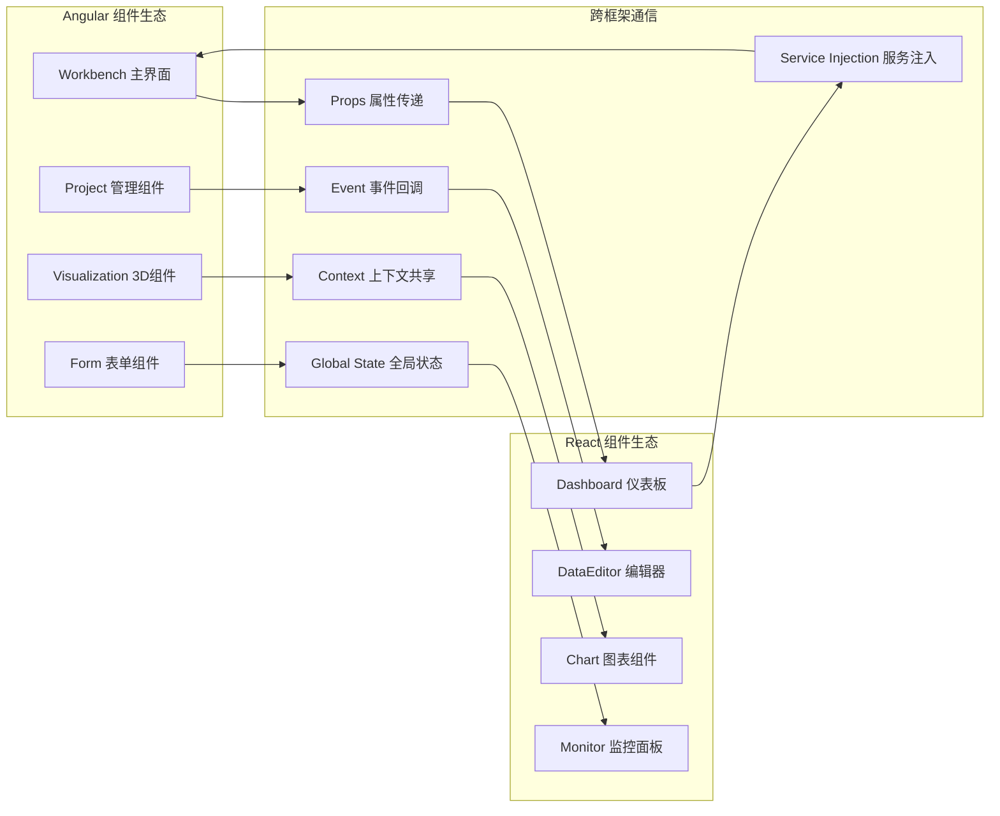

### 5.3 技术选型策略

| 功能领域 | 技术选择 | 选择理由 |
|----------|----------|----------|
| 核心框架 | Angular 17 | 企业级特性、依赖注入、强类型支持 |
| 数据展示 | React 18 | 生态丰富、组件化、快速开发 |
| 状态管理 | Angular Signals | 响应式、性能优化、类型安全 |
| UI组件库 | ng-zorro + Ant Design | 统一设计语言、丰富组件 |
| 3D渲染 | Three.js | WebGL支持、性能优秀、社区活跃 |
| 图表可视化 | ECharts + Plotly | 功能强大、科学计算支持 |

## 6. 可视化技术架构

### 6.1 可视化技术栈

CFD 仿真需要强大的可视化能力来展示复杂的流场数据和分析结果。

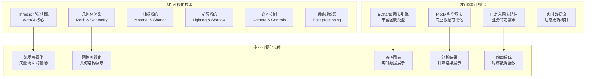

### 6.2 可视化数据处理流程

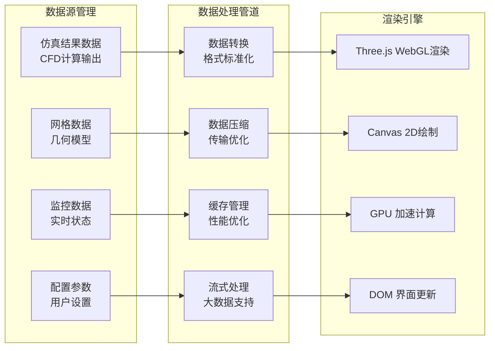

### 6.3 可视化性能优化

1. **LOD (Level of Detail)**: 根据视角距离调整模型精度
2. **实例化渲染**: 批量渲染相似几何体
3. **视锥体剔除**: 只渲染可见区域
4. **纹理压缩**: 减少GPU内存占用
5. **帧率控制**: 动态调整渲染质量

## 7. 状态管理架构

### 7.1 Angular Signals 响应式架构

Angular 17 引入的 Signals 为 Flow360 提供了现代化的响应式状态管理能力。

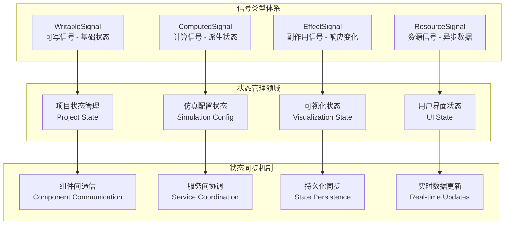

### 7.2 响应式数据流设计

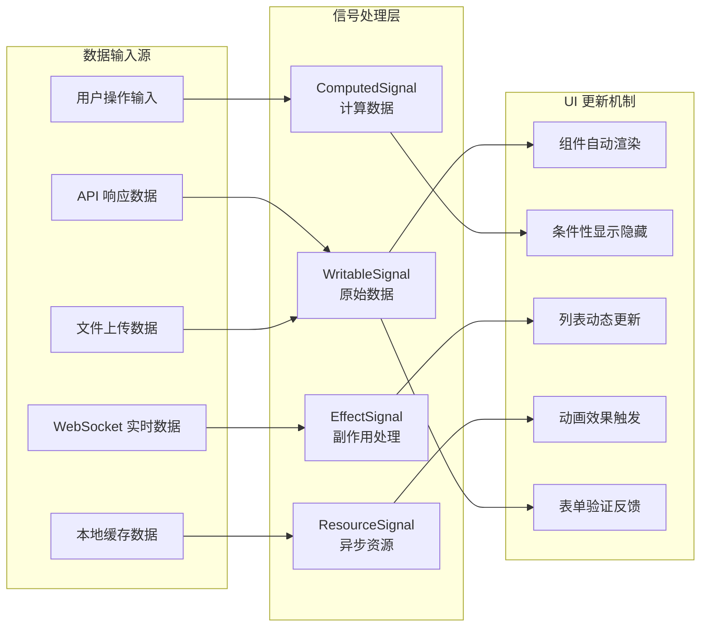

### 7.3 状态管理最佳实践

1. **单一数据源**: 每个状态片段只有一个权威来源
2. **不可变更新**: 通过 Signal.update() 确保状态不可变性
3. **计算缓存**: 利用 computed() 自动缓存派生状态
4. **副作用隔离**: 使用 effect() 处理外部副作用
5. **类型安全**: 充分利用 TypeScript 类型系统

## 8. 部署与运维架构

### 8.1 多环境部署架构

Flow360 支持多种部署环境，满足不同的业务需求和安全要求。

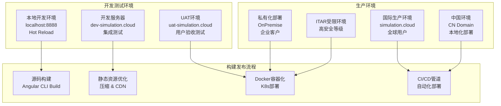

### 8.2 性能优化策略

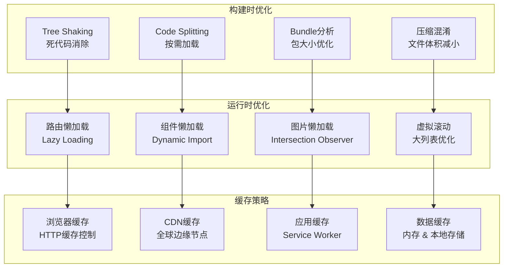

## 9. 安全与认证架构

### 9.1 安全体系设计

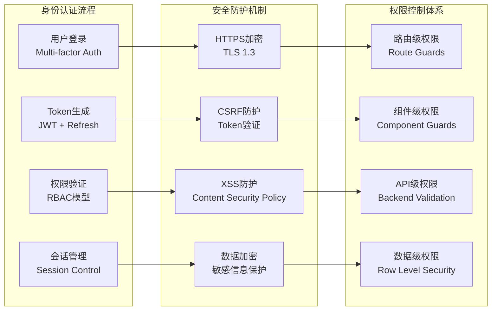

## 10. 测试架构

### 10.1 测试策略体系

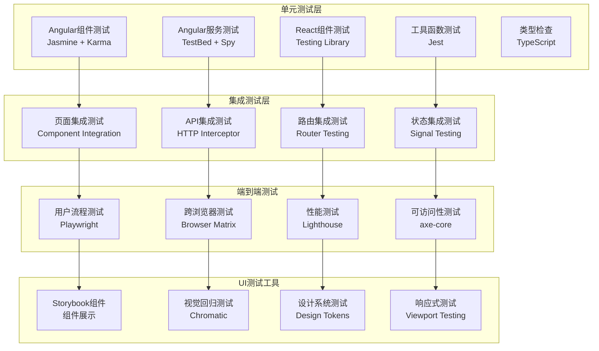

## 11. 架构设计总结

### 11.1 核心架构优势

Flow360 的架构设计体现了现代企业级应用的最佳实践，主要优势包括：

#### 技术架构层面
1. **混合技术栈的创新实践**
   - Angular 提供企业级框架基础
   - React 补充生态系统优势
   - 两者有机结合，发挥各自长处

2. **现代化状态管理**
   - Angular Signals 提供响应式能力
   - 类型安全的状态管理
   - 优秀的性能表现

3. **专业级可视化能力**
   - Three.js 支持复杂3D渲染
   - 多种图表库满足不同需求
   - 针对科学计算优化

#### 业务架构层面
1. **领域驱动设计**
   - 明确的业务边界划分
   - 专业的 CFD 工作流支持
   - 可扩展的模块化架构

2. **企业级特性完善**
   - 多租户支持
   - 细粒度权限控制
   - 完善的审计追踪

### 11.2 架构挑战与解决方案

#### 挑战一：技术栈复杂性
**问题**: 混合技术栈增加了学习成本和维护难度
**解决方案**:
- 建立清晰的技术边界
- 完善的开发文档和规范
- 统一的开发工具链

#### 挑战二：性能优化
**问题**: 大量数据可视化对性能要求高
**解决方案**:
- WebGL 硬件加速
- 数据流式处理
- 智能缓存策略
- LOD 细节层次优化

#### 挑战三：状态一致性
**问题**: 跨框架状态同步复杂
**解决方案**:
- 统一的状态管理策略
- 明确的数据流向
- 响应式状态更新

### 11.3 最佳实践总结

1. **架构设计原则**
   - 单一职责原则
   - 开闭原则
   - 依赖倒置原则
   - 接口隔离原则

2. **技术选型策略**
   - 基于业务需求选型
   - 考虑团队技能匹配
   - 评估生态系统成熟度
   - 关注长期维护成本

3. **性能优化策略**
   - 构建时优化
   - 运行时优化
   - 网络传输优化
   - 用户体验优化

## 12. 未来演进方向

### 12.1 技术演进趋势

1. **WebAssembly 集成**
   - 高性能计算任务
   - 复杂算法实现
   - 跨语言能力扩展

2. **边缘计算支持**
   - 减少网络延迟
   - 提升用户体验
   - 数据安全增强

3. **AI/ML 能力集成**
   - 智能参数优化
   - 自动化工作流
   - 预测性分析

### 12.2 架构优化方向

1. **微前端深度实践**
   - 更精细的模块划分
   - 独立部署能力
   - 团队协作优化

2. **云原生架构演进**
   - 容器化部署
   - 自动扩缩容
   - 服务网格集成

3. **用户体验提升**
   - PWA 支持
   - 离线能力
   - 跨平台扩展

Flow360 的架构设计不仅解决了当前的业务需求，也为未来的技术演进奠定了坚实基础，是企业级 CFD 仿真平台架构设计的优秀范例。
