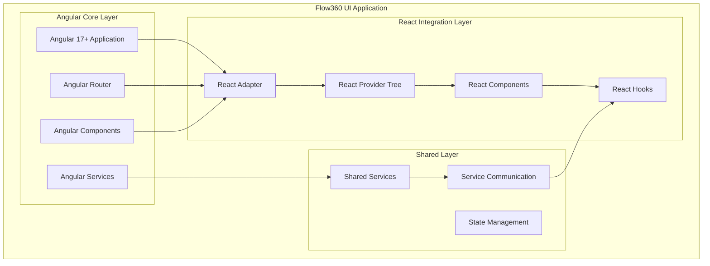
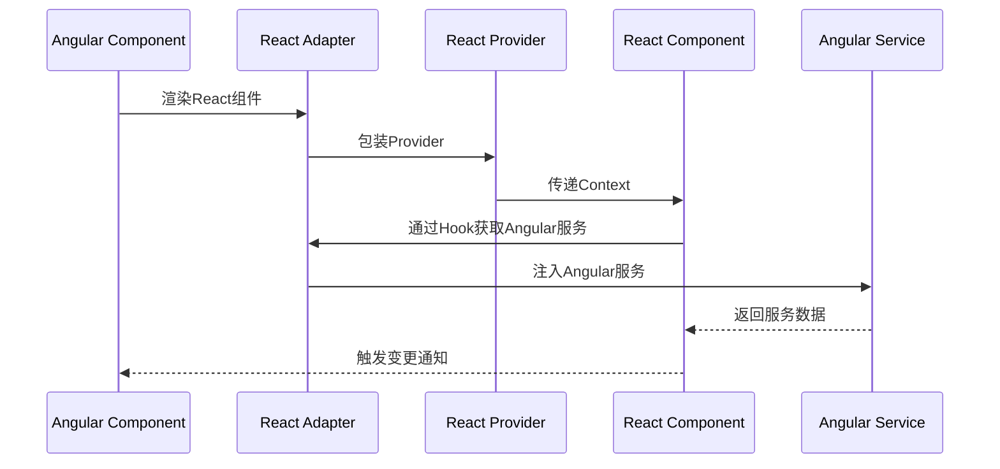
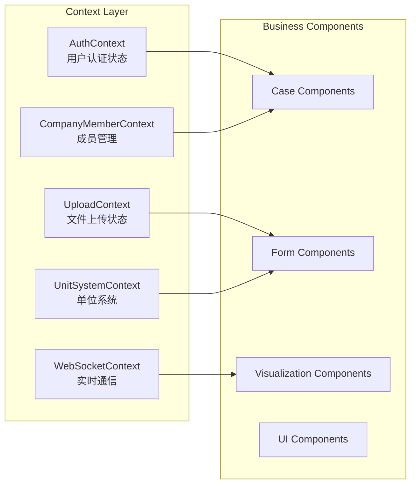
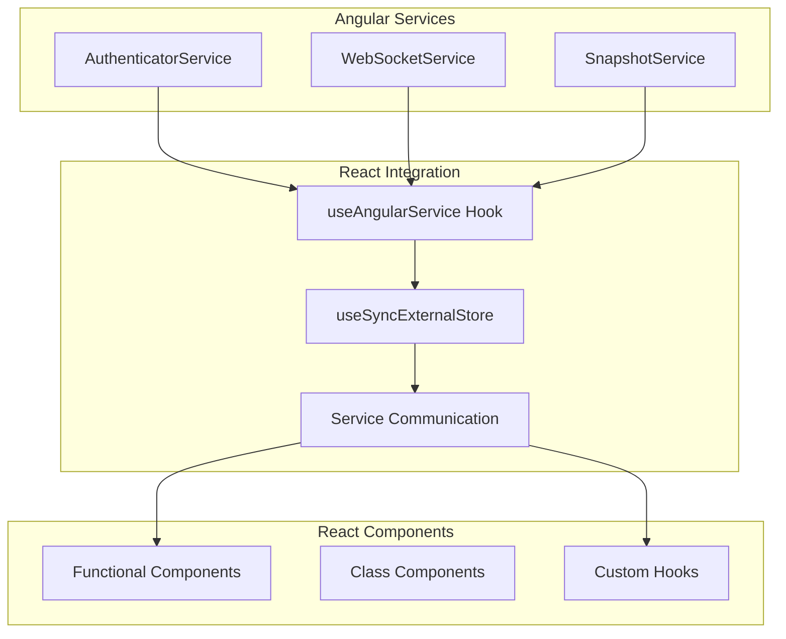
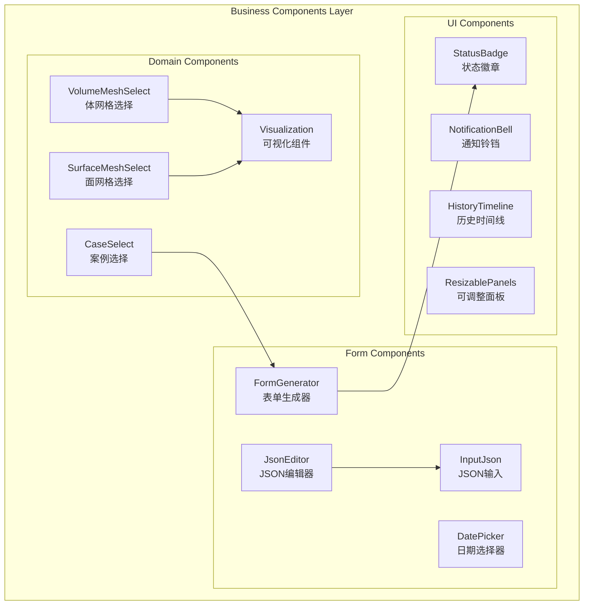
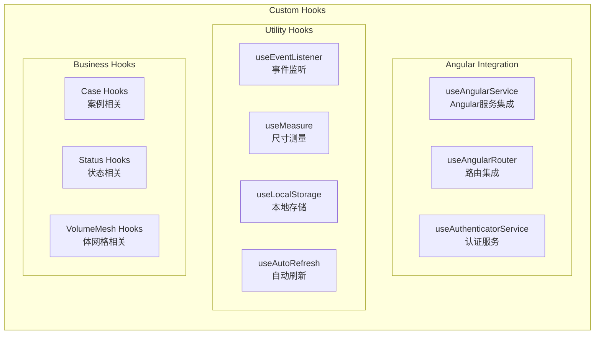
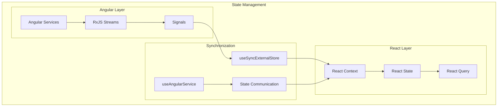
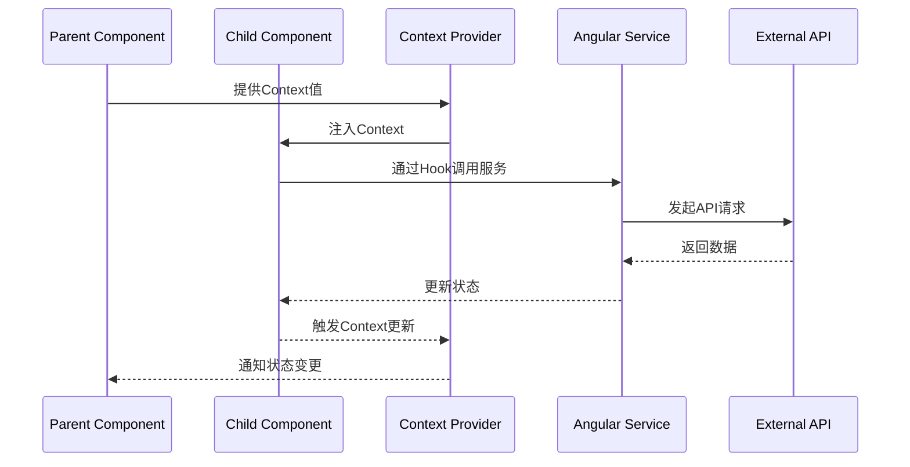
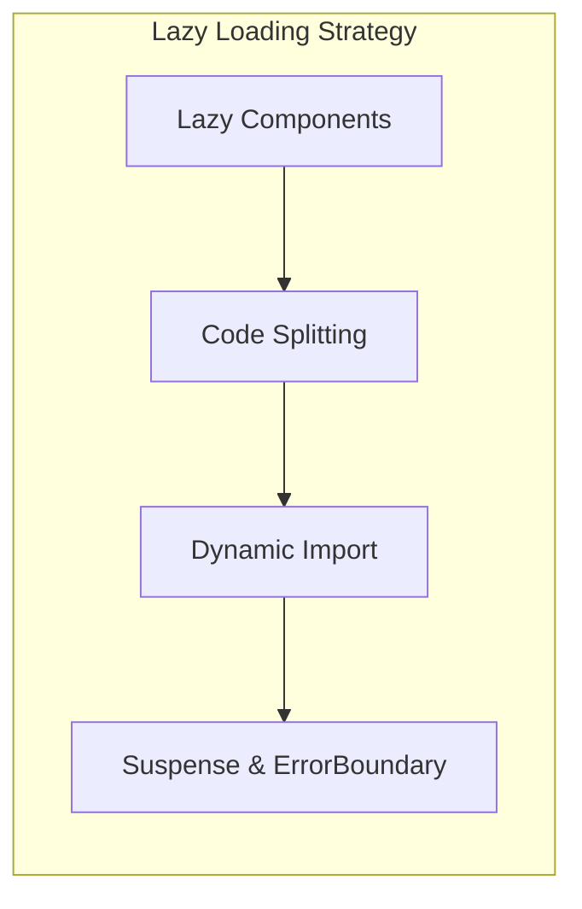

# Flow360 UI React 架构分析文档

## 项目概述

Flow360 UI 是一个混合架构的前端应用，主要基于 Angular 17+ 构建，但集成了 React 组件系统来增强用户界面功能。该项目采用了创新的跨框架集成方案，实现了 Angular 与 React 的无缝协作。

## 整体架构图



## React 组件架构

### 1. 核心 Provider 层级结构

```mermaid
graph TD
    subgraph "React Provider Hierarchy"
        QP[QueryParamProvider<br/>路由参数管理]
        QC[QueryClientProvider<br/>数据查询客户端]
        WS[WebSocketContextProvider<br/>WebSocket连接管理]
        CM[CompanyMemberContextProvider<br/>公司成员管理]
        AU[AuthContextProvider<br/>身份认证管理]
        UP[UploadContextProvider<br/>文件上传管理]
        TP[ThemeProvider<br/>主题配置]
        US[UnitSystemContextProvider<br/>单位系统管理]
        
        QP --> QC
        QC --> WS
        WS --> CM
        CM --> AU
        AU --> UP
        UP --> TP
        TP --> US
        US --> Children[React Components]
    end
```



### 2. Angular-React 集成架构



## 核心模块分析

### 1. Context 管理系统



### 2. 服务集成模式



## 组件分类架构

### 1. 业务组件分层



### 2. Hook 系统架构



## 数据流架构

### 1. 状态管理模式



### 2. 组件通信模式



## 技术特色分析

### 1. 跨框架集成特色

#### Angular-React 桥接机制
- **服务注入桥接**: 通过 `useAngularService` 实现 React 组件访问 Angular 服务
- **路由状态同步**: `AngularRouterAdapter` 确保路由状态在两个框架间同步
- **生命周期管理**: 使用 `useSyncExternalStore` 实现状态同步和生命周期管理

#### 状态同步策略
```typescript
// 核心集成Hook示例
export function useAngularService<TService extends SnapshotService>(
  service: ProviderToken<TService>,
  injector: Injector = AppInjector
): UnwrapSignal<TService['getSnapshot']> {
  const serviceRef = useRef<TService>(injectAngularService(service, injector));

  return useSyncExternalStore(
    onStoreChange => {
      const effectRef = serviceRef.current.onSnapshotChange(onStoreChange);
      return () => effectRef.destroy();
    },
    () => serviceRef.current.getSnapshot()
  );
}
```

### 2. 组件设计模式

#### Provider模式
- **分层Context设计**: 每个业务领域都有独立的Context Provider
- **依赖注入**: Context通过Provider树进行依赖注入
- **状态隔离**: 不同Context之间保持状态隔离，减少耦合

#### Hook复用模式
- **业务Hook**: 封装特定业务逻辑的Hook
- **工具Hook**: 通用功能的Hook封装
- **集成Hook**: Angular服务集成的专用Hook

### 3. 性能优化策略

#### 组件懒加载


#### 状态优化
- **useSyncExternalStore**: 确保外部状态变化时的高效同步
- **React Query**: 提供缓存、重试、背景更新等功能
- **Context分割**: 避免单一大Context导致的不必要重渲染

## 架构优势

### 1. 技术优势
- **渐进式迁移**: 可以逐步将Angular组件迁移到React
- **生态系统利用**: 充分利用两个框架的生态系统优势
- **开发效率**: 团队可以选择熟悉的框架进行开发

### 2. 维护优势
- **清晰的分层**: Context层、组件层、服务层职责明确
- **类型安全**: 完整的TypeScript支持
- **测试友好**: 每个层次都便于单元测试

### 3. 扩展优势
- **模块化设计**: 新功能可以选择合适的技术栈
- **独立部署**: React组件可以独立开发和测试
- **向前兼容**: 为未来可能的完全React迁移做准备

## 开发指南

### 1. 新增React组件
1. 在 `src/react/components/` 创建组件目录
2. 实现组件逻辑，使用相应的Context
3. 通过 `ReactAdapterComponent` 集成到Angular

### 2. 状态管理
1. 业务状态优先使用Angular服务
2. UI状态使用React local state
3. 跨组件状态使用Context或React Query

### 3. 性能最佳实践
1. 合理拆分Context，避免过度渲染
2. 使用React.memo优化函数组件
3. 利用React Query进行数据缓存

## 总结

Flow360 UI的React架构展现了一个成熟的跨框架集成方案，通过精心设计的Provider层级、Hook系统和状态管理，实现了Angular与React的深度融合。这种架构既保持了各框架的优势，又为项目的持续演进提供了灵活性。
