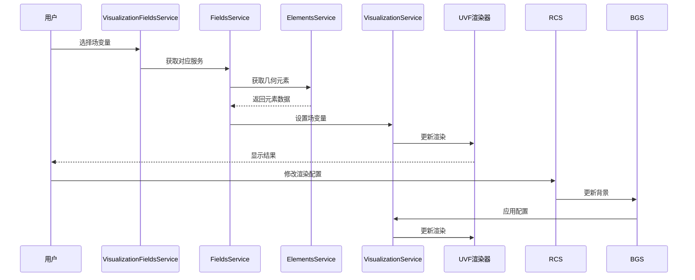
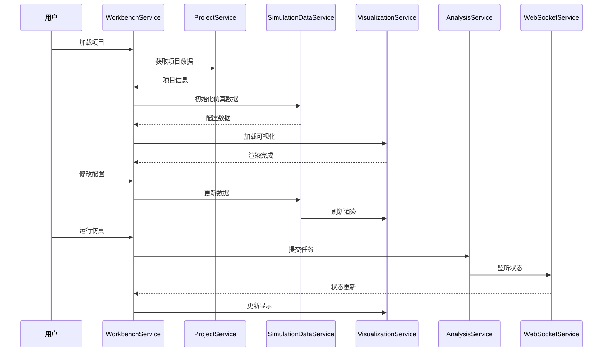

# Flow360 工作台服务架构分析

## 概述

Flow360 工作台组件是一个复杂的 CFD（计算流体力学）仿真平台的核心界面，集成了 **33 个服务**，实现了从项目管理到可视化渲染的完整工作流。

## 服务分类与功能

### 🗂️ **核心数据管理层**
- **ProjectService**: 项目 CRUD 操作，项目生命周期管理
- **SharedProjectService**: 全局项目状态共享
- **SimulationDataService**: 仿真配置数据管理
- **WorkbenchService**: 工作台状态协调器

### 🎯 **实体与几何管理**
- **EntitiesDataService**: 实体数据管理（面、边、区域）
- **EntitiesDraftDataService**: 草稿实体数据
- **EntitiesGhostDataService**: 虚拟实体数据
- **EntitiesBodiesDataService**: 几何体数据管理
- **GeometryService**: 几何数据处理
- **EntitiesTreeService**: 实体树结构管理

### 🎨 **可视化渲染层**
- **VisualizationService**: 3D 渲染引擎核心，管理 UVF 渲染器
- **VisualizationFieldsService**: 场变量可视化总控制器
- **AnalysisVisualizationService**: 分析结果可视化
- **RenderingConfigService**: 渲染配置管理
- **StyleService**: 视觉样式管理
- **ViewpointDataService**: 视角数据管理

#### **专业可视化服务集群**
- **BackgroundService**: 背景配置管理（渐变、纯色、图片）
- **LightService**: 光照系统管理
- **RenderingOptionsService**: 渲染选项管理（阴影、反射、环境光遮蔽等）
- **MaterialListService**: 材质库管理
- **ExporterService**: 图像导出功能

#### **几何元素服务**
- **BoundariesService**: 边界面几何元素管理
- **SlicesService**: 切片几何体管理
- **IsosurfacesService**: 等值面几何体管理  
- **StreamlinesService**: 流线几何体管理

#### **场变量可视化服务**
- **SurfacesFieldsService**: 表面场变量可视化
- **SlicesFieldsService**: 切片场变量可视化
- **IsosurfacesFieldsService**: 等值面场变量可视化
- **StreamlinesFieldsService**: 流线场变量可视化
- **FieldsService**: 场变量可视化基类

#### **专业分析服务**
- **BoundaryConditionService**: 边界条件可视化和管理
- **DivergenceService**: 发散点调试可视化
- **GizmosOverlayService**: 3D 交互控件和测量工具

### 📊 **分析与监控**
- **AnalysisService**: 分析数据处理
- **AnalysisMetricsService**: 分析指标统计
- **DivergenceService**: 发散调试服务
- **BoundaryConditionService**: 边界条件管理
- **WallRotationService**: 旋转壁面处理

### 🔄 **状态与通信**
- **WebSocketService**: 实时状态同步
- **ValidationErrorsService**: 验证错误管理
- **WorkbenchProgressService**: 进度状态管理
- **PerformanceService**: 性能监控

### 🌐 **网络与存储**
- **HttpService**: HTTP 请求管理
- **AwsService**: AWS S3 集成
- **AuthenticatorService**: 用户认证

### 🎮 **交互与界面**
- **GizmosOverlayService**: 3D 交互控件
- **RouterUtilService**: 路由工具
- **GaiService**: AI 几何优化

### 🧰 **基础设施**
- **NzDestroyService**: 组件销毁管理
- **ActivatedRoute**: 路由参数
- **Router**: 路由导航
- **NzMessageService**: 消息提示
- **NzModalService**: 模态框管理
- **Title**: 页面标题管理

## 可视化服务详细架构图

```mermaid
graph TB
    %% 定义样式
    classDef coreVis fill:#e3f2fd
    classDef elementsVis fill:#f1f8e9
    classDef fieldsVis fill:#fff8e1
    classDef renderVis fill:#fce4ec
    classDef configVis fill:#f3e5f5
    classDef utilVis fill:#e8f5e8

    subgraph "可视化核心引擎"
        VS[VisualizationService<br/>3D渲染引擎核心<br/>UVF封装]:::coreVis
        MS[MessageService<br/>数据传输]:::coreVis
        VU[VisualizationUtil<br/>工具函数]:::coreVis
    end

    subgraph "几何元素管理层"
        ES[ElementsService<br/>元素接口]:::elementsVis
        BS[BoundariesService<br/>边界面管理]:::elementsVis
        SLS[SlicesService<br/>切片管理]:::elementsVis
        ISS[IsosurfacesService<br/>等值面管理]:::elementsVis
        STS[StreamlinesService<br/>流线管理]:::elementsVis
    end

    subgraph "场变量可视化层"
        VFS[VisualizationFieldsService<br/>场变量总控制器]:::fieldsVis
        FS[FieldsService<br/>场变量基类]:::fieldsVis
        SFS[SurfacesFieldsService<br/>表面场可视化]:::fieldsVis
        SLFS[SlicesFieldsService<br/>切片场可视化]:::fieldsVis
        ISFS[IsosurfacesFieldsService<br/>等值面场可视化]:::fieldsVis
        STFS[StreamlinesFieldsService<br/>流线场可视化]:::fieldsVis
    end

    subgraph "渲染配置层"
        RCS[RenderingConfigService<br/>渲染配置管理]:::configVis
        BGS[BackgroundService<br/>背景配置]:::configVis
        LS[LightService<br/>光照系统]:::configVis
        ROS[RenderingOptionsService<br/>渲染选项]:::configVis
        MLS[MaterialListService<br/>材质库管理]:::configVis
    end

    subgraph "样式与交互层"
        SS[StyleService<br/>样式管理]:::renderVis
        GOS[GizmosOverlayService<br/>3D交互控件]:::renderVis
        ES2[ExporterService<br/>图像导出]:::renderVis
    end

    subgraph "专业分析层"
        BCS[BoundaryConditionService<br/>边界条件可视化]:::utilVis
        DS[DivergenceService<br/>发散点调试]:::utilVis
    end

    %% 核心关系
    VS --> MS
    VS --> VU
    VS -.-> ES

    %% 元素服务关系
    ES --> BS
    ES --> SLS
    ES --> ISS
    ES --> STS

    %% 场变量服务关系
    VFS --> FS
    FS --> SFS
    FS --> SLFS
    FS --> ISFS
    FS --> STFS
    
    SFS --> BS
    SLFS --> SLS
    ISFS --> ISS
    STFS --> STS

    %% 渲染配置关系
    RCS --> BGS
    RCS --> LS
    RCS --> ROS
    RCS --> MLS
    
    BGS --> VS
    LS --> VS
    ROS --> VS
    MLS --> VS

    %% 样式交互关系
    SS --> VS
    GOS --> VS
    ES2 --> VS

    %% 专业分析关系
    BCS --> VS
    BCS --> BS
    DS --> VS
    DS --> SLS

    %% 主控制关系
    VFS --> VS
    RCS --> VS
```



## 服务关系架构图

```mermaid
graph TB
    %% 定义样式
    classDef coreService fill:#e1f5fe
    classDef dataService fill:#f3e5f5
    classDef visualService fill:#e8f5e8
    classDef analysisService fill:#fff3e0
    classDef infraService fill:#fce4ec
    classDef networkService fill:#f1f8e9

    subgraph "工作台核心协调层"
        WS[WorkbenchService<br/>工作台状态协调器]:::coreService
        SPS[SharedProjectService<br/>全局项目状态]:::coreService
        WPS[WorkbenchProgressService<br/>进度管理]:::coreService
    end

    subgraph "数据管理层"
        PS[ProjectService<br/>项目管理]:::dataService
        SDS[SimulationDataService<br/>仿真数据]:::dataService
        EDS[EntitiesDataService<br/>实体数据]:::dataService
        EDDS[EntitiesDraftDataService<br/>草稿实体]:::dataService
        EGDS[EntitiesGhostDataService<br/>虚拟实体]:::dataService
        EBDS[EntitiesBodiesDataService<br/>几何体数据]:::dataService
        GS[GeometryService<br/>几何处理]:::dataService
        ETS[EntitiesTreeService<br/>实体树]:::dataService
    end

    subgraph "可视化渲染层"
        VS[VisualizationService<br/>3D渲染引擎]:::visualService
        VFS[VisualizationFieldsService<br/>场变量可视化]:::visualService
        AVS[AnalysisVisualizationService<br/>分析可视化]:::visualService
        RCS[RenderingConfigService<br/>渲染配置]:::visualService
        SS[StyleService<br/>样式管理]:::visualService
        VDS[ViewpointDataService<br/>视角管理]:::visualService
        GOS[GizmosOverlayService<br/>3D交互控件]:::visualService
    end

    subgraph "分析计算层"
        AS[AnalysisService<br/>分析处理]:::analysisService
        AMS[AnalysisMetricsService<br/>分析指标]:::analysisService
        DS[DivergenceService<br/>发散调试]:::analysisService
        BCS[BoundaryConditionService<br/>边界条件]:::analysisService
        WRS[WallRotationService<br/>旋转壁面]:::analysisService
        GAIS[GaiService<br/>AI几何优化]:::analysisService
    end

    subgraph "网络通信层"
        HSS[HttpService<br/>HTTP请求]:::networkService
        WSS[WebSocketService<br/>实时通信]:::networkService
        AWS[AwsService<br/>云存储]:::networkService
        AUTHS[AuthenticatorService<br/>用户认证]:::networkService
    end

    subgraph "状态验证层"
        VES[ValidationErrorsService<br/>验证错误]:::infraService
        PERF[PerformanceService<br/>性能监控]:::infraService
    end

    subgraph "基础设施层"
        RU[RouterUtilService<br/>路由工具]:::infraService
        AR[ActivatedRoute<br/>路由参数]:::infraService
        R[Router<br/>路由导航]:::infraService
        NMS[NzMessageService<br/>消息提示]:::infraService
        NMOS[NzModalService<br/>模态框]:::infraService
        TS[Title<br/>标题管理]:::infraService
        NDS[NzDestroyService<br/>销毁管理]:::infraService
    end

    %% 核心协调关系
    WS --> SPS
    WS --> WPS
    WS --> VS
    WS --> EDS
    WS --> SDS

    %% 数据流关系
    PS --> SPS
    SDS --> EDS
    EDS --> EDDS
    EDS --> EGDS
    EDS --> EBDS
    GS --> VS
    ETS --> EDS

    %% 可视化渲染关系
    VS --> VFS
    VS --> AVS
    VS --> RCS
    VS --> SS
    VS --> VDS
    VS --> GOS
    AVS --> AS
    VFS --> AS

    %% 分析计算关系
    AS --> AMS
    AS --> DS
    AS --> BCS
    AS --> WRS
    GAIS --> GS
    BCS --> VS

    %% 网络通信关系
    PS --> HSS
    WSS --> WPS
    AWS --> VS
    AUTHS --> HSS

    %% 状态验证关系
    VES --> SDS
    PERF --> WS

    %% 基础设施关系
    WS --> RU
    WS --> NMS
    WS --> NMOS
    AR --> WS
    R --> RU
    TS --> WS
    NDS --> WS
```



## 可视化服务详细功能分析

### 🎯 **核心可视化服务**

#### **VisualizationService**
- **功能**: 3D渲染引擎核心，封装UVF渲染器
- **职责**: 
  - Manifest数据加载和解析
  - 3D场景管理和渲染控制
  - Draft几何体管理
  - 可视化状态协调
- **关键接口**: 
  - `loadManifest()`: 加载可视化清单
  - `restoreDrafts()`: 恢复草稿几何体
  - `toggleHideIds()`: 控制元素显隐

#### **VisualizationFieldsService**
- **功能**: 场变量可视化总控制器
- **职责**: 
  - 统一管理所有场变量可视化
  - 自定义颜色映射管理
  - 场变量服务路由分发
- **支持场类型**: Surfaces、Slices、Isosurfaces、Streamlines

### 🎨 **几何元素服务层**

#### **ElementsService接口**
```typescript
interface ElementsService {
  readonly elements: Signal<IVisElement[]>;
  readonly root: Signal<IVisElement | null>;
}
```

#### **具体元素服务**
- **BoundariesService**: 边界面元素管理
- **SlicesService**: 切片元素管理，支持flat/crinkled类型切换
- **IsosurfacesService**: 等值面元素管理  
- **StreamlinesService**: 流线元素管理

### 🌈 **场变量可视化服务**

#### **FieldsService基类**
- **核心功能**: 
  - 场变量数据管理
  - 颜色映射控制
  - 最值范围设置
  - 对数刻度支持
  - 等高线/流线参数控制

#### **专业场变量服务**
- **SurfacesFieldsService**: 表面场变量，默认显示CfVec场
- **SlicesFieldsService**: 切片场变量可视化  
- **IsosurfacesFieldsService**: 等值面场变量可视化
- **StreamlinesFieldsService**: 流线场变量，支持管道宽度和方向控制

### 🎭 **渲染配置服务**

#### **RenderingConfigService**
- **功能**: 渲染配置统一管理和持久化
- **配置内容**: 背景、光照、渲染选项、材质样式
- **持久化**: 自动保存到项目配置

#### **BackgroundService**
```typescript
type BackgroundType = 'gradient' | 'color' | 'image';
```
- **渐变背景**: 支持双色渐变
- **纯色背景**: 单一颜色背景  
- **图片背景**: 支持图片上传和格式转换

#### **LightService**
- **光照预设**: 基于UVF光照系统
- **动态切换**: 支持无光照到各种光照预设
- **自动应用**: 配置变化自动应用到渲染器

#### **RenderingOptionsService**
```typescript
interface RenderingOptionsConfig {
  material: boolean;    // 材质渲染
  shadow: boolean;      // 阴影
  ssr: boolean;         // 屏幕空间反射
  ssao: boolean;        // 屏幕空间环境光遮蔽
  bloom: boolean;       // 辉光效果
  toneMapping: string;  // 色调映射
}
```

#### **MaterialListService**
- **材质库管理**: 内置材质和自定义材质
- **材质绑定**: 网格与材质的映射关系
- **材质预览**: 自动生成材质预览图

### 🎪 **专业分析服务**

#### **BoundaryConditionService**
- **边界条件可视化**: 不同类型边界条件的颜色编码
- **交互响应**: 鼠标悬停显示边界条件详情
- **旋转轴可视化**: 旋转壁面的轴线显示

#### **DivergenceService**
- **发散点标记**: 自动标记计算发散的位置
- **最大偏差点**: 突出显示最大偏差位置
- **切片可见性**: 基于发散分析自动调整切片显示

#### **GizmosOverlayService**
- **测量工具**: 点、长度、面积测量
- **3D交互**: 坐标轴、测量标尺显示
- **数据转换**: 支持不同单位系统转换

### 🎨 **样式管理**

#### **StyleService**
- **实体着色**: 面、边、体的颜色管理
- **材质应用**: 物理材质与几何体绑定
- **动态更新**: 实时更新样式变化

#### **ExporterService**
- **高质量导出**: 支持高分辨率图像导出
- **格式支持**: WebP、PNG等格式
- **渲染后导出**: 确保渲染完成后导出

### 🔄 **数据流向**



## 整体功能架构

### 🎯 **主要功能域**

1. **项目生命周期管理**
   - 项目创建、加载、保存、删除
   - 草稿管理和版本控制
   - 项目状态同步和持久化

2. **可视化渲染系统**
   - 3D 几何体渲染
   - 网格可视化（表面网格、体网格）
   - 仿真结果可视化（压力、速度、温度等场）
   - 交互式视角控制

3. **仿真配置管理**
   - 边界条件设置
   - 求解器参数配置
   - 网格生成参数
   - 分析设置管理

4. **实时协作与监控**
   - WebSocket 实时状态同步
   - 多用户协作支持
   - 进度监控和性能分析
   - 错误验证和调试

5. **云端集成**
   - AWS S3 文件存储
   - 用户认证和权限管理
   - 分布式计算资源调度

### 🔄 **数据流向**



### 🏗️ **可视化服务架构特点**

1. **专业领域驱动**: 专门为CFD仿真设计的可视化服务
2. **分层解耦**: 核心引擎 → 元素管理 → 场变量 → 渲染配置的清晰分层
3. **类型安全**: 基于TypeScript的强类型几何元素和场变量定义
4. **响应式**: Angular Signals驱动的自动响应式更新
5. **可扩展**: 基于接口的元素服务，易于添加新的几何类型
6. **性能优化**: 
   - 防抖更新机制
   - 分层渲染控制
   - 按需加载几何数据
7. **配置持久化**: 渲染配置自动保存到项目

### 🎯 **可视化技术特色**

#### **专业CFD可视化**
- **边界条件可视化**: 不同物理边界的颜色编码和交互
- **场变量渲染**: 压力、速度、温度等标量/矢量场的专业可视化
- **流线分析**: 支持上游/下游/双向流线，管道宽度控制
- **等值面**: Q-criterion等CFD特有的等值面分析
- **发散调试**: 自动标记计算发散位置，辅助调试

#### **高质量渲染**
```typescript
// 渲染选项支持
interface RenderingOptions {
  material: boolean;      // PBR材质渲染
  shadow: boolean;        // 动态阴影
  ssr: boolean;          // 屏幕空间反射
  ssao: boolean;         // 环境光遮蔽
  bloom: boolean;        // 辉光效果
  toneMapping: string;   // HDR色调映射
}
```

#### **交互式测量**
- **精度测量**: 点位置、长度、面积的精确测量
- **单位转换**: 支持多种工程单位系统
- **3D标注**: 实时3D坐标轴和标尺显示

### 🔄 **服务协作模式**

#### **元素→场变量→渲染链路**
```typescript
ElementsService → FieldsService → VisualizationService → UVF
     ↓              ↓                  ↓
  几何元素     →   场变量数据    →    3D渲染
```

#### **配置管理链路**
```typescript
RenderingConfigService
    ├── BackgroundService     → 背景配置
    ├── LightService         → 光照系统  
    ├── MaterialListService  → 材质库
    └── RenderingOptions     → 渲染选项
```

### 💡 **核心价值**

#### **专业性**
- **CFD特化**: 专门为计算流体力学设计的可视化工具链
- **工程标准**: 支持工程单位、精度要求和行业标准
- **物理准确**: 基于物理的渲染和准确的数值可视化

#### **易用性**
- **直观交互**: 3D可视化界面，自然的鼠标交互
- **智能默认**: 针对不同数据类型的智能默认配置
- **实时反馈**: 配置变化立即生效，所见即所得

#### **性能优化**
- **增量更新**: 只更新变化的几何元素和场数据
- **内存管理**: 自动清理不需要的几何数据和纹理
- **GPU加速**: 基于WebGL的GPU并行渲染

#### **扩展性**
- **插件化**: 基于接口的服务设计，易于扩展新功能
- **类型安全**: TypeScript保证的编译时类型检查
- **配置驱动**: 通过配置文件控制渲染行为

### 🏗️ **架构特点**

1. **分层架构**: 清晰的数据、业务逻辑、可视化分层
2. **服务协调**: WorkbenchService 作为中央协调器
3. **响应式设计**: 基于 Angular Signals 的响应式状态管理
4. **模块化**: 每个服务职责单一，松耦合设计
5. **实时性**: WebSocket + 轮询保证状态实时同步
6. **扩展性**: 插件化的可视化和分析模块

### 🎯 **可视化服务总结**

Flow360的可视化服务集群是一个**专业级CFD可视化引擎**，具备：

1. **完整性**: 从几何渲染到场变量分析的完整可视化解决方案
2. **专业性**: 针对CFD领域的专业可视化功能
3. **高性能**: GPU加速的高质量实时渲染
4. **易扩展**: 基于接口的模块化设计
5. **用户友好**: 直观的3D交互和智能的默认配置

这个可视化架构为Flow360提供了强大的3D可视化能力，使复杂的CFD仿真结果能够以直观、美观、准确的方式呈现给用户，大大提升了工程师的工作效率和分析能力。

### 💡 **核心价值**

- **专业性**: 专门为 CFD 仿真设计的完整工作流
- **易用性**: 直观的 3D 可视化界面和交互体验
- **协作性**: 支持多用户实时协作的云端平台
- **性能**: 高效的 3D 渲染和大数据处理能力
- **可靠性**: 完善的错误处理和状态恢复机制

这个服务架构构成了一个功能完整、技术先进的 CFD 仿真工作台，为工程师提供了从几何建模到结果分析的一站式解决方案。
