# Flow360 系统架构分析

## 1. 系统概述

Flow360是一个计算流体动力学(CFD)模拟系统，提供了从几何建模、网格生成到求解和后处理的完整工作流程。系统采用了客户端-服务器架构，本地客户端负责用户交互和数据准备，而计算密集型的求解过程则在云端服务器上执行。

## 2. 核心组件架构

## Geometry 类图

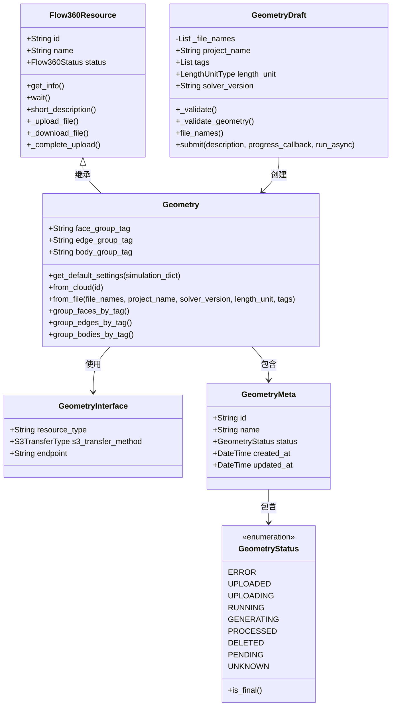

## SurfaceMesh 类图

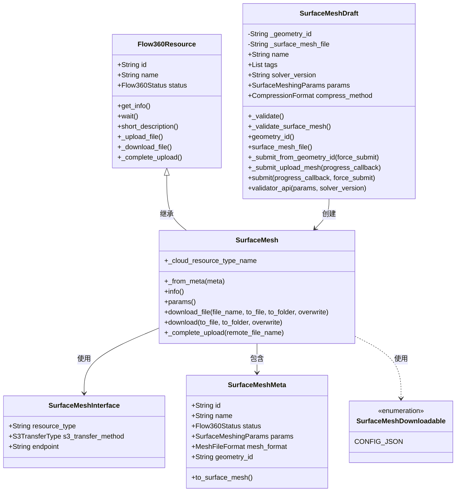

## VolumeMesh 类图

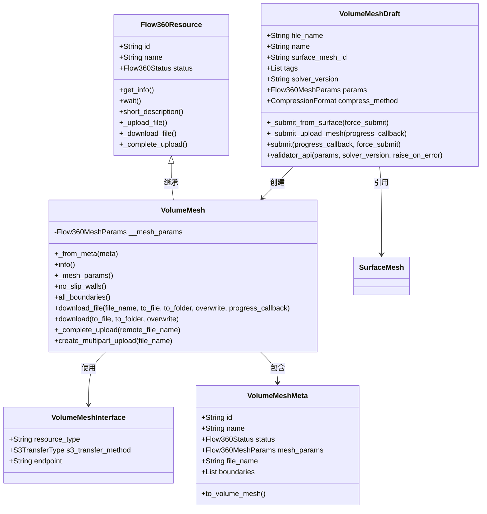

## Case 类图

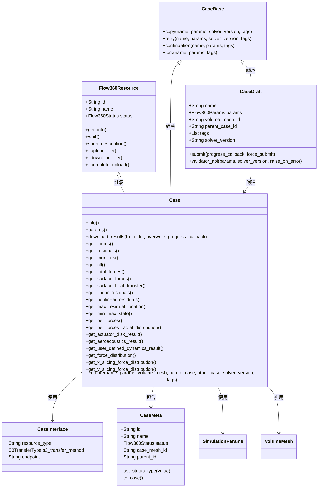

## Project 类图

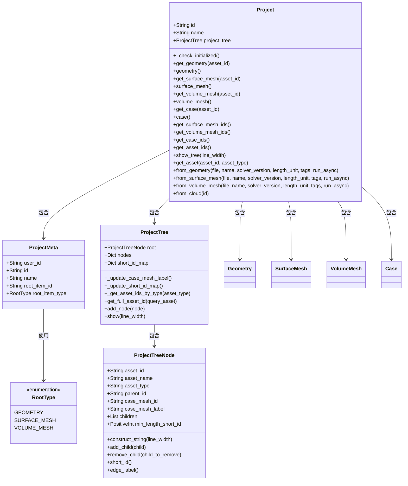

## SimulationParams 类图

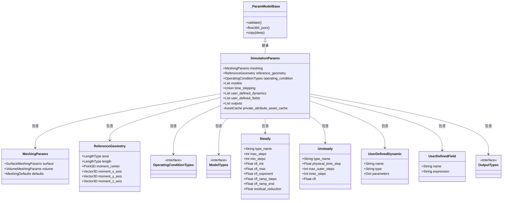

## 核心组件关系图

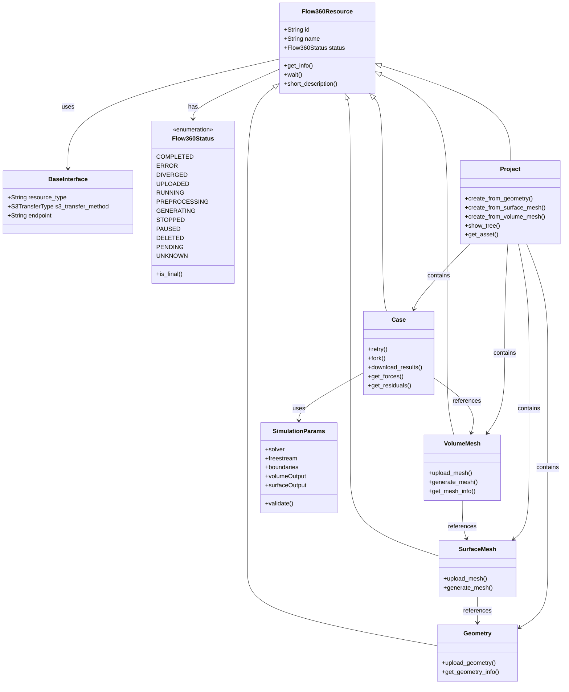

## 3. 系统层次结构

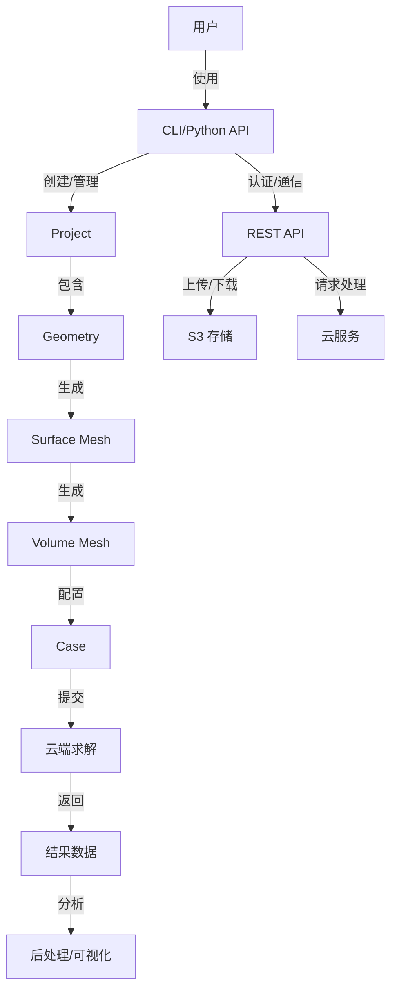

## 4. 组件详细说明

### 4.1 文件组织结构

```mermaid
graph TD
    A[flow360] --> B[cli]
    A --> C[cloud]
    A --> D[component]
    A --> E[plugins]
    A --> F[examples]
    
    B --> B1[app.py]
    B --> B2[api_set_func.py]
    B --> B3[dict_utils.py]
    
    C --> C1[rest_api.py]
    C --> C2[flow360_requests.py]
    C --> C3[s3_utils.py]
    C --> C4[http_util.py]
    C --> C5[security.py]
    
    D --> D1[resource_base.py]
    D --> D2[interfaces.py]
    D --> D3[case.py]
    D --> D4[volume_mesh.py]
    D --> D5[surface_mesh.py]
    D --> D6[geometry.py]
    D --> D7[project.py]
    D --> D8[simulation]
    D --> D9[results]
    
    D8 --> D8A[simulation_params.py]
    D8 --> D8B[models]
    D8 --> D8C[outputs]
    D8 --> D8D[time_stepping]
    D8 --> D8E[operating_condition]
    
    D9 --> D9A[base_results.py]
    D9 --> D9B[case_results.py]
    
    E --> E1[report]
    
    F --> F1[tutorial_*.py]
    F --> F2[example data]
```

### 4.2 核心资源类

系统的核心是`Flow360Resource`基类，它定义了所有资源（如几何、网格、求解案例等）的共同特性和行为。每种资源类型都继承自这个基类，并添加了特定的功能。

- **Flow360Resource**: 所有资源的基类，提供了ID、名称、状态管理等基本功能
- **Case**: 表示一个CFD求解案例，包含求解参数、边界条件等
- **VolumeMesh**: 表示三维体网格，用于CFD求解
- **SurfaceMesh**: 表示表面网格，是生成体网格的基础
- **Geometry**: 表示几何模型，是生成表面网格的基础
- **Project**: 项目容器，组织和管理相关资源

### 4.3 接口与通信

系统使用REST API与云服务进行通信，主要组件包括：

- **RestApi**: 基础REST API客户端，处理HTTP请求
- **BaseInterface**: 定义资源类型的API端点和传输方法
- **S3TransferType**: 定义不同资源类型的S3存储传输方法

### 4.4 模拟参数

`SimulationParams`类定义了CFD模拟所需的各种参数，包括：

- 求解器设置
- 自由流条件
- 边界条件
- 输出控制
- 时间步进设置
- 湍流模型

### 4.5 CLI与用户交互

系统提供了命令行界面(CLI)和Python API两种交互方式：

- **CLI**: 通过命令行工具进行配置和基本操作
- **Python API**: 提供完整的编程接口，支持自动化工作流和高级定制

## 5. 工作流程

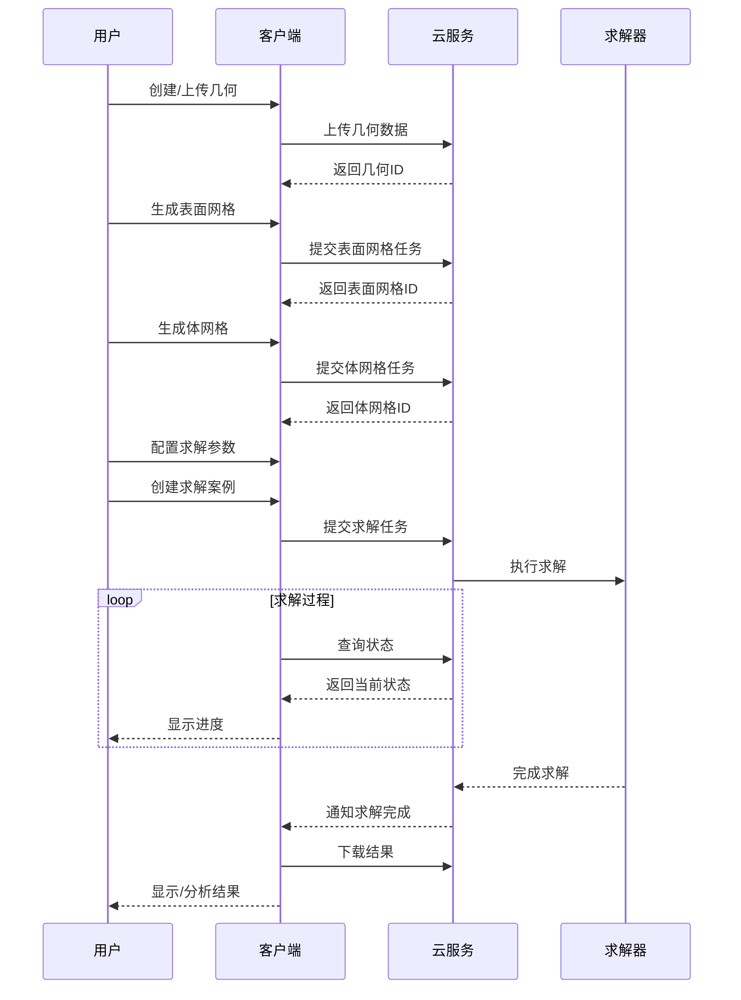

## 6. 架构评估

### 6.1 优势

1. **分离的客户端-服务器架构**：将计算密集型任务放在云端，减轻本地计算负担
2. **模块化设计**：各组件职责明确，便于维护和扩展
3. **资源抽象**：统一的资源模型简化了API设计和使用
4. **工作流管理**：Project类提供了组织和管理相关资源的能力

### 6.2 版本演进

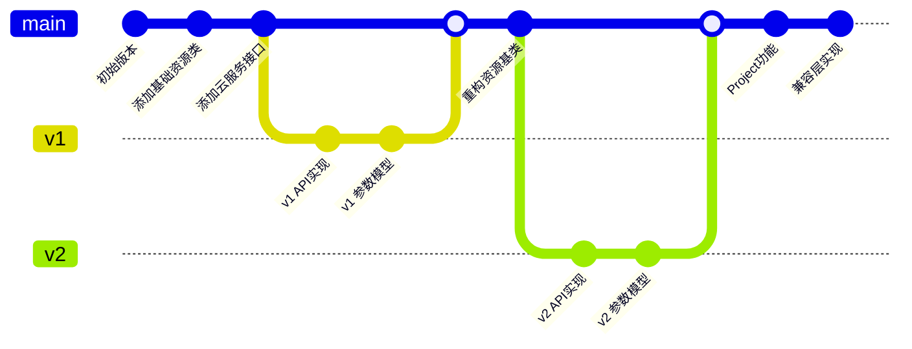

系统的版本演进显示了从v1到v2的过渡，以及如何通过兼容层保持向后兼容性。这种演进方式允许系统逐步更新API和数据模型，同时不破坏现有的用户代码。

### 6.3 可能的改进

1. **异步操作优化**：增强异步任务处理能力，提供更好的进度反馈
2. **缓存机制**：改进本地缓存策略，减少不必要的网络请求
3. **错误处理**：增强错误处理和恢复机制，提高系统稳定性
4. **版本兼容性**：简化版本管理，减少v1和v2接口并存的复杂性
5. **模块化重构**：进一步分离关注点，提高代码的可维护性和可测试性

## 7. 组件交互图

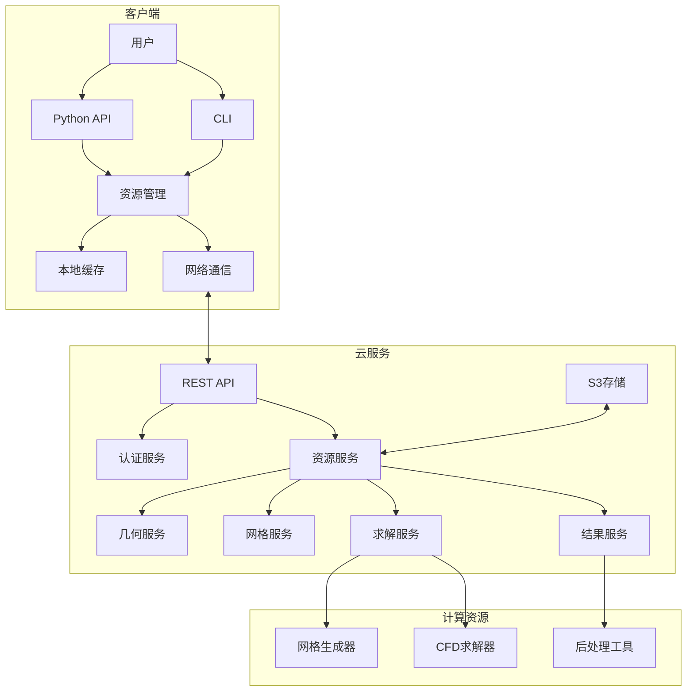

## 8. 数据流图

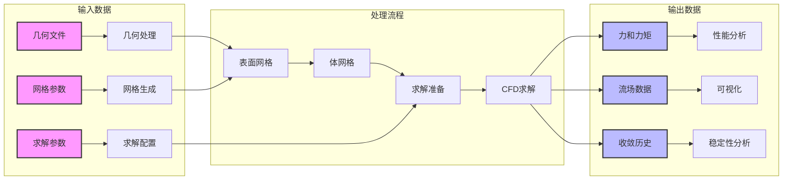

## 9. 新手开发指南

对于想要了解并参与Flow360项目开发的新手，以下是一个建议的源码阅读路径：

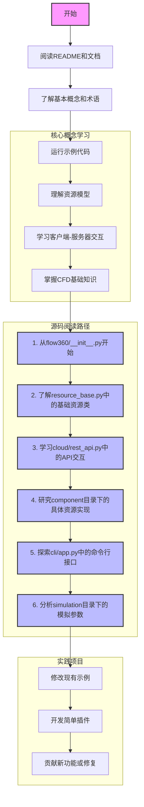

### 9.1 关键文件解析

1. **flow360/__init__.py**: 模块入口点，导出主要API和类，包括`Case`、`Geometry`、`Project`等核心资源类，以及配置函数和单位系统
2. **flow360/component/resource_base.py**: 定义所有资源的基类和共同行为，是理解整个系统资源模型的关键
3. **flow360/cloud/rest_api.py**: 处理与云服务的HTTP通信，实现了RESTful API的客户端
4. **flow360/component/case.py**: 案例资源的实现，包含求解配置、状态管理和结果处理
5. **flow360/component/volume_mesh.py**: 体网格资源的实现，处理三维网格的生成和管理
6. **flow360/component/surface_mesh.py**: 表面网格资源的实现，处理表面网格的生成和管理
7. **flow360/component/geometry.py**: 几何资源的实现，处理几何模型的导入和处理
8. **flow360/component/project.py**: 项目资源的实现，组织和管理其他资源，提供项目树结构
9. **flow360/cli/app.py**: 命令行界面的实现，提供了配置和基本操作的命令
10. **flow360/component/simulation/simulation_params.py**: 模拟参数的定义和验证，包含求解器设置、边界条件等
11. **flow360/solver_version.py**: 版本控制模块，定义了`Flow360Version`类，用于处理和比较版本号

### 9.2 学习路径图

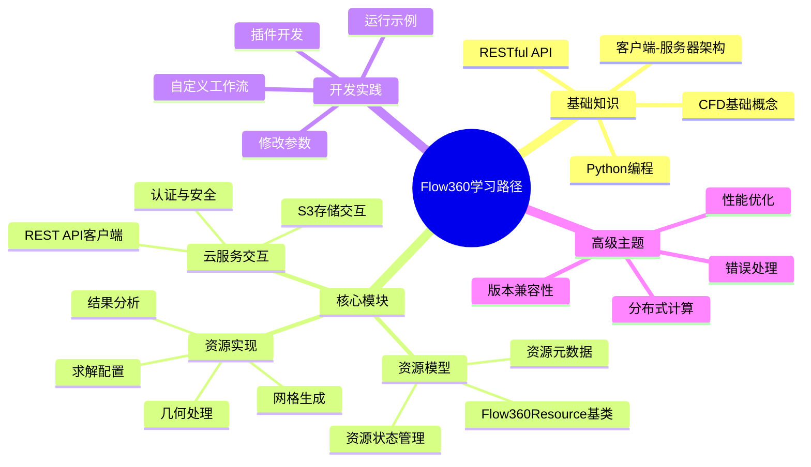

## 10. 总结

Flow360采用了现代化的客户端-服务器架构，通过将计算密集型任务放在云端，同时保持本地客户端的灵活性和易用性，实现了高效的CFD模拟工作流程。系统的模块化设计和统一的资源模型使其具有良好的可扩展性和可维护性。

通过进一步优化异步操作、缓存机制、错误处理和版本兼容性，系统可以提供更好的用户体验和更高的可靠性。

系统的架构设计充分考虑了CFD模拟的特点和需求，通过分离计算密集型任务和用户交互，实现了高效的工作流程。同时，统一的资源模型和模块化设计使系统具有良好的可扩展性和可维护性，能够适应不同的应用场景和需求变化。