---
title: "React 核心库架构深度分析"
description: "深入分析React核心库的源代码架构，从组件系统、Hook机制到JSX实现的全面剖析"
date: "2025-08-02"
lastmod: "2025-08-02"
author: "juzhongsun"
tags: 
  - React
  - 源码分析
  - 架构设计
  - JavaScript
  - Hook系统
categories:
  - 技术分析
  - 前端开发
  - 源码解读
draft: false
weight: 1
toc: true
---

# React 核心库架构深度分析

## 目录

1. [概述](#1-概述)
2. [整体架构概览](#2-整体架构概览)
3. [核心模块详细分析](#3-核心模块详细分析)
   3.1 [入口点架构](#31-入口点架构-entry-points)
   3.2 [组件基类系统](#32-组件基类系统-base-classes)
   3.3 [Hook系统架构](#33-hook系统架构-hooks-system)
   3.4 [JSX系统架构](#34-jsx系统架构-jsx-system)
   3.5 [Context系统架构](#35-context系统架构-context-system)
   3.6 [高阶组件系统](#36-高阶组件系统-higher-order-components)
4. [React核心概念UML类图](#4-react核心概念uml类图)
   4.1 [核心组件架构](#41-核心组件架构)
   4.2 [Context系统架构](#42-context系统架构)
   4.3 [Hook系统架构](#43-hook系统架构)
   4.4 [高阶组件架构](#44-高阶组件架构)
   4.5 [Fiber架构关系](#45-fiber架构关系)
5. [$$typeof设计原理深度解析](#5-typeof设计原理深度解析)
   5.1 [安全防护机制](#51-安全防护机制)
   5.2 [类型识别系统](#52-类型识别系统)
   5.3 [运行时类型检查实现](#53-运行时类型检查实现)
   5.4 [为什么选择Symbol？](#54-为什么选择symbol)
   5.5 [跨环境兼容性处理](#55-跨环境兼容性处理)
   5.6 [开发工具集成](#56-开发工具集成)
6. [源码阅读思路指南](#6-源码阅读思路指南)
   6.1 [阶段一：核心概念理解](#61-阶段一核心概念理解1-2天)
   6.2 [阶段二：Hook系统深入](#62-阶段二hook系统深入2-3天)
   6.3 [阶段三：Context和高阶组件](#63-阶段三context和高阶组件1-2天)
   6.4 [阶段四：与Reconciler接口](#64-阶段四与reconciler接口2-3天)
7. [React工作过程详解](#7-react工作过程详解)
   7.1 [示例应用](#71-示例应用)
   7.2 [工作流程详解](#72-工作流程详解)
   7.3 [详细工作步骤](#73-详细工作步骤)
   7.4 [性能优化在工作流程中的体现](#74-性能优化在工作流程中的体现)
8. [核心设计模式](#8-核心设计模式)
   8.1 [Symbol-based Type System](#81-symbol-based-type-system)
   8.2 [Dispatcher Pattern](#82-dispatcher-pattern)
   8.3 [Internal API Design](#83-internal-api-design)
9. [性能优化策略](#9-性能优化策略)
   9.1 [开发/生产环境分离](#91-开发生产环境分离)
   9.2 [编译时优化](#92-编译时优化)
   9.3 [运行时优化](#93-运行时优化)
10. [错误处理机制](#10-错误处理机制)
11. [与Reconciler的接口设计](#11-与reconciler的接口设计)
12. [总结](#12-总结)

## 1. 概述

React核心库（`react` package）是整个React生态的基础，它提供了定义React组件所需的所有核心功能。本文将从源码角度深入分析React核心库的架构设计，探讨其组件系统、Hook机制、JSX实现等核心模块的设计原理。

## 2. 整体架构概览

React核心库采用模块化设计，主要由以下几个核心模块组成：

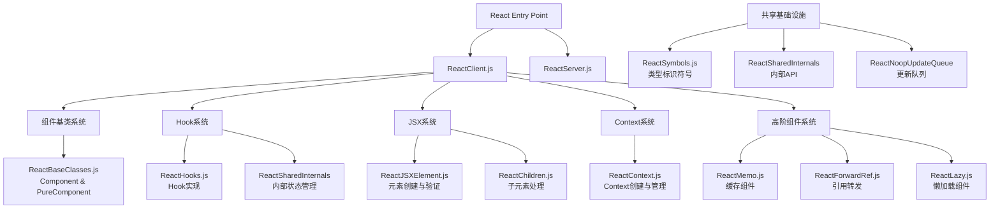
```mermaid
graph TD
    A[React Entry Point] --> B[ReactClient.js]
    A --> C[ReactServer.js]
    
    B --> D[组件基类系统]
    B --> E[Hook系统]
    B --> F[JSX系统]
    B --> G[Context系统]
    B --> H[高阶组件系统]
    
    D --> D1[ReactBaseClasses.js<br/>Component & PureComponent]
    
    E --> E1[ReactHooks.js<br/>Hook实现]
    E --> E2[ReactSharedInternals<br/>内部状态管理]
    
    F --> F1[ReactJSXElement.js<br/>元素创建与验证]
    F --> F2[ReactChildren.js<br/>子元素处理]
    
    G --> G1[ReactContext.js<br/>Context创建与管理]
    
    H --> H1[ReactMemo.js<br/>缓存组件]
    H --> H2[ReactForwardRef.js<br/>引用转发]
    H --> H3[ReactLazy.js<br/>懒加载组件]
    
    I[共享基础设施] --> I1[ReactSymbols.js<br/>类型标识符号]
    I --> I2[ReactSharedInternals<br/>内部API]
    I --> I3[ReactNoopUpdateQueue<br/>更新队列]
```

## 3. 核心模块详细分析

### 3.1 入口点架构 (Entry Points)

React提供了多个入口点以适应不同的运行环境：

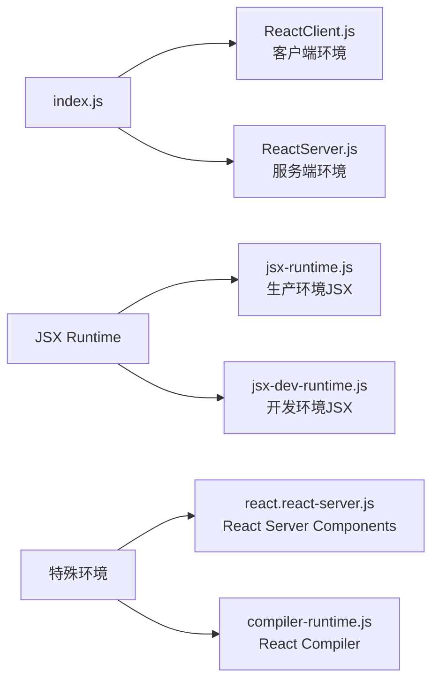
```mermaid
graph LR
    A[index.js] --> B[ReactClient.js<br/>客户端环境]
    A --> C[ReactServer.js<br/>服务端环境]
    
    D[JSX Runtime] --> E[jsx-runtime.js<br/>生产环境JSX]
    D --> F[jsx-dev-runtime.js<br/>开发环境JSX]
    
    G[特殊环境] --> H[react.react-server.js<br/>React Server Components]
    G --> I[compiler-runtime.js<br/>React Compiler]
```

**关键设计原则：**
- **环境分离**: 客户端和服务端使用不同的入口点
- **开发优化**: 开发和生产环境有不同的构建版本
- **特性隔离**: 实验性特性通过独立入口点提供

### 3.2 组件基类系统 (Base Classes)

组件基类系统是React组件模型的基础：

```javascript
// ReactBaseClasses.js 核心实现
function Component(props, context, updater) {
  this.props = props;
  this.context = context;
  this.refs = emptyObject;
  this.updater = updater || ReactNoopUpdateQueue;
}

Component.prototype.isReactComponent = {};
Component.prototype.setState = function(partialState, callback) {
  this.updater.enqueueSetState(this, partialState, callback, 'setState');
};
```

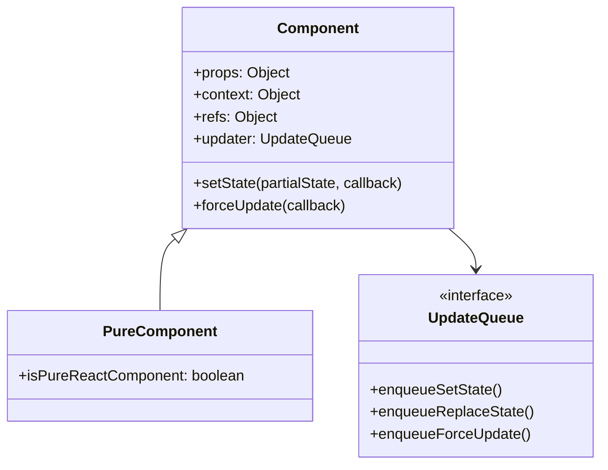
```mermaid
classDiagram
    class Component {
        +props: Object
        +context: Object
        +refs: Object
        +updater: UpdateQueue
        +setState(partialState, callback)
        +forceUpdate(callback)
    }
    
    class PureComponent {
        +isPureReactComponent: boolean
    }
    
    Component <|-- PureComponent
    
    class UpdateQueue {
        <<interface>>
        +enqueueSetState()
        +enqueueReplaceState()
        +enqueueForceUpdate()
    }
    
    Component --> UpdateQueue
```

**架构特点：**
- **最小化设计**: Component类只包含必要的核心方法
- **依赖注入**: updater通过构造函数注入，支持不同的更新策略
- **扩展友好**: PureComponent通过继承扩展浅比较功能

### 3.3 Hook系统架构 (Hooks System)

Hook系统是React现代化的状态管理和副作用处理机制：

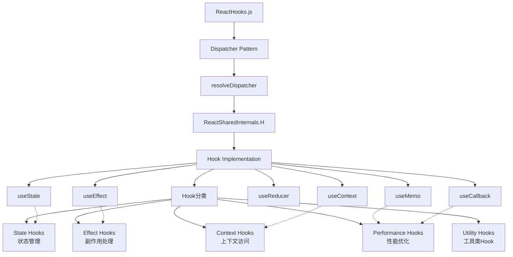
```mermaid
graph TD
    A[ReactHooks.js] --> B[Dispatcher Pattern]
    
    B --> C[resolveDispatcher]
    C --> D[ReactSharedInternals.H]
    
    D --> E[Hook Implementation]
    E --> E1[useState]
    E --> E2[useEffect]
    E --> E3[useContext]
    E --> E4[useReducer]
    E --> E5[useMemo]
    E --> E6[useCallback]
    
    E --> F[Hook分类]
    F --> F1[State Hooks<br/>状态管理]
    F --> F2[Effect Hooks<br/>副作用处理]  
    F --> F3[Context Hooks<br/>上下文访问]
    F --> F4[Performance Hooks<br/>性能优化]
    F --> F5[Utility Hooks<br/>工具类Hook]
    
    E1 -.-> F1
    E2 -.-> F2
    E3 -.-> F3
    E5 -.-> F4
    E6 -.-> F4
```

#### 3.3.1 Dispatcher机制详解

React Hook系统的核心是Dispatcher机制，它是一种运行时多态模式，允许不同的渲染器（如ReactDOM、React Native）提供各自的Hook实现，同时保持统一的API接口。

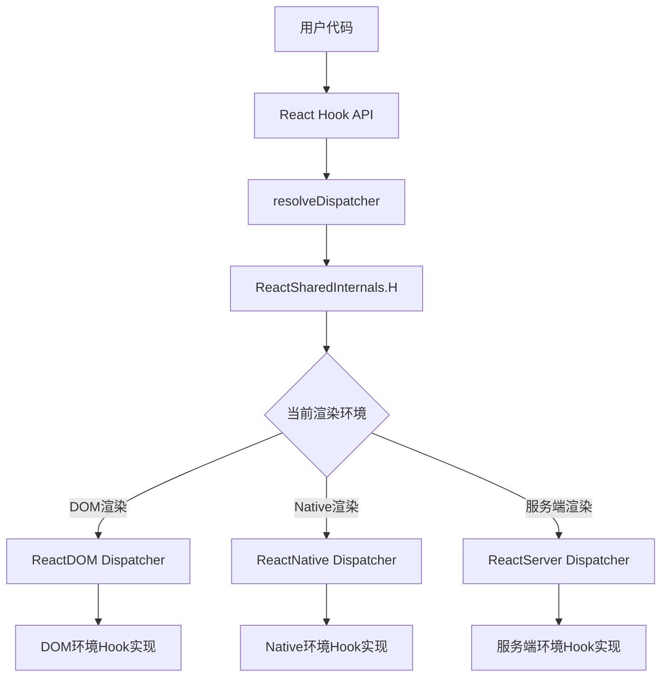
```mermaid
graph TD
    A[用户代码] --> B[React Hook API]
    B --> C[resolveDispatcher]
    C --> D[ReactSharedInternals.H]
    
    D --> E{当前渲染环境}
    E -->|DOM渲染| F[ReactDOM Dispatcher]
    E -->|Native渲染| G[ReactNative Dispatcher]
    E -->|服务端渲染| H[ReactServer Dispatcher]
    
    F --> I[DOM环境Hook实现]
    G --> J[Native环境Hook实现]
    H --> K[服务端环境Hook实现]
```

**Dispatcher的工作原理：**

1. **动态注入**：每个渲染器在渲染前设置全局的`ReactCurrentDispatcher.current`
2. **运行时解析**：Hook调用时通过`resolveDispatcher()`获取当前dispatcher
3. **委托执行**：将实际实现委托给当前环境的dispatcher处理

```javascript
// ReactHooks.js中的Hook实现模式
export function useState<S>(
  initialState: (() => S) | S,
): [S, Dispatch<BasicStateAction<S>>] {
  const dispatcher = resolveDispatcher();
  return dispatcher.useState(initialState);
}

// 解析当前dispatcher的核心函数
function resolveDispatcher() {
  const dispatcher = ReactSharedInternals.H; // H是ReactCurrentDispatcher.current的别名
  // 开发环境错误检查
  if (__DEV__ && dispatcher === null) {
    console.error(
      'Invalid hook call. Hooks can only be called inside of the body of a function component...'
    );
  }
  return dispatcher;
}

// ReactCurrentDispatcher的定义 (在ReactCurrentDispatcher.js中)
const ReactCurrentDispatcher = {
  current: null, // 初始为null，由渲染器在渲染前设置
};
```

**Dispatcher的优势：**

- **统一接口**: 所有Hook通过dispatcher模式统一管理，保持API一致性
- **运行时检查**: 开发环境提供详细的错误信息，如Hook规则违反检测
- **渲染器无关**: Hook实现与具体渲染器解耦，支持多平台
- **环境适配**: 不同环境（开发/生产、客户端/服务端）可以提供不同的实现
- **测试友好**: 可以在测试中注入模拟的dispatcher

### 3.4 JSX系统架构 (JSX System)

JSX系统负责将JSX语法转换为React元素：

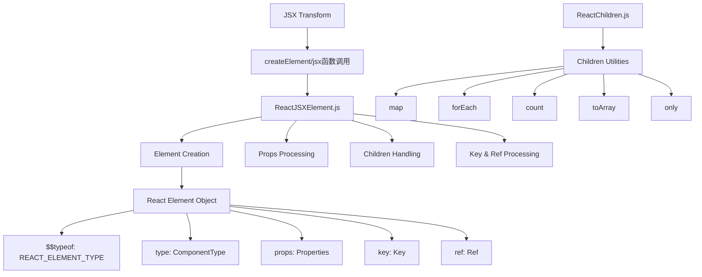
```mermaid
graph TD
    A[JSX Transform] --> B[createElement/jsx函数调用]
    
    B --> C[ReactJSXElement.js]
    C --> D[Element Creation]
    C --> E[Props Processing]
    C --> F[Children Handling]
    C --> G[Key & Ref Processing]
    
    D --> H[React Element Object]
    H --> I[$$typeof: REACT_ELEMENT_TYPE]
    H --> J[type: ComponentType]
    H --> K[props: Properties]
    H --> L[key: Key]
    H --> M[ref: Ref]
    
    N[ReactChildren.js] --> O[Children Utilities]
    O --> O1[map]
    O --> O2[forEach]
    O --> O3[count]
    O --> O4[toArray]
    O --> O5[only]
```

**元素创建流程：**
```javascript
function ReactElement(type, key, ref, owner, props) {
  const element = {
    // React元素标识
    $$typeof: REACT_ELEMENT_TYPE,
    
    // 元素基本属性
    type: type,
    key: key,
    ref: ref,
    props: props,
    
    // 开发工具支持
    _owner: owner,
  };
  
  return element;
}
```

**架构优势：**
- **类型安全**: 通过$$typeof防止XSS攻击
- **开发支持**: 丰富的开发时检查和警告
- **性能优化**: 编译时优化和运行时缓存

### 3.5 Context系统架构 (Context System)

Context系统提供了组件树中的数据传递机制：

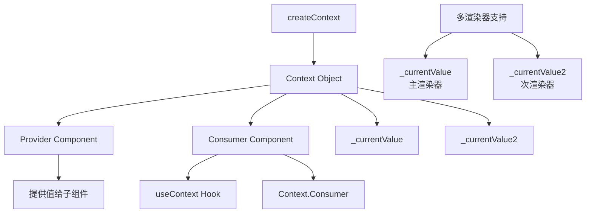
```mermaid
graph TD
    A[createContext] --> B[Context Object]
    
    B --> C[Provider Component]
    B --> D[Consumer Component]
    B --> E[_currentValue]
    B --> F[_currentValue2]
    
    C --> G[提供值给子组件]
    D --> H[useContext Hook]
    D --> I[Context.Consumer]
    
    J[多渲染器支持] --> K[_currentValue<br/>主渲染器]
    J --> L[_currentValue2<br/>次渲染器]
```

**Context实现：**
```javascript
export function createContext<T>(defaultValue: T): ReactContext<T> {
  const context: ReactContext<T> = {
    $$typeof: REACT_CONTEXT_TYPE,
    _currentValue: defaultValue,
    _currentValue2: defaultValue,  // 支持多渲染器
    _threadCount: 0,
    Provider: context,  // 循环引用
    Consumer: {
      $$typeof: REACT_CONSUMER_TYPE,
      _context: context,
    },
  };
  
  return context;
}
```

### 3.6 高阶组件系统 (Higher-Order Components)

React提供了多种高阶组件来增强组件功能：

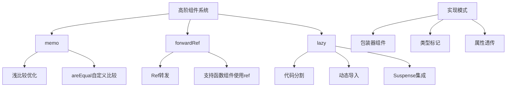
```mermaid
graph TD
    A[高阶组件系统] --> B[memo]
    A --> C[forwardRef]
    A --> D[lazy]
    
    B --> B1[浅比较优化]
    B --> B2[areEqual自定义比较]
    
    C --> C1[Ref转发]
    C --> C2[支持函数组件使用ref]
    
    D --> D1[代码分割]
    D --> D2[动态导入]
    D --> D3[Suspense集成]
    
    E[实现模式] --> E1[包装器组件]
    E --> E2[类型标记]
    E --> E3[属性透传]
```

**memo实现示例：**
```javascript
export function memo<Props>(
  type: React$ComponentType<Props>,
  compare?: (oldProps: Props, newProps: Props) => boolean,
): React$ComponentType<Props> {
  const elementType = {
    $$typeof: REACT_MEMO_TYPE,
    type,
    compare: compare === undefined ? null : compare,
  };
  
  return elementType;
}
```

## 4. React核心概念UML类图

以下是React核心库中主要概念的UML类图，展示了它们之间的关系：

### 4.1 核心组件架构

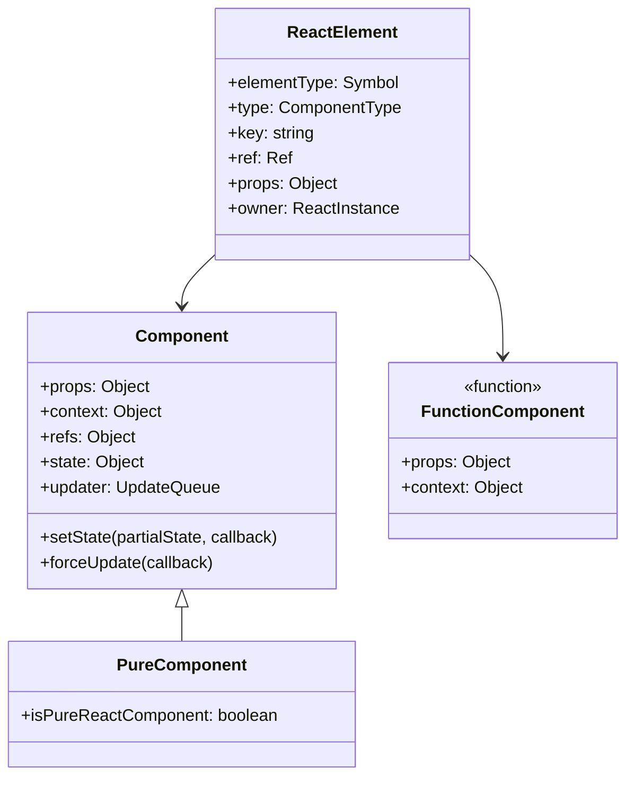
```mermaid
classDiagram
    class ReactElement {
        +elementType: Symbol
        +type: ComponentType
        +key: string
        +ref: Ref
        +props: Object
        +owner: ReactInstance
    }
    
    class Component {
        +props: Object
        +context: Object
        +refs: Object
        +state: Object
        +updater: UpdateQueue
        +setState(partialState, callback)
        +forceUpdate(callback)
    }
    
    class PureComponent {
        +isPureReactComponent: boolean
    }
    
    class FunctionComponent {
        <<function>>
        +props: Object
        +context: Object
    }
    
    Component <|-- PureComponent
    ReactElement --> Component
    ReactElement --> FunctionComponent
```

### 4.2 Context系统架构

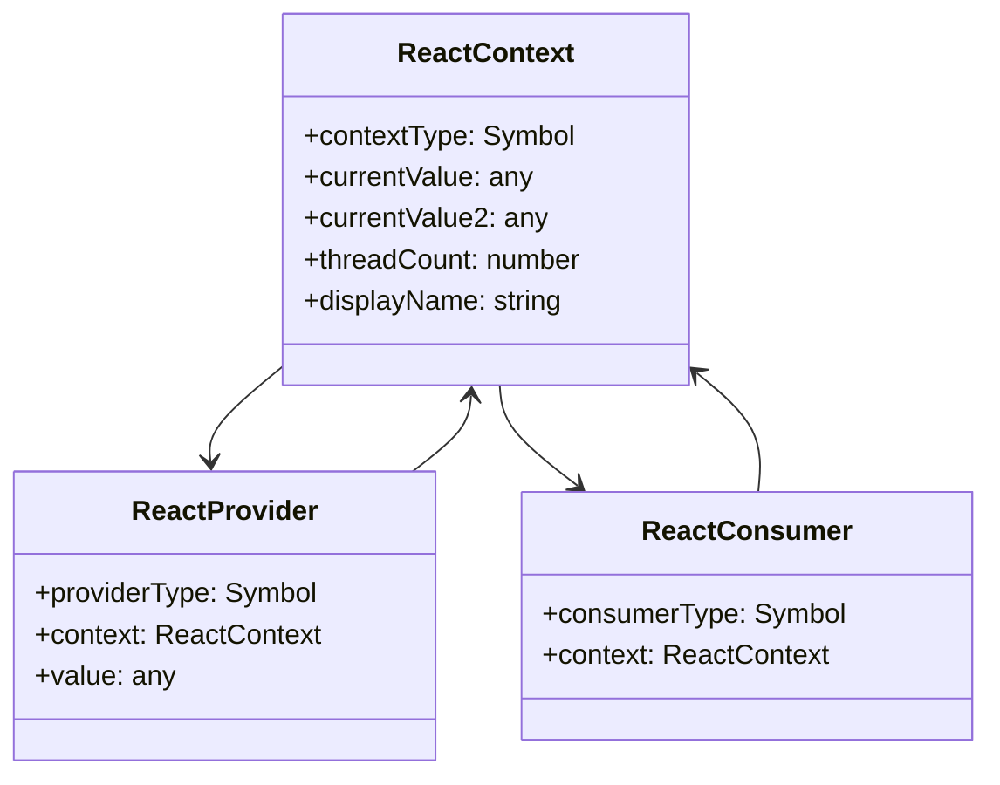
```mermaid
classDiagram
    class ReactContext {
        +contextType: Symbol
        +currentValue: any
        +currentValue2: any
        +threadCount: number
        +displayName: string
    }
    
    class ReactProvider {
        +providerType: Symbol
        +context: ReactContext
        +value: any
    }
    
    class ReactConsumer {
        +consumerType: Symbol
        +context: ReactContext
    }
    
    ReactContext --> ReactProvider
    ReactContext --> ReactConsumer
    ReactProvider --> ReactContext
    ReactConsumer --> ReactContext
```

### 4.3 Hook系统架构

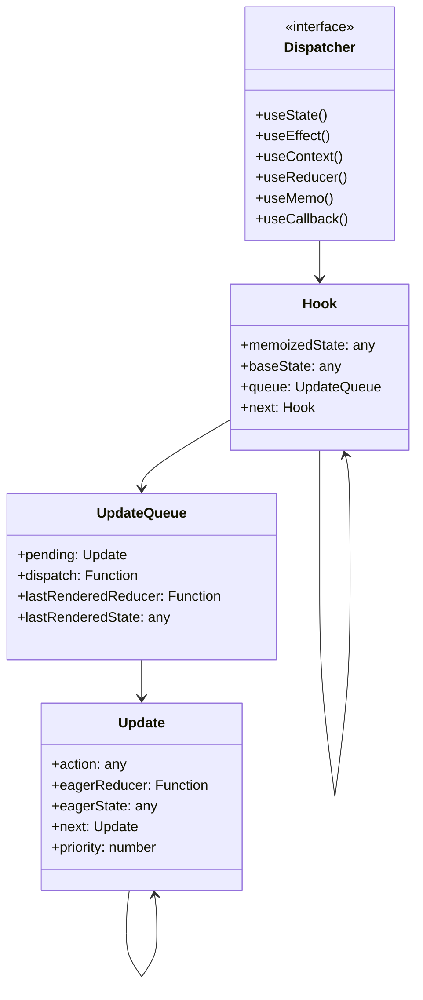
```mermaid
classDiagram
    class Hook {
        +memoizedState: any
        +baseState: any
        +queue: UpdateQueue
        +next: Hook
    }
    
    class UpdateQueue {
        +pending: Update
        +dispatch: Function
        +lastRenderedReducer: Function
        +lastRenderedState: any
    }
    
    class Update {
        +action: any
        +eagerReducer: Function
        +eagerState: any
        +next: Update
        +priority: number
    }
    
    class Dispatcher {
        <<interface>>
        +useState()
        +useEffect()
        +useContext()
        +useReducer()
        +useMemo()
        +useCallback()
    }
    
    Hook --> Hook
    Hook --> UpdateQueue
    UpdateQueue --> Update
    Update --> Update
    Dispatcher --> Hook
```

### 4.4 高阶组件架构

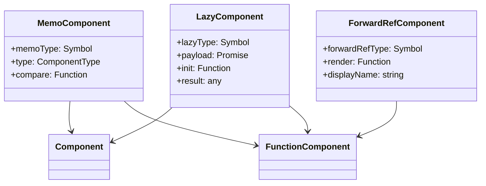
```mermaid
classDiagram
    class MemoComponent {
        +memoType: Symbol
        +type: ComponentType
        +compare: Function
    }
    
    class ForwardRefComponent {
        +forwardRefType: Symbol
        +render: Function
        +displayName: string
    }
    
    class LazyComponent {
        +lazyType: Symbol
        +payload: Promise
        +init: Function
        +result: any
    }
    
    MemoComponent --> Component
    MemoComponent --> FunctionComponent
    ForwardRefComponent --> FunctionComponent
    LazyComponent --> Component
    LazyComponent --> FunctionComponent
```

### 4.5 Fiber架构关系

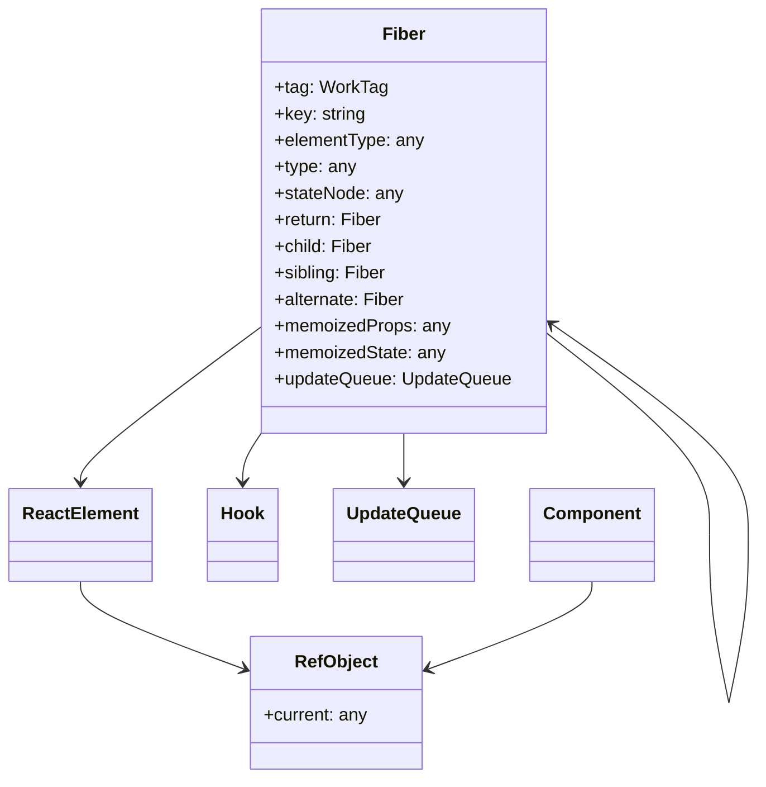
```mermaid
classDiagram
    class Fiber {
        +tag: WorkTag
        +key: string
        +elementType: any
        +type: any
        +stateNode: any
        +return: Fiber
        +child: Fiber
        +sibling: Fiber
        +alternate: Fiber
        +memoizedProps: any
        +memoizedState: any
        +updateQueue: UpdateQueue
    }
    
    class RefObject {
        +current: any
    }
    
    Fiber --> ReactElement
    Fiber --> Hook
    Fiber --> UpdateQueue
    Fiber --> Fiber
    ReactElement --> RefObject
    Component --> RefObject
```

## 5. $$typeof设计原理深度解析

### 5.1 安全防护机制

`$$typeof`是React最重要的安全设计之一，主要用于防止XSS攻击：

```javascript
// ReactSymbols.js中的定义
export const REACT_ELEMENT_TYPE = Symbol.for('react.element');

// ReactJSXElement.js中的使用
function ReactElement(type, key, ref, owner, props) {
  const element = {
    // 这个Symbol无法通过JSON序列化
    $$typeof: REACT_ELEMENT_TYPE,
    type: type,
    key: key,
    ref: ref,
    props: props,
    _owner: owner,
  };
  return element;
}
```

**安全原理图解：**

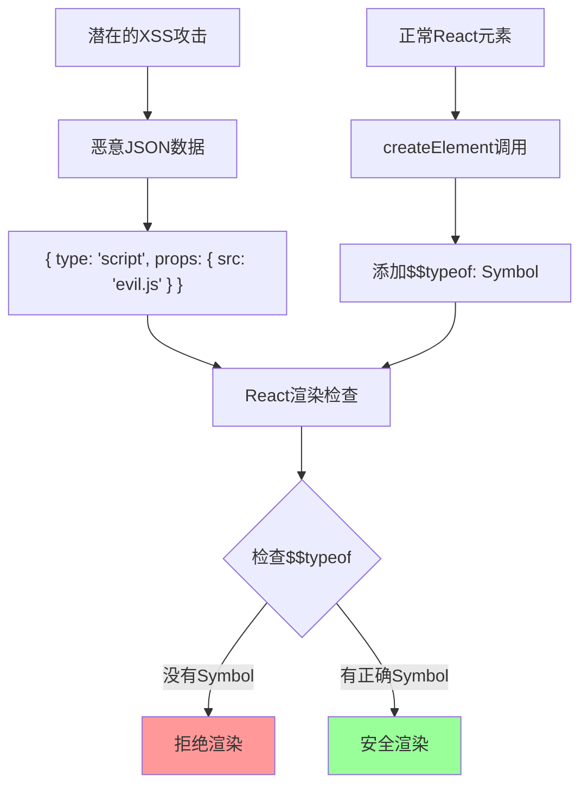
```mermaid
graph TD
    A[潜在的XSS攻击] --> B[恶意JSON数据]
    B --> C["{ type: 'script', props: { src: 'evil.js' } }"]
    C --> D[React渲染检查]
    D --> E{检查$$typeof}
    E -->|没有Symbol| F[拒绝渲染]
    E -->|有正确Symbol| G[安全渲染]
    
    H[正常React元素] --> I[createElement调用]
    I --> J[添加$$typeof: Symbol]
    J --> D
    
    style F fill:#ff9999
    style G fill:#99ff99
```

### 5.2 类型识别系统

`$$typeof`构成了React完整的类型识别体系：

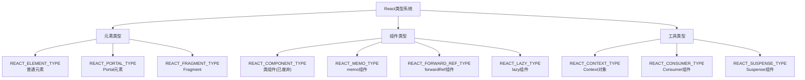
```mermaid
graph TD
    A[React类型系统] --> B[元素类型]
    A --> C[组件类型]
    A --> D[工具类型]
    
    B --> B1["REACT_ELEMENT_TYPE<br/>普通元素"]
    B --> B2["REACT_PORTAL_TYPE<br/>Portal元素"]
    B --> B3["REACT_FRAGMENT_TYPE<br/>Fragment"]
    
    C --> C1["REACT_COMPONENT_TYPE<br/>类组件(已废弃)"]
    C --> C2["REACT_MEMO_TYPE<br/>memo组件"]
    C --> C3["REACT_FORWARD_REF_TYPE<br/>forwardRef组件"]
    C --> C4["REACT_LAZY_TYPE<br/>lazy组件"]
    
    D --> D1["REACT_CONTEXT_TYPE<br/>Context对象"]
    D --> D2["REACT_CONSUMER_TYPE<br/>Consumer组件"]
    D --> D3["REACT_SUSPENSE_TYPE<br/>Suspense组件"]
```

### 5.3 运行时类型检查实现

```javascript
// 类型检查函数示例
function isValidElement(object) {
  return (
    typeof object === 'object' &&
    object !== null &&
    object.$$typeof === REACT_ELEMENT_TYPE
  );
}

function isContextConsumer(object) {
  return (
    typeof object === 'object' &&
    object !== null &&
    object.$$typeof === REACT_CONSUMER_TYPE
  );
}

// 在reconciler中的使用
function beginWork(current, workInProgress, renderLanes) {
  const Component = workInProgress.type;
  
  switch (workInProgress.tag) {
    case FunctionComponent: {
      // 检查是否为特殊组件类型
      if (Component.$$typeof === REACT_MEMO_TYPE) {
        return updateMemoComponent(/* ... */);
      }
      if (Component.$$typeof === REACT_FORWARD_REF_TYPE) {
        return updateForwardRef(/* ... */);
      }
      return updateFunctionComponent(/* ... */);
    }
  }
}
```

### 5.4 为什么选择Symbol？

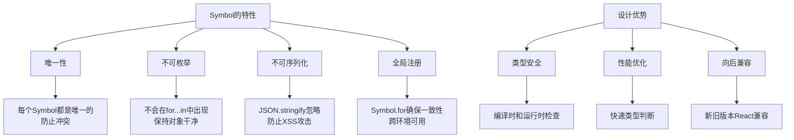
```mermaid
graph TD
    A[Symbol的特性] --> B[唯一性]
    A --> C[不可枚举]
    A --> D[不可序列化]
    A --> E[全局注册]
    
    B --> B1[每个Symbol都是唯一的<br/>防止冲突]
    C --> C1[不会在for...in中出现<br/>保持对象干净]
    D --> D1[JSON.stringify忽略<br/>防止XSS攻击]
    E --> E1[Symbol.for确保一致性<br/>跨环境可用]
    
    F[设计优势] --> G[类型安全]
    F --> H[性能优化]
    F --> I[向后兼容]
    
    G --> G1[编译时和运行时检查]
    H --> H1[快速类型判断]
    I --> I1[新旧版本React兼容]
```

### 5.5 跨环境兼容性处理

```javascript
// ReactSymbols.js中的兼容性处理
const hasSymbol = typeof Symbol === 'function' && Symbol.for;

export const REACT_ELEMENT_TYPE = hasSymbol
  ? Symbol.for('react.element')
  : 0xeac7; // 备用的数字标识

// 检查函数需要同时支持两种情况
function isValidElement(object) {
  return (
    typeof object === 'object' &&
    object !== null &&
    object.$$typeof === REACT_ELEMENT_TYPE
  );
}
```

### 5.6 开发工具集成

```javascript
// React DevTools通过$$typeof识别组件
function getDisplayName(type) {
  if (typeof type === 'string') {
    return type;
  }
  
  switch (type.$$typeof) {
    case REACT_MEMO_TYPE:
      return `Memo(${getDisplayName(type.type)})`;
    case REACT_FORWARD_REF_TYPE:
      return `ForwardRef(${getDisplayName(type.render)})`;
    case REACT_LAZY_TYPE:
      return 'Lazy';
    default:
      return type.displayName || type.name || 'Unknown';
  }
}
```

## 6. 源码阅读思路指南

### 6.1 阶段一：核心概念理解（1-2天）

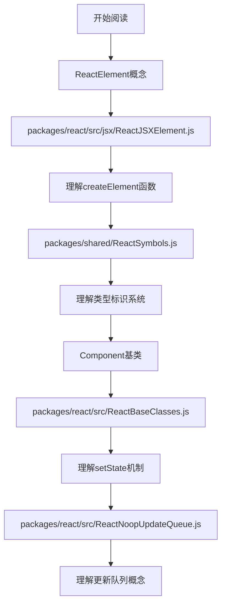
```mermaid
graph TD
    A[开始阅读] --> B[ReactElement概念]
    B --> C[packages/react/src/jsx/ReactJSXElement.js]
    C --> D[理解createElement函数]
    D --> E[packages/shared/ReactSymbols.js]
    E --> F[理解类型标识系统]
    
    F --> G[Component基类]
    G --> H[packages/react/src/ReactBaseClasses.js]
    H --> I[理解setState机制]
    I --> J[packages/react/src/ReactNoopUpdateQueue.js]
    J --> K[理解更新队列概念]
```

**重点文件和阅读顺序：**
1. `ReactSymbols.js` - 理解React的类型系统
2. `ReactJSXElement.js` - 理解元素创建过程
3. `ReactBaseClasses.js` - 理解组件基类设计
4. `ReactNoopUpdateQueue.js` - 理解更新队列抽象

### 6.2 阶段二：Hook系统深入（2-3天）

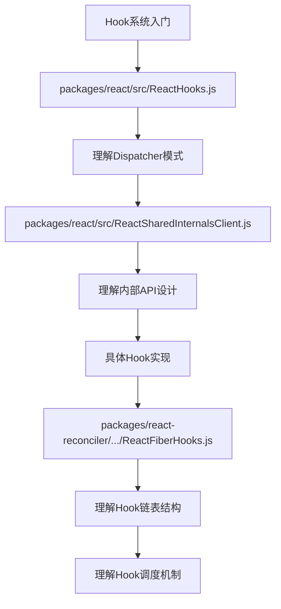
```mermaid
graph TD
    A[Hook系统入门] --> B[packages/react/src/ReactHooks.js]
    B --> C[理解Dispatcher模式]
    C --> D[packages/react/src/ReactSharedInternalsClient.js]
    D --> E[理解内部API设计]
    
    E --> F[具体Hook实现]
    F --> G[packages/react-reconciler/.../ReactFiberHooks.js]
    G --> H[理解Hook链表结构]
    H --> I[理解Hook调度机制]
```

**重点概念：**
- Dispatcher模式的运行时多态
- Hook链表的数据结构
- Hook与Fiber的关系
- 依赖数组的比较机制

### 6.3 阶段三：Context和高阶组件（1-2天）

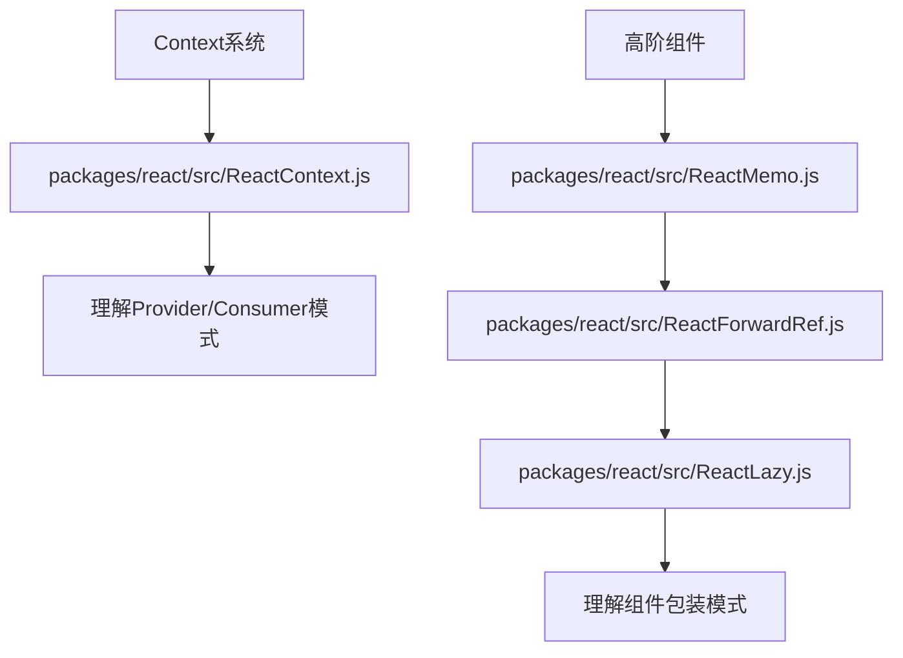
```mermaid
graph TD
    A[Context系统] --> B[packages/react/src/ReactContext.js]
    B --> C[理解Provider/Consumer模式]
    
    D[高阶组件] --> E[packages/react/src/ReactMemo.js]
    E --> F[packages/react/src/ReactForwardRef.js]
    F --> G[packages/react/src/ReactLazy.js]
    G --> H[理解组件包装模式]
```

### 6.4 阶段四：与Reconciler接口（2-3天）

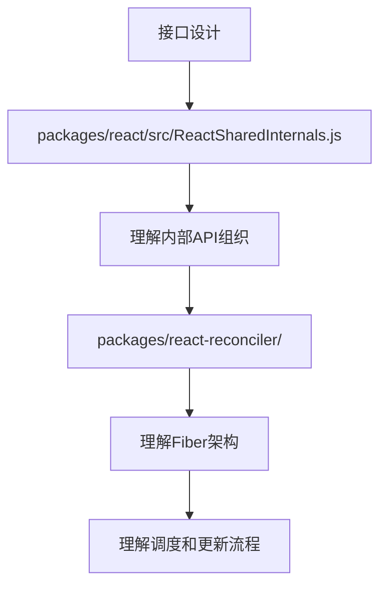
```mermaid
graph TD
    A[接口设计] --> B[packages/react/src/ReactSharedInternals.js]
    B --> C[理解内部API组织]
    C --> D[packages/react-reconciler/]
    D --> E[理解Fiber架构]
    E --> F[理解调度和更新流程]
```

## 7. React工作过程详解

让我们通过一个具体的例子来说明React的完整工作过程：

### 7.1 示例应用

```javascript
import React, { useState, useEffect } from 'react';

function Counter() {
  const [count, setCount] = useState(0);
  const [message, setMessage] = useState('');
  
  useEffect(() => {
    setMessage(`Current count is ${count}`);
  }, [count]);
  
  return (
    <div>
      <h1>{message}</h1>
      <p>Count: {count}</p>
      <button onClick={() => setCount(count + 1)}>
        Increment
      </button>
    </div>
  );
}

const App = () => <Counter />;
export default App;
```

### 7.2 工作流程详解

```mermaid
sequenceDiagram
    participant User as 用户交互
    participant JSX as JSX转换
    participant React as React核心
    participant Reconciler as 协调器
    participant Scheduler as 调度器
    participant Renderer as 渲染器
    
    User->>JSX: 编写JSX代码
    JSX->>React: createElement调用
    React->>React: 创建ReactElement
    
    Note over React: 初始渲染阶段
    React->>Reconciler: 传递元素树
    Reconciler->>Reconciler: 创建Fiber树
    Reconciler->>React: 调用Hook dispatcher
    React->>React: 执行useState初始化
    React->>React: 执行useEffect注册
    
    Reconciler->>Scheduler: 调度渲染任务
    Scheduler->>Renderer: 执行渲染
    Renderer->>User: 显示UI
    
    Note over User: 用户点击按钮
    User->>React: onClick事件
    React->>React: 调用setCount
    React->>Reconciler: 触发更新
    
    Reconciler->>Reconciler: 标记Fiber为dirty
    Reconciler->>Scheduler: 调度更新任务
    Scheduler->>Reconciler: 执行工作循环
    
    Reconciler->>React: 调用Hook dispatcher
    React->>React: 执行useState更新
    React->>React: 检查useEffect依赖
    React->>React: 标记effect需要执行
    
    Reconciler->>Reconciler: Diff新旧Fiber树
    Reconciler->>Renderer: 提交变更
    Renderer->>User: 更新UI
    
    Note over React: Effect执行阶段
    React->>React: 执行useEffect回调
    React->>React: 调用setMessage
    React->>Reconciler: 触发新的更新...
```

### 7.3 详细工作步骤

#### 7.3.1 编译阶段
```javascript
// JSX代码
<button onClick={() => setCount(count + 1)}>Increment</button>

// 编译后
React.createElement(
  'button',
  { onClick: () => setCount(count + 1) },
  'Increment'
)
```

#### 7.3.2 元素创建阶段
```javascript
// ReactJSXElement.js
function ReactElement(type, key, ref, owner, props) {
  return {
    $$typeof: REACT_ELEMENT_TYPE,
    type: 'button',
    key: null,
    ref: null,
    props: {
      onClick: () => setCount(count + 1),
      children: 'Increment'
    },
    _owner: null,
  };
}
```

#### 7.3.3 Hook执行阶段
```javascript
// ReactHooks.js中的useState实现
export function useState(initialState) {
  const dispatcher = resolveDispatcher();
  return dispatcher.useState(initialState);
}

// 在reconciler中的实际实现
function mountState(initialState) {
  const hook = mountWorkInProgressHook();
  hook.memoizedState = hook.baseState = initialState;
  
  const queue = (hook.queue = {
    pending: null,
    dispatch: null,
  });
  
  const dispatch = (queue.dispatch = dispatchAction.bind(
    null,
    currentlyRenderingFiber,
    queue,
  ));
  
  return [hook.memoizedState, dispatch];
}
```

#### 7.3.4 更新调度阶段
```mermaid
graph TD
    A[setCount调用] --> B[创建Update对象]
    B --> C[加入更新队列]
    C --> D[调度更新任务]
    D --> E[Scheduler选择执行时间]
    E --> F[开始工作循环]
    F --> G[处理Fiber节点]
    G --> H[执行Hook更新]
    H --> I[计算新状态]
    I --> J[标记需要重新渲染]
```

#### 7.3.5 Effect执行阶段
```javascript
// useEffect的执行时机
function commitLifeCycles(finishedRoot, current, finishedWork) {
  switch (finishedWork.tag) {
    case FunctionComponent: {
      // 执行useEffect
      commitHookEffectListMount(HookLayout | HookHasEffect, finishedWork);
      break;
    }
  }
}
```

### 7.4 性能优化在工作流程中的体现

```mermaid
graph TD
    A[性能优化策略] --> B[编译时优化]
    A --> C[运行时优化]
    A --> D[调度优化]
    
    B --> B1[Dead Code Elimination]
    B --> B2[Tree Shaking]
    B --> B3[Constant Folding]
    
    C --> C1[浅比较]
    C --> C2[对象引用复用]
    C --> C3[Batching更新]
    
    D --> D1[时间切片]
    D --> D2[优先级调度]
    D --> D3[并发渲染]
```

## 8. 核心设计模式

### 8.1 Symbol-based Type System

React使用Symbol来标识不同类型的元素，确保类型安全：

```javascript
// ReactSymbols.js
export const REACT_ELEMENT_TYPE = Symbol.for('react.element');
export const REACT_CONTEXT_TYPE = Symbol.for('react.context');
export const REACT_MEMO_TYPE = Symbol.for('react.memo');
export const REACT_LAZY_TYPE = Symbol.for('react.lazy');
```

### 8.2 Dispatcher Pattern

Dispatcher Pattern是React核心库中最重要的设计模式之一，特别是在Hook系统中的应用尤为关键。这种模式实现了运行时多态，使React能够在不同环境中保持一致的API。

#### 8.2.1 基本工作流程

```mermaid
sequenceDiagram
    participant App as Application
    participant Hook as Hook Function
    participant Dispatcher as Current Dispatcher
    participant Impl as Hook Implementation
    
    App->>Hook: useState(0)
    Hook->>Dispatcher: resolveDispatcher()
    Dispatcher->>Impl: dispatcher.useState(0)
    Impl-->>Hook: [state, setState]
    Hook-->>App: [state, setState]
```

#### 8.2.2 Dispatcher在React架构中的角色

Dispatcher模式在React中扮演了以下关键角色：

1. **抽象层**：在React核心API和具体实现之间提供抽象层
2. **环境适配器**：根据当前环境（DOM、Native、服务端）选择合适的实现
3. **版本隔离**：允许不同版本的React并存而不冲突
4. **开发/生产环境切换**：提供不同环境下的特定实现

```javascript
// 在ReactDOM渲染器中的使用示例
function renderWithHooks(current, workInProgress, Component, props) {
  // 保存之前的dispatcher
  const prevDispatcher = ReactCurrentDispatcher.current;
  
  try {
    // 根据是否是首次渲染设置不同的dispatcher
    ReactCurrentDispatcher.current = current === null ? 
      HooksDispatcherOnMount : HooksDispatcherOnUpdate;
    
    // 渲染组件，此时组件内的Hook调用会使用上面设置的dispatcher
    let children = Component(props);
    
    // 处理渲染结果...
    return children;
  } finally {
    // 恢复之前的dispatcher
    ReactCurrentDispatcher.current = prevDispatcher;
  }
}
```

#### 8.2.3 不同环境下的Dispatcher实现

```mermaid
graph TD
    A[ReactCurrentDispatcher.current] --> B{渲染阶段}
    B -->|首次渲染| C[HooksDispatcherOnMount]
    B -->|更新渲染| D[HooksDispatcherOnUpdate]
    B -->|渲染后| E[HooksDispatcherOnRerender]
    
    C --> F[mountState<br/>mountEffect<br/>mountRef等]
    D --> G[updateState<br/>updateEffect<br/>updateRef等]
    E --> H[rerenderState<br/>rerenderMemo等]
    
    I[开发环境] --> J[带有额外检查的Dispatcher]
    K[生产环境] --> L[优化性能的Dispatcher]
```

#### 8.2.4 Dispatcher模式的优势

1. **解耦**：React核心库与渲染器之间的松耦合
2. **可测试性**：可以轻松注入测试用的dispatcher
3. **扩展性**：新的渲染器只需实现dispatcher接口
4. **一致性**：确保所有环境下API行为一致
5. **错误处理**：集中式的错误检查和处理

这种设计使得React能够在保持简洁API的同时，适应各种复杂的渲染环境和使用场景。

### 8.3 Internal API Design

React通过`ReactSharedInternals`管理内部API：

```javascript
// ReactSharedInternalsClient.js
import ReactCurrentDispatcher from './ReactCurrentDispatcher';
import ReactCurrentBatchConfig from './ReactCurrentBatchConfig';

const ReactSharedInternals = {
  H: ReactCurrentDispatcher,  // Hook Dispatcher
  S: ReactCurrentBatchConfig, // Batch Config
  A: ReactCurrentActQueue,    // Act Queue
};
```

## 9. 性能优化策略

### 9.1 开发/生产环境分离

```mermaid
graph LR
    A[Source Code] --> B{Build Environment}
    B -->|Development| C[完整错误检查<br/>详细警告<br/>开发工具支持]
    B -->|Production| D[移除检查代码<br/>优化性能<br/>减小体积]
```

### 9.2 编译时优化

- **Dead Code Elimination**: 通过`__DEV__`标记移除开发代码
- **Constant Folding**: 编译时常量折叠
- **Tree Shaking**: 未使用代码的自动移除

### 9.3 运行时优化

- **Object Reuse**: 复用不变的对象引用
- **Shallow Comparison**: 浅比较优化渲染决策
- **Lazy Evaluation**: 延迟计算和初始化

## 10. 错误处理机制

React核心库实现了完善的错误处理：

```mermaid
graph TD
    A[Error Handling] --> B[Development Warnings]
    A --> C[Runtime Checks]
    A --> D[Error Boundaries Support]
    
    B --> B1[Hook规则检查]
    B --> B2[Context使用警告]
    B --> B3[组件命名建议]
    
    C --> C1[类型验证]
    C --> C2[参数检查]
    C --> C3[状态一致性]
    
    D --> D1[错误捕获]
    D --> D2[错误恢复]
    D --> D3[错误上报]
```

## 11. 与Reconciler的接口设计

React核心库通过清晰的接口与reconciler通信：

```mermaid
graph TD
    A[React Core] --> B[Public API]
    A --> C[Internal API]
    
    B --> D[Components]
    B --> E[Hooks]
    B --> F[Context]
    
    C --> G[ReactSharedInternals]
    G --> H[Dispatcher]
    G --> I[BatchConfig]
    G --> J[ActQueue]
    
    K[Reconciler] --> L[实现Dispatcher]
    K --> M[管理组件生命周期]
    K --> N[处理更新队列]
```

## 12. 总结

React核心库的架构设计体现了以下核心理念：

1. **最小化核心**: 核心库只包含定义组件所需的最基本功能
2. **渲染器无关**: 通过抽象接口与具体渲染器解耦
3. **类型安全**: 使用Symbol和运行时检查确保类型安全
4. **开发体验**: 丰富的开发时检查和错误提示
5. **性能优先**: 编译时和运行时的多重优化策略
6. **向后兼容**: 保持API稳定性的同时支持新特性

这种架构设计使得React能够在保持核心简洁的同时，支持多种渲染环境，为开发者提供一致且强大的组件开发体验。

---

*最后更新: 2025年8月2日*
