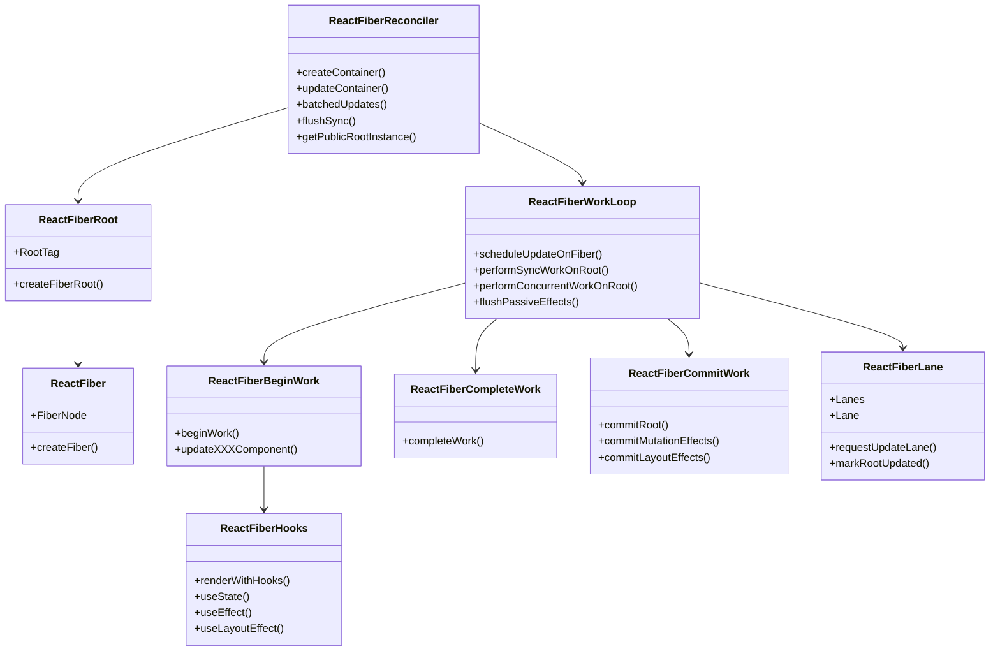
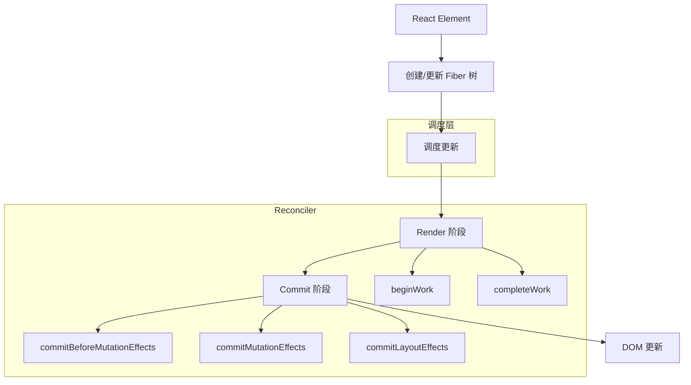
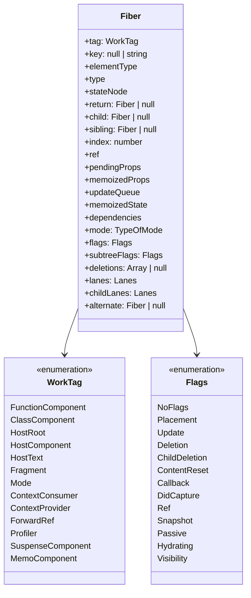
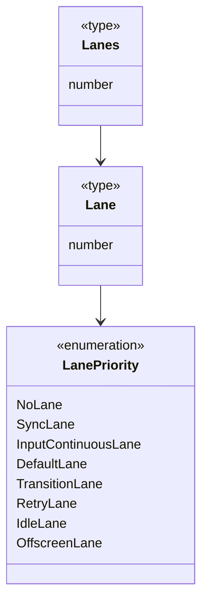
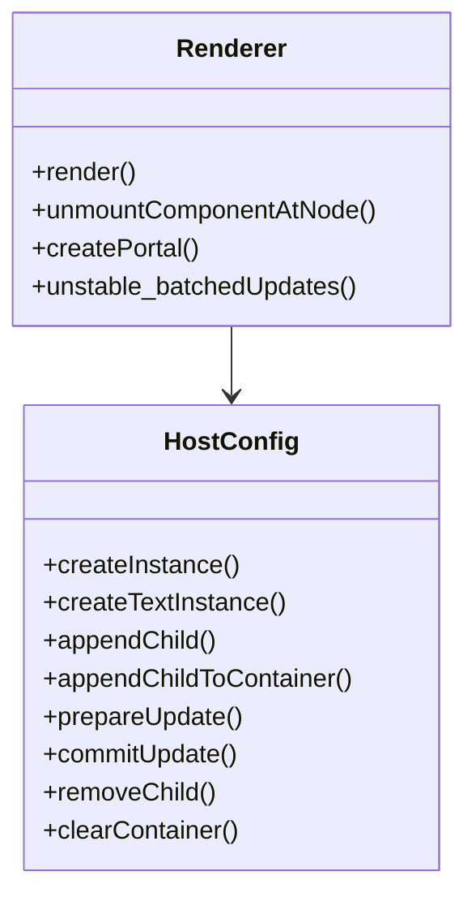

# React Reconciler 架构分析

## 概述

React Reconciler 是 React 的核心包之一，负责实现 React 的协调算法（Reconciliation Algorithm）。它是一个通用的渲染器创建工具，允许开发者基于 React 的核心算法创建自定义渲染器，如 React DOM、React Native 等。

协调器的主要职责是：
1. 处理组件的更新和渲染
2. 计算更新的最小集合（Diff 算法）
3. 调度和优先级管理
4. 错误处理和边界管理
5. 提供可扩展的渲染器接口

## 核心架构

### 核心架构组件关系说明

上图展示了React Reconciler的核心架构组件及其关系，下面是详细说明：

1. **ReactFiberReconciler**：
   - 作为整个协调器的入口点和对外接口
   - 提供创建和更新容器的方法，是自定义渲染器与React核心算法交互的桥梁
   - 依赖ReactFiberRoot来创建和管理Fiber树的根节点
   - 依赖ReactFiberWorkLoop来调度和执行更新

2. **ReactFiberRoot**：
   - 负责创建和管理Fiber树的根节点（FiberRoot）
   - 定义了不同类型的根节点（如Legacy、Concurrent等）
   - 依赖ReactFiber来创建具体的Fiber节点

3. **ReactFiber**：
   - 定义了Fiber节点的结构和创建方法
   - 是React组件树的内部表示，每个React元素对应一个Fiber节点
   - 包含组件的类型、状态、props、子节点等信息

4. **ReactFiberWorkLoop**：
   - 实现了React的工作循环，是协调过程的核心引擎
   - 负责调度更新、执行渲染工作、提交变更到宿主环境
   - 协调Render阶段和Commit阶段的工作
   - 依赖ReactFiberBeginWork和ReactFiberCompleteWork来执行Render阶段
   - 依赖ReactFiberCommitWork来执行Commit阶段
   - 使用ReactFiberLane来管理更新的优先级

5. **ReactFiberBeginWork**：
   - 实现了Render阶段的"向下遍历"过程
   - 负责处理组件的更新，计算变更
   - 为不同类型的组件（函数组件、类组件等）提供更新方法
   - 依赖ReactFiberHooks来处理函数组件的hooks

6. **ReactFiberCompleteWork**：
   - 实现了Render阶段的"向上回溯"过程
   - 完成节点的渲染工作，准备DOM操作
   - 创建和更新DOM节点的属性、事件监听等

7. **ReactFiberCommitWork**：
   - 负责Commit阶段的工作，将变更应用到宿主环境
   - 执行DOM更新、调用生命周期方法和hooks的副作用函数
   - 分为多个子阶段：before mutation、mutation和layout

8. **ReactFiberHooks**：
   - 实现了React Hooks的核心逻辑
   - 提供useState、useEffect等hook的实现
   - 管理函数组件的状态和副作用

9. **ReactFiberLane**：
   - 实现了React的优先级模型
   - 使用二进制位表示不同的优先级通道（Lane）
   - 提供优先级相关的工具函数，如合并、比较优先级等

这些组件共同构成了React Reconciler的核心架构，通过清晰的职责划分和模块化设计，实现了高效、可扩展的协调算法。

## 工作流程

## Fiber 架构

## Lane 模型（优先级管理）

## 渲染器接口

## 架构评估

React Reconciler 的架构设计有以下几个优点：

1. **高度模块化**：各个模块职责清晰，如 Fiber 结构、工作循环、优先级管理等，便于维护和扩展。

2. **可扩展性**：通过 HostConfig 接口，允许创建自定义渲染器，支持多平台渲染。

3. **优先级调度**：Lane 模型提供了细粒度的优先级控制，使得 React 能够根据任务重要性进行调度。

4. **增量渲染**：Fiber 架构支持工作的中断和恢复，实现了增量渲染，提高了用户体验。

5. **并发模式**：支持并发渲染，能够更好地响应用户交互。

可能的改进方向：

1. **简化 API**：当前的 HostConfig 接口较为复杂，可以考虑提供更简化的 API 以降低自定义渲染器的开发难度。

2. **更好的文档**：提供更详细的文档和示例，帮助开发者理解和使用 Reconciler。

3. **性能优化**：继续优化调度算法和 Diff 算法，减少不必要的计算和渲染。

4. **更好的类型安全**：增强类型系统，提供更好的类型检查和推断。

总体而言，React Reconciler 是一个设计精良的库，为 React 的跨平台渲染和高性能更新提供了坚实的基础。