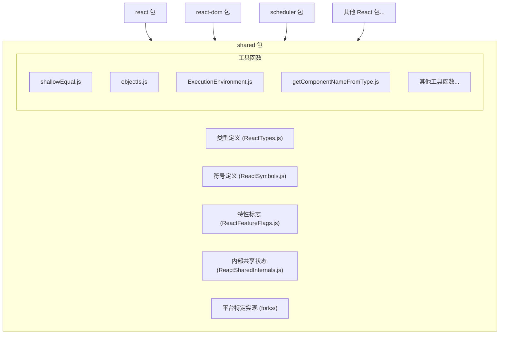
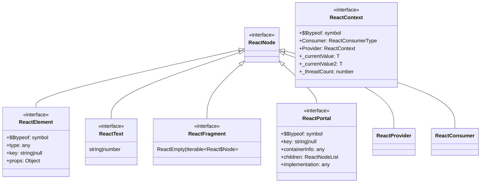
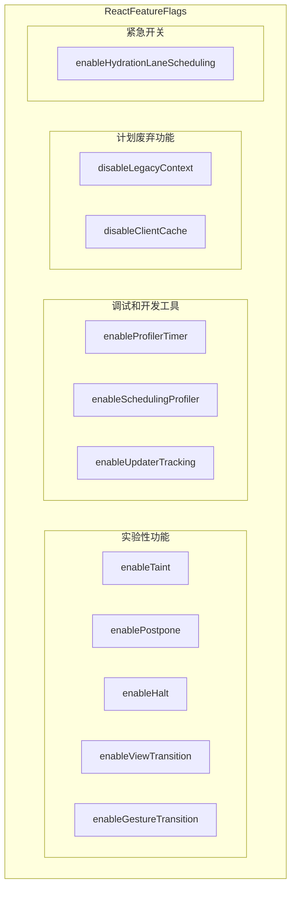

# React Shared 包分析

## 概述

React Shared 包是 React 库的核心共享模块，它包含了被 React 其他包共同使用的工具函数、类型定义、常量和特性标志。这个包的主要目的是提供一个集中的位置来存放所有 React 包之间共享的代码，避免代码重复，并确保一致性。

## 主要组件和功能

### 类型定义

React Shared 包中的 `ReactTypes.js` 文件定义了 React 中使用的核心类型，包括：

- React 节点类型（ReactNode, ReactText, ReactFragment 等）
- Context 相关类型（ReactProvider, ReactConsumer, ReactContext）
- Portal 类型
- Suspense 和异步相关类型（Wakeable, Thenable）
- 错误处理和调试相关类型

### 符号定义

`ReactSymbols.js` 文件定义了 React 内部使用的符号常量，这些符号用于标识不同类型的 React 元素：

- REACT_ELEMENT_TYPE
- REACT_PORTAL_TYPE
- REACT_FRAGMENT_TYPE
- REACT_STRICT_MODE_TYPE
- 等等

### 特性标志

`ReactFeatureFlags.js` 文件包含了控制 React 功能的开关，这些标志用于：

- 启用/禁用实验性功能
- 控制性能优化
- 管理废弃功能
- 启用调试工具

### 工具函数

Shared 包还包含了许多实用工具函数：

- `shallowEqual.js`：用于浅比较两个对象
- `objectIs.js`：实现 Object.is() 的功能
- `ExecutionEnvironment.js`：检测执行环境（如是否在浏览器中）
- `getComponentNameFromType.js`：从组件类型获取组件名称

### 内部共享状态

`ReactSharedInternals.js` 提供了对 React 内部状态的访问，这些状态在 React 的不同部分之间共享。

## 架构图

### 包结构图

### 类型关系图

### 特性标志分类图

## 架构分析

### 优势

1. **代码复用**：通过将共享代码集中在一个包中，React 避免了代码重复，提高了维护效率。

2. **一致性**：所有 React 包使用相同的类型定义和工具函数，确保了行为一致性。

3. **特性标志系统**：通过特性标志，React 团队可以安全地实验新功能，并在必要时快速禁用有问题的功能。

4. **平台适配**：通过 forks 目录中的平台特定实现，React 可以在不同环境中运行，同时保持核心逻辑一致。

### 可能的改进

1. **模块化**：随着 React 的发展，shared 包可能变得过大。进一步模块化可能有助于减少包大小和提高维护性。

2. **类型系统**：虽然 Flow 类型系统提供了类型安全，但考虑迁移到 TypeScript 可能会提供更好的工具支持和社区兼容性。

3. **文档**：为共享工具函数和类型提供更详细的文档，可以帮助开发者更好地理解和使用 React 内部 API。

4. **测试覆盖**：增加测试覆盖率，特别是对于关键的工具函数和类型转换逻辑。

## 总结

React Shared 包是 React 库的基础设施，它提供了类型定义、符号常量、特性标志和工具函数，被 React 的其他包共同使用。这种架构设计促进了代码复用和一致性，同时通过特性标志系统支持了渐进式的功能开发和实验。

通过分析 Shared 包，我们可以更好地理解 React 的内部工作原理，以及 React 团队如何管理和组织这个复杂的库。