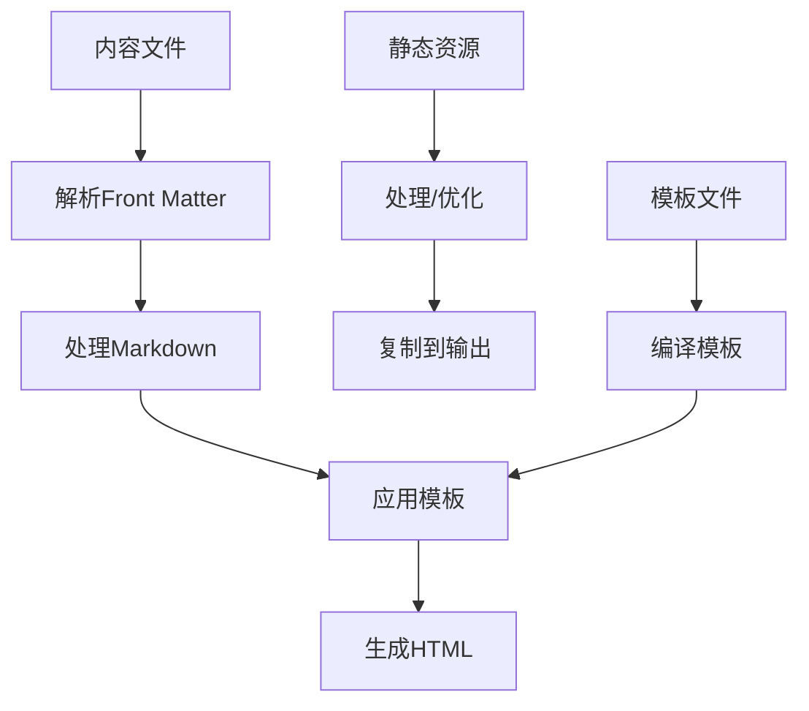

## 1. Hugo简介与核心特性

Hugo是一个用Go语言编写的开源静态网站生成器，以极快的构建速度和强大的功能著称。作为使用者，你需要了解的核心特性包括：

- **极速构建**：5000页网站平均构建时间仅2.3秒，开发环境下实时预览几乎无延迟
- **零运行时依赖**：生成纯静态HTML文件，无需数据库或服务器端语言
- **丰富模板系统**：支持200+内置模板函数，可构建复杂的网站结构
- **多语言支持**：内置i18n功能，轻松创建多语言网站
- **内容管理**：强大的分类、标签和分区系统，灵活组织内容
- **现代化工具链**：内置Sass/SCSS编译、图片处理、实时重载等功能
- **主题生态**：丰富的主题库，可快速搭建各类网站

## 2. 快速入门与基本命令

作为Hugo使用者，你需要掌握的基本命令和工作流程如下：

### 2.1 安装与初始化

```bash
# 安装Hugo (macOS)
brew install hugo

# 安装Hugo (Windows)
choco install hugo -confirm

# 创建新站点
hugo new site my-website
cd my-website

# 添加主题
git init
git submodule add https://github.com/theNewDynamic/gohugo-theme-ananke themes/ananke
echo 'theme = "ananke"' >> hugo.yaml
```

### 2.2 常用命令

```bash
# 创建新内容
hugo new content posts/my-first-post.md

# 启动开发服务器
hugo server -D  # -D 显示草稿内容

# 构建网站
hugo  # 生成到 public/ 目录

# 清理缓存并重新构建
hugo --cleanDestinationDir

# 生成带有未来日期的内容
hugo -F
```

### 2.3 配置文件

Hugo支持多种格式的配置文件：`hugo.yaml`、`hugo.toml`或`hugo.json`。以下是一个基本的YAML配置示例：

```yaml
baseURL: "https://example.org/"
languageCode: "zh-cn"
title: "我的Hugo网站"
theme: "ananke"

params:
  author: "网站作者"
  description: "网站描述"

menu:
  main:
    - identifier: "home"
      name: "首页"
      url: "/"
      weight: 10
    - identifier: "about"
      name: "关于"
      url: "/about/"
      weight: 20

taxonomies:
  category: "categories"
  tag: "tags"
  series: "series"
```

### 2.4 内容创建

Hugo内容文件通常包含前置元数据(Front Matter)和Markdown内容：

```markdown
---
title: "我的第一篇文章"
date: 2023-01-01T10:00:00+08:00
draft: false
tags: ["hugo", "web"]
categories: ["教程"]
---

## 文章内容

这是我的第一篇Hugo文章。
```

### 2.5 构建流程



Hugo的构建过程对使用者来说是透明的，你只需关注内容创作和模板定制，Hugo会自动处理构建优化。

## 3. 项目结构与内容管理

### 3.1 标准目录结构与使用说明

Hugo项目的标准目录结构如下，每个目录都有特定的用途：

```
my-hugo-site/
├── archetypes/          # 内容模板，定义新建内容的默认结构
├── assets/              # 需要处理的资源文件（SCSS、JS等）
├── config.yaml          # 站点配置文件
├── content/             # 网站内容（Markdown文件）
│   ├── posts/           # 博客文章
│   ├── about/           # 关于页面（通常用index.md）
│   └── _index.md        # 首页内容
├── data/                # 数据文件（YAML/JSON/TOML）
├── layouts/             # 自定义HTML模板
│   ├── _default/        # 默认模板
│   ├── partials/        # 可重用模板片段
│   └── shortcodes/      # 自定义短代码
├── static/              # 静态资源（图片/CSS/JS）
├── resources/           # 生成的资源缓存（自动创建）
└── themes/              # 主题目录
    └── theme-name/      # 特定主题
```

### 3.2 目录详细说明与使用技巧

#### archetypes/

这里存放内容模板，用于定义新建内容的默认结构。当你使用`hugo new`命令创建内容时，Hugo会使用这些模板：

```markdown
# archetypes/default.md（默认模板）
---
title: "{{ replace .Name "-" " " | title }}"
date: {{ .Date }}
draft: true
---

# archetypes/posts.md（文章专用模板）
---
title: "{{ replace .Name "-" " " | title }}"
date: {{ .Date }}
draft: true
tags: []
categories: []
---
```

#### content/

网站内容的核心所在，目录结构决定了URL结构：

- **单页面**：`content/about.md` → `/about/`
- **章节页面**：`content/posts/_index.md` → `/posts/`
- **常规页面**：`content/posts/my-post.md` → `/posts/my-post/`
- **捆绑资源**：`content/posts/my-post/index.md`和同目录下的图片等资源

#### layouts/

自定义模板目录，按照以下优先级查找模板：

1. `/layouts/<TYPE>/<VIEW>.html`
2. `/themes/<THEME>/layouts/<TYPE>/<VIEW>.html`

常用模板文件：

```
layouts/
├── _default/
│   ├── baseof.html      # 基础模板（所有页面的外壳）
│   ├── list.html        # 列表页模板（分类、标签页等）
│   └── single.html      # 单页模板（文章页等）
├── index.html           # 首页模板
└── partials/            # 可复用的模板片段
    ├── header.html
    └── footer.html
```

#### static/ vs assets/

- **static/**：直接复制到输出目录，不经处理
- **assets/**：可通过管道处理（如SCSS编译、JS压缩）

```go
<!-- 引用static目录资源 -->


<!-- 引用assets目录资源（模板中） -->
{{ $style := resources.Get "scss/main.scss" | resources.ToCSS | resources.Fingerprint }}
<link rel="stylesheet" href="{{ $style.Permalink }}">
```

#### data/

存储结构化数据，可在模板中使用：

```yaml
# data/authors.yaml
john:
  name: John Doe
  bio: Writer and blogger
  twitter: johndoe
```

```html
<!-- 在模板中使用 -->
{{ $author := index .Site.Data.authors .Params.author }}
<p>作者：{{ $author.name }}</p>
```

这种结构化的目录约定使得项目易于维护，尤其是团队协作时。Hugo的目录结构设计考虑了性能优化，如内容分区存储减少文件扫描范围，模板预编译加速渲染，以及资源指纹提高缓存效率。

## 4. Hugo模板系统与内置变量

### 4.1 模板系统概述

Hugo的模板系统基于Go的模板引擎，支持强大的变量、函数和逻辑控制：

```go
<!-- 基本语法示例 -->
{{ if eq .Section "posts" }}
  <h1>这是博客文章</h1>
{{ else }}
  <h1>这是其他页面</h1>
{{ end }}

<!-- 循环示例 -->
<ul>
  {{ range .Pages }}
    <li><a href="{{ .RelPermalink }}">{{ .Title }}</a></li>
  {{ end }}
</ul>

<!-- 管道和函数链 -->
{{ .Content | truncate 200 | markdownify }}
```

### 4.2 Hugo内置变量

Hugo提供了丰富的内置变量，可以在模板中直接使用。这些变量按作用域可分为以下几类：

#### 全局变量

这些变量在任何模板中都可以访问：

| 变量 | 描述 |
|------|------|
| `.Site` | 包含整个站点的信息和配置 |
| `.Page` | 当前页面的信息 |
| `.File` | 当前内容文件的信息 |
| `.Params` | 当前页面的前置参数 |
| `.Hugo` | Hugo相关信息（版本等） |

#### 站点变量 (.Site)

通过`.Site`可以访问站点级别的信息：

```go
{{ .Site.Title }}           // 站点标题
{{ .Site.BaseURL }}         // 基础URL
{{ .Site.Language.Lang }}   // 当前语言代码
{{ .Site.Params.author }}   // 自定义参数
{{ .Site.Pages }}           // 所有页面
{{ .Site.RegularPages }}    // 常规页面（非章节页面）
{{ .Site.Taxonomies }}      // 所有分类法
{{ .Site.Data }}            // data目录中的数据
```

#### 页面变量 (.Page)

在页面模板中，可以访问当前页面的详细信息：

```go
{{ .Title }}               // 页面标题
{{ .Content }}             // 页面内容（HTML）
{{ .Plain }}               // 纯文本内容
{{ .Summary }}             // 内容摘要
{{ .Date }}                // 发布日期
{{ .Lastmod }}             // 最后修改日期
{{ .Permalink }}           // 完整URL
{{ .RelPermalink }}        // 相对URL
{{ .WordCount }}           // 字数统计
{{ .ReadingTime }}         // 预计阅读时间（分钟）
{{ .TableOfContents }}     // 自动生成的目录
{{ .NextInSection }}       // 同一章节的下一页
{{ .PrevInSection }}       // 同一章节的上一页
{{ .Params.custom_field }} // 自定义前置参数
```

#### 分类变量

访问标签、分类等分类法：

```go
<!-- 获取所有标签 -->
{{ range $name, $taxonomy := .Site.Taxonomies.tags }}
  <li><a href="/tags/{{ $name | urlize }}">{{ $name }}</a> ({{ $taxonomy.Count }})</li>
{{ end }}

<!-- 当前页面的分类 -->
{{ range .Params.categories }}
  <a href="/categories/{{ . | urlize }}">{{ . }}</a>
{{ end }}
```

#### 文件变量 (.File)

```go
{{ .File.Path }}           // 相对于content目录的路径
{{ .File.LogicalName }}    // 文件名（含扩展名）
{{ .File.BaseFileName }}   // 不含扩展名的文件名
{{ .File.Dir }}            // 目录路径
{{ .File.ContentBaseName }} // 内容文件的基本名称
```

#### 菜单变量

```go
<!-- 遍历主菜单 -->
{{ range .Site.Menus.main }}
  <a href="{{ .URL }}" title="{{ .Title }}">{{ .Name }}</a>
{{ end }}
```

### 4.3 上下文变量与作用域

Hugo模板中的上下文（`.`）会随着模板的嵌套而变化：

```go
<!-- 主模板中的上下文是页面 -->
<h1>{{ .Title }}</h1>  <!-- 页面标题 -->

<!-- range循环中上下文变为当前迭代项 -->
{{ range .Pages }}
  <h2>{{ .Title }}</h2>  <!-- 当前迭代页面的标题 -->
{{ end }}

<!-- with语句改变上下文 -->
{{ with .Params.author }}
  <p>作者: {{ . }}</p>  <!-- 上下文变为author值 -->
{{ end }}

<!-- 在改变上下文后访问原始上下文 -->
{{ range .Pages }}
  <h2>{{ .Title }}</h2>
  <p>来自站点: {{ $.Site.Title }}</p>  <!-- $引用全局上下文 -->
{{ end }}
```

### 4.4 模板继承与组合

Hugo的模板继承体系采用三层结构：

```go
<!-- baseof.html（基础模板） -->
<!DOCTYPE html>
<html>
<head>
  {{ block "head" . }}{{ end }}
</head>
<body>
  {{ block "main" . }}{{ end }}
  {{ block "footer" . }}{{ end }}
</body>
</html>

<!-- single.html（继承基础模板） -->
{{ define "main" }}
  <article>
    <h1>{{ .Title }}</h1>
    {{ .Content }}
  </article>
{{ end }}
```

可复用组件通过Partials实现模块化：

```go
<!-- 引用部分模板 -->
{{ partial "header.html" . }}

<!-- 带缓存的部分模板（提高性能） -->
{{ partialCached "footer.html" . }}
```

## 5. Hugo模板函数与高级功能

### 5.1 常用模板函数

Hugo内置了200多个模板函数，可以在模板中直接使用。以下是按类别整理的常用函数及其使用示例：

#### 字符串处理函数

```go
{{ "Hello, World" | lower }}                  // "hello, world"
{{ "hello" | title }}                        // "Hello"
{{ "   Hello   " | trim }}                   // "Hello"
{{ replace "Hello, World" "Hello" "Hi" }}    // "Hi, World"
{{ "Hello, **World**" | markdownify }}        // "Hello, <strong>World</strong>"
{{ "my-post-name" | humanize }}              // "My post name"
{{ "user" | pluralize }}                     // "users"
{{ "My Post Title" | urlize }}               // "my-post-title"
{{ "Hello" | safeHTML }}                     // 不转义HTML
{{ substr "Hello, World" 0 5 }}              // "Hello"
```

#### 数学与逻辑函数

```go
{{ add 1 2 }}                                // 3
{{ sub 3 2 }}                                // 1
{{ mul 2 3 }}                                // 6
{{ div 6 3 }}                                // 2
{{ mod 5 2 }}                                // 1
{{ math.Round 1.5 }}                         // 2
{{ math.Floor 1.5 }}                         // 1
{{ math.Ceil 1.5 }}                          // 2
{{ seq 1 5 }}                                // [1, 2, 3, 4, 5]
{{ eq "a" "a" }}                             // true
{{ ne "a" "b" }}                             // true
{{ lt 1 2 }}                                 // true (小于)
{{ le 1 1 }}                                 // true (小于等于)
{{ gt 2 1 }}                                 // true (大于)
{{ ge 1 1 }}                                 // true (大于等于)
```

#### 日期时间函数

```go
{{ now }}                                    // 当前时间
{{ now.Format "2006-01-02" }}                // 格式化日期，如"2023-11-02"
{{ dateFormat "Monday, Jan 2, 2006" .Date }} // 格式化日期
{{ time "2023-11-02" }}                     // 解析时间字符串
{{ .Date.Year }}                             // 获取年份
{{ .Date.Month }}                            // 获取月份
```

#### 集合与数据处理函数

```go
<!-- 筛选集合 -->
{{ $pages := where .Site.RegularPages "Type" "posts" }}

<!-- 限制数量 -->
{{ $recent := first 5 $pages }}

<!-- 排序 -->
{{ $sorted := sort $pages "Date" "desc" }}

<!-- 分组 -->
{{ $grouped := .Site.RegularPages.GroupByDate "2006" }}

<!-- 合并集合 -->
{{ $combined := union (slice 1 2 3) (slice 3 4 5) }}  // [1 2 3 4 5]

<!-- 交集 -->
{{ $common := intersect (slice 1 2 3) (slice 3 4 5) }}  // [3]

<!-- 差集 -->
{{ $diff := complement (slice 1 2 3) (slice 3 4 5) }}  // [1 2]

<!-- 检查元素是否在集合中 -->
{{ in (slice 1 2 3) 2 }}  // true
```

#### 文件与资源处理函数

```go
<!-- 获取资源 -->
{{ $style := resources.Get "css/main.css" }}

<!-- 处理SCSS -->
{{ $scss := resources.Get "scss/main.scss" }}
{{ $style := $scss | resources.ToCSS }}

<!-- 压缩CSS -->
{{ $style := $style | minify }}

<!-- 添加指纹（缓存破坏） -->
{{ $style := $style | fingerprint }}
<link rel="stylesheet" href="{{ $style.RelPermalink }}">

<!-- 处理图片 -->
{{ $img := resources.Get "images/hero.jpg" }}
{{ $small := $img.Resize "600x" }}

```

#### 条件与默认值函数

```go
<!-- 设置默认值 -->
{{ .Params.author | default "匿名" }}

<!-- 三元操作符模拟 -->
{{ if .Params.draft }}未发布{{ else }}已发布{{ end }}

<!-- 检查变量是否存在 -->
{{ if isset .Params "author" }}作者: {{ .Params.author }}{{ end }}

<!-- 检查变量是否为空 -->
{{ if not (eq .Params.tags nil) }}有标签{{ end }}
```

### 5.2 短代码(Shortcodes)

Shortcodes是Hugo的强大功能，允许在Markdown内容中嵌入复杂的HTML或模板代码。

#### 内置短代码

Hugo提供了多种内置短代码，例如：

- **youtube**: 嵌入YouTube视频
- **vimeo**: 嵌入Vimeo视频
- **gist**: 嵌入GitHub Gist
- **tweet**: 嵌入Twitter推文
- **instagram**: 嵌入Instagram帖子
- **figure**: 嵌入带标题的图片

短代码使用特殊的语法，由两个花括号和尖括号组成，例如：`\{\{ youtube 视频ID \}\}`（注意：实际使用时不需要反斜杠）。

#### 自定义短代码

你可以创建自定义短代码（例如`layouts/shortcodes/myshortcode.html`），在其中使用HTML和Go模板语法：

```html
<!-- 自定义短代码模板示例 -->
<div class="custom-box">
  <!-- 这里可以访问参数和内部内容 -->
</div>
```

在Markdown中使用自定义短代码时，可以传递参数并包含内部内容。短代码可以是自闭合的或成对的，取决于是否需要包含内部内容。

### 5.3 内容管理高级功能

#### 内容类型与原型

为不同类型的内容创建自定义模板和元数据结构：

```yaml
# archetypes/products.md
---
title: "\{\{ replace .Name "-" " " | title \}\}"
date: \{\{ .Date \}\}
draft: true
price: 0
sku: ""
stock: 0
images: []
features: []
---
```

#### 内容组织

```
content/
├── _index.md                # 首页内容
├── posts/                   # 博客文章
│   ├── _index.md            # 文章列表页内容
│   └── my-post/             # 页面包（Page Bundle）
│       ├── index.md         # 文章内容
│       ├── featured.jpg     # 文章特色图片
│       └── gallery/         # 文章相关资源
├── products/                # 产品页面
└── about.md                 # 关于页面
```

#### 自定义分类法

在配置文件中定义自定义分类法：

```yaml
# hugo.yaml
taxonomies:
  category: categories
  tag: tags
  series: series
  author: authors
```

### 5.4 多语言支持

配置多语言站点：

```yaml
# hugo.yaml
languages:
  en:
    languageName: English
    weight: 1
    title: "My Website"
  zh:
    languageName: 中文
    weight: 2
    title: "我的网站"
    params:
      description: "网站描述"
```

多语言内容组织：

```
content/
├── about.md       # 默认语言(英文)内容
├── about.zh.md    # 中文内容
├── posts/
│   ├── post-1.md
│   └── post-1.zh.md
```

语言切换菜单：

```go
\{\{ range .Site.Languages \}\}
  \{\{ if ne $.Site.Language.Lang .Lang \}\}
    <a href="\{\{ .Lang | relLangURL \}\}">\{\{ .LanguageName \}\}</a>
  \{\{ end \}\}
\{\{ end \}\}
```

### 5.5 资源处理管道

Hugo的资源处理管道允许对CSS、JavaScript、图片等资源进行处理：

```go
<!-- SCSS处理 -->
\{\{ $style := resources.Get "scss/main.scss" | resources.ToCSS | resources.Minify | resources.Fingerprint \}\}
<link rel="stylesheet" href="\{\{ $style.RelPermalink \}\}" integrity="\{\{ $style.Data.Integrity \}\}">

<!-- JavaScript处理 -->
\{\{ $js := resources.Get "js/main.js" | resources.Minify | resources.Fingerprint \}\}
<script src="\{\{ $js.RelPermalink \}\}" integrity="\{\{ $js.Data.Integrity \}\}"></script>

<!-- 图片处理 -->
\{\{ with .Resources.GetMatch "featured.jpg" \}\}
  \{\{ $small := .Resize "300x" \}\}
  \{\{ $medium := .Resize "600x" \}\}
  \{\{ $large := .Resize "900x" \}\}
  
\{\{ end \}\}
```

## 6. Hugo内置变量详解

Hugo提供了丰富的内置变量，可以在模板中直接使用。以下是按类别整理的主要变量：

### 6.1 全局变量

这些变量在任何模板中都可以访问：

```go
\{\{ .Site \}\}           // 站点相关信息
\{\{ .Page \}\}           // 当前页面信息
\{\{ .File \}\}           // 当前文件信息
\{\{ .Permalink \}\}      // 当前页面的永久链接
\{\{ .RelPermalink \}\}   // 当前页面的相对永久链接
\{\{ .Title \}\}          // 当前页面标题
\{\{ .Content \}\}        // 当前页面内容（已处理的HTML）
\{\{ .Summary \}\}        // 当前页面摘要
\{\{ .TableOfContents \}\} // 当前页面的目录
\{\{ .WordCount \}\}      // 当前页面字数
\{\{ .ReadingTime \}\}    // 当前页面预计阅读时间（分钟）
\{\{ .Params \}\}         // 当前页面的前置参数
\{\{ .Hugo \}\}           // Hugo相关信息（版本等）
```

### 6.2 站点变量 (.Site)

站点级别的变量，包含整个站点的信息：

```go
\{\{ .Site.Title \}\}        // 站点标题
\{\{ .Site.BaseURL \}\}      // 站点基础URL
\{\{ .Site.Language \}\}     // 当前语言信息
\{\{ .Site.Languages \}\}    // 所有配置的语言
\{\{ .Site.LanguageCode \}\} // 当前语言代码
\{\{ .Site.Copyright \}\}    // 版权信息
\{\{ .Site.Author \}\}       // 作者信息
\{\{ .Site.Params \}\}       // 站点参数（配置文件中的params部分）

<!-- 内容集合 -->
\{\{ .Site.Pages \}\}        // 所有页面
\{\{ .Site.RegularPages \}\} // 常规页面（不包括列表页和分类页）
\{\{ .Site.Sections \}\}     // 所有章节
\{\{ .Site.AllPages \}\}     // 所有语言的所有页面

<!-- 分类法 -->
\{\{ .Site.Taxonomies \}\}   // 所有分类法
\{\{ .Site.Categories \}\}   // 所有分类
\{\{ .Site.Tags \}\}         // 所有标签

<!-- 菜单 -->
\{\{ .Site.Menus \}\}        // 所有菜单
\{\{ .Site.Home \}\}         // 首页
\{\{ .Site.LastChange \}\}   // 最后修改时间
```

### 6.3 页面变量 (.Page)

当前页面的变量：

```go
<!-- 基本信息 -->
\{\{ .Page.Title \}\}        // 页面标题
\{\{ .Page.LinkTitle \}\}    // 链接标题（如果设置）
\{\{ .Page.Date \}\}         // 发布日期
\{\{ .Page.Lastmod \}\}      // 最后修改日期
\{\{ .Page.ExpiryDate \}\}   // 过期日期
\{\{ .Page.PublishDate \}\}  // 发布日期
\{\{ .Page.Kind \}\}         // 页面类型（home, page, section, taxonomy, term）
\{\{ .Page.Type \}\}         // 内容类型
\{\{ .Page.Section \}\}      // 所属章节
\{\{ .Page.Layout \}\}       // 布局
\{\{ .Page.Draft \}\}        // 是否为草稿

<!-- 内容 -->
\{\{ .Page.Plain \}\}        // 纯文本内容
\{\{ .Page.PlainWords \}\}   // 纯文本内容的单词列表
\{\{ .Page.Summary \}\}      // 摘要
\{\{ .Page.RawContent \}\}   // 原始内容（未处理的Markdown）
\{\{ .Page.Truncated \}\}    // 内容是否被截断

<!-- 元数据 -->
\{\{ .Page.Params \}\}       // 前置参数
\{\{ .Page.Keywords \}\}     // 关键词
\{\{ .Page.Description \}\}  // 描述

<!-- 导航 -->
\{\{ .Page.Next \}\}         // 下一页
\{\{ .Page.Prev \}\}         // 上一页
\{\{ .Page.NextInSection \}\} // 同一章节的下一页
\{\{ .Page.PrevInSection \}\} // 同一章节的上一页

<!-- 层级 -->
\{\{ .Page.Parent \}\}       // 父页面
\{\{ .Page.CurrentSection \}\} // 当前章节
\{\{ .Page.Ancestors \}\}    // 所有祖先页面
\{\{ .Page.Resources \}\}    // 页面资源（Page Bundle中的文件）
\{\{ .Page.Pages \}\}        // 子页面
\{\{ .Page.RegularPages \}\} // 常规子页面
\{\{ .Page.Sections \}\}     // 子章节

<!-- 分类 -->
\{\{ .Page.Taxonomies \}\}   // 页面的所有分类
\{\{ .Page.Categories \}\}   // 页面的分类
\{\{ .Page.Tags \}\}         // 页面的标签
```

### 6.4 分类变量

分类法相关的变量：

```go
<!-- 在分类列表页中 -->
\{\{ .Data.Singular \}\}     // 分类法的单数形式（如"tag"）
\{\{ .Data.Plural \}\}       // 分类法的复数形式（如"tags"）
\{\{ .Data.Terms \}\}        // 所有分类项
\{\{ .Data.Term \}\}         // 当前分类项
\{\{ .Data.Pages \}\}        // 属于当前分类的页面
```

### 6.5 文件变量 (.File)

当前内容文件的信息：

```go
\{\{ .File.Path \}\}         // 文件路径
\{\{ .File.LogicalName \}\}  // 逻辑文件名
\{\{ .File.BaseFileName \}\} // 不带扩展名的文件名
\{\{ .File.Dir \}\}          // 目录
\{\{ .File.Ext \}\}          // 文件扩展名
\{\{ .File.Lang \}\}         // 文件语言
\{\{ .File.ContentBaseName \}\} // 内容基本名称
```

### 6.6 菜单变量

菜单相关的变量：

```go
<!-- 在模板中访问菜单 -->
\{\{ range .Site.Menus.main \}\}
  <a href="\{\{ .URL \}\}" title="\{\{ .Title \}\}">\{\{ .Name \}\}</a>
  \{\{ if .HasChildren \}\}
    <ul class="sub-menu">
      \{\{ range .Children \}\}
        <a href="\{\{ .URL \}\}" title="\{\{ .Title \}\}">\{\{ .Name \}\}</a>
      \{\{ end \}\}
    </ul>
  \{\{ end \}\}
\{\{ end \}\}
```

### 6.7 上下文变量与作用域

Hugo模板中的上下文（`.`）会随着模板的嵌套而变化：

```go
<!-- 在主模板中，. 指向当前页面 -->
\{\{ .Title \}\} <!-- 页面标题 -->

<!-- 在range循环中，. 指向当前迭代项 -->
\{\{ range .Site.Pages \}\}
  \{\{ .Title \}\} <!-- 当前迭代页面的标题 -->
\{\{ end \}\}

<!-- 使用with改变上下文 -->
\{\{ with .Params.author \}\}
  \{\{ . \}\} <!-- 作者名称 -->
\{\{ end \}\}

<!-- 在嵌套上下文中访问全局变量 -->
\{\{ range .Site.Pages \}\}
  \{\{ $.Title \}\} <!-- 原始页面的标题 -->
\{\{ end \}\}
```

### 6.8 条件变量

在条件判断中常用的变量和函数：

```go
<!-- 检查变量是否存在 -->
\{\{ if isset .Params "image" \}\}
  
\{\{ end \}\}

<!-- 检查变量是否为空 -->
\{\{ if .Params.tags \}\}
  <div class="tags">\{\{ range .Params.tags \}\}\{\{ . \}\}\{\{ end \}\}</div>
\{\{ end \}\}

<!-- 检查页面类型 -->
\{\{ if eq .Page.Kind "page" \}\}
  <!-- 单页面逻辑 -->
\{\{ else if eq .Page.Kind "home" \}\}
  <!-- 首页逻辑 -->
\{\{ else if eq .Page.Kind "section" \}\}
  <!-- 章节页逻辑 -->
\{\{ end \}\}

<!-- 检查环境 -->
\{\{ if hugo.IsProduction \}\}
  <!-- 生产环境逻辑 -->
\{\{ else \}\}
  <!-- 开发环境逻辑 -->
\{\{ end \}\}
```

## 7. 性能与生态系统

### 7.1 性能优化

Hugo 的构建速度是其最大的优势之一，即使对于包含数千页面的大型网站，构建时间通常也只需几秒钟。这种性能来源于以下几个方面：

1. **并行处理**：Hugo 利用 Go 语言的并发特性，可以并行处理多个页面的生成。
2. **增量构建**：只重新生成发生变化的页面，而不是整个网站。
3. **内存缓存**：缓存模板和内容，减少重复处理。
4. **静态文件生成**：生成纯静态 HTML，无需服务器端处理。

### 7.2 生态系统

Hugo 拥有活跃的社区和丰富的生态系统，包括：

1. **主题**：数百个开源主题可供选择，覆盖博客、文档、作品集等各种用途。
2. **模块**：支持模块化开发，可以共享和重用组件。
3. **插件**：虽然 Hugo 本身不支持插件，但通过外部工具和 CI/CD 流程可以扩展功能。
4. **托管服务**：多个静态网站托管服务对 Hugo 有良好支持，如 Netlify、Vercel、GitHub Pages 等。

## 8. 最佳实践与常见问题

### 8.1 最佳实践

1. **内容组织**：使用 Page Bundles（页面包）组织相关内容和资源。
2. **模板结构**：遵循 DRY（Don't Repeat Yourself）原则，使用 partials 和 base templates。
3. **性能优化**：使用 `resources.Cache` 和 `partialCached` 减少重复处理。
4. **版本控制**：将整个 Hugo 项目置于版本控制之下，包括内容和配置。

### 8.2 常见问题

1. **路径问题**：确保 `baseURL` 配置正确，特别是在子目录部署时。
2. **图片处理**：使用 Hugo 的图像处理功能生成响应式图像。
3. **部署问题**：了解不同托管服务的特殊要求和配置。
4. **内容组织**：合理使用 sections、taxonomies 和 page bundles 组织内容。

## 9. 结论

Hugo 作为一个现代静态网站生成器，通过其高性能、灵活性和强大的功能集，为开发者提供了一个高效的网站构建工具。无论是个人博客、企业网站还是文档系统，Hugo 都能够满足各种需求，同时保持简单易用的特性。

随着静态网站生成技术的不断发展，Hugo 也在持续进化，引入新功能并优化现有功能。对于寻求快速、安全且易于维护的网站解决方案的开发者来说，Hugo 是一个值得考虑的选择。