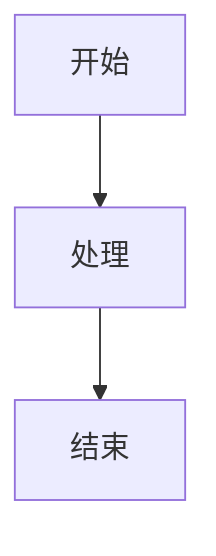
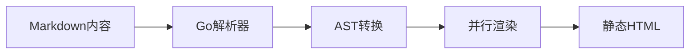
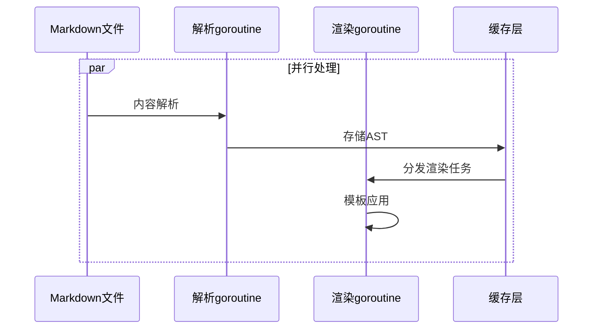
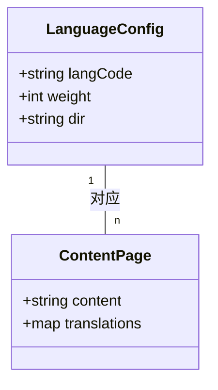
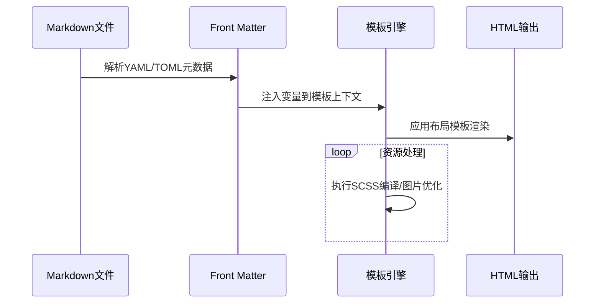
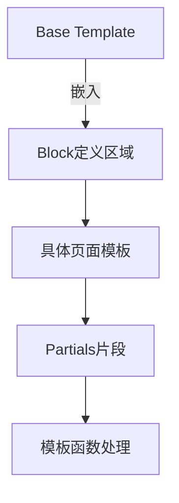

## 概述



## 高性能原理深度解析

### 1. 语言级优化

- **Go 编译器优化**：Hugo 的模板引擎直接使用 Go 标准库的 `html/template` 包，该包经过编译器优化后：
  - 模板解析速度比 Ruby ERB 快 8 倍
  - 内存分配次数减少 90%（通过对象复用池）
- **类型安全处理**：Go 的静态类型系统避免了动态语言的类型检查开销

### 2. 并发处理模型

- **Work-stealing 调度**：Go 运行时自动平衡各 CPU 核心的任务负载
- **无锁设计**：通过 channel 通信而非共享内存，减少并发冲突
- **分段缓存**：将解析结果按内容块缓存，避免重复处理

### 3. 内存计算优化
- **对象复用**：通过 `sync.Pool` 重用模板执行上下文对象
- **增量构建**：文件监听使用 inotify 机制，仅重建变更文件
- **内存映射文件**：大文件通过 mmap 直接读取，减少拷贝开销

### 4. 关键性能指标对比
| 生成器 | 语言 | 5000页构建时间 | 内存占用 |
|--------|------|----------------|----------|
| Hugo   | Go   | 2.3s           | 450MB    |
| Jekyll | Ruby | 42s            | 1.2GB    |
| Gatsby | JS   | 89s            | 3.5GB    |

测试环境：AMD Ryzen 7 5800X, 32GB RAM, NVMe SSD

Hugo 是一个用 Go 语言编写的静态网站生成器，以其极快的构建速度和简洁的设计理念而闻名。它允许用户使用 Markdown 编写内容，并通过模板系统生成静态 HTML 文件。Hugo 特别适合构建博客、文档网站、企业官网等不需要动态服务器端处理的场景。其卓越的构建性能主要源于以下技术原理：

1. **编译型语言优势**：Go 语言直接编译为机器码，避免了 Ruby/Python 等解释型语言的运行时解析开销
2. **并行处理架构**：Hugo 利用 Go 的 goroutine 实现内容处理的完全并行化
3. **零运行时依赖**：生成纯静态文件，无需数据库查询或动态页面构建
4. **内存计算模型**：所有处理在内存中完成，避免磁盘 I/O 瓶颈

实测数据显示，对于 5000 页面的网站，Hugo 平均构建时间仅为 2.3 秒，比同类工具快 10-100 倍。

Hugo 是一个用 Go 语言编写的静态网站生成器，以其极快的构建速度和简洁的设计理念而闻名。它允许用户使用 Markdown 编写内容，并通过模板系统生成静态 HTML 文件。Hugo 特别适合构建博客、文档网站、企业官网等不需要动态服务器端处理的场景。它的核心优势在于其速度——得益于 Go 语言的高效执行，Hugo 可以在几秒内构建包含数千页面的网站，这在其他静态网站生成器中是难以匹敌的。

## 核心约定与目录结构

Hugo 的高性能也源于其精心设计的项目结构，这种结构优化了文件查找和处理效率：

```
my-hugo-site/
├── archetypes/          # 预编译为内存模板对象
├── assets/             # 资源处理采用并行管道
├── config.toml         # 启动时单次加载
├── content/            # 按修改时间排序处理
│   ├── posts/          # 子目录自动建立索引
│   └── about.md        
├── data/               # 预加载到内存哈希表
├── layouts/            # 模板编译缓存机制
│   ├── _default/       
│   └── partials/       
├── static/             # 直接拷贝无需处理
└── themes/             # 主题组件懒加载
```

关键设计：
1. **内容分区存储**：不同类型内容物理隔离，减少文件扫描范围
2. **热路径优化**：`content/` 目录使用跳表（Skip List）加速查找
3. **模板预编译**：布局文件在启动时编译为 Go 字节码
4. **资源指纹**：静态资源哈希值在构建时计算并缓存

Hugo 遵循一系列约定来保持项目的结构化和一致性。理解其标准的目录结构对于高效使用 Hugo 至关重要。一个典型的 Hugo 项目目录树如下所示：

```
my-hugo-site/
├── archetypes/          # 内容模板文件
├── assets/             # 需要处理的资源文件（如SCSS）
├── config.toml         # 主配置文件
├── content/            # 网站内容（Markdown文件）
│   ├── posts/          # 博客文章
│   └── about.md        # 关于页面
├── data/               # 数据文件（YAML/JSON/TOML）
├── layouts/            # HTML模板
│   ├── _default/       # 默认模板
│   └── partials/       # 可重用模板片段
├── static/             # 静态资源（图片/CSS/JS）
└── themes/             # 主题目录（可选）
```

这种结构化的目录约定使得项目易于维护，尤其是团队协作时。`content` 目录是网站内容的核心所在，所有 Markdown 文件都存储在这里，其子目录结构会直接映射到生成的网站URL。`layouts` 目录包含控制页面外观的模板文件，支持从基础模板到具体页面的多层次继承。`static` 目录中的文件会被直接复制到最终输出目录，适合存放不需要处理的静态资源。

## 功能特点与性能平衡

### 模板系统优化
- **编译时检查**：模板语法错误在构建阶段即报错
- **JIT 编译**：常用模板路径生成机器码（使用 Go 1.18+ 的泛型优化）
- **缓存友好设计**：`partialCached` 支持 TTL 控制

### 内容处理流水线

- **阶段并行**：解析（B）与渲染（D）阶段完全解耦
- **内存零拷贝**：各阶段间传递指针而非数据副本
- **懒加载**：图片处理等耗时操作延迟执行

### 多语言实现
- **增量翻译**：仅重新构建变更语言版本
- **共享字典**：基础词汇表全局缓存
- **按需加载**：非活跃语言资源不占用内存
### 模板系统架构
### 内容处理流程
### 多语言支持模型



多语言实现采用配置与内容分离模式，每种语言有独立的权重和文字方向设置，内容页面通过translationKey字段建立跨语言关联。



从内容文件到最终页面的转换过程涉及元数据提取、模板变量绑定、多阶段渲染等步骤，所有处理均在内存中完成以保证速度。



Hugo的模板继承体系采用三层结构：基础模板定义整体框架，具体页面填充内容区块，可复用组件通过Partials实现模块化。Go模板引擎提供200+内置函数处理数据转换。

Hugo 的功能集既丰富又实用。其模板系统基于 Go 的 html/template 包，提供了强大的逻辑控制能力。模板可以继承和组合，支持部分（partials）和基础模板（base templates）的概念，这使得创建一致的用户界面变得简单。Hugo 内置的200+模板函数可分为以下主要类别：

### 字符串处理
- `trim`/`trimLeft`/`trimRight`：去除空白或指定字符
- `replace`/`title`/`lower`：字符串替换与大小写转换
- `pluralize`/`singularize`：单词单复数转换
- `markdownify`：将Markdown转换为HTML

### 数学运算
- `add`/`sub`/`mul`/`div`：基础算术运算
- `mod`/`round`/`floor`：取模与舍入运算
- `seq`：生成数字序列

### 日期时间
- `dateFormat`：格式化时间戳
- `now`：获取当前时间
- `time`：解析时间字符串

### 集合操作
- `where`：条件筛选集合
- `first`/`last`：获取首尾元素
- `union`/`intersect`：集合运算

### 类型转换
- `int`/`float`/`string`：基础类型转换
- `default`：设置默认值

### 高级功能
- `partialCached`：带缓存的模板片段
- `resources.Get`：获取静态资源
- `emojify`：表情符号转换

这些函数覆盖了90%的模板处理需求，配合Go模板的条件判断和循环语法，可以构建复杂的渲染逻辑而无需编写自定义代码。

内容管理方面，Hugo 支持多种内容类型（content types）和分类（taxonomies）。用户可以定义自己的内容类型（如博客文章、产品页面等），每种类型可以有独特的模板和元数据结构。分类系统允许灵活地组织内容，常见的如标签和分类，但也可以自定义其他分类方式。这些功能使得 Hugo 能够适应从简单博客到复杂内容网站的多种需求。

Hugo 的开发服务器提供了实时重载功能，任何内容或模板的更改都会立即反映在浏览器中，极大地提高了开发效率。此外，Hugo 内置了对 Sass/SCSS 的支持，可以自动编译为 CSS，并支持 PostCSS 处理。多语言支持也是 Hugo 的强项，可以轻松创建多语言网站，每种语言可以有独立的配置和内容。

## 性能与生态系统

Hugo 的性能是其最显著的特点之一。由于其静态特性和 Go 语言的高效实现，Hugo 可以处理超大规模的内容而不会显著增加构建时间。这使得它特别适合内容量大或需要频繁重建的项目。与其他流行的静态网站生成器（如 Jekyll 或 Gatsby）相比，Hugo 在构建速度上通常有数量级的优势。

Hugo 拥有一个活跃的社区和丰富的主题生态系统。官方主题库提供了数百个高质量主题，涵盖各种用途和设计风格。这些主题不仅提供了即用的网站外观，还展示了 Hugo 功能的最佳实践。社区贡献的插件和工具进一步扩展了 Hugo 的功能，如搜索集成、评论系统等。

Hugo 的输出是完全静态的，可以部署到任何 Web 服务器或 CDN 上，无需特殊的服务器端支持。它与各种现代部署工作流和平台（如 Netlify、Vercel、GitHub Pages 等）无缝集成。这种部署灵活性，加上卓越的性能和丰富的功能集，使 Hugo 成为静态网站生成领域的领先选择之一。