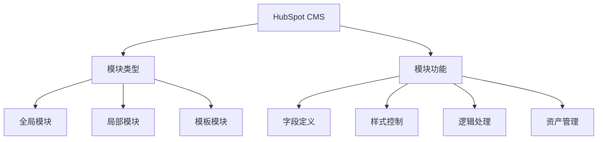
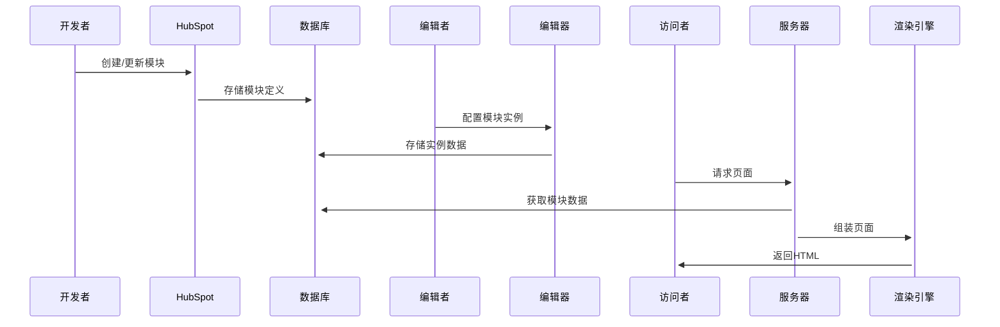

# HubSpot CMS模块技术解析

## 概述

HubSpot CMS中的模块(Modules)是构建网站内容的核心组件系统，允许开发人员创建可重用的定制组件，同时为非技术用户提供直观的内容编辑界面。模块系统实现了内容与表现的分离，是HubSpot CMS Hub的核心功能之一。

**核心价值**：
- 可视化内容构建：营销人员无需编码即可组装页面
- 开发效率提升：一次开发，多处复用
- 品牌一致性保障：标准化组件确保统一体验
- 个性化支持：基于访客属性的动态内容展示
- 跨渠道复用：模块可在网站、邮件、登陆页等多场景使用

## 架构设计

### 模块系统架构



*图表说明：模块系统包含三种类型模块和四大核心功能，全局模块可在全站使用，局部模块限定于特定模板，模板模块用于定义页面结构。*

### 模块组成要素

| 要素 | 说明 | 示例 |
|------|------|-------|
| 模块定义 | 声明模块的基础配置 | `module_definition.html` |
| 字段 | 可编辑的内容元素 | 文本、图片、选择器等 |
| 模板 | 模块的HTML结构 | `module.html` |
| 样式 | 模块的CSS表现 | `module.css` |
| 脚本 | 模块的交互逻辑 | `module.js` |
| 翻译 | 多语言支持 | `en.json`等 |

## 实现原理

### 模块生命周期



*图表说明：模块从开发到最终呈现的完整流程，包含开发、编辑和访问三个阶段。*

## 开发实践

### 基础模块示例

```html
<!-- 模块定义 -->


<!-- 模块模板 -->
<div class="simple-card">
  <h2>{{ module.header }}</h2>
  <div class="content">
    
  </div>
</div>

<!-- 模块样式 -->
<style>
.simple-card {
  border: 1px solid #ddd;
  padding: 20px;
  border-radius: 4px;
}
</style>
```

### 高级功能实现

**动态内容模块**：
```html
{% module "dynamic_content"
  label="动态内容",
  fields={
    "audience": {
      "type": "choice",
      "label": "目标受众",
      "choices": [
        ["new", "新访客"],
        ["returning", "回头客"],
        ["customer", "客户"]
      ]
    },
    "content_variants": {
      "type": "group",
      "label": "内容变体",
      "repeatable": true,
      "fields": {
        "variant_audience": {
          "type": "text",
          "label": "适用受众"
        },
        "variant_content": {
          "type": "richtext",
          "label": "内容"
        }
      }
    }
  }
%}
```

**最佳实践建议**：
1. 使用语义化的模块命名
2. 为字段添加清晰的标签和说明
3. 设置合理的默认值
4. 使用字段验证确保数据质量
5. 遵循响应式设计原则
6. 优化前端性能（延迟加载、资源压缩等）

## 常见问题

### 技术问题

**Q：如何调试模块？**
A：使用HubSpot CLI的`hs watch`命令实时预览变更，结合浏览器开发者工具调试。

**Q：模块有性能问题怎么办？**
A：1) 检查重复查询 2) 启用缓存 3) 优化前端资源 4) 使用性能分析工具

### 使用问题

**Q：如何实现多语言模块？**
A：使用HubSpot的本地化系统，为每种语言创建翻译文件，模块会自动匹配访客语言。

**Q：模块可以跨门户使用吗？**
A：可以通过模块导出/导入功能或使用HubSpot CLI在不同门户间共享模块。

## 学习资源

- [官方模块开发文档](https://developers.hubspot.com/docs/cms/guides/modules)
- [HubSpot模块示例库](https://github.com/HubSpot/cms-theme-boilerplate)
- [模块性能优化指南](https://developers.hubspot.com/docs/cms/performance)
- [高级模块开发课程](https://academy.hubspot.com/courses/cms-developer)