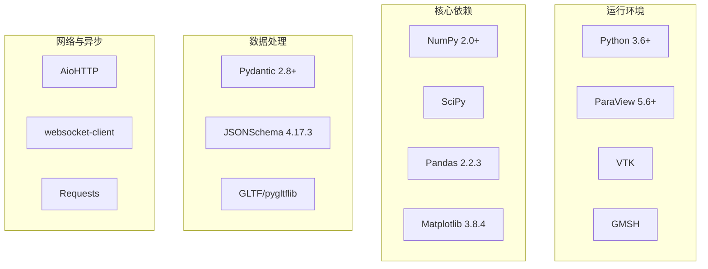
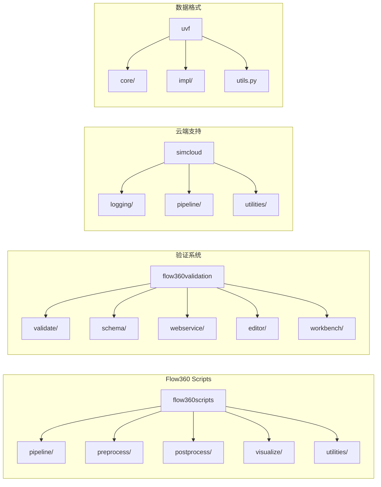
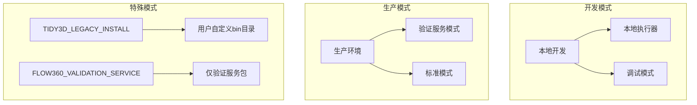

# Flow360 项目架构概览

## 项目简介

Flow360 是一个基于 Python 的计算流体动力学（CFD）自动化处理平台，提供从几何体预处理、网格生成、流体仿真到后处理可视化的完整工具链。

## 技术栈

该技术栈支持高性能科学计算，集成了业界标准的可视化和数据处理工具，同时提供了现代化的异步网络通信能力。

## 项目结构

项目采用模块化架构，每个模块职责清晰：pipeline 负责流水线管理，preprocess/postprocess 处理数据预处理和后处理，visualize 负责可视化，validation 提供完整的数据验证体系。

## 核心模块功能

### Pipeline 流水线模块
- **meshVisualizePipeline**: 网格可视化流水线
- **casePipeline**: 案例处理核心流水线
- **adaptiveMeshPipeline**: 自适应网格生成
- **caseVisualizePipeline**: 案例可视化流水线
- **geometryConversionPipeline**: 几何体转换流水线

### 数据处理模块
- **preprocess**: 数据预处理，包括JSON配置转换、网格信息更新等
- **postprocess**: 结果后处理，包括报告生成、工作量计算等
- **visualize**: 可视化生成，支持GLTF、UVF等多种格式

### 验证系统
- **validateFlow360Case**: 案例配置验证
- **validateFlow360Mesh**: 网格验证
- **validateFlow360Geometry**: 几何体验证

## 部署模式

该项目支持多种部署模式，通过环境变量灵活配置。验证服务模式专门用于 API 服务部署，标准模式包含完整功能，开发模式支持本地调试和测试。

## 命令行工具

项目提供 20+ 个命令行工具，涵盖完整的 CFD 工作流：

- 网格处理：`meshDecompositionPipeline.py`、`meshMetaDataPipeline.py`
- 案例管理：`casePipeline.py`、`caseMetaDataPipeline.py`
- 预处理：`generateMeshJson.py`、`preprocessCaseJson.py`
- 后处理：`report.py`、`calculateNumOfTotalPseudoSteps.py`
- 验证工具：`validateFlow360Case.py`、`validateFlow360Mesh.py`

这些工具通过 setup.py 的 console_scripts 自动安装，支持标准的命令行调用方式。