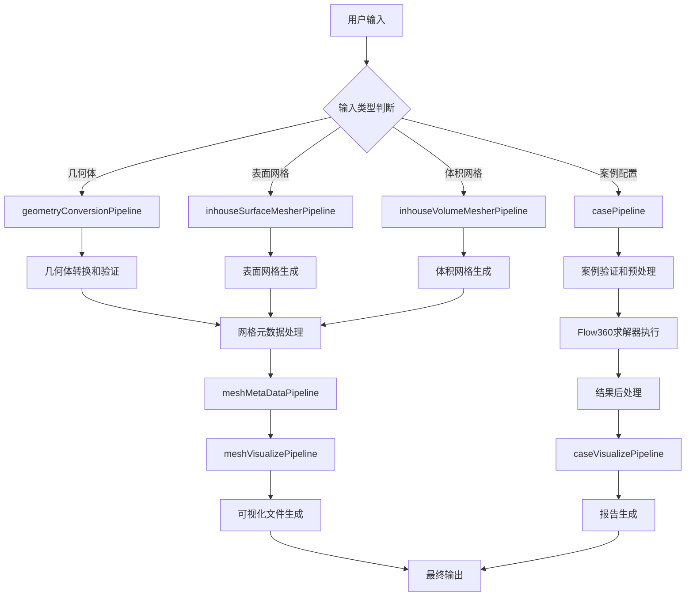
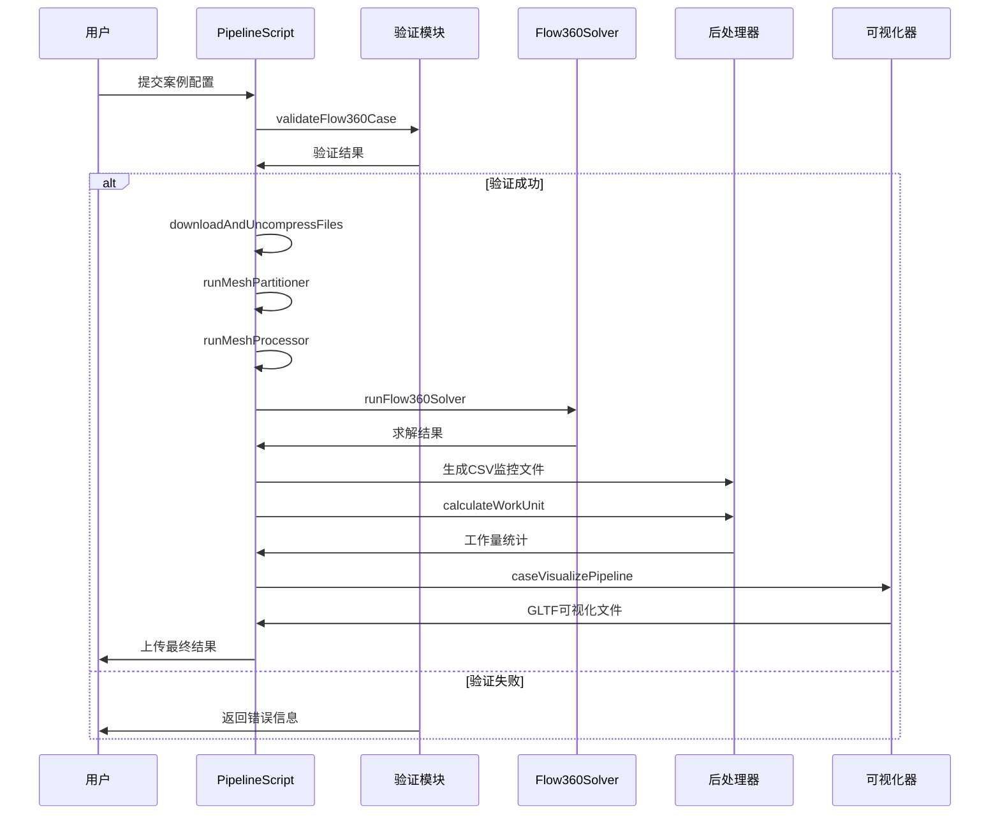
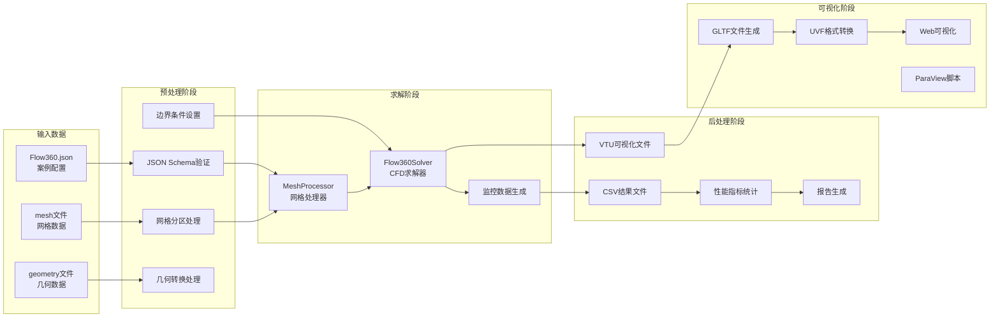
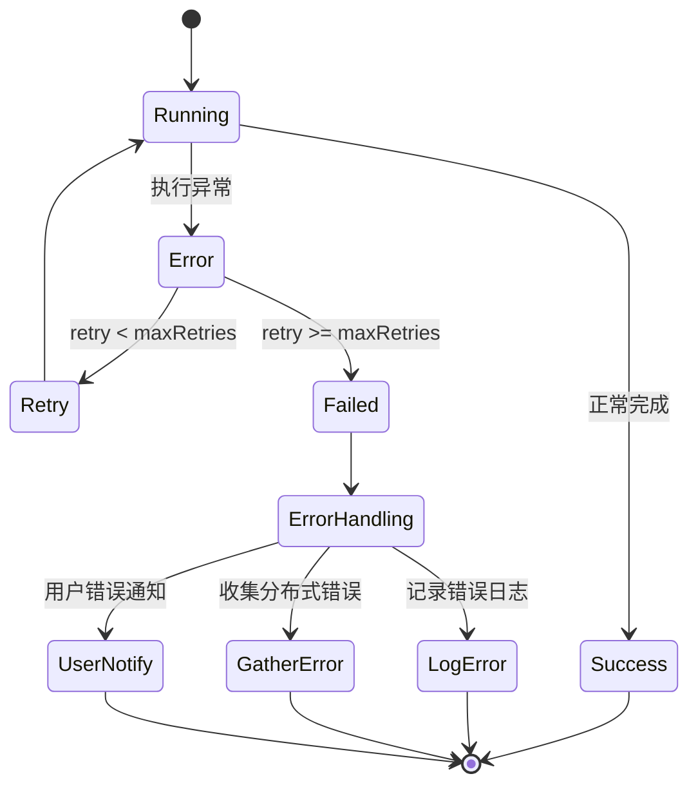

# Flow360 核心流水线流程

## 整体流程架构

该流程图展示了Flow360从输入到输出的完整处理链路。系统支持多种输入格式（几何体、网格、案例配置），通过不同的pipeline进行处理，最终生成可视化结果和分析报告。

## 核心Pipeline时序图

该时序图详细展示了案例处理的关键步骤和模块间的交互关系。验证阶段确保输入数据的正确性，求解阶段执行核心计算，后处理和可视化阶段生成用户所需的输出结果。

## 数据流图

数据流图清晰展示了Flow360中数据的转换和流动路径。输入数据经过验证和预处理后，进入求解阶段进行CFD计算，随后通过后处理生成各种格式的结果文件，最终转换为用户友好的可视化格式。

## Pipeline错误处理机制

错误处理机制采用多层次策略：运行时监控、自动重试、分布式错误收集和用户友好的错误反馈。这确保了系统的稳定性和用户体验。

## 关键组件交互

各Pipeline通过PipelineScript基类实现统一的执行模式，包括：

1. **资源管理**：自动下载输入文件，上传输出结果
2. **命令执行**：支持本地和分布式执行模式
3. **进度监控**：实时跟踪执行状态和性能指标
4. **错误恢复**：智能重试机制和错误诊断
5. **缓存优化**：网格数据缓存和增量处理

每个Pipeline都遵循"下载-处理-上传"的标准模式，确保了系统的一致性和可维护性。