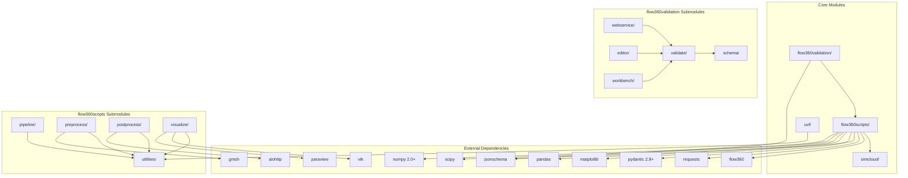
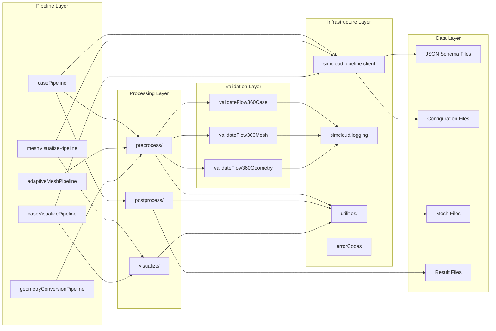
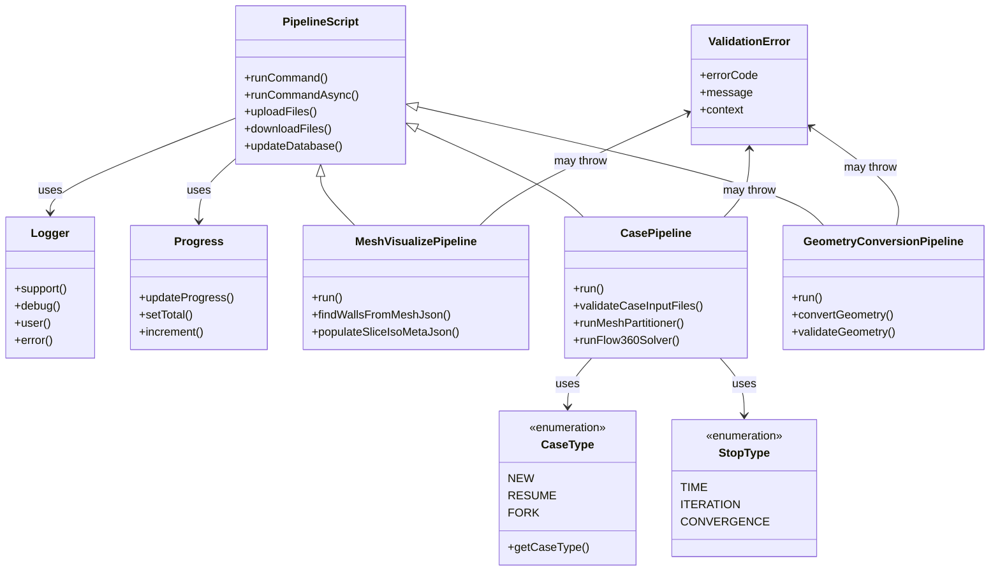
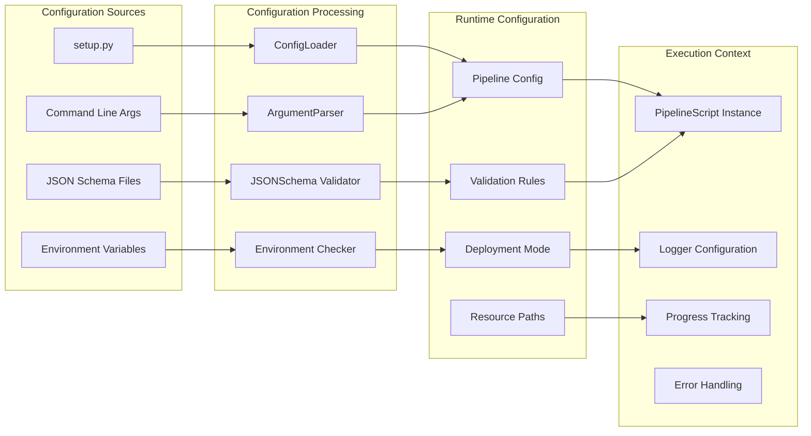

# Flow360 模块依赖关系

## 包引用关系图

该依赖关系图展现了Flow360项目的模块架构。核心模块simcloud提供基础设施，flow360scripts实现主要业务逻辑，flow360validation负责数据验证，各模块通过明确的依赖关系协同工作。

## 内部模块交互图

内部模块交互采用分层架构：Pipeline层协调整体流程，Processing层执行具体处理逻辑，Validation层确保数据正确性，Infrastructure层提供通用服务，Data层管理各类文件和配置。

## 关键类依赖图

关键类设计体现了面向对象的设计原则：PipelineScript作为基类提供通用Pipeline功能，具体Pipeline类继承并实现特定逻辑，枚举类提供类型安全，工具类提供通用服务。

## 配置和数据流

配置和数据流展示了从静态配置到运行时环境的转换过程。系统支持多种配置源，通过统一的处理机制转换为运行时配置，最终驱动Pipeline的执行。

## 依赖关系特点

1. **松耦合设计**：各模块通过明确的接口交互，降低耦合度
2. **分层架构**：Infrastructure层为上层提供稳定的基础服务
3. **插件化扩展**：新的Pipeline可以轻松集成到现有框架中
4. **配置驱动**：通过配置文件和环境变量控制系统行为
5. **错误隔离**：每个模块的错误不会影响其他模块的正常运行

这种设计保证了系统的可维护性、可扩展性和稳定性，支持大规模CFD计算任务的可靠执行。