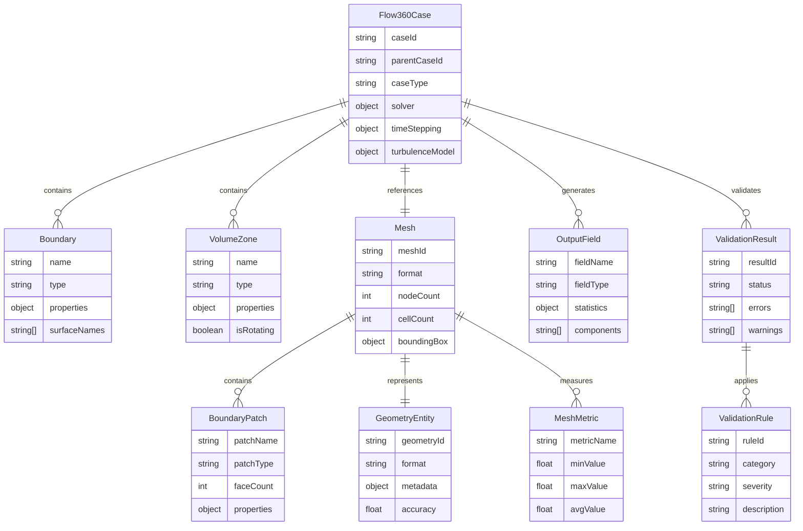
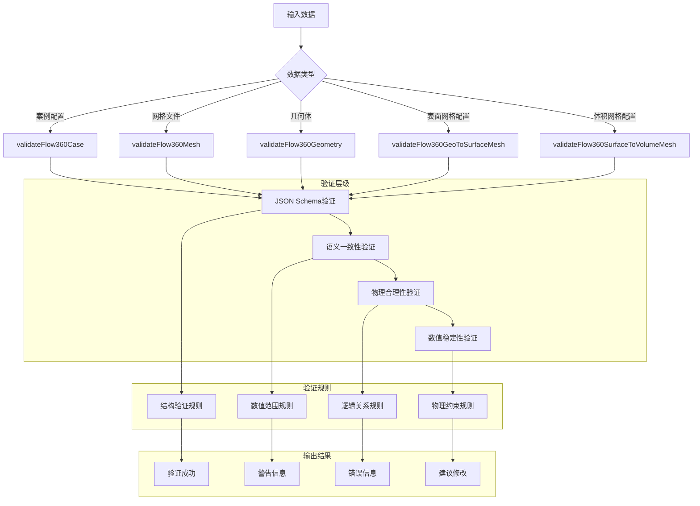
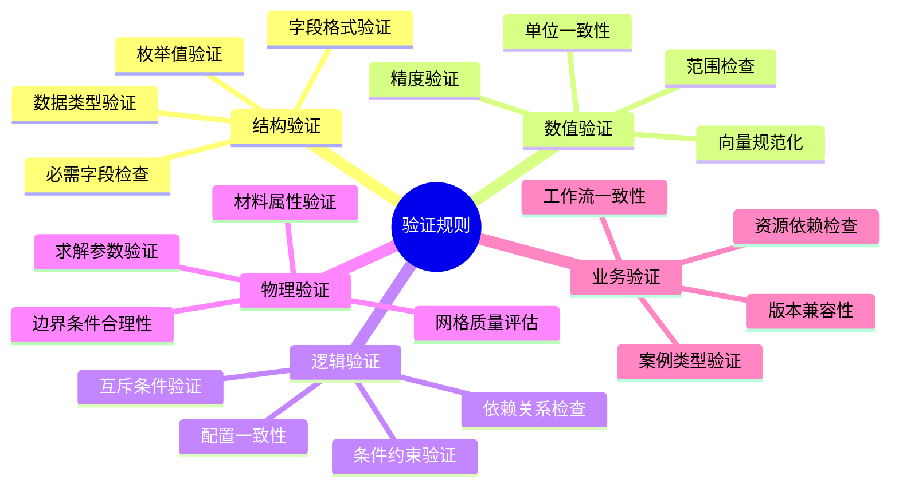
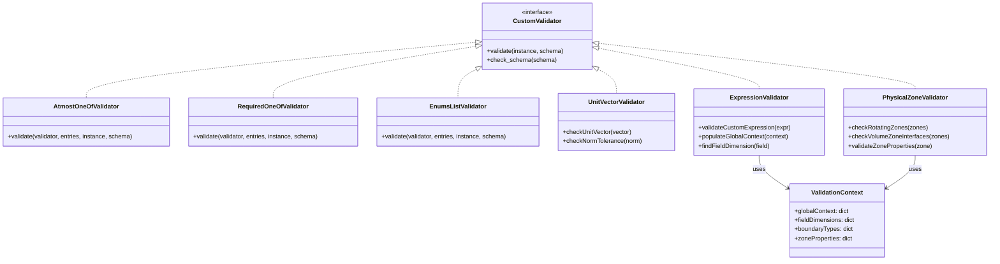
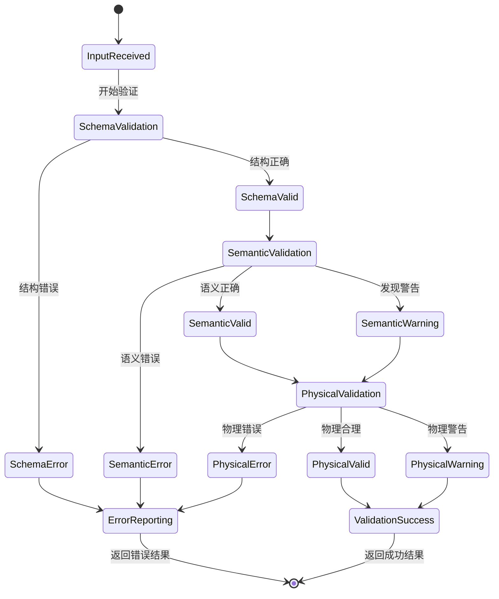

# Flow360 数据模型和验证机制

## 数据模型实体关系图

该ER图展示了Flow360系统中的核心数据实体和它们之间的关系。Flow360Case作为中心实体，关联网格、边界条件、体积区域等多个相关实体，形成完整的CFD案例数据模型。

## 验证机制架构

验证机制采用多层次验证策略：从基础的JSON Schema结构验证，到高级的物理合理性和数值稳定性检查，确保输入数据的完整性和正确性。

## 验证规则分类

验证规则覆盖从数据结构到业务逻辑的各个层面，确保系统能够识别和处理各种潜在的配置错误和不一致问题。

## 自定义验证器

自定义验证器扩展了标准JSON Schema验证功能，提供了针对CFD领域的专业验证能力，包括物理量验证、表达式验证、几何约束验证等。

## 验证流程状态图

验证流程采用渐进式验证策略，从基础结构验证逐步深入到复杂的物理合理性验证，每个阶段都可能产生错误、警告或成功结果。

## 核心验证特性

1. **JSON Schema集成**：基于industry-standard JSON Schema 进行结构验证
2. **自定义验证器**：扩展验证功能，支持CFD特定的验证需求
3. **分级错误处理**：区分错误和警告，提供不同级别的反馈
4. **上下文相关验证**：根据配置上下文进行智能验证
5. **表达式验证**：支持用户自定义表达式的语法和语义验证
6. **物理约束检查**：验证物理参数的合理性和一致性

该验证系统确保了Flow360平台能够可靠地处理各种复杂的CFD配置，提高了计算成功率和结果准确性。