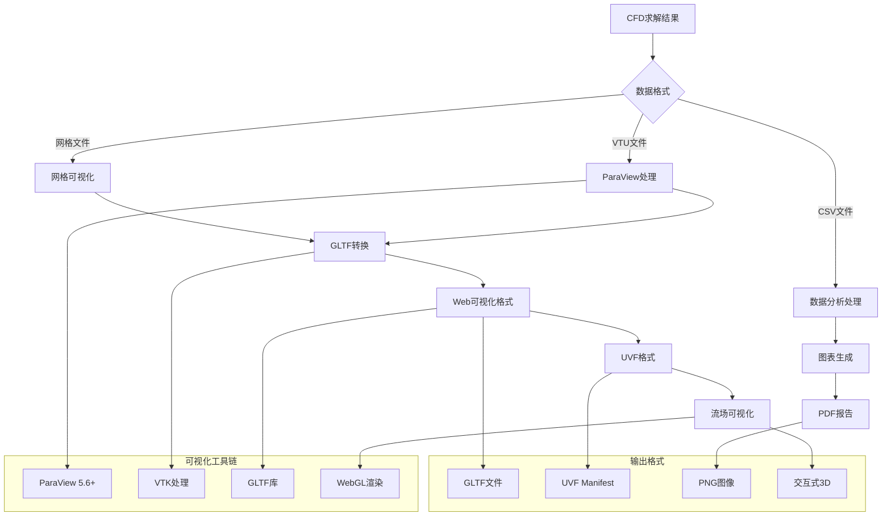
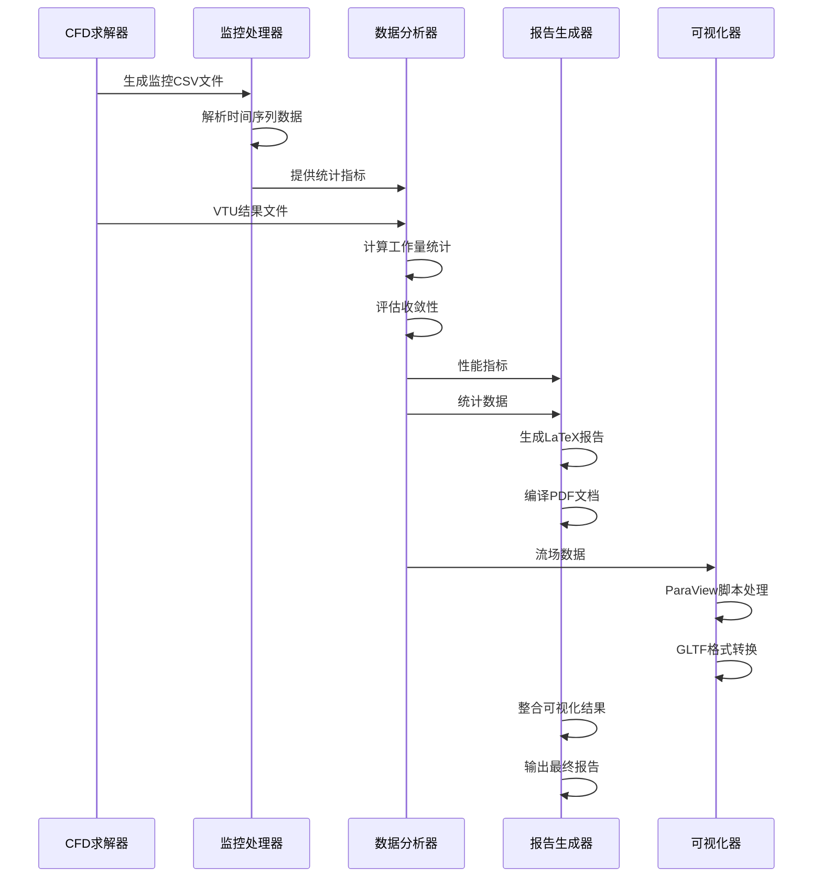
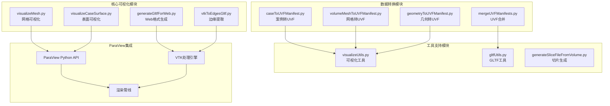
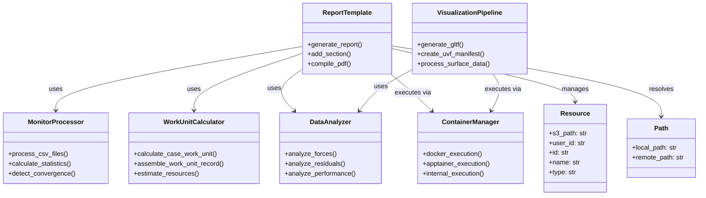
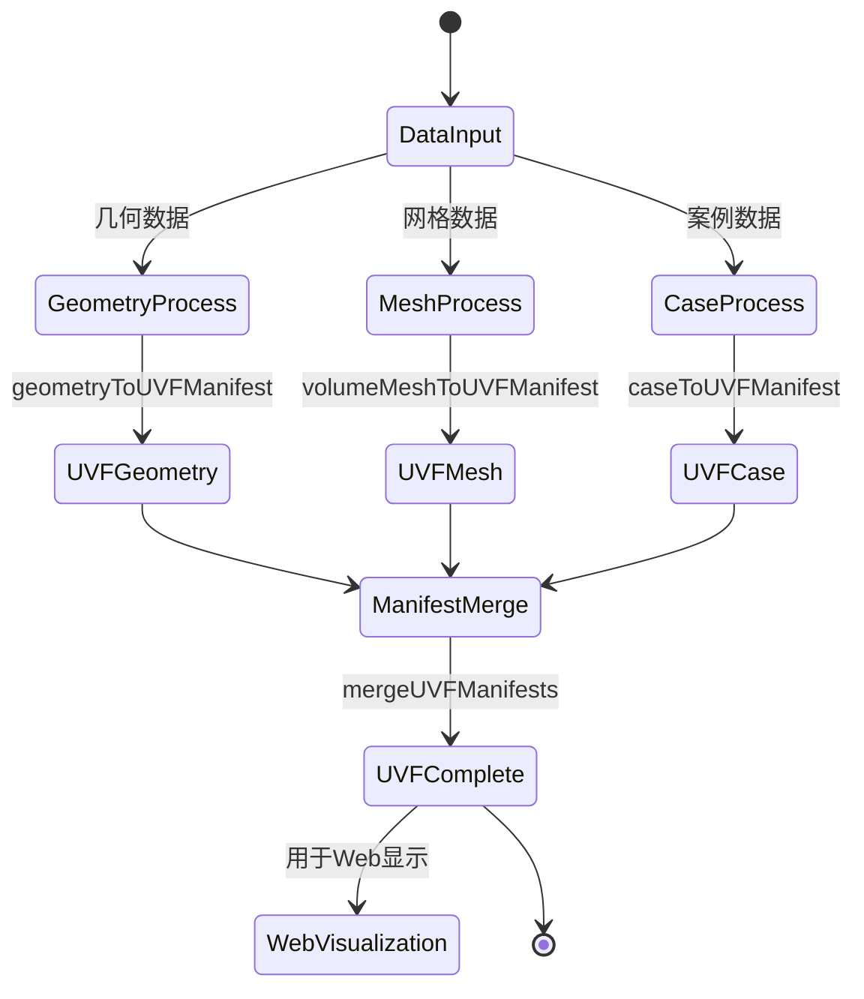

# Flow360 可视化和后处理组件

## 可视化处理流程

可视化流程支持多种数据格式输入，通过ParaView和VTK等专业工具进行处理，最终生成Web友好的可视化格式，支持交互式3D展示和报告生成。

## 后处理数据流

后处理时序图展示了从求解器输出到最终报告生成的完整数据处理链路，包括监控数据分析、性能评估、可视化生成和报告整合等关键步骤。

## 可视化组件架构

可视化组件采用模块化设计，核心模块负责不同类型的可视化任务，数据转换模块处理格式转换，工具模块提供通用功能，ParaView集成提供专业的可视化能力。

## 后处理组件结构

后处理组件采用面向对象设计，各组件职责明确：ReportTemplate负责报告生成，MonitorProcessor处理监控数据，WorkUnitCalculator计算工作量，VisualizationPipeline处理可视化，DataAnalyzer进行数据分析。

## UVF格式处理流程

UVF（Unified Visualization Format）处理流程将不同类型的数据（几何、网格、案例）转换为统一的可视化格式，通过manifest合并形成完整的可视化数据包。

## 关键技术特性

1. **多格式支持**：支持VTU、GLTF、UVF、CSV等多种数据格式
2. **ParaView集成**：深度集成ParaView进行专业可视化处理
3. **Web友好输出**：生成WebGL兼容的GLTF格式，支持浏览器直接显示
4. **容器化执行**：支持Docker、Apptainer等容器技术执行
5. **自动报告生成**：基于LaTeX模板自动生成PDF技术报告
6. **实时监控处理**：实时处理求解器输出的监控数据
7. **分布式处理**：支持大规模数据的分布式后处理

该可视化和后处理系统为Flow360平台提供了完整的结果展示和分析能力，支持从原始CFD数据到最终用户可视化的全流程处理。