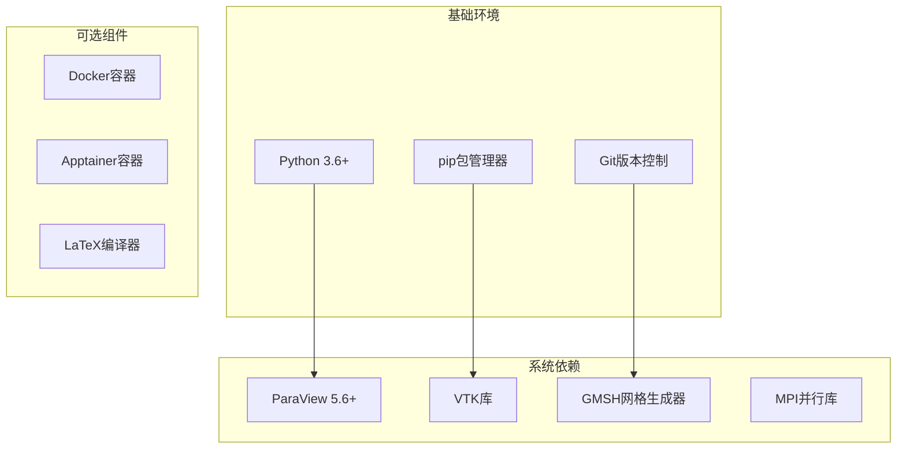
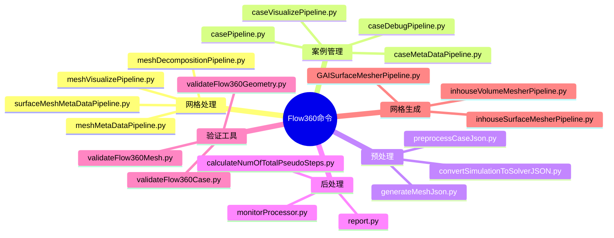
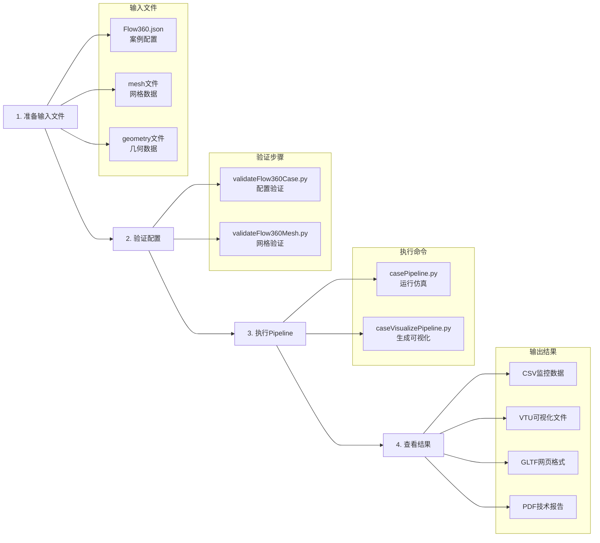
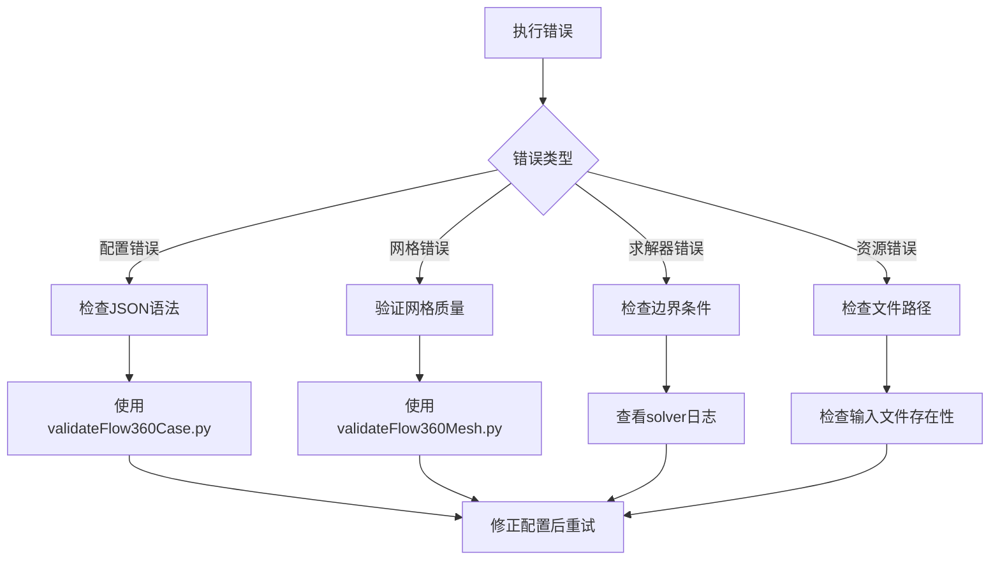

# Flow360 快速入门指南

## 项目概述

Flow360是一个基于Python的计算流体动力学（CFD）自动化处理平台，提供从几何体预处理、网格生成、流体仿真到后处理可视化的完整工具链。

## 环境要求



确保系统已安装Python 3.6以上版本，以及必要的科学计算库和可视化工具。

## 安装步骤

### 1. 克隆项目
```bash
git clone <repository-url>
cd flow360/pipelines
```

### 2. 安装依赖
```bash
# 安装标准模式（包含完整功能）
pip install -e .

# 或安装验证服务模式
FLOW360_VALIDATION_SERVICE=1 pip install -e .
```

### 3. 验证安装
```bash
# 检查核心命令是否可用
casePipeline.py --help
validateFlow360Case.py --help
meshVisualizePipeline.py --help
```

## 核心命令使用

### Pipeline命令分类



### 基础工作流程



## 典型使用场景

### 场景1：CFD案例仿真
```bash
# 1. 验证案例配置
validateFlow360Case.py --caseJson Flow360.json

# 2. 执行CFD仿真
casePipeline.py --caseJson Flow360.json --meshFile mesh.cgns

# 3. 生成可视化结果
caseVisualizePipeline.py --caseId <case-id>

# 4. 生成技术报告
report.py --caseId <case-id> --output report.pdf
```

### 场景2：网格可视化
```bash
# 1. 验证网格文件
validateFlow360Mesh.py --meshJson Flow360Mesh.json

# 2. 生成网格可视化
meshVisualizePipeline.py --meshFile mesh.cgns

# 3. 查看生成的GLTF文件
ls *.gltf
```

### 场景3：几何体处理
```bash
# 1. 验证几何体
validateFlow360Geometry.py --geometryJson geometry.json

# 2. 几何体转换
geometryConversionPipeline.py --input geometry.step

# 3. 生成表面网格
inhouseSurfaceMesherPipeline.py --geometryFile geometry.json
```

## 配置文件示例

### Flow360.json基础配置
```json
{
    "geometry": {
        "refArea": 1.0,
        "momentCenter": [0.0, 0.0, 0.0],
        "momentLength": [1.0, 1.0, 1.0]
    },
    "boundaries": {
        "inlet": {
            "type": "VelocityInlet",
            "velocity": [100.0, 0.0, 0.0]
        },
        "outlet": {
            "type": "PressureOutlet",
            "staticPressure": 101325.0
        },
        "wall": {
            "type": "NoSlipWall"
        }
    },
    "solver": {
        "equations": "NavierStokes",
        "turbulenceModel": "SpalartAllmaras"
    },
    "timeStepping": {
        "maxSteps": 1000,
        "CFL": {
            "initial": 1.0,
            "final": 100.0
        }
    }
}
```

## 常见问题排查

### 错误类型和解决方案



### 日志分析
- **DEBUG级别**：详细的执行信息，用于开发调试
- **SUPPORT级别**：关键步骤信息，用于用户支持
- **ERROR级别**：错误信息，需要立即处理
- **USER级别**：用户友好的提示信息

## 性能优化建议

1. **并行处理**：使用`--numProcessors`参数启用多核并行
2. **内存管理**：大网格案例使用分布式处理模式
3. **存储优化**：使用本地SSD存储临时文件
4. **缓存利用**：重复计算时利用网格缓存机制

## 扩展开发

### 添加新的Pipeline
```python
from simcloud.pipeline.client import PipelineScript

class CustomPipeline(PipelineScript):
    def __init__(self, name):
        super().__init__(name)
        
    def run(self):
        # 实现自定义逻辑
        pass

def run():
    pipeline = CustomPipeline("custom-pipeline")
    pipeline.run()

if __name__ == "__main__":
    run()
```

### 自定义验证规则
```python
def customValidator(validator, entries, instance, schema):
    # 实现自定义验证逻辑
    if not custom_check(instance):
        yield ValidationError("Custom validation failed")
```

## 社区支持

- **文档**：查阅README和代码注释
- **示例**：参考tests目录下的测试用例
- **Issue跟踪**：使用项目的Issue系统报告问题
- **贡献指南**：遵循项目的代码贡献规范

Flow360平台提供了完整的CFD处理工具链，通过合理使用各种Pipeline命令，可以高效完成从几何体到最终结果的全流程CFD计算任务。